# Metro Backend - Overall System Architecture

## 🏗️ Complete System Architecture Diagram

```mermaid
graph TB
    %% Client Layer
    subgraph "Client Layer"
        WEB[Web Application]
        MOBILE[Mobile App]
        ADMIN[Admin Panel]
        API_CLIENT[API Clients]
    end

    %% Edge Layer
    subgraph "Edge Layer"
        NGINX[Nginx Reverse Proxy<br/>:80, :443<br/>SSL Termination<br/>Rate Limiting<br/>CORS Management]
    end

    %% API Gateway Layer
    subgraph "API Gateway Layer"
        GATEWAY[API Gateway<br/>:8000<br/>Authentication<br/>Dynamic Routing<br/>Load Balancing<br/>Circuit Breaker]
    end

    %% Core Microservices
    subgraph "Core Microservices"
        AUTH[Auth Service<br/>:8001<br/>JWT Authentication<br/>User Management<br/>API Key Generation]
        
        USER[User Service<br/>:8002<br/>User Profiles<br/>Passenger Management<br/>Event Publishing]
        
        TRANSPORT[Transport Service<br/>:8003<br/>Routes & Stations<br/>Train Fleet<br/>gRPC Server]
        
        TICKET[Ticket Service<br/>:8004<br/>Ticket Management<br/>Fare Calculation<br/>Promotions]
        
        PUBLIC[Public Service<br/>:8005<br/>Data Aggregation<br/>Caching Layer<br/>Public APIs]
        
        PAYMENT[Payment Service<br/>:8006<br/>Multi-Gateway Support<br/>VNPay & PayPal<br/>Transaction Processing]
        
        REPORT[Report Service<br/>:8007<br/>Analytics<br/>Business Intelligence<br/>Revenue Tracking]
        
        CONTROL[Control Service<br/>:8008<br/>AI Scheduler<br/>Prophet ML<br/>Schedule Optimization]
        
        NOTIFICATION[Notification Service<br/>:8009<br/>Email & SMS<br/>Push Notifications<br/>Event Processing]
    end

    %% Supporting Services
    subgraph "Supporting Services"
        SCHEDULER[Scheduler Service<br/>Cron Jobs<br/>gRPC Endpoints<br/>Job Management]
        
        WEBHOOK[Webhook Service<br/>Payment Webhooks<br/>External Integrations<br/>Event Processing]
    end

    %% Data Layer
    subgraph "Data Layer"
        POSTGRES[(PostgreSQL<br/>Primary Database<br/>Users, Services<br/>Transactions)]
        
        REDIS[(Redis Cache<br/>Session Management<br/>API Keys<br/>Rate Limiting)]
        
        MONGODB[(MongoDB<br/>Webhook Logs<br/>Unstructured Data<br/>Event Storage)]
        
        KAFKA[(Kafka Cluster<br/>Event Streaming<br/>Service Communication<br/>Message Broker)]
    end

    %% Monitoring & Observability
    subgraph "Monitoring & Observability"
        PROMETHEUS[Prometheus<br/>Metrics Collection<br/>Alerting]
        
        GRAFANA[Grafana<br/>Dashboards<br/>Visualization]
        
        LOKI[Loki<br/>Log Aggregation<br/>Centralized Logging]
        
        ALERTMANAGER[Alertmanager<br/>Alert Routing<br/>Notification Management]
    end

    %% External Services
    subgraph "External Services"
        VNPAY[VNPay Gateway<br/>Vietnamese Payments<br/>VND Processing]
        
        PAYPAL[PayPal Gateway<br/>International Payments<br/>USD Processing]
        
        EMAIL[SMTP Server<br/>Email Delivery<br/>Gmail SMTP]
        
        SMS[SMS Provider<br/>Text Messaging<br/>Notification Delivery]
    end

    %% Client Connections
    WEB --> NGINX
    MOBILE --> NGINX
    ADMIN --> NGINX
    API_CLIENT --> NGINX

    %% Edge to Gateway
    NGINX --> GATEWAY

    %% Gateway to Services
    GATEWAY --> AUTH
    GATEWAY --> USER
    GATEWAY --> TRANSPORT
    GATEWAY --> TICKET
    GATEWAY --> PUBLIC
    GATEWAY --> PAYMENT
    GATEWAY --> REPORT
    GATEWAY --> CONTROL
    GATEWAY --> NOTIFICATION

    %% Inter-Service Communication
    AUTH -.->|JWT Validation| GATEWAY
    USER -.->|gRPC| TRANSPORT
    TICKET -.->|gRPC| TRANSPORT
    PUBLIC -.->|gRPC| TRANSPORT
    PUBLIC -.->|gRPC| TICKET
    CONTROL -.->|gRPC| TRANSPORT
    SCHEDULER -.->|gRPC| CONTROL
    WEBHOOK -.->|HTTP| PAYMENT

    %% Data Connections
    GATEWAY --> POSTGRES
    GATEWAY --> REDIS
    AUTH --> POSTGRES
    USER --> POSTGRES
    TRANSPORT --> POSTGRES
    TICKET --> POSTGRES
    PAYMENT --> POSTGRES
    REPORT --> POSTGRES
    WEBHOOK --> MONGODB

    %% Cache Connections
    GATEWAY --> REDIS
    USER --> REDIS
    PUBLIC --> REDIS
    TICKET --> REDIS

    %% Event Streaming
    GATEWAY --> KAFKA
    USER --> KAFKA
    TRANSPORT --> KAFKA
    TICKET --> KAFKA
    PAYMENT --> KAFKA
    NOTIFICATION --> KAFKA

    %% External Integrations
    PAYMENT --> VNPAY
    PAYMENT --> PAYPAL
    NOTIFICATION --> EMAIL
    NOTIFICATION --> SMS
    WEBHOOK --> VNPAY
    WEBHOOK --> PAYPAL

    %% Monitoring Connections
    GATEWAY --> PROMETHEUS
    AUTH --> PROMETHEUS
    USER --> PROMETHEUS
    TRANSPORT --> PROMETHEUS
    TICKET --> PROMETHEUS
    PAYMENT --> PROMETHEUS
    CONTROL --> PROMETHEUS
    NOTIFICATION --> PROMETHEUS

    PROMETHEUS --> GRAFANA
    PROMETHEUS --> ALERTMANAGER
    LOKI --> GRAFANA

    %% Styling
    classDef clientLayer fill:#e1f5fe,stroke:#01579b,stroke-width:2px
    classDef edgeLayer fill:#f3e5f5,stroke:#4a148c,stroke-width:2px
    classDef gatewayLayer fill:#e8f5e8,stroke:#1b5e20,stroke-width:2px
    classDef microservice fill:#fff3e0,stroke:#e65100,stroke-width:2px
    classDef supporting fill:#fce4ec,stroke:#880e4f,stroke-width:2px
    classDef dataLayer fill:#e0f2f1,stroke:#004d40,stroke-width:2px
    classDef monitoring fill:#f1f8e9,stroke:#33691e,stroke-width:2px
    classDef external fill:#ffebee,stroke:#b71c1c,stroke-width:2px

    class WEB,MOBILE,ADMIN,API_CLIENT clientLayer
    class NGINX edgeLayer
    class GATEWAY gatewayLayer
    class AUTH,USER,TRANSPORT,TICKET,PUBLIC,PAYMENT,REPORT,CONTROL,NOTIFICATION microservice
    class SCHEDULER,WEBHOOK supporting
    class POSTGRES,REDIS,MONGODB,KAFKA dataLayer
    class PROMETHEUS,GRAFANA,LOKI,ALERTMANAGER monitoring
    class VNPAY,PAYPAL,EMAIL,SMS external
```

## 🔄 Data Flow Architecture

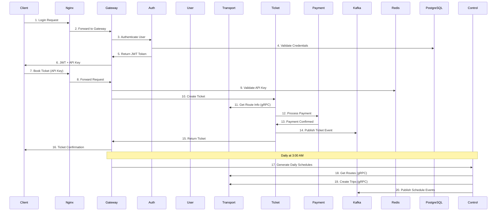

## 🏛️ Service Architecture Patterns

### 1. **API Gateway Pattern**
- **Single Entry Point**: All client requests through Nginx → API Gateway
- **Authentication & Authorization**: JWT + API Key dual system
- **Dynamic Routing**: Service discovery with load balancing
- **Circuit Breaker**: Fault tolerance with automatic fallback

### 2. **Microservices Architecture**
- **Domain-Driven Design**: Each service owns specific business domain
- **Independent Deployment**: Services can be deployed separately
- **Technology Diversity**: Node.js, Python, different databases
- **Event-Driven Communication**: Kafka for loose coupling

### 3. **Event-Driven Architecture**
- **Asynchronous Processing**: Services communicate via events
- **Event Sourcing**: Critical business events stored as logs
- **CQRS**: Separate read/write models for performance
- **Saga Pattern**: Distributed transaction management

### 4. **Multi-Database Strategy**
- **PostgreSQL**: Primary transactional database
- **Redis**: High-performance caching and session management
- **MongoDB**: Document storage for unstructured data
- **Kafka**: Event streaming and message broker

## 🔧 Technology Stack Summary

### **Frontend & Edge**
- **Nginx**: Reverse proxy, SSL termination, rate limiting
- **Web/Mobile**: React, mobile applications
- **Admin Panel**: Management interface

### **Backend Services**
- **API Gateway**: Node.js + Express + PostgreSQL + Redis
- **Auth Service**: Node.js + JWT + PostgreSQL
- **User Service**: Node.js + PostgreSQL + Redis + Kafka
- **Transport Service**: Node.js + PostgreSQL + gRPC
- **Ticket Service**: Node.js + PostgreSQL + Redis + gRPC
- **Public Service**: Node.js + Redis + gRPC
- **Payment Service**: Node.js + PostgreSQL + Kafka
- **Report Service**: Python + PostgreSQL
- **Control Service**: Python + Prophet ML + gRPC
- **Notification Service**: Node.js + Kafka + SMTP/SMS

### **Supporting Services**
- **Scheduler Service**: Node.js + gRPC + Cron
- **Webhook Service**: Node.js + MongoDB + Redis

### **Data & Infrastructure**
- **PostgreSQL**: Primary database
- **Redis**: Caching and session management
- **MongoDB**: Document storage
- **Kafka**: Event streaming
- **Prometheus + Grafana**: Monitoring
- **Loki**: Log aggregation

### **External Integrations**
- **VNPay**: Vietnamese payment gateway
- **PayPal**: International payment gateway
- **SMTP**: Email delivery
- **SMS**: Text messaging

## 🚀 Key Architectural Benefits

### **Scalability**
- **Horizontal Scaling**: Each service can scale independently
- **Load Balancing**: Nginx + API Gateway load distribution
- **Caching**: Redis for high-performance data access
- **Event Streaming**: Kafka for high-throughput messaging

### **Reliability**
- **Circuit Breaker**: Automatic failure handling
- **Health Checks**: Service monitoring and auto-recovery
- **Graceful Degradation**: System continues with reduced functionality
- **Data Consistency**: Event sourcing and saga patterns

### **Security**
- **Multi-layer Security**: Nginx + API Gateway + Service-level
- **JWT + API Key**: Dual authentication system
- **Rate Limiting**: Protection against abuse
- **CORS Management**: Controlled cross-origin access

### **Observability**
- **Comprehensive Monitoring**: Prometheus + Grafana
- **Centralized Logging**: Loki for log aggregation
- **Distributed Tracing**: Request correlation across services
- **Performance Metrics**: Real-time system health monitoring

## 🗄️ Database Schema & Entity Relationship Diagrams (ERD)

Based on the comprehensive analysis of all service README files and database models, here are the individual Entity Relationship Diagrams for each microservice in the Metro Backend system:

### 🔐 API Gateway Service Database

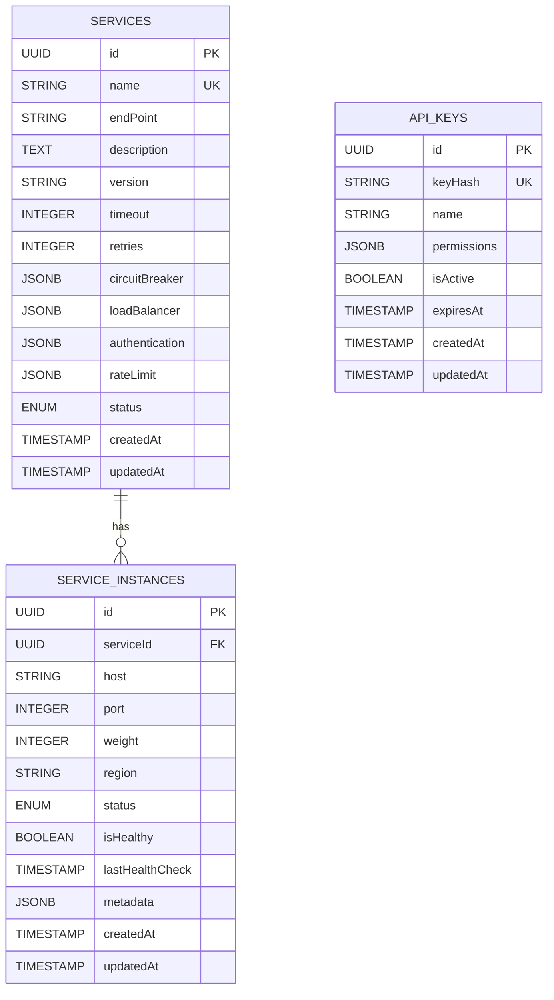

### 🔑 Auth Service Database

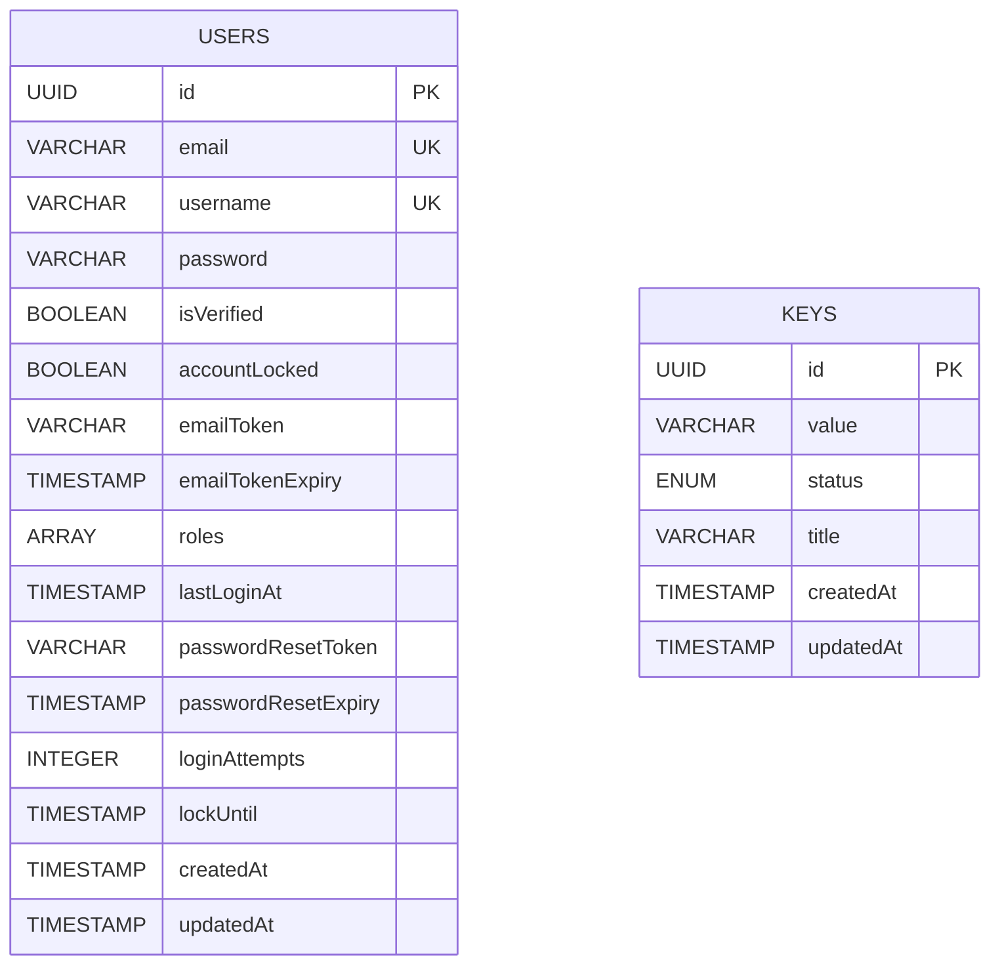

### 👥 User Service Database

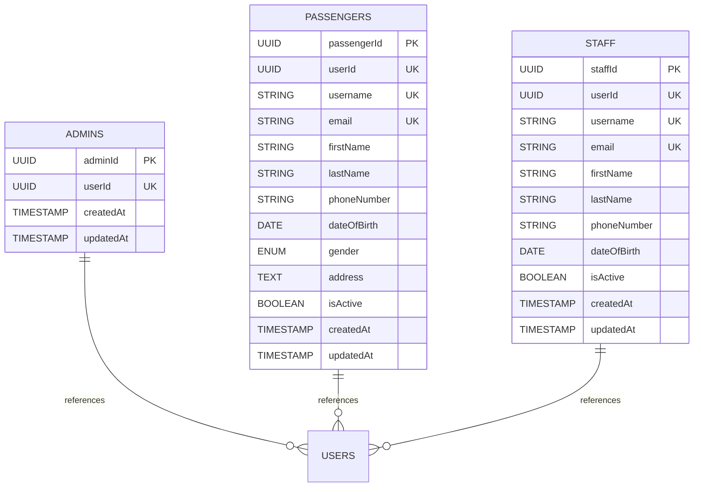

### 🚇 Transport Service Database

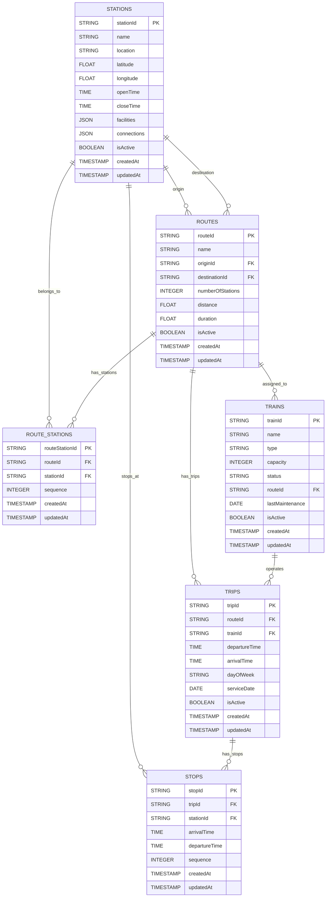

### 🎫 Ticket Service Database

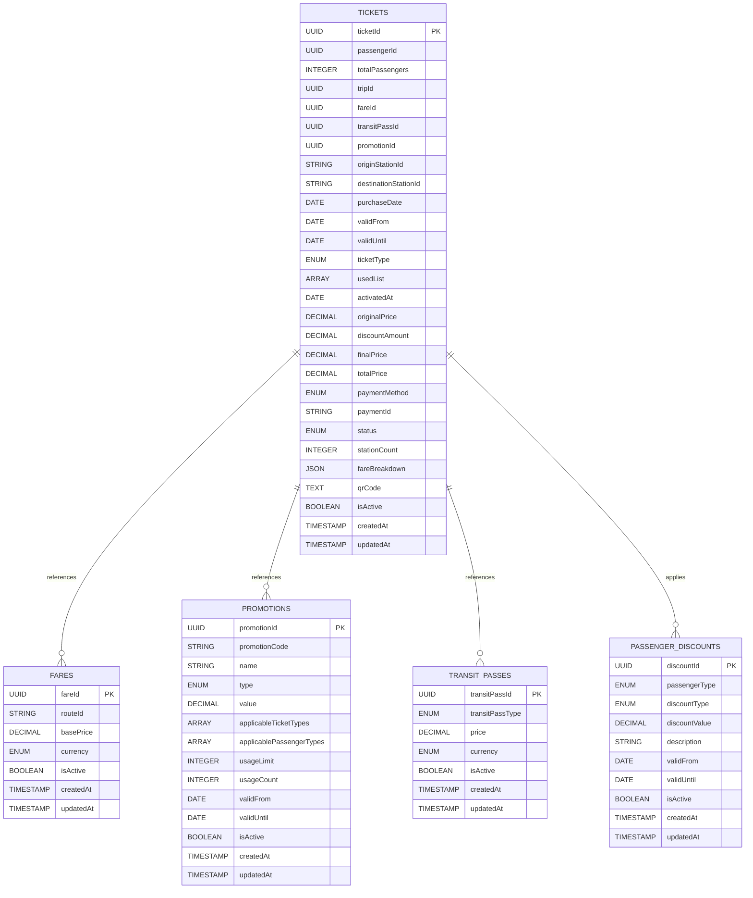

### 💳 Payment Service Database

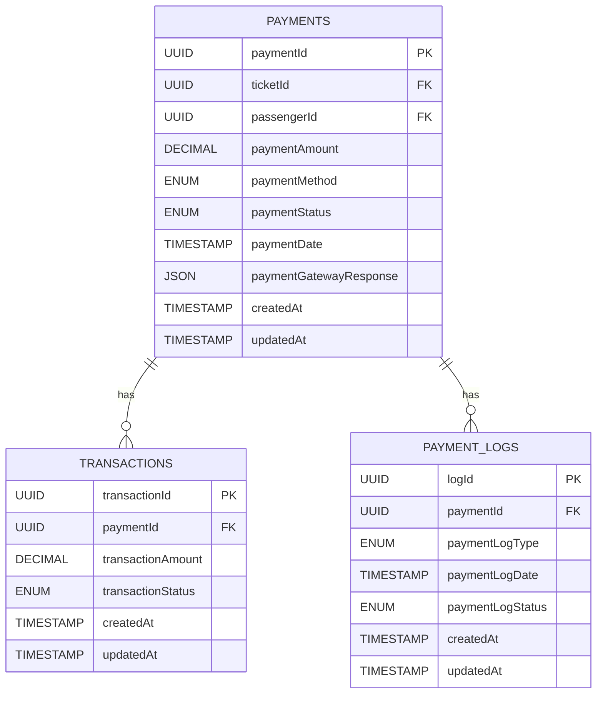

### 📧 Notification Service Database

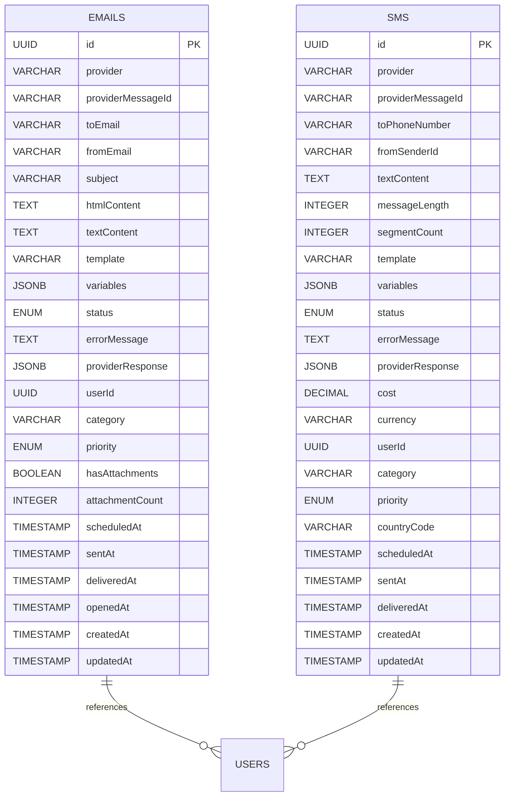

### 📊 Report Service Database

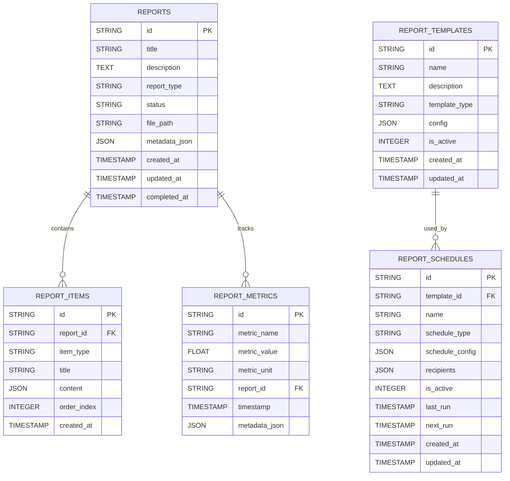

### ⚙️ Management Service Database

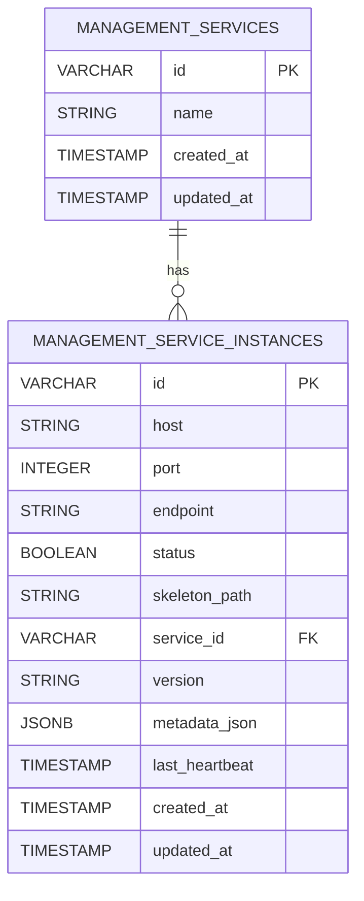

### 🔗 Webhook Service Database (MongoDB)

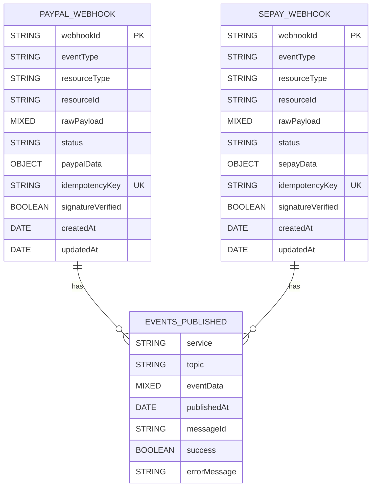

### 🚫 Stateless Services (No Database)

- **Control Service**: Sử dụng file system để lưu trữ Prophet ML models (Joblib)
- **Public Service**: Chỉ sử dụng Redis cache, không có database riêng
- **Scheduler Service**: Sử dụng in-memory job registry, không có persistence

### 📊 Database Distribution Across Services

| Service | Database Type | Primary Tables/Collections | Purpose |
|---------|---------------|---------------------------|---------|
| **API Gateway** | PostgreSQL | Services, ServiceInstances, APIKeys | Service registry, load balancing, API key management |
| **Auth Service** | PostgreSQL | Users, Keys | User authentication, JWT tokens, API keys |
| **User Service** | PostgreSQL | Admins, Passengers, Staff | User profile management, role-based data |
| **Transport Service** | PostgreSQL | Stations, Routes, RouteStations, Trains, Trips, Stops | Metro infrastructure, scheduling, route management |
| **Ticket Service** | PostgreSQL | Tickets, Fares, Promotions, TransitPasses, PassengerDiscounts | Ticket lifecycle, pricing, promotions |
| **Payment Service** | PostgreSQL | Payments, Transactions, PaymentLogs | Payment processing, transaction tracking |
| **Notification Service** | PostgreSQL | Emails, SMS | Notification delivery tracking, audit trail |
| **Report Service** | PostgreSQL | Reports, ReportItems, ReportTemplates, ReportSchedules, ReportMetrics | Report generation, analytics, scheduling |
| **Management Service** | PostgreSQL | Services, ServiceInstances | Service management, monitoring |
| **Webhook Service** | MongoDB | PayPal_Webhook, Sepay_Webhook, Events_Published | Webhook processing, event audit |
| **Control Service** | File System | Prophet Models (Joblib) | AI model storage, no database |
| **Public Service** | Redis Cache | Transport/Ticket data cache | Data aggregation, caching layer |
| **Scheduler Service** | In-Memory | Job Registry (Map) | Cron job management, no persistence |

### 🔗 Key Relationships & Data Flow

1. **User Management Flow**: `Users` (Auth) → `Admins/Passengers/Staff` (User Service)
2. **Ticket Lifecycle**: `Passengers` → `Tickets` → `Payments` → `Notifications`
3. **Transport System**: `Stations` → `Routes` → `Trips` → `Stops`
4. **Service Discovery**: `Services` → `ServiceInstances` (API Gateway)
5. **Event Processing**: Kafka events → Service databases → Audit logs
6. **Report Generation**: Service data → `Reports` → Analytics

### 🏗️ Database Architecture Patterns

- **Multi-Database Strategy**: PostgreSQL for transactional data, MongoDB for document storage, Redis for caching
- **Event Sourcing**: Critical business events stored as audit logs
- **CQRS**: Separate read/write models for performance optimization
- **Database per Service**: Each service owns its data domain
- **Eventual Consistency**: Cross-service data synchronization via Kafka events

---

**Metro Backend Architecture** represents a modern, production-ready microservices platform designed for high availability, scalability, and maintainability in the urban transit domain.
