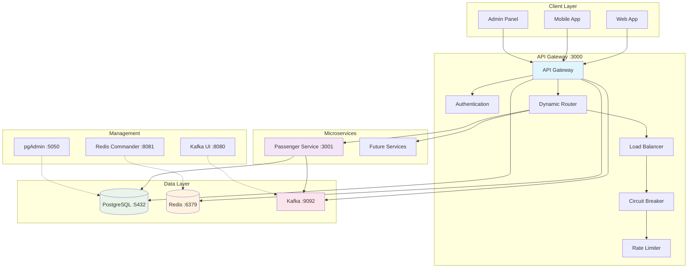
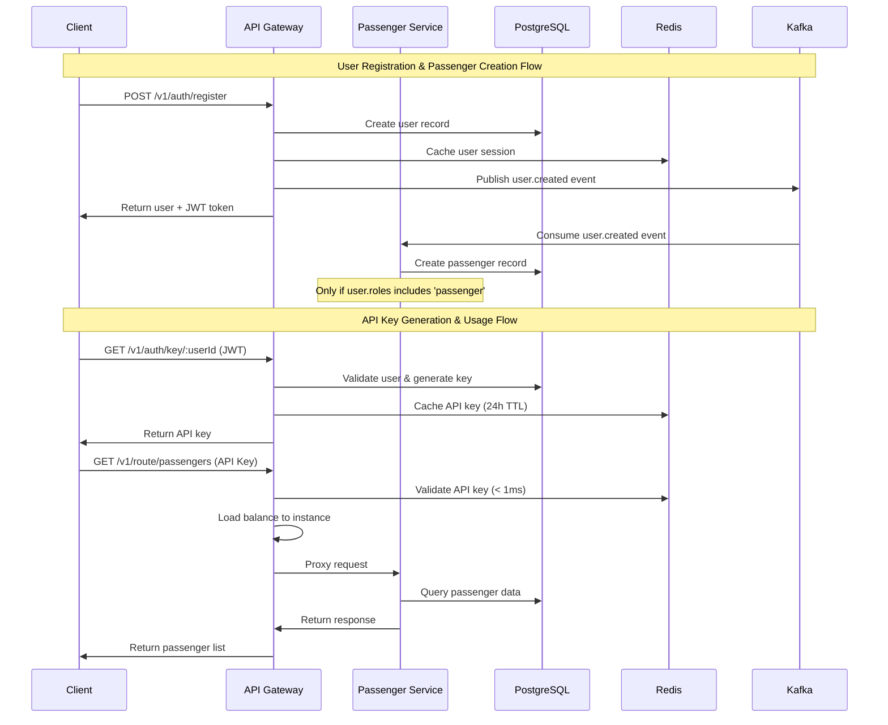
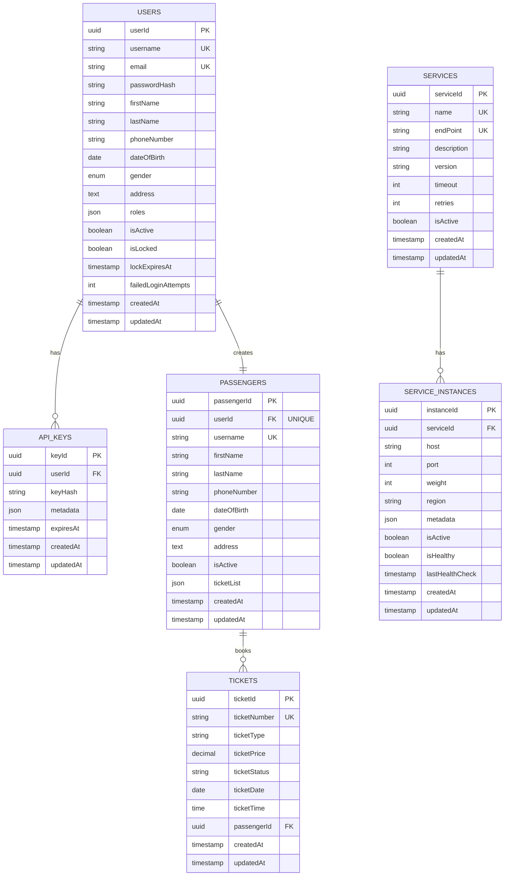

# Metro Backend - Microservices Platform

An event-driven microservices backend built with Node.js, PostgreSQL, Redis, and Kafka.  
The platform provides a comprehensive API Gateway with dynamic routing, authentication, and real-time passenger management services.

---

## 📂 Repository Structure

```
Metro-backend/
├── api-gateway/           # Central API Gateway (authentication, routing, load balancing)
├── passenger-service/     # Passenger management microservice
├── pgadmin/              # PostgreSQL admin interface configuration
├── docker-compose.yml    # Complete development stack
├── init_db.sql          # Database initialization script
└── README.md
```

> Each service owns its own Dockerfile, package.json, tests, and dedicated database schema.

---

## 🚀 Quick Start (Development)

### Prerequisites

* Docker + Docker Compose v2
* Node.js 18+ (LTS)
* Git

### 1. Clone & Bootstrap

```bash
# Clone repository
git clone <repo-url> Metro-backend && cd Metro-backend

# Start complete development stack
docker-compose up --build
```

Docker Compose will provision:
1. **API Gateway** (Port 3000) - Authentication, routing, load balancing
2. **Passenger Service** (Port 3001) - Passenger management
3. **PostgreSQL** (Port 5432) - Primary database
4. **Redis** (Port 6379) - Cache and session store
5. **Kafka** (Port 9092) - Event streaming platform
6. **pgAdmin** (Port 5050) - Database management UI

### 2. Verify Installation

```bash
# Health checks
curl http://localhost:3000/health        # API Gateway
curl http://localhost:3001/health        # Passenger Service

# API Documentation
open http://localhost:3000/api-docs      # Swagger UI
open http://localhost:5050               # pgAdmin
```

### 3. Development Commands

```bash
# View service logs
docker-compose logs -f api-gateway
docker-compose logs -f passenger-service

# Run tests
docker-compose exec api-gateway npm test
docker-compose exec passenger-service npm test

# Restart specific service
docker-compose restart api-gateway

# Cleanup (removes volumes/data)
docker-compose down -v
```

---

## 🏗️ System Architecture



### Key Components:

* **API Gateway** – Central entry point with JWT authentication, API key management, dynamic routing, load balancing, circuit breaker, and rate limiting
* **Passenger Service** – Manages passenger profiles, integrates with user events via Kafka
* **PostgreSQL** – Stores users, services, instances, API keys, and passenger data
* **Redis** – High-speed cache for API keys (10-50x faster), rate limiting, and connection tracking
* **Kafka** – Event-driven communication for user lifecycle events

---

## 🔄 Data Flow & Event Architecture



---

## 🗄️ Database Schema



### Schema Highlights:

- **Multi-role User System**: Supports passenger, staff, admin roles
- **API Key Management**: Hashed keys with metadata and TTL
- **Service Registry**: Dynamic service discovery and health monitoring
- **Event-Driven Sync**: User → Passenger creation via Kafka
- **Extensible Design**: Ready for ticketing, payment, route services

---

## 🔧 Configuration & Environment

### API Gateway (.env)
```env
# Application
NODE_ENV=development
PORT=3000

# Database
DB_HOST=localhost
DB_PORT=5432
DB_NAME=metro_gateway
DB_USER=postgres
DB_PASSWORD=postgres

# Redis
REDIS_HOST=localhost
REDIS_PORT=6379

# JWT & Security
JWT_ACCESS_SECRET=your_super_secret_access_key_32_chars_min
JWT_REFRESH_SECRET=your_super_secret_refresh_key_32_chars_min
HASH_SECRET=your_api_key_hash_secret_32_chars_min

# Kafka
KAFKA_BROKERS=localhost:9092
KAFKA_CLIENT_ID=api-gateway
```

### Passenger Service (.env)
```env
# Application
NODE_ENV=development
PORT=3001

# Database
DB_HOST=localhost
DB_PORT=5432
DB_NAME=passenger_db
DB_USER=postgres
DB_PASSWORD=postgres

# Kafka
KAFKA_BROKERS=localhost:9092
KAFKA_CLIENT_ID=passenger-service
```

---

## 📚 API Endpoints

### Authentication Routes (API Gateway)
```bash
POST /v1/auth/register      # User registration + Kafka event
POST /v1/auth/login         # JWT authentication
POST /v1/auth/refresh       # Token refresh
POST /v1/auth/logout        # User logout
GET  /v1/auth/key/:userId   # Generate API key (JWT required)
```

### Service Management (API Gateway - JWT Required)
```bash
POST /v1/services                        # Register microservice
GET  /v1/services                        # List services
POST /v1/services/:id/instances          # Register service instance
GET  /v1/services/:id/health             # Health check instances
```

### Dynamic Routing (API Gateway - API Key Required)
```bash
# Route to any registered microservice
ALL /v1/route/:endPoint/*

# Examples:
GET  /v1/route/passengers               # List all passengers
GET  /v1/route/passengers/:id           # Get passenger profile
POST /v1/route/passengers               # Create passenger
PUT  /v1/route/passengers/:id           # Update passenger
DELETE /v1/route/passengers/:id         # Delete passenger
```

### Passenger Service (Direct - for development)
```bash
GET  /v1/passengers         # List passengers
GET  /v1/passengers/:id     # Get passenger by ID
POST /v1/passengers         # Create passenger
PUT  /v1/passengers/:id     # Update passenger
DELETE /v1/passengers/:id   # Delete passenger
```

---

## ➕ Adding New Microservices

### 1. Create Service Structure
```bash
mkdir new-service && cd new-service
npm init -y
npm install express sequelize pg kafkajs winston
```

### 2. Add Dockerfile
```dockerfile
FROM node:18-alpine
WORKDIR /app
COPY package*.json ./
RUN npm install
COPY . .
EXPOSE 3002
CMD ["npm", "start"]
```

### 3. Update docker-compose.yml
```yaml
new-service:
  build: ./new-service
  ports: ["3002:3002"]
  environment:
    - NODE_ENV=development
    - PORT=3002
    - DB_HOST=postgres
  depends_on:
    - postgres
    - redis
    - kafka
  networks:
    - metro-network
```

### 4. Register with API Gateway
```bash
# Register service
curl -X POST http://localhost:3000/v1/services \
  -H "Authorization: Bearer JWT_TOKEN" \
  -d '{
    "name": "new-service",
    "endPoint": "newservice",
    "description": "New microservice",
    "version": "1.0.0"
  }'

# Register instance
curl -X POST http://localhost:3000/v1/services/SERVICE_ID/instances \
  -H "Authorization: Bearer JWT_TOKEN" \
  -d '{
    "host": "new-service",
    "port": 3002,
    "weight": 1
  }'
```

---

## 🧪 Testing Strategy

### Unit Tests
```bash
# Test specific service
docker-compose exec api-gateway npm test
docker-compose exec passenger-service npm test

# Test with coverage
docker-compose exec api-gateway npm run test:coverage
```

### Integration Tests
```bash
# Full system integration tests
npm run test:integration

# Kafka event flow tests
npm run test:events

# Load balancing tests
npm run test:routing
```

### Performance Tests
```bash
# API Gateway load testing
npm run test:load

# Redis performance validation
npm run test:cache
```

---

## 🚀 Production Deployment

### 1. Build Production Images
```bash
# Build versioned images
docker build -t metro/api-gateway:v1.0.0 ./api-gateway
docker build -t metro/passenger-service:v1.0.0 ./passenger-service

# Push to registry
docker push metro/api-gateway:v1.0.0
docker push metro/passenger-service:v1.0.0
```

### 2. Production Compose
```bash
# Deploy with production configuration
docker-compose -f docker-compose.prod.yml up -d
```

### 3. Health Monitoring
```bash
# Monitor service health
curl http://production-url/health
curl http://production-url/v1/services/health

# View metrics
curl http://production-url/metrics
```

---

## 📊 Monitoring & Observability

### Health Endpoints
- **API Gateway**: `GET /health`, `GET /health/db`, `GET /health/redis`
- **Services**: `GET /v1/services/:id/health`
- **Metrics**: `GET /metrics` (Prometheus format)

### Management UIs
- **API Documentation**: http://localhost:3000/api-docs
- **Database Admin**: http://localhost:5050 (pgAdmin)
- **Redis Management**: http://localhost:8081 (Redis Commander)  
- **Kafka UI**: http://localhost:8080

### Performance Metrics
- **API Key Validation**: Redis cache ~0.5-1ms vs PostgreSQL ~10-50ms
- **Rate Limiting**: Redis-backed with automatic TTL cleanup
- **Circuit Breaker**: Opossum with configurable thresholds
- **Load Balancing**: Connection-aware routing with Redis tracking

---

## 🤝 Contributing

1. Fork the repository
2. Create feature branch: `git checkout -b feature/awesome-feature`
3. Follow conventional commits: `feat: add user authentication`
4. Run tests: `npm test` 
5. Submit PR with comprehensive description

### Code Standards
- **ESLint + Prettier**: Consistent code formatting
- **Jest**: Unit and integration testing
- **Conventional Commits**: Standardized commit messages
- **API Documentation**: Swagger/OpenAPI 3.0

---

## 📄 Documentation

- **[API Gateway Documentation](./api-gateway/README.md)**: Comprehensive guide
- **[Routes Documentation](./api-gateway/ROUTES_DOCUMENTATION.md)**: Detailed API reference
- **[Swagger UI](http://localhost:3000/api-docs)**: Interactive API explorer

---

## 📝 License

MIT © 2025 Metro Backend Contributors

---

**Built with ❤️ for scalable microservices architecture** 