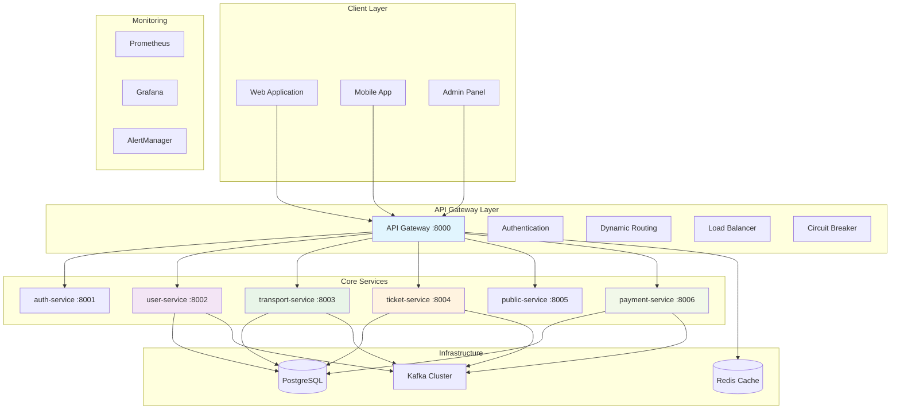
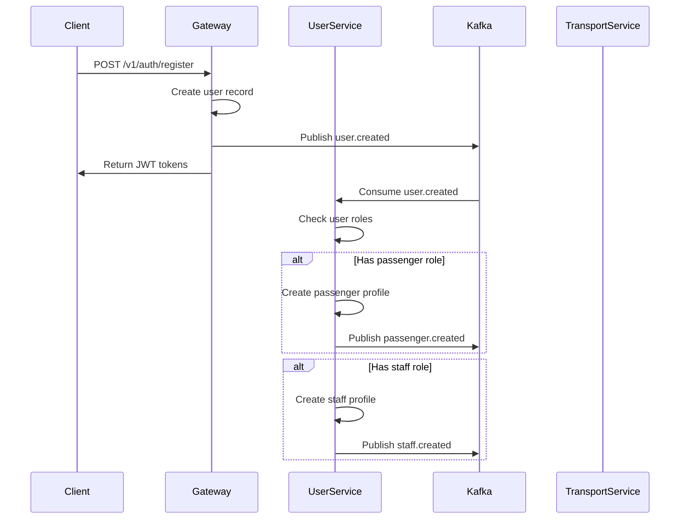

# Metro Backend - Microservices Platform

A comprehensive event-driven microservices backend platform for urban transit management, built with Node.js and featuring advanced architecture patterns including API Gateway, gRPC communication, Kafka event streaming, and unified user management.

## 🏗️ System Architecture



## 🚀 Quick Start

### Prerequisites
- Docker & Docker Compose v2.0+
- Node.js 18+ (for local development)
- Git

### 1. Clone & Setup
```bash
git clone <repository-url> Metro-backend
cd Metro-backend

# Copy environment files
cp api-gateway/env.example api-gateway/.env
cp auth-service/env.example auth-service/.env
cp user-service/env.example user-service/.env
cp transport-service/env.example transport-service/.env
cp ticket-service/env.example ticket-service/.env
cp payment-service/env.example payment-service/.env
cp public-service/env.example public-service/.env
```

### 2. Launch Complete Stack
```bash
# Start all services
docker-compose up --build -d

# Check service status
docker-compose ps

# View logs
docker-compose logs -f api-gateway
```

### 3. Verify Services
```bash
# Health checks
curl http://localhost:8000/health          # API Gateway
curl http://localhost:8002/health          # User Service
curl http://localhost:8003/health          # Transport Service

# API Documentation
open http://localhost:8000/api-docs        # Swagger UI

# Management Tools
open http://localhost:5050                 # pgAdmin (admin@admin.com/admin)
open http://localhost:8081                 # Redis Commander
open http://localhost:9000                 # Kafka UI
open http://localhost:3001                 # Grafana (admin/admin)
```

## 📋 Service Overview

| Service | Port | Description | Status |
|---------|------|-------------|--------|
| **api-gateway** | 8000 | Central API Gateway with authentication & routing | ✅ Active |
| **auth-service** | 8001 | Authentication & authorization service | ✅ Active |
| **user-service** | 8002 | Unified user management (admin/passenger/staff) | ✅ Active |
| **transport-service** | 8003 | Transport operations (routes, stations, schedules) | ✅ Active |
| **ticket-service** | 8004 | Ticket & fare management with gRPC | ✅ Active |
| **public-service** | 8005 | Public API with caching & scheduling | ✅ Active |
| **payment-service** | 8006 | Payment processing (PayPal, VNPay) | ✅ Active |
| **report-service** | 8007 | Analytics & reporting | 🚧 In Development |

## 🔐 API Gateway (Port 8000)

**Central entry point** with advanced routing, authentication, and load balancing capabilities.

### Key Features:
- **Dual Authentication**: JWT + API Key management
- **Dynamic Routing**: Auto-discovery and load balancing
- **Circuit Breaker**: Automatic failover with Opossum
- **Rate Limiting**: Multi-tier protection
- **Redis Caching**: Ultra-fast API key validation (< 1ms)
- **Swagger Documentation**: Complete API specs

### Architecture:
```
api-gateway/
├── src/
│   ├── controllers/      # Auth, routing, service management
│   ├── services/         # Load balancing, email, business logic
│   ├── middlewares/      # Auth, rate limiting, validation
│   ├── events/           # Kafka producers
│   ├── config/           # Database, Redis, Swagger
│   └── swagger/          # API documentation
```

## 👥 User Service (Port 8002)

**Unified user management** consolidating admin, passenger, and staff profiles into a single service.

### Key Features:
- **Unified Architecture**: Single service for all user types
- **Event-Driven**: Automatic profile creation from Kafka events
- **Role-Based Processing**: Smart handling based on user roles
- **Security Enhanced**: Network validation and service authentication
- **Backward Compatible**: All original API endpoints maintained

### API Documentation:
📖 **Complete API Documentation**: http://localhost:8000/api-docs/#/

All endpoints are documented with detailed request/response examples, authentication requirements, and testing capabilities.

## 🚆 Transport Service (Port 8003)

**Transport operations** managing routes, stations, schedules, and trains with gRPC support.

### Key Features:
- **Route Management**: Complete CRUD for metro routes
- **Station Operations**: Station management and scheduling
- **gRPC Communication**: High-performance inter-service communication
- **Event Publishing**: Kafka events for route changes
- **Schedule Management**: Trip scheduling and optimization

### API Documentation:
📖 **Complete API Documentation**: http://localhost:8000/api-docs/#/

All transport endpoints are documented with detailed request/response examples, authentication requirements, and testing capabilities.

## 🎫 Ticket Service (Port 8004)

**Ticket & fare management** with gRPC server and promotion handling.

### Key Features:
- **Ticket Management**: Complete ticket lifecycle
- **Fare Calculation**: Dynamic pricing with gRPC
- **Promotion System**: Discount and promotion management
- **gRPC Server**: High-performance fare calculations
- **Event Publishing**: Ticket and fare change events

### API Documentation:
📖 **Complete API Documentation**: http://localhost:8000/api-docs/#/

All ticket and fare endpoints are documented with detailed request/response examples, authentication requirements, and testing capabilities.

## 💳 Payment Service (Port 8006)

**Payment processing** supporting multiple payment gateways.

### Key Features:
- **Multi-Gateway**: PayPal and VNPay integration
- **Payment Logging**: Complete transaction history
- **Event Consumption**: Ticket payment events from Kafka
- **Secure Processing**: Encrypted payment data handling
- **Webhook Support**: Payment confirmation callbacks

### Supported Payment Methods:
- **PayPal**: International payments
- **VNPay**: Vietnamese payment gateway
- **Future**: Credit card, mobile money integration

## 📡 Public Service (Port 8005)

**Public API** with caching, scheduling, and gRPC client capabilities.

### Key Features:
- **Public Endpoints**: External-facing APIs
- **Redis Caching**: High-performance data caching
- **Scheduled Tasks**: Automated data updates
- **gRPC Client**: Communication with transport & ticket services
- **Health Monitoring**: Service health checks

### API Documentation:
📖 **Complete API Documentation**: http://localhost:8000/api-docs/#/

All public endpoints are documented with detailed request/response examples, authentication requirements, and testing capabilities.

## 🔄 Event-Driven Architecture

### Kafka Topics:
```bash
# User Events
user.created
user.updated
user.deleted

# Admin Events
admin.created
admin.updated
admin.deleted

# Passenger Events
passenger.created
passenger.updated
passenger.deleted

# Staff Events
staff.created
staff.updated
staff.deleted
staff.status.changed

# Transport Events
route.created
route.updated
route.deleted

# Ticket Events
ticket.created
ticket.updated
ticket.deleted
fare.updated
```

### Event Flow Example:


## 🛡️ Security Features

### Authentication & Authorization:
- **JWT Tokens**: HTTP-only cookies with access/refresh tokens
- **API Key Management**: Automatic generation and rotation
- **Role-Based Access**: Granular permissions per user type
- **Service Authentication**: Inter-service communication security

### Network Security:
- **CORS Protection**: Controlled cross-origin access
- **Helmet.js**: Security headers and XSS protection
- **Rate Limiting**: Multi-tier protection against abuse
- **Input Validation**: Joi schemas and SQL injection prevention

### Data Protection:
- **Encrypted Storage**: Password hashing with bcrypt
- **Secure Logging**: No sensitive data in logs
- **Network Validation**: Direct access blocking for microservices
- **Circuit Breaker**: Automatic failover and recovery

## 📊 Monitoring & Observability

### Health Endpoints:
```bash
# Service Health
GET /health                    # Basic health check
GET /health/db                 # Database connectivity
GET /health/redis              # Redis connectivity
GET /metrics                   # Prometheus metrics
```

### Monitoring Stack:
- **Prometheus**: Metrics collection
- **Grafana**: Visualization and dashboards
- **AlertManager**: Alert management
- **Kafka UI**: Event stream monitoring

### Management Interfaces:
- **Swagger UI**: http://localhost:8000/api-docs
- **pgAdmin**: http://localhost:5050 (admin@admin.com/admin)
- **Redis Commander**: http://localhost:8081
- **Kafka UI**: http://localhost:9000
- **Grafana**: http://localhost:3001 (admin/admin)

## 🧪 Development & Testing

### Running Tests:
```bash
# API Gateway tests
docker-compose exec api-gateway npm test
docker-compose exec api-gateway npm run test:unit
docker-compose exec api-gateway npm run test:integration

# User Service tests
docker-compose exec user-service npm test

# All services
docker-compose exec api-gateway npm test && \
docker-compose exec user-service npm test && \
docker-compose exec transport-service npm test
```

### Development Commands:
```bash
# Watch logs
docker-compose logs -f api-gateway user-service

# Restart specific service
docker-compose restart user-service

# Access service shell
docker-compose exec user-service bash

# Database access
docker-compose exec postgres psql -U postgres

# Redis CLI
docker-compose exec redis redis-cli -a redispass123
```

## 🚀 Deployment

### Production Configuration:
```bash
# Use production compose file
docker-compose -f docker-compose.prod.yml up -d

# Environment variables
NODE_ENV=production
LOG_LEVEL=warn
RATE_LIMIT_MAX_REQUESTS=1000
```

### Scaling Considerations:
- **API Gateway**: Multiple instances behind load balancer
- **User Service**: Horizontal scaling with Kafka consumer groups
- **Redis**: Clustering for high availability
- **PostgreSQL**: Read replicas for performance
- **Kafka**: Multi-broker cluster for reliability

## 📖 API Usage Examples

### API Testing:
📖 **Interactive API Testing**: http://localhost:8000/api-docs/#/

Use the Swagger UI to:
- Test all endpoints interactively
- View detailed request/response schemas
- Understand authentication requirements
- Execute API calls with real data

### Quick Examples:
```bash
# Health check
curl http://localhost:8000/health

# Service status
curl http://localhost:8000/metrics
```

## 🤝 Contributing

1. Fork the repository
2. Create feature branch: `git checkout -b feature/amazing-feature`
3. Follow established code standards and patterns
4. Write comprehensive tests
5. Update documentation as needed
6. Commit changes: `git commit -m 'Add amazing feature'`
7. Push to branch: `git push origin feature/amazing-feature`
8. Open a Pull Request

### Development Standards:
- **ESLint + Prettier**: Code formatting and linting
- **Jest**: Testing framework with high coverage
- **Conventional Commits**: Standardized commit messages
- **API Documentation**: Update Swagger specs for all changes

## 📄 License

This project is licensed under the MIT License - see the [LICENSE](LICENSE) file for details.

---

**Metro Backend - Building the Future of Urban Transit Management** 🚇✨