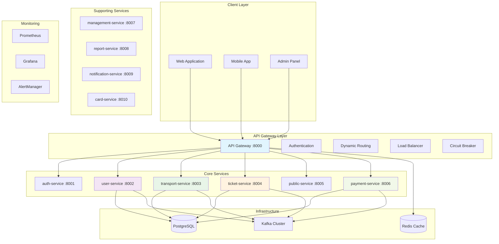
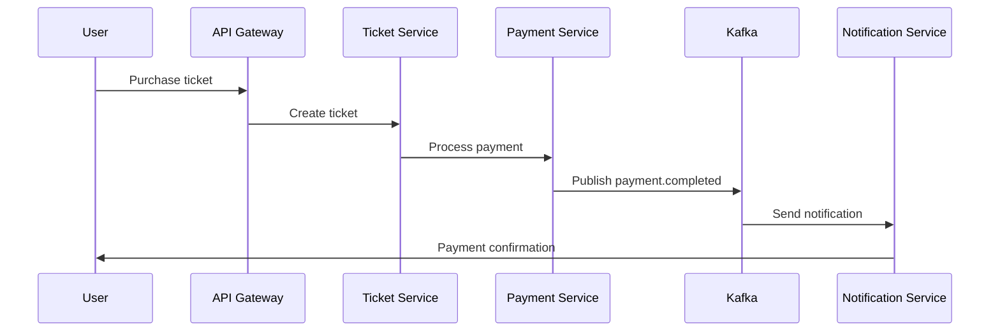

# Metro Backend - Microservices Platform

A comprehensive event-driven microservices backend platform for urban transit management, built with Node.js and Python, featuring advanced architecture patterns including API Gateway, gRPC communication, Kafka event streaming, and unified user management.

## 🏗️ System Architecture



## 🚀 Quick Start

### Prerequisites
- Docker & Docker Compose v2.0+
- Node.js 18+ (for local development)
- Python 3.8+ (for Python services)
- Git

### 1. Clone & Setup
```bash
git clone <repository-url> Metro-backend
cd Metro-backend

# Copy environment files
cp api-gateway/env.example api-gateway/.env
cp auth-service/env.example auth-service/.env
cp user-service/env.example user-service/.env
cp transport-service/env.example transport-service/.env
cp ticket-service/env.example ticket-service/.env
cp payment-service/env.example payment-service/.env
cp public-service/env.example public-service/.env
```

### 2. Launch Complete Stack
```bash
# Start all services
docker-compose up --build -d

# Check service status
docker-compose ps
```

### 3. Verify Installation
```bash
# Health check
curl http://localhost:8000/health

# API documentation
open http://localhost:8000/api-docs
```

## 📋 Service Overview

### Core Services

#### 🔐 **API Gateway** (`:8000`)
- **Central Entry Point**: All client requests routed through gateway
- **Authentication & Authorization**: JWT tokens + API keys for dual auth system
- **Dynamic Service Routing**: Express-http-proxy with path resolution
- **Load Balancing**: Redis-backed least connections algorithm
- **Circuit Breaker**: Opossum-based fault tolerance
- **Rate Limiting**: Multi-tier rate limiting (auth, sensitive, API, user-specific)
- **Security**: Helmet.js, CORS, input validation, SQL injection prevention

#### 🔑 **Authentication Service** (`:8001`)
- **JWT Token Management**: Access and refresh token generation/validation
- **User Authentication**: Login, logout, session management
- **Role-Based Access Control**: Admin, passenger, staff roles
- **Password Security**: bcrypt hashing, secure token generation
- **Email Verification**: Account verification system
- **Account Security**: Auto-locking, temporary blocks, admin controls

#### 👥 **User Service** (`:8002`)
- **Unified User Management**: Admin, passenger, and staff users
- **Profile Management**: User profiles, preferences, account settings
- **Event-Driven Updates**: Kafka integration for real-time user updates
- **Redis Caching**: Fast access to user data
- **Registration & Account Management**: User onboarding and lifecycle

#### 🚇 **Transport Service** (`:8003`)
- **Route Management**: Metro line definitions and route optimization
- **Station Network**: Complete station database with geographical data
- **Train Fleet Management**: Train inventory and operational status
- **Trip Scheduling**: Real-time trip tracking and schedule management
- **gRPC Server**: High-performance API for other services
- **Real-time Updates**: Kafka integration for infrastructure changes

#### 🎫 **Ticket Service** (`:8004`)
- **Ticket Management**: Creation, validation, and lifecycle management
- **Fare Calculation**: Dynamic pricing (zone-based, distance-based, time-based)
- **Promotion System**: Discount codes, campaigns, special offers
- **Short-Term Tickets**: One-way and return tickets with station-based pricing
- **Long-Term Passes**: Day, weekly, monthly, yearly, and lifetime passes
- **Passenger Caching**: Redis-based performance optimization
- **gRPC Integration**: Efficient communication with transport service

#### 💳 **Payment Service** (`:8006`)
- **Multi-Gateway Support**: VNPay (Vietnamese) and PayPal (International)
- **Multi-Currency**: VND and USD payment processing
- **Webhook Handling**: Secure payment status verification
- **Transaction Logging**: Comprehensive payment audit trail
- **Event-Driven**: Kafka-based payment event publishing
- **Refund Processing**: Complete refund management system

#### 🌐 **Public Service** (`:8005`)
- **Data Aggregation**: Fetches data from Transport and Ticket services via gRPC
- **Caching Layer**: Redis-based caching for fast data retrieval
- **REST APIs**: Public access to transport and ticket information
- **Automated Sync**: Hourly data synchronization from backend services
- **Performance Optimized**: Sub-millisecond response times for cached data

### Supporting Services

#### 📊 **Management Service** (`:8007`)
- **Service Health Monitoring**: Real-time health checks for all services
- **Infrastructure Management**: Docker container orchestration
- **Prometheus Metrics**: Comprehensive metrics collection
- **Alert Management**: Automated alerting and notifications
- **Service Discovery**: Dynamic service registration and discovery

#### 📈 **Report Service** (`:8008`)
- **Report Generation**: Daily, weekly, monthly, and custom reports
- **Real-time Analytics**: Kafka event processing for live metrics
- **Template System**: Reusable report templates
- **Scheduled Reports**: Automated report generation
- **Data Visualization**: Charts and analytics dashboards

#### 🔔 **Notification Service** (`:8009`)
- **Push Notifications**: Real-time push notification system
- **Email Notifications**: SMTP-based email delivery
- **SMS Integration**: Text message notifications
- **In-App Messaging**: Internal messaging system
- **Notification Preferences**: User-configurable notification settings

#### 💳 **Card Service** (`:8010`)
- **Smart Card Management**: Metro card registration and activation
- **Balance Management**: Card balance tracking and updates
- **Transaction History**: Complete transaction audit trail
- **Card Security**: Advanced security features and fraud prevention
- **Integration**: Seamless integration with payment and ticket services

## 🛠️ Technology Stack

### Backend Technologies
- **Node.js 18+**: JavaScript/TypeScript runtime
- **Python 3.8+**: Python services (Report, Management)
- **Express.js**: Web framework for Node.js services
- **FastAPI**: Modern Python web framework
- **Sequelize**: Node.js ORM for database operations
- **SQLAlchemy**: Python ORM for database operations

### Database & Caching
- **PostgreSQL 15**: Primary database for all services
- **Redis 7**: Distributed caching and session storage
- **Connection Pooling**: Optimized database connections

### Message Queue & Communication
- **Apache Kafka**: Event streaming and message queuing
- **gRPC**: High-performance inter-service communication
- **Protocol Buffers**: Efficient data serialization

### Security & Authentication
- **JWT Tokens**: JSON Web Tokens for authentication
- **bcrypt**: Password hashing and security
- **Helmet.js**: Security headers and protection
- **CORS**: Cross-origin resource sharing
- **Rate Limiting**: Multi-tier request limiting

### Monitoring & Observability
- **Prometheus**: Metrics collection and monitoring
- **Grafana**: Data visualization and dashboards
- **AlertManager**: Alert management and notifications
- **Winston**: Structured logging with daily rotation
- **Health Checks**: Comprehensive health monitoring

### Development Tools
- **Docker & Docker Compose**: Containerization and orchestration
- **ESLint & Prettier**: Code linting and formatting
- **Jest**: JavaScript testing framework
- **pytest**: Python testing framework
- **Swagger/OpenAPI**: API documentation

## 📚 API Documentation

### Authentication Endpoints
```bash
POST /v1/auth/register     # User registration
POST /v1/auth/login        # User login
POST /v1/auth/refresh      # Token refresh
POST /v1/auth/logout       # User logout
GET  /v1/auth/key/:userId  # Generate API key
```

### User Management
```bash
GET    /v1/users           # List users
POST   /v1/users           # Create user
GET    /v1/users/:id       # Get user details
PUT    /v1/users/:id       # Update user
DELETE /v1/users/:id       # Delete user
```

### Transport System
```bash
GET /v1/transport/routes           # List all routes
GET /v1/transport/routes/:id       # Get route details
GET /v1/transport/stations         # List all stations
GET /v1/transport/stations/:id     # Get station details
GET /v1/transport/trips            # List trips
GET /v1/transport/trains           # List trains
```

### Ticketing System
```bash
POST /v1/ticket/tickets/create-short-term  # Create short-term ticket
POST /v1/ticket/tickets/create-long-term   # Create long-term pass
GET  /v1/ticket/tickets/:id               # Get ticket details
PUT  /v1/ticket/tickets/:id/validate      # Validate ticket
GET  /v1/ticket/fares                     # Get fare information
POST /v1/ticket/fares/calculate           # Calculate fare
```

### Payment Processing
```bash
POST /v1/payment/vnpay              # Initiate VNPay payment
GET  /v1/payment/vnpay/return       # Handle VNPay return
POST /v1/payment/paypal/create-order # Create PayPal order
POST /v1/payment/paypal/capture/:id  # Capture PayPal payment
```

### Public APIs
```bash
GET /v1/public/transport/routes      # Public route information
GET /v1/public/transport/stations    # Public station data
GET /v1/public/tickets/fares         # Public fare information
GET /v1/public/tickets/transit-passes # Public pass information
```

## 🔄 Event System

### Kafka Topics
- `user-events`: User lifecycle events (created, updated, deleted)
- `payment-events`: Payment processing events (initiated, completed, failed)
- `ticket-events`: Ticket lifecycle events (created, validated, expired)
- `transport-events`: Transport updates (routes, stations, trips)
- `notification-events`: Notification delivery events

### Event Flow Example


## 🚀 Deployment

### Development Environment
```bash
# Start all services
docker-compose up --build -d

# View logs
docker-compose logs -f

# Stop services
docker-compose down
```

### Production Deployment
```bash
# Production compose file
docker-compose -f docker-compose.prod.yml up -d

# Environment-specific configs
# Development: .env.development
# Staging: .env.staging
# Production: .env.production
```

### Service Health Monitoring
```bash
# Gateway health
curl http://localhost:8000/health

# Service-specific health checks
curl http://localhost:8001/health  # Auth service
curl http://localhost:8002/health  # User service
curl http://localhost:8003/health  # Transport service
curl http://localhost:8004/health  # Ticket service
curl http://localhost:8005/health  # Public service
curl http://localhost:8006/health  # Payment service
```

## 📊 Monitoring & Management

### Management Tools
- **API Documentation**: http://localhost:8000/api-docs
- **Redis Commander**: http://localhost:8081
- **pgAdmin**: http://localhost:5050
- **Kafka UI**: http://localhost:8080
- **Grafana**: http://localhost:3000
- **Prometheus**: http://localhost:9090

### Performance Metrics
- **Request/Response Logging**: Winston with correlation IDs
- **Rate Limiting Metrics**: Redis-based tracking
- **Circuit Breaker Stats**: Opossum metrics
- **Database Performance**: Connection pool monitoring
- **Cache Performance**: Redis hit rates and memory usage

## 🔒 Security Features

### Authentication & Authorization
- **Dual Authentication**: JWT tokens for service management + API keys for routing
- **Role-Based Access Control**: Admin, passenger, staff roles
- **Session Management**: Secure session handling
- **Token Refresh**: Automatic token renewal

### Data Protection
- **Password Hashing**: bcrypt with salt rounds
- **Input Validation**: Joi schema validation
- **SQL Injection Prevention**: Parameterized queries
- **XSS Protection**: Input sanitization
- **CORS Configuration**: Cross-origin request handling

### Rate Limiting Tiers
- **General**: 100 requests/15 minutes per IP
- **Authentication**: 10 requests/15 minutes per IP
- **Sensitive Operations**: 5 requests/hour per IP
- **API Endpoints**: 1000 requests/hour per API key
- **Per-User**: 60 requests/minute per authenticated user

## 🧪 Testing

### Test Coverage
- **Unit Tests**: Jest (JavaScript) and pytest (Python)
- **Integration Tests**: Service-to-service communication
- **API Tests**: Endpoint testing with Supertest
- **Performance Tests**: Load testing and benchmarking

### Test Commands
```bash
# Run all tests
npm test

# Run specific service tests
cd api-gateway && npm test
cd user-service && npm test
cd transport-service && npm test

# Run Python service tests
cd report-service && pytest
cd management-service && pytest
```

## 🤝 Contributing

We welcome contributions! Please see our [Contributing Guide](CONTRIBUTING.md) for details on:

- Development setup and environment
- Code standards and guidelines
- Testing requirements
- Pull request process
- Issue reporting

### Quick Contribution Setup
```bash
# Fork and clone
git clone https://github.com/your-username/Metro-backend.git
cd Metro-backend

# Install dependencies
npm install

# Run tests
npm test

# Start development environment
docker-compose up -d
```

## 📄 Documentation

- **[API Documentation](http://localhost:8000/api-docs)**: Interactive API explorer
- **[Contributing Guide](CONTRIBUTING.md)**: Development guidelines
- **[Changelog](CHANGELOG.md)**: Version history and updates
- **[Service READMEs](./api-gateway/README.md)**: Individual service documentation

## 📝 License

This project is licensed under the MIT License - see the [LICENSE](LICENSE) file for details.

## 🆘 Support

- **Documentation**: Check service-specific READMEs
- **Issues**: [GitHub Issues](https://github.com/your-repo/issues)
- **Discussions**: [GitHub Discussions](https://github.com/your-repo/discussions)
- **Email**: support@metro-backend.com

---

**Made with ❤️ for Metro Backend Architecture** 🚇

*Built with modern microservices architecture, event-driven design, and comprehensive monitoring for scalable urban transit management.*