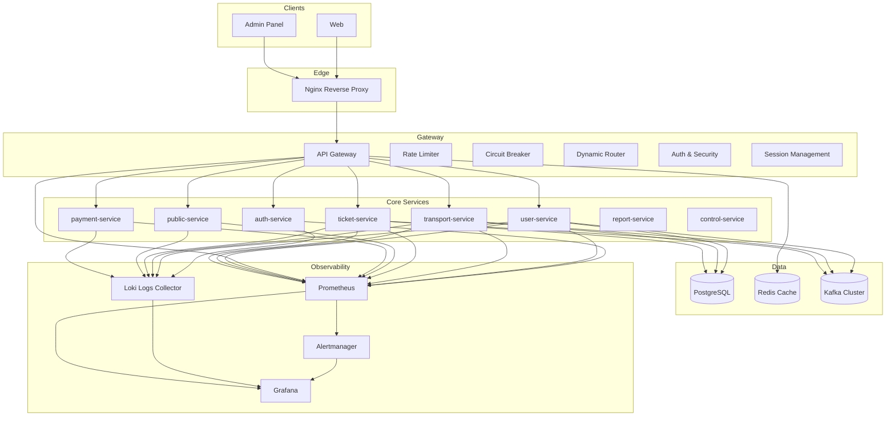
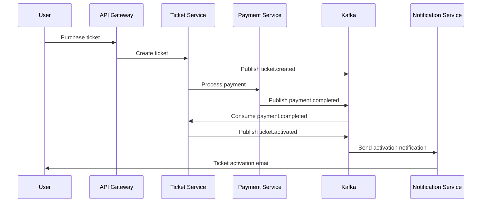
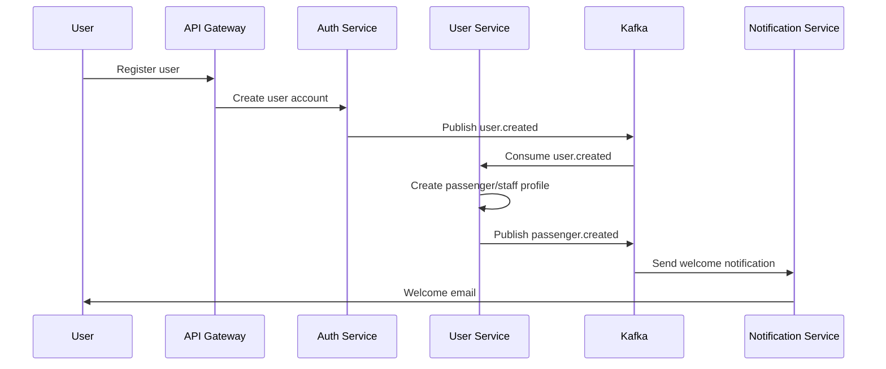
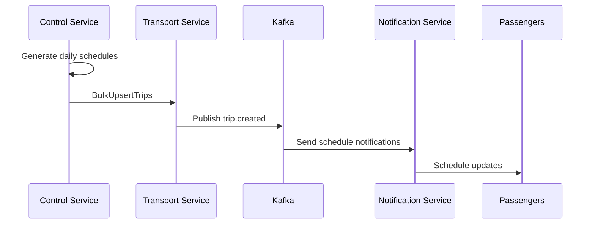

# Metro Backend - Microservices Platform

A comprehensive event-driven microservices backend platform for urban transit management, built with Node.js and Python, featuring advanced architecture patterns including API Gateway, gRPC communication, Kafka event streaming, and unified user management.

## 🏗️ System Architecture



## 🚀 Quick Start

### Prerequisites
- Docker & Docker Compose v2.0+
- Node.js 18+ (for local development)
- Python 3.8+ (for Python services)
- Git

### 1. Clone & Setup
```bash
git clone <repository-url> Metro-backend
cd Metro-backend

# Copy environment files
cp api-gateway/env.example api-gateway/.env
cp auth-service/env.example auth-service/.env
cp user-service/env.example user-service/.env
cp transport-service/env.example transport-service/.env
cp ticket-service/env.example ticket-service/.env
cp payment-service/env.example payment-service/.env
cp public-service/env.example public-service/.env
```

### 2. Launch Complete Stack
```bash
# Start all services
docker-compose up --build -d

# Check service status
docker-compose ps
```

### 3. Verify Installation
```bash
# Health check
curl http://localhost:8000/health

# API documentation
open http://localhost:8000/api-docs
```

## 📋 Service Overview

### Core Services

#### 🔐 **API Gateway** (`:8000`)
- **Central Entry Point**: Single entry point for all client requests
- **Authentication & Authorization**: JWT tokens + API keys for dual auth system
- **Dynamic Service Routing**: Express-http-proxy with path resolution
- **Load Balancing**: Redis-backed least connections algorithm
- **Circuit Breaker**: Opossum-based fault tolerance (50% error threshold, 30s timeout)
- **Rate Limiting**: Multi-tier rate limiting (auth: 5 req/min, API: 100 req/15min, sensitive: 3 req/min)
- **Security**: Helmet.js, CORS, input validation, SQL injection prevention
- **Service Discovery**: Dynamic service registration and health monitoring

#### 🔑 **Authentication Service** (`:8001`)
- **JWT Token Management**: Access (15m) and refresh (7d) token generation/validation
- **User Authentication**: Login, logout, session management with Redis
- **Role-Based Access Control**: Admin, passenger, staff roles with granular permissions
- **Password Security**: bcrypt hashing (10 rounds), secure token generation
- **Email Verification**: Account verification system with SMTP integration
- **Account Security**: Auto-locking (5 failed attempts = 2h lock), temporary blocks
- **API Key Management**: Service-to-service authentication keys

#### 👥 **User Service** (`:8002`)
- **Unified User Management**: Consolidated admin, passenger, and staff user management
- **Event-Driven Profile Creation**: Automatic profile creation from Kafka user events
- **Role-Based Processing**: Smart handling based on user roles (passenger/staff auto-created, admin manual)
- **Profile Management**: User profiles, preferences, account settings
- **gRPC Integration**: High-performance communication with Ticket and Transport services
- **Redis Caching**: Fast access to user data with 30-minute TTL

#### 🚇 **Transport Service** (`:8003`)
- **Route Management**: Metro line definitions with origin/destination stations
- **Station Network**: Complete station database with geographical coordinates
- **Train Fleet Management**: Train inventory with capacity and maintenance tracking
- **Trip Scheduling**: Real-time trip tracking with departure/arrival times
- **gRPC Server**: High-performance API for other services (port 50051)
- **Bulk Operations**: Efficient bulk upsert for trips and stops
- **Real-time Updates**: Kafka integration for infrastructure changes

#### 🎫 **Ticket Service** (`:8004`)
- **Ticket Management**: Complete lifecycle from creation to usage
- **Advanced Fare Calculation**: Station-based pricing with passenger type discounts
- **Promotion System**: Discount codes with validation and usage limits
- **Short-Term Tickets**: One-way and return tickets with QR code generation
- **Long-Term Passes**: Day, weekly, monthly, yearly passes with activation scheduling
- **Passenger Caching**: Redis-based performance optimization
- **gRPC Integration**: Efficient communication with Transport service (port 50052)
- **Payment Integration**: Seamless payment processing workflow

#### 🌐 **Public Service** (`:8005`)
- **Data Aggregation**: Fetches data from Transport and Ticket services via gRPC
- **Caching Layer**: Redis-based caching with 1-hour TTL for fast data retrieval
- **REST APIs**: Public access to transport and ticket information
- **Automated Sync**: Hourly data synchronization from backend services
- **Performance Optimized**: Sub-millisecond response times for cached data
- **QR Code Hosting**: Static file serving for ticket QR codes
#### 💳 **Payment Service** (`:8006`)
- **Multi-Gateway Support**: VNPay (VND) and PayPal (USD) integration
- **Webhook Handling**: Secure payment status verification with signature validation
- **Transaction Logging**: Comprehensive payment audit trail
- **Event-Driven**: Kafka-based payment event publishing
- **Multi-Currency**: VND and USD payment processing
- **Refund Processing**: Complete refund management system
- **Security**: HMAC signature verification for webhooks

### Supporting Services

#### 📈 **Report Service** (`:8007`)
- **Report Generation**: Daily, weekly, monthly, and custom reports with FastAPI
- **Real-time Analytics**: Kafka event processing for live metrics
- **Template System**: Reusable report templates with configurable parameters
- **Scheduled Reports**: Automated report generation with cron scheduling
- **Data Visualization**: Charts and analytics dashboards
- **File Storage**: HTML/PDF report generation and storage

#### 🤖 **Control Service** (`:8008`)
- **AI-Powered Scheduling**: Prophet ML forecasting for demand prediction
- **Smart Route Optimization**: Heuristic algorithms for efficient trip planning
- **Real-time Rescheduling**: Dynamic schedule adjustments based on demand
- **gRPC Server**: High-performance scheduling API (port 50053)
- **Model Persistence**: Joblib-based Prophet model storage and training
- **Bulk Trip Generation**: Efficient creation of daily schedules for all routes

#### 🔔 **Notification Service** (`:8009`)
- **Multi-Channel Notifications**: Email (Resend) and SMS (Vonage) delivery
- **Template Engine**: Handlebars-based email and SMS templates
- **Event-Driven**: Kafka consumer for ticket, auth, and system events
- **QR Code Generation**: Automatic QR code creation for ticket notifications
- **Delivery Tracking**: Comprehensive notification status and timeline tracking
- **Retry Mechanism**: Automatic retry for failed notifications

#### ⏰ **Scheduler Service** (`:8010`)
- **Cron Job Management**: Centralized scheduling for all periodic tasks
- **Ticket Activation**: Automated long-term ticket activation (every 5 minutes)
- **Expiration Notifications**: Automated expiring ticket notifications (daily at 8 AM)
- **Job Registry**: In-memory job registry with concurrency control
- **gRPC Integration**: Communication with Ticket service for operations
- **Health Monitoring**: Comprehensive scheduler status and job statistics

#### 🔗 **Webhook Service** (`:3003`)
- **Payment Webhook Processing**: PayPal and Sepay webhook handling
- **Idempotency**: Redis-based duplicate webhook prevention
- **Event Transformation**: Webhook payload to business event conversion
- **Audit Logging**: MongoDB-based webhook processing audit trail
- **Retry Mechanism**: Failed webhook retry with exponential backoff
- **Statistics**: Comprehensive webhook processing analytics

## 🛠️ Technology Stack

### Backend Technologies
- **Node.js 18+**: JavaScript runtime for most services
- **Python 3.11+**: Python services (Report, Control)
- **Express.js**: Web framework for Node.js services
- **FastAPI**: Modern Python web framework (Report Service)
- **Sequelize**: Node.js ORM for PostgreSQL operations
- **SQLAlchemy**: Python ORM for database operations
- **MongoDB**: Document database for webhook audit logs

### Database & Caching
- **PostgreSQL 15**: Primary database for most services
- **Redis 7**: Distributed caching, session storage, and idempotency
- **Connection Pooling**: Optimized database connections (max 20-1000 per service)
- **Database Indexing**: Optimized queries with proper indexing strategies

### Message Queue & Communication
- **Apache Kafka**: Event streaming and message queuing
- **gRPC**: High-performance inter-service communication (ports 50051-50060)
- **Protocol Buffers**: Efficient data serialization (.proto files)
- **Event-Driven Architecture**: Kafka-based event publishing and consumption

### Security & Authentication
- **JWT Tokens**: JSON Web Tokens for authentication (HS256, 5-15min expiry)
- **bcrypt**: Password hashing and security (10-12 rounds)
- **Helmet.js**: Security headers and protection
- **CORS**: Cross-origin resource sharing
- **Rate Limiting**: Multi-tier request limiting (express-rate-limit)
- **API Keys**: Service-to-service authentication
- **HMAC Signatures**: Webhook signature verification

### AI & Machine Learning
- **Prophet**: Facebook's time series forecasting library
- **Joblib**: Model persistence and serialization
- **Pandas & NumPy**: Data manipulation and analysis
- **Heuristic Algorithms**: Custom scheduling optimization

### Monitoring & Observability
- **Prometheus**: Metrics collection and monitoring
- **Grafana**: Data visualization and dashboards
- **Winston**: Structured logging with daily rotation
- **Health Checks**: Comprehensive health monitoring endpoints
- **Correlation IDs**: Request tracking across services
- **Structured Logging**: JSON format with service context

### External Integrations
- **VNPay**: Vietnamese payment gateway
- **PayPal**: International payment gateway
- **Resend**: Email delivery service
- **Vonage**: SMS delivery service
- **SMTP**: Email server integration

### Development Tools
- **Docker & Docker Compose**: Containerization and orchestration
- **ESLint & Prettier**: Code linting and formatting
- **Jest**: JavaScript testing framework
- **pytest**: Python testing framework
- **Swagger/OpenAPI**: API documentation
- **Handlebars**: Template engine for notifications

## 📚 API Documentation

### Authentication Endpoints
```bash
POST /v1/auth/register              # User registration
POST /v1/auth/login                 # User login
POST /v1/auth/refresh               # Token refresh
POST /v1/auth/logout                # User logout
POST /v1/auth/forgot-password       # Password reset request
POST /v1/auth/reset-password        # Password reset
POST /v1/auth/verify-email          # Email verification
GET  /v1/auth/key/:id               # Generate API key
GET  /v1/auth/keys/:userId          # List user API keys
DELETE /v1/auth/key/:id             # Delete API key
```

### User Management
```bash
# Admin Management
GET    /v1/user/admin/getAllAdmins     # List all admins
GET    /v1/user/admin/getAdminById/:id # Get admin by ID
PUT    /v1/user/admin/updateAdmin/:id  # Update admin
GET    /v1/user/admin/me               # Get current admin

# Passenger Management
GET    /v1/user/passenger/getallPassengers    # List all passengers
GET    /v1/user/passenger/getPassengerById/:id # Get passenger by ID
POST   /v1/user/passenger/createPassenger     # Create passenger
PUT    /v1/user/passenger/updatePassenger/:id # Update passenger
DELETE /v1/user/passenger/deletePassenger/:id # Delete passenger
GET    /v1/user/passenger/me                  # Get current passenger
PUT    /v1/user/passenger/me                  # Update current passenger

# Staff Management
GET    /v1/user/staff/getAllStaff        # List all staff
GET    /v1/user/staff/getStaffById/:id   # Get staff by ID
POST   /v1/user/staff/createStaff        # Create staff
PUT    /v1/user/staff/updateStaff/:id    # Update staff
DELETE /v1/user/staff/deleteStaff/:id    # Delete staff
PUT    /v1/user/staff/updateStaffStatus/:id # Update staff status
GET    /v1/user/staff/me                 # Get current staff
```

### Transport System
```bash
GET /v1/transport/route/                    # List all routes
GET /v1/transport/route/active              # List active routes
GET /v1/transport/route/search/between-stations # Search routes
GET /v1/transport/route/:id                 # Get route details
GET /v1/transport/route/:routeId/stations   # Get route stations
POST /v1/transport/route/                   # Create route (admin)
PUT /v1/transport/route/:id                 # Update route (admin)
DELETE /v1/transport/route/:id              # Delete route (admin)
GET /v1/transport/station/                  # List all stations
GET /v1/transport/station/:id               # Get station details
GET /v1/transport/train/                    # List all trains
GET /v1/transport/trip/                     # List all trips
```

### Ticketing System
```bash
POST /v1/ticket/tickets/calculate-price     # Calculate ticket price
POST /v1/ticket/tickets/create-short-term   # Create short-term ticket
POST /v1/ticket/tickets/create-long-term    # Create long-term pass
GET  /v1/ticket/tickets/me                  # Get my tickets
GET  /v1/ticket/tickets/:id/getTicket       # Get ticket with QR
POST /v1/ticket/tickets/:id/use             # Use ticket
POST /v1/ticket/tickets/qr/:qrCode/use      # Use ticket via QR
GET  /v1/ticket/tickets/:id/validate        # Validate ticket
POST /v1/ticket/tickets/:id/cancel          # Cancel ticket
GET  /v1/ticket/tickets/getAllTickets       # List all tickets (admin)
GET  /v1/ticket/tickets/getTicketStatistics # Ticket statistics
```

### Payment Processing
```bash
# VNPay
POST /v1/payment/vnpay              # Initiate VNPay payment
GET  /v1/payment/vnpay/return       # Handle VNPay return
POST /v1/payment/vnpay/ipn          # Handle VNPay IPN

# PayPal
POST /v1/payment/paypal/create-order # Create PayPal order
POST /v1/payment/paypal/capture/:id  # Capture PayPal payment
GET  /v1/payment/paypal/order/:id    # Get PayPal order
POST /v1/payment/paypal/webhook      # Handle PayPal webhook
```

### Public APIs
```bash
GET /transport/routes                # Public route information
GET /transport/routes/:id            # Public route details
GET /transport/routes/search         # Search routes
GET /transport/stations              # Public station data
GET /transport/stations/:id          # Public station details
GET /transport/routes/:routeId/stations # Route stations
GET /ticket/fares                    # Public fare information
GET /ticket/fares/route/:routeId     # Route-specific fares
GET /ticket/fares/search             # Search fares
GET /ticket/transit-passes           # Public pass information
GET /ticket/passenger-discounts      # Passenger discounts
GET /qr/:ticketId                    # Get QR code image
```

### Notification Management
```bash
GET /notification/emails/getAllEmails        # List emails (admin)
GET /notification/emails/getEmailStats       # Email statistics
GET /notification/emails/getEmailById/:id    # Email details
GET /notification/emails/getEmailTimeline/:id # Email timeline
POST /notification/emails/retryEmail/:id     # Retry failed email
GET /notification/sms/getAllSMS              # List SMS (admin)
GET /notification/sms/getSMSStats            # SMS statistics
GET /notification/sms/getSMSCosts            # SMS cost analysis
POST /notification/sms/retrySMS/:id          # Retry failed SMS
```

### Report & Analytics
```bash
POST /v1/reports/                    # Create report
GET  /v1/reports/                    # List reports
GET  /v1/reports/:id                 # Get report
DELETE /v1/reports/:id               # Delete report
POST /v1/reports/templates           # Create template
GET  /v1/reports/templates           # List templates
POST /v1/reports/schedules           # Create schedule
GET  /v1/reports/analytics/daily     # Daily analytics
GET  /v1/reports/analytics/weekly    # Weekly analytics
GET  /v1/reports/analytics/monthly   # Monthly analytics
```

### Webhook Processing
```bash
POST /webhook/paypal                 # PayPal webhook
POST /webhook/sepay                  # Sepay webhook
GET  /webhook/statistics             # Combined statistics
GET  /webhook/paypal/statistics      # PayPal statistics
GET  /webhook/sepay/statistics       # Sepay statistics
POST /webhook/paypal/retry           # Retry failed PayPal webhooks
POST /webhook/sepay/retry            # Retry failed Sepay webhooks
```

## 🔄 Event System

### Kafka Topics

#### User & Authentication Events
- `user.created`: User registration events
- `user.login`: User login events
- `user.deleted`: User deletion events
- `auth.welcome.email`: Welcome email notifications
- `auth.verification.email`: Email verification notifications
- `auth.password.reset.email`: Password reset notifications

#### Ticket Events
- `ticket.created`: Ticket creation events
- `ticket.activated`: Long-term ticket activation events
- `ticket.cancelled`: Ticket cancellation events
- `ticket.used`: Ticket usage events
- `ticket.expired`: Ticket expiration events
- `ticket.expiring_soon`: Expiring ticket notifications
- `ticket.payment_ready`: Payment URL generation events
- `ticket.payment_completed`: Payment completion events
- `ticket.payment_failed`: Payment failure events

#### Transport Events
- `route.created`: Route creation events
- `route.updated`: Route update events
- `station.created`: Station creation events
- `trip.created`: Trip creation events
- `transport.search`: Route search events

#### Payment Events
- `payment.initiated`: Payment initiation events
- `payment.completed`: Payment completion events
- `payment.failed`: Payment failure events
- `paypal.webhook.event`: PayPal webhook events
- `sepay.webhook.event`: Sepay webhook events

#### Notification Events
- `notification.events`: Generic notification events
- `qr.storage`: QR code image storage events
- `passenger-sync-request`: Passenger cache sync requests
- `passenger-cache-sync`: Passenger cache synchronization

#### System Events
- `passenger.created`: Passenger profile creation
- `passenger.updated`: Passenger profile updates
- `passenger.deleted`: Passenger profile deletion
- `staff.created`: Staff profile creation
- `staff.updated`: Staff profile updates
- `staff.deleted`: Staff profile deletion
- `staff.status.changed`: Staff status changes

### Event Flow Examples

#### Ticket Purchase Flow


#### User Registration Flow


#### AI Scheduling Flow


## 🚀 Deployment

### Development Environment
```bash
# Start all services
docker-compose up --build -d

# View logs
docker-compose logs -f

# Stop services
docker-compose down
```

### Production Deployment
```bash
# Production compose file
docker-compose -f docker-compose.prod.yml up -d

# Environment-specific configs
# Development: .env.development
# Staging: .env.staging
# Production: .env.production
```

### Service Health Monitoring
```bash
# Gateway health
curl http://localhost:8000/health

# Core Services Health Checks
curl http://localhost:8001/health  # Auth service
curl http://localhost:8002/health  # User service
curl http://localhost:8003/health  # Transport service
curl http://localhost:8004/health  # Ticket service
curl http://localhost:8005/health  # Public service
curl http://localhost:8006/health  # Payment service

# Supporting Services Health Checks
curl http://localhost:8007/health  # Report service
curl http://localhost:8008/health  # Control service
curl http://localhost:8009/health  # Notification service
curl http://localhost:8010/health  # Scheduler service
curl http://localhost:3003/health  # Webhook service

# Detailed Health Checks
curl http://localhost:8005/health/detailed  # Public service detailed
curl http://localhost:8009/notification/health  # Notification service detailed
curl http://localhost:3003/webhook/health  # Webhook service detailed
```

## 📊 Monitoring & Management

### Management Tools
- **API Documentation**: http://localhost:8000/api-docs
- **Redis Commander**: http://localhost:8081
- **pgAdmin**: http://localhost:5050
- **Kafka UI**: http://localhost:8080
- **Grafana**: http://localhost:3000
- **Prometheus**: http://localhost:9090

### Performance Metrics
- **Request/Response Logging**: Winston with correlation IDs
- **Rate Limiting Metrics**: Redis-based tracking
- **Circuit Breaker Stats**: Opossum metrics
- **Database Performance**: Connection pool monitoring
- **Cache Performance**: Redis hit rates and memory usage

## 🔒 Security Features

### Authentication & Authorization
- **Dual Authentication**: JWT tokens for service management + API keys for routing
- **Role-Based Access Control**: Admin, passenger, staff roles
- **Session Management**: Secure session handling
- **Token Refresh**: Automatic token renewal

### Data Protection
- **Password Hashing**: bcrypt with salt rounds
- **Input Validation**: Joi schema validation
- **SQL Injection Prevention**: Parameterized queries
- **XSS Protection**: Input sanitization
- **CORS Configuration**: Cross-origin request handling

### Rate Limiting Tiers
- **General**: 100 requests/15 minutes per IP
- **Authentication**: 10 requests/15 minutes per IP
- **Sensitive Operations**: 5 requests/hour per IP
- **API Endpoints**: 1000 requests/hour per API key
- **Per-User**: 60 requests/minute per authenticated user

## 🧪 Testing

### Test Coverage
- **Unit Tests**: Jest (JavaScript) and pytest (Python)
- **Integration Tests**: Service-to-service communication
- **API Tests**: Endpoint testing with Supertest
- **Performance Tests**: Load testing and benchmarking

### Test Commands
```bash
# Run all tests
npm test

# Run specific service tests
cd api-gateway && npm test
cd user-service && npm test
cd transport-service && npm test

# Run Python service tests
cd report-service && pytest
cd management-service && pytest
```

## 🤝 Contributing

We welcome contributions! Please see our [Contributing Guide](CONTRIBUTING.md) for details on:

- Development setup and environment
- Code standards and guidelines
- Testing requirements
- Pull request process
- Issue reporting

### Quick Contribution Setup
```bash
# Fork and clone
git clone https://github.com/your-username/Metro-backend.git
cd Metro-backend

# Install dependencies
npm install

# Run tests
npm test

# Start development environment
docker-compose up -d
```

## 📄 Documentation

- **[API Documentation](http://localhost:8000/api-docs)**: Interactive API explorer
- **[Contributing Guide](CONTRIBUTING.md)**: Development guidelines
- **[Changelog](CHANGELOG.md)**: Version history and updates
- **[Service READMEs](./api-gateway/README.md)**: Individual service documentation

## 📝 License

This project is licensed under the MIT License - see the [LICENSE](LICENSE) file for details.

## 🆘 Support

- **Documentation**: Check service-specific READMEs
- **Issues**: [GitHub Issues](https://github.com/your-repo/issues)
- **Discussions**: [GitHub Discussions](https://github.com/your-repo/discussions)
- **Email**: support@metro-backend.com

---

**Made with ❤️ for Metro Backend Architecture** 🚇

*Built with modern microservices architecture, event-driven design, and comprehensive monitoring for scalable urban transit management.*