# Metro Backend - Microservices Platform

A comprehensive event-driven microservices backend platform built with Node.js, featuring unified user management, dynamic routing, and real-time communication capabilities.

## 🏢 Service Domain Architecture

The Metro Backend is organized into logical service domains, each handling specific business capabilities:

| Domain | Services | Sub-Modules | Status |
|--------|----------|-------------|--------|
| 🧑‍✈️ **User Management** | `user-service` | admin, passenger, staff | ✅ Active |
| 🚆 **Transport Operations** | `transport-service` | station, schedule, route | 🏗️ In Development |
| 🎫 **Ticket & Pricing** | `ticket-service` | ticket, fare, promotion | 📋 Planned |
| 📞 **Customer Support** | `customer-support-service` | supportReq, guide, chat, call | 📋 Planned |
| 💳 **Payment Processing** | `payment-service` | Single unified payment service | 📋 Planned |
| 📊 **Analytics & Reporting** | `report-service` | Single reporting service | 📋 Planned |
| 🔐 **API Management** | `api-gateway` | Central gateway with routing | ✅ Active |

### Service Architecture Benefits:
- ✅ **Domain-Driven Design**: Services grouped by business capability
- ✅ **Independent Deployment**: Each service can be deployed separately
- ✅ **Scalability**: Scale services based on domain-specific load
- ✅ **Team Ownership**: Clear service boundaries for development teams
- ✅ **Technology Flexibility**: Each domain can use optimal tech stack

### Current Implementation:
- **🔐 API Gateway**: Central authentication, routing, and load balancing
- **🧑‍✈️ User Service**: Unified user management (previously 3 separate services)

### 🏗️ Service Architecture Overview

```mermaid
graph TB
    subgraph "🔐 API Management Layer"
        API[API Gateway :3000]
    end

    subgraph "🧑‍✈️ User Management Domain"
        USER[user-service :3001]
        subgraph "User Modules"
            ADMIN[Admin Management]
            PASSENGER[Passenger Management] 
            STAFF[Staff Management]
        end
    end

    subgraph "🚆 Transport Operations Domain"
        TRANSPORT[transport-service :3002]
        subgraph "Transport Modules"
            STATION[Station Management]
            SCHEDULE[Schedule Management]
            ROUTE[Route Management]
        end
    end

    subgraph "🎫 Ticket & Pricing Domain"
        TICKET_SVC[ticket-service :3003]
        subgraph "Ticket Modules"
            TICKET[Ticket Management]
            FARE[Fare Management]
            PROMOTION[Promotion Management]
        end
    end

    subgraph "📞 Customer Support Domain"
        SUPPORT[customer-support-service :3004]
        subgraph "Support Modules"
            SUPPORT_REQ[Support Requests]
            GUIDE[Guide System]
            CHAT[Chat Support]
            CALL[Call Center]
        end
    end

    subgraph "💳 Payment Domain"
        PAYMENT[payment-service :3005]
    end

    subgraph "📊 Analytics Domain"
        REPORT[report-service :3006]
    end

    subgraph "💾 Data & Infrastructure"
        POSTGRES[(PostgreSQL)]
        REDIS[(Redis Cache)]
        KAFKA[Kafka Events]
    end

    API --> USER
    API --> TRANSPORT
    API --> TICKET_SVC
    API --> SUPPORT
    API --> PAYMENT
    API --> REPORT

    USER --> ADMIN
    USER --> PASSENGER
    USER --> STAFF

    TRANSPORT --> STATION
    TRANSPORT --> SCHEDULE
    TRANSPORT --> ROUTE

    TICKET_SVC --> TICKET
    TICKET_SVC --> FARE
    TICKET_SVC --> PROMOTION

    SUPPORT --> SUPPORT_REQ
    SUPPORT --> GUIDE
    SUPPORT --> CHAT
    SUPPORT --> CALL

    USER --> POSTGRES
    TRANSPORT --> POSTGRES
    TICKET_SVC --> POSTGRES
    SUPPORT --> POSTGRES
    PAYMENT --> POSTGRES
    REPORT --> POSTGRES

    API --> REDIS
    USER --> KAFKA
    TRANSPORT --> KAFKA
    TICKET_SVC --> KAFKA
    SUPPORT --> KAFKA
    PAYMENT --> KAFKA

    style API fill:#e1f5fe
    style USER fill:#f3e5f5
    style TRANSPORT fill:#e8f5e8
    style TICKET_SVC fill:#fff3e0
    style SUPPORT fill:#fce4ec
    style PAYMENT fill:#f1f8e9
    style REPORT fill:#fff8e1
```



---

## 🎯 Platform Overview

The Metro Backend consolidates user management (admin, passenger, staff) into a unified architecture with sophisticated API Gateway capabilities including authentication, dynamic routing, load balancing, and event-driven communication.

### Key Achievements:
- ✅ **Unified User Service**: Merged 3 separate services into 1 (admin-service, passenger-service, staff-service → user-service)
- ✅ **Dynamic Routing**: API Gateway with load balancing and circuit breaker patterns
- ✅ **Event-Driven Architecture**: Kafka-based microservice communication
- ✅ **High-Performance Caching**: Redis-based API key validation (10-50x faster)
- ✅ **Comprehensive Security**: JWT + API Key authentication, rate limiting, account protection
- ✅ **Complete Documentation**: Swagger UI with detailed API specifications

---

## 📂 Repository Structure

```
Metro-backend/
├── api-gateway/              # Central API Gateway (Port 3000)
│   ├── src/
│   │   ├── controllers/      # Authentication, routing, service management
│   │   ├── services/         # Business logic, load balancing, email
│   │   ├── middlewares/      # Auth, rate limiting, validation
│   │   ├── events/           # Kafka producer for user events
│   │   ├── config/           # Database, Redis, Swagger setup
│   │   └── swagger/          # Comprehensive API documentation
│   └── tests/                # Unit and integration tests
├── user-service/             # Unified User Management (Port 3001)
│   ├── src/
│   │   ├── controllers/      # Admin, passenger, staff controllers
│   │   ├── services/         # User management business logic
│   │   ├── models/           # Admin, Passenger, Staff models
│   │   ├── events/           # Kafka consumer for user events
│   │   └── routes/           # Modular routing system
│   └── package.json
├── transport-service/        # Transport Operations (Port 3002)
│   └── src/
│       ├── station/          # Station management module
│       ├── schedule/         # Schedule management module
│       └── route/            # Route management module
├── ticket-service/           # Ticket & Pricing (Port 3003)
│   └── src/
│       ├── ticket/           # Ticket management module
│       ├── fare/             # Fare management module
│       └── promotion/        # Promotion management module
├── customer-support-service/ # Customer Support (Port 3004)
│   └── src/
│       ├── supportReq/       # Support request module
│       ├── guide/            # Guide system module
│       ├── chat/             # Chat support module
│       └── call/             # Call center module
├── payment-service/          # Payment Processing (Port 3005)
├── report-service/           # Analytics & Reporting (Port 3006)
├── docker-compose.yml        # Complete development infrastructure
├── init_db.sql              # Database initialization
└── README.md
```

---

## 🚀 Quick Start

### Prerequisites
- Docker + Docker Compose v2.0+
- Node.js 18+ (for local development)
- Git

### 1. Environment Setup

Create environment files for each service:

#### API Gateway (`.env` in `api-gateway/`)
```env
# Application Configuration
NODE_ENV=development
PORT=3000
SERVICE_NAME=api-gateway

# Database Configuration
DB_HOST=postgres
DB_PORT=5432
DB_NAME=postgres
DB_USER=postgres
DB_PASSWORD=postgres

# Redis Configuration  
REDIS_HOST=redis
REDIS_PORT=6379
REDIS_PASSWORD=
REDIS_USER=

# JWT Security
JWT_ACCESS_SECRET=your_super_secret_access_key_change_in_production
JWT_REFRESH_SECRET=your_super_secret_refresh_key_change_in_production
JWT_ACCESS_EXPIRY=1h
JWT_REFRESH_EXPIRY=7d

# API Key Security
HASH_SECRET=your_api_key_hash_secret_change_in_production
API_KEY_EXPIRY=86400

# Kafka Configuration
KAFKA_BROKERS=kafka-1:19092
KAFKA_CLIENT_ID=api-gateway
KAFKA_GROUP_ID=api-gateway-group

# Kafka Topics
USER_CREATED_TOPIC=user.created
USER_UPDATED_TOPIC=user.updated
USER_DELETED_TOPIC=user.deleted

# Email Service (Optional)
EMAIL_HOST=smtp.gmail.com
EMAIL_PORT=587
EMAIL_USER=your-email@gmail.com
EMAIL_PASS=your-app-password

# Rate Limiting
RATE_LIMIT_WINDOW_MS=900000
RATE_LIMIT_MAX_REQUESTS=100
AUTH_RATE_LIMIT_MAX=10
SENSITIVE_RATE_LIMIT_MAX=5
API_RATE_LIMIT_MAX=1000
USER_RATE_LIMIT_MAX=60

# Circuit Breaker
CIRCUIT_BREAKER_TIMEOUT=30000
CIRCUIT_BREAKER_ERROR_THRESHOLD=50
CIRCUIT_BREAKER_RESET_TIMEOUT=30000

# Logging
LOG_LEVEL=info
LOG_MAX_SIZE=20m
LOG_MAX_FILES=14d
```

#### User Service (`.env` in `user-service/`)
```env
# Application Configuration
NODE_ENV=development
PORT=3001
SERVICE_NAME=user-service

# Database Configuration
DB_HOST=postgres
DB_PORT=5432
DB_NAME=postgres
DB_USER=postgres
DB_PASSWORD=postgres

# Kafka Configuration
KAFKA_BROKERS=kafka-1:19092
KAFKA_CLIENT_ID=user-service
KAFKA_GROUP_ID=user-service-group

# Kafka Topics - Consumer
USER_CREATED_TOPIC=user.created
USER_UPDATED_TOPIC=user.updated
USER_DELETED_TOPIC=user.deleted

# Kafka Topics - Producer
ADMIN_CREATED_TOPIC=admin.created
ADMIN_UPDATED_TOPIC=admin.updated
ADMIN_DELETED_TOPIC=admin.deleted
PASSENGER_CREATED_TOPIC=passenger.created
PASSENGER_UPDATED_TOPIC=passenger.updated
PASSENGER_DELETED_TOPIC=passenger.deleted
STAFF_CREATED_TOPIC=staff.created
STAFF_UPDATED_TOPIC=staff.updated
STAFF_DELETED_TOPIC=staff.deleted
STAFF_STATUS_CHANGED_TOPIC=staff.status.changed

# Database Sync
DB_FORCE_SYNC=true
DB_ALTER_SYNC=false

# Logging
LOG_LEVEL=info
LOG_MAX_SIZE=20m
LOG_MAX_FILES=14d

# Security
BCRYPT_ROUNDS=12
```

### 2. Launch Development Stack

```bash
# Clone repository
git clone <repository-url> Metro-backend
cd Metro-backend

# Start complete infrastructure
docker-compose up --build -d

# View service logs
docker-compose logs -f api-gateway
docker-compose logs -f user-service
```

### 3. Service Verification

```bash
# Health Checks
curl http://localhost:3000/health          # API Gateway
curl http://localhost:3001/metrics         # User Service

# API Documentation
open http://localhost:3000/api-docs        # Swagger UI

# Management Interfaces
open http://localhost:5050                 # pgAdmin (postgres/postgres)
open http://localhost:8081                 # Redis Commander
open http://localhost:8080                 # Kafka UI
```

---

## 🏗️ System Architecture


### Architecture Highlights:

#### 🔐 **API Gateway (Port 3000)**
- **Dual Authentication**: JWT (service management) + API Key (routing)
- **Dynamic Routing**: Auto-discovery and load balancing to microservices
- **Performance**: Redis caching for ultra-fast API key validation (< 1ms)
- **Reliability**: Circuit breaker pattern with automatic fallback
- **Security**: Multi-tier rate limiting, account protection, input validation

#### 👥 **User Service (Port 3001)** 
- **Unified Management**: Admin + Passenger + Staff in single service
- **Event-Driven**: Automatic profile creation from Kafka user events
- **Role-Based**: Smart processing based on user roles
- **Backward Compatible**: Maintains all previous API endpoints


---

## 🔄 Event-Driven Data Flow


---

## 📊 Database Schema

### Core Tables:

#### **API Gateway Database**
```sql
-- Users table (authentication)
users (id, email, username, password_hash, first_name, last_name, phone_number, roles, is_active, created_at, updated_at)

-- Services registry
services (id, name, end_point, description, version, timeout, retries, created_at, updated_at)

-- Service instances for load balancing
service_instances (id, service_id, host, port, status, is_healthy, weight, region, metadata, created_at, updated_at)

-- API keys for routing
keys (id, user_id, key_hash, created_at, updated_at)
```

#### **User Service Database**
```sql
-- Admin profiles
admins (id, user_id, permissions, department, hire_date, created_at, updated_at)

-- Passenger profiles  
passengers (id, user_id, membership_type, total_trips, last_trip_date, created_at, updated_at)

-- Staff profiles
staff (id, user_id, position, department, hire_date, status, supervisor_id, created_at, updated_at)
```

---

## 🛡️ Security Features

### Authentication & Authorization
- **JWT Authentication**: HTTP-only cookies with access/refresh tokens
- **API Key Management**: Automatic generation, caching, and rotation
- **Role-Based Access**: Admin, Staff, Passenger with granular permissions
- **Account Protection**: Auto-locking, progressive delays, admin controls

### Rate Limiting & Performance
- **Multi-Tier Limits**: Different rates for auth, API, sensitive operations
- **Redis-Backed**: Distributed rate limiting across instances
- **Circuit Breaker**: Automatic failover and recovery
- **Ultra-Fast Validation**: Redis caching for 10-50x performance improvement

### Data Protection
- **Input Validation**: Joi schemas, SQL injection prevention
- **XSS Protection**: Helmet.js security headers
- **CORS Configuration**: Controlled cross-origin access
- **Secure Logging**: Correlation IDs, no sensitive data exposure

---

## 🧪 Testing & Development

### Running Tests
```bash
# API Gateway tests
docker-compose exec api-gateway npm test
docker-compose exec api-gateway npm run test:unit
docker-compose exec api-gateway npm run test:integration

# User Service tests
docker-compose exec user-service npm test

# All services
docker-compose exec api-gateway npm test && docker-compose exec user-service npm test
```

### Development Commands
```bash
# Watch logs
docker-compose logs -f api-gateway user-service

# Restart specific service
docker-compose restart user-service

# Access service shell
docker-compose exec user-service bash

# Database access
docker-compose exec postgres psql -U postgres

# Redis CLI
docker-compose exec redis redis-cli
```

### Code Quality
```bash
# Linting
npm run lint
npm run lint:fix

# Code formatting
npm run format

# Type checking
npm run type-check
```

---

## 📈 Monitoring & Operations

### Health Endpoints
- **API Gateway**: `GET /health`, `GET /health/db`, `GET /health/redis`
- **User Service**: `GET /metrics`, `GET /health`
- **Database**: `GET /health/db` (via API Gateway)

### Performance Metrics
- Request/response times with correlation IDs
- API key validation performance
- Circuit breaker statistics
- Rate limiting metrics
- Database connection pool monitoring

### Management Interfaces
- **Swagger UI**: http://localhost:3000/api-docs (Complete API documentation)
- **pgAdmin**: http://localhost:5050 (Database management)
- **Redis Commander**: http://localhost:8081 (Cache monitoring)
- **Kafka UI**: http://localhost:8080 (Event streaming monitoring)

---

## 📖 API Usage Examples

### Complete User Journey

```bash
# 1. Register new user
curl -X POST http://localhost:3000/v1/auth/register \
  -H "Content-Type: application/json" \
  -d '{
    "firstName": "John",
    "lastName": "Doe",
    "email": "john@example.com",
    "password": "SecurePass123!",
    "phoneNumber": "1234567890",
    "roles": ["passenger"]
  }'

# 2. Login (JWT in HTTP-only cookie)
curl -X POST http://localhost:3000/v1/auth/login \
  -H "Content-Type: application/json" \
  -c cookies.txt \
  -d '{
    "email": "john@example.com",
    "password": "SecurePass123!"
  }'

# 3. Access passenger data (automatic API key injection)
curl -X GET http://localhost:3000/v1/route/passengers \
  -b cookies.txt

# 4. Update passenger profile
curl -X PUT http://localhost:3000/v1/route/passengers/me \
  -b cookies.txt \
  -H "Content-Type: application/json" \
  -d '{
    "membershipType": "premium"
  }'
```

### Service Management (Admin)

```bash
# Register new microservice
curl -X POST http://localhost:3000/v1/services \
  -b cookies.txt \
  -H "Content-Type: application/json" \
  -d '{
    "name": "ticket-service",
    "endPoint": "tickets",
    "description": "Ticket management service",
    "version": "1.0.0"
  }'

# Register service instance
curl -X POST http://localhost:3000/v1/services/1/instances \
  -b cookies.txt \
  -H "Content-Type: application/json" \
  -d '{
    "host": "ticket-service",
    "port": 3003,
    "weight": 1
  }'
```

---

## 🚀 Deployment

### Production Configuration
- Update all `.env` files with production values
- Use strong secrets for JWT and API key hashing
- Configure proper database credentials
- Set up SSL/TLS certificates
- Configure production logging levels

### Docker Production
```bash
# Build production images
docker-compose -f docker-compose.prod.yml build

# Deploy to production
docker-compose -f docker-compose.prod.yml up -d

# Monitor production logs
docker-compose -f docker-compose.prod.yml logs -f
```

### Scaling Considerations
- Multiple API Gateway instances behind load balancer
- User Service horizontal scaling with Kafka consumer groups
- Redis clustering for high availability
- PostgreSQL read replicas for performance

---

## 🤝 Contributing

1. Fork the repository
2. Create feature branch: `git checkout -b feature/amazing-feature`
3. Follow the established code standards and patterns
4. Write comprehensive tests
5. Update documentation as needed
6. Commit changes: `git commit -m 'Add amazing feature'`
7. Push to branch: `git push origin feature/amazing-feature`
8. Open a Pull Request

### Development Standards
- **ESLint + Prettier**: Code formatting and linting
- **Jest**: Testing framework with high coverage requirements
- **Conventional Commits**: Standardized commit messages
- **API Documentation**: Update Swagger specs for all changes

---

## 📄 License

This project is licensed under the MIT License - see the [LICENSE](LICENSE) file for details.

---

**Metro Backend - Building the Future of Urban Transit Management** 🚇✨