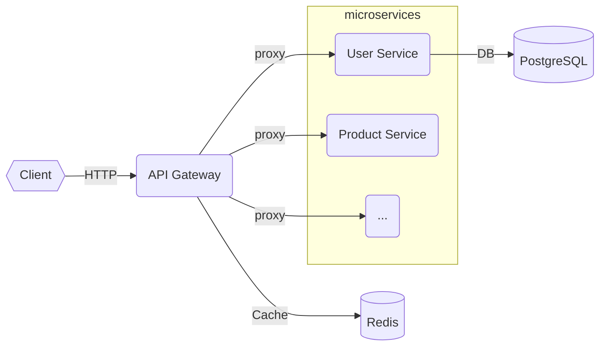
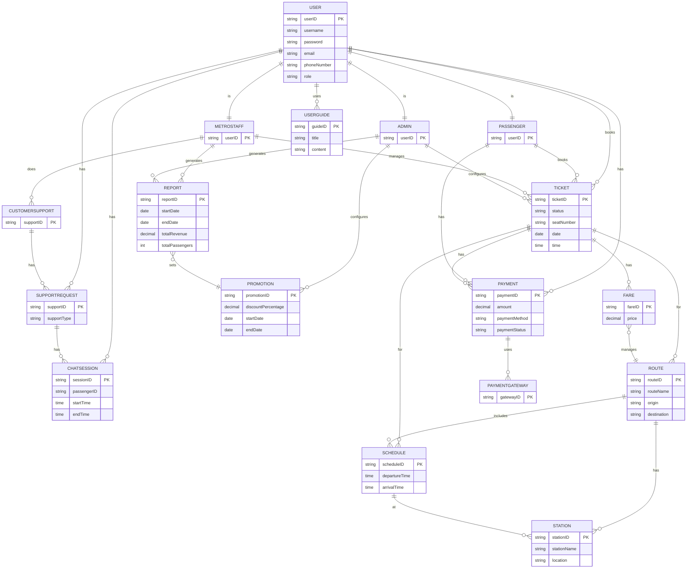

# Metro ‑ Microservices Platform

An opinionated microservices backend built with Node.js, PostgreSQL and Redis.  
The repository currently contains the **API Gateway** service (entry-point for all client traffic) and is designed to host many more services as the platform grows.

---

## 📂 Repository layout

```
Metro/
├── api-gateway/        # Gateway service (authentication, routing, metrics, …)
├── <future-service>/   # Placeholders for upcoming microservices
├── docker-compose.yml  # Local development stack
└── README.md
```

> Each service owns its own `Dockerfile`, `package.json`, tests and CI pipeline.

---

## 🚀 Quick start (development)

### Prerequisites

* Docker + Docker Compose v2
* Node.js 18 (LTS) – only required if you want to run a service **outside** Docker
* Git

### 1. Clone & bootstrap

```bash
# clone
$ git clone <repo-url> Metro && cd Metro

# spin everything up (gateway + Postgres + Redis)
$ docker compose up --build
```

Docker Compose will:
1. Build each service image (only `api-gateway` for now).
2. Provision Postgres & Redis containers.
3. Mount your source code so that code changes hot-reload via Nodemon.

### 2. Useful commands

```bash
# show live logs of the gateway
$ docker compose logs -f api-gateway

# run unit tests of a single service
$ docker compose exec api-gateway npm test

# shut everything down
$ docker compose down -v   # removes volumes (DB data) too
```

---

## 🏗️ Architecture



* **API Gateway** – terminates TLS, authenticates requests, enforces rate-limits, proxies to downstream services, publishes metrics.
* **Microservices** – isolated domains (Auth, User, Product, …).  Each exposes a REST API and registers itself with the gateway (or is declared in config).
* **PostgreSQL** – shared relational database (for demo; in production every service should own its own schema or database).
* **Redis** – caching, session store, distributed locks.

---

## 🗄️ Database Design

The following ERD shows the core entities and their relationships across the Metro platform:



This design supports:
- **User Management** – Multi-role system (Passenger, Staff, Admin)
- **Ticketing** – Ticket booking with fares, routes, and schedules
- **Payment Processing** – Integration with payment gateways
- **Support System** – Customer support with chat sessions
- **Operations** – Staff reporting and admin promotion management
- **Infrastructure** – Station and route management

---

## 🔧 Configuration

Each service reads environment variables at runtime.  For local development they are supplied in `docker-compose.yml`.  For production use real secrets (Docker Secrets, Vault, …).

Example (gateway):

```env
NODE_ENV=production
PORT=3000
DB_HOST=postgres
DB_PORT=5432
DB_NAME=auth_db
DB_USER=postgres
DB_PASSWORD=postgres
REDIS_HOST=redis
REDIS_PORT=6379
REDIS_PASSWORD=redispass123
JWT_ACCESS_SECRET=***
JWT_REFRESH_SECRET=***
```

---

## ➕ Adding a new microservice

1. Scaffold a folder at repo root:
   ```bash
   mkdir order-service && cd order-service
   npm init -y
   npm i express dotenv # etc.
   ```
2. Add a `Dockerfile` with `RUN npm install` and expose a port (e.g. `3004`).
3. Wire the service into *docker-compose*:
   ```yaml
   order-service:
     build: ./order-service
     ports: ["3004:3004"]
     environment:
       - NODE_ENV=development
       - PORT=3004
     depends_on:
       - postgres
       - redis
     networks:
       - backend-network
   ```
4. Update the gateway's config (JSON or DB) so requests to `/v1/orders` are proxied to `order-service`.
5. Push a PR – CI will lint & test every service in isolation.

---

## 🧪 Testing

Each service contains its own Jest test-suite.  To run **all** tests:

```bash
# host machine
npm run test:all   # script aggregates `docker compose exec <svc> npm test`
```

Integration tests live under `tests/integration` and can be executed against the running Compose stack.

---

## 🏭 Production deployment

1. Build versioned images (CI):
   ```bash
   docker build -t ghcr.io/my-org/api-gateway:1.0.0 ./api-gateway
   docker push ghcr.io/my-org/api-gateway:1.0.0
   # repeat for every service
   ```
2. Run with a production compose file **without** bind-mounts:
   ```bash
   docker compose -f docker-compose.prod.yml up -d
   ```
3. Or deploy on Kubernetes / ECS – manifests live under `k8s/`.

---

## 🤝 Contributing

Feel free to open issues or pull requests.  Please follow the conventional-commits spec and run `npm run lint && npm test` before pushing.

---

## 📄 License

MIT © 2025 Metro contributors 