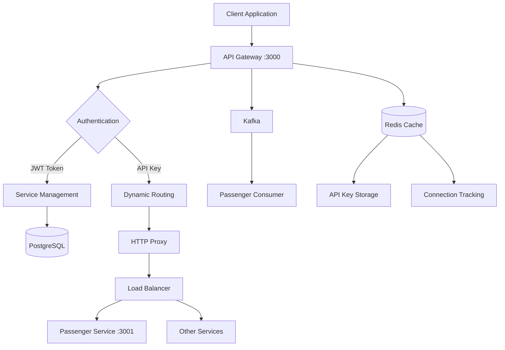
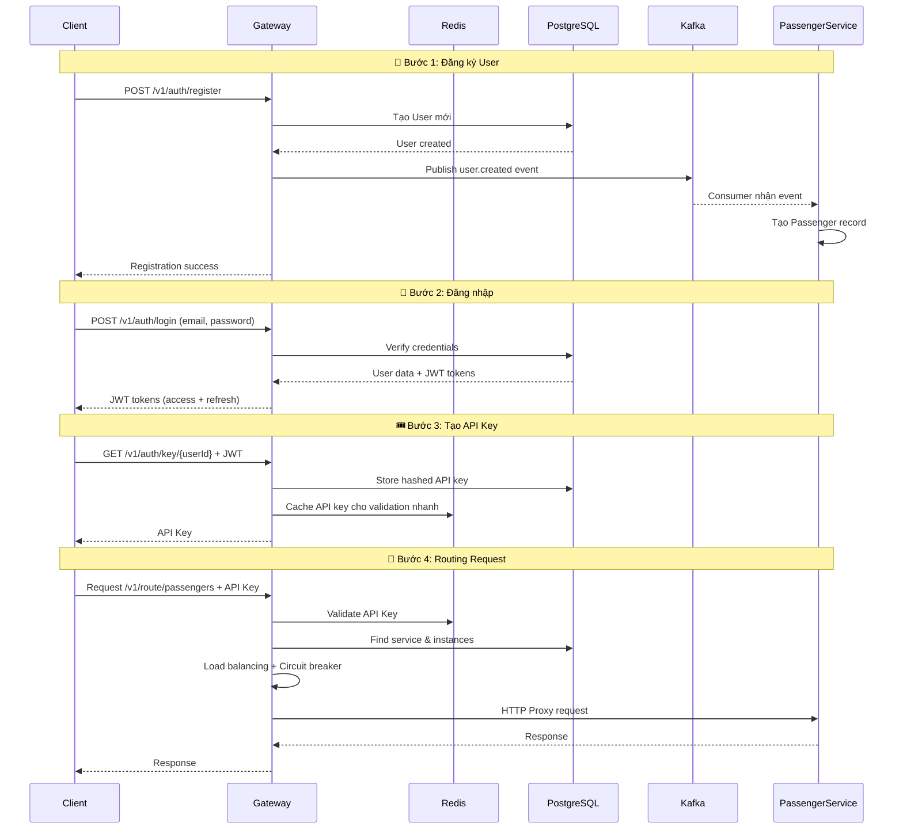
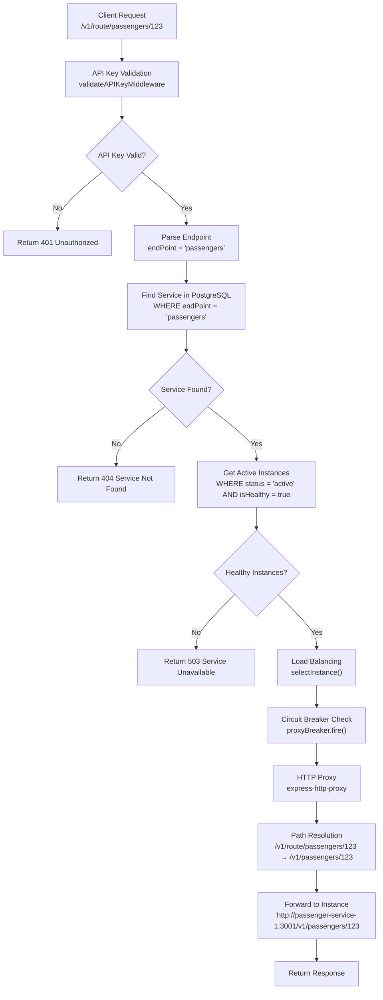
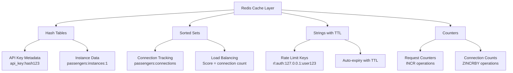
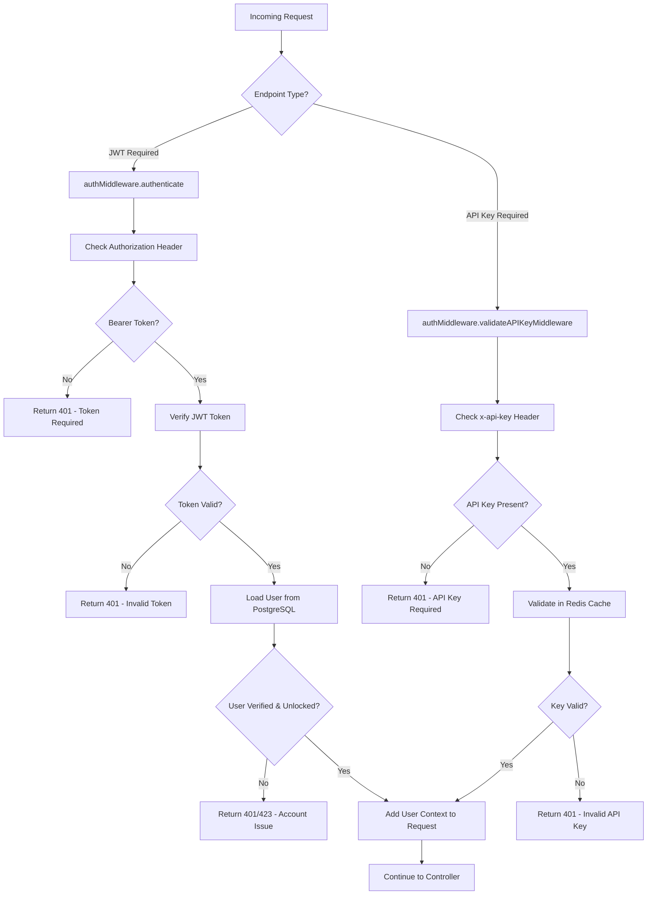
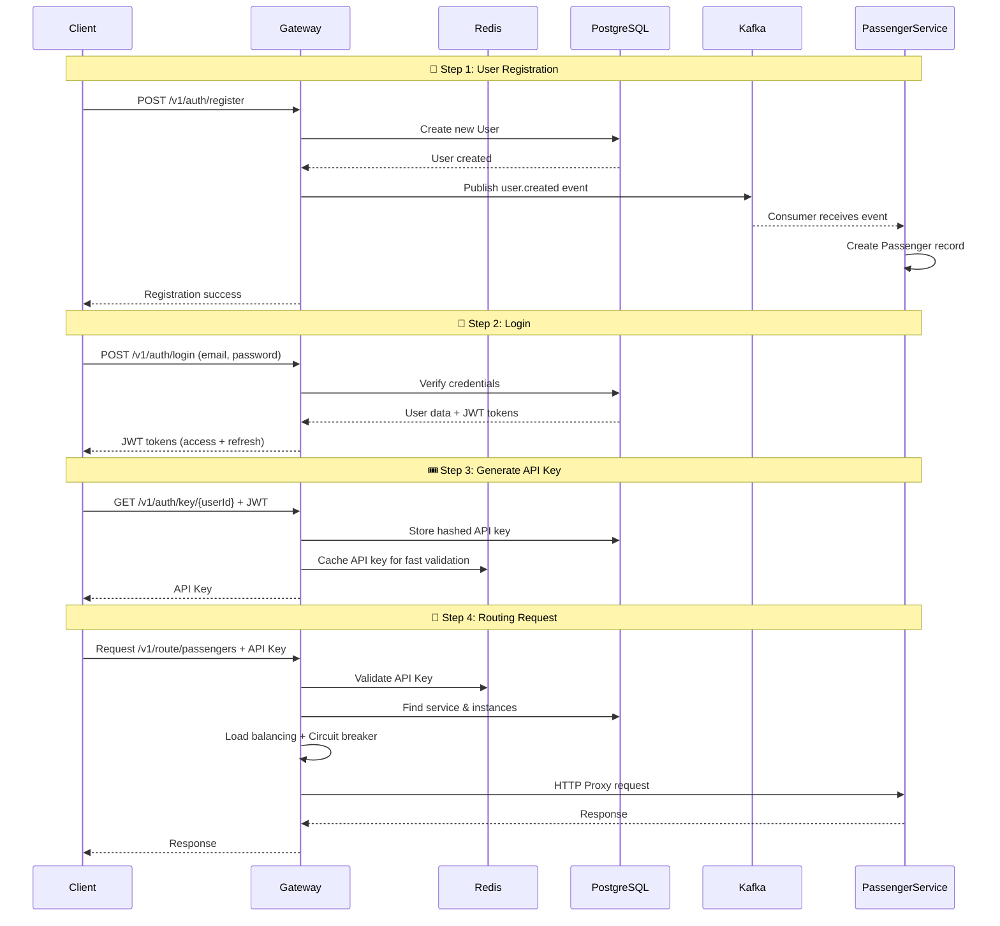

#### English version below
# 🔐 Tài liệu Hệ thống Routes và Authentication của API Gateway

## 📋 Tổng quan

API Gateway của Metro Backend là một hệ thống microservices phức tạp với các tính năng:

### 🎯 Chức năng chính:
1. **Authentication hai cấp**: JWT Token + API Key
2. **Dynamic Routing**: Định tuyến động đến các microservices  
3. **Load Balancing**: Cân bằng tải với circuit breaker
4. **Event-Driven Architecture**: Kafka producer/consumer
5. **HTTP Proxy**: Chuyển tiếp request với middleware
6. **Service Discovery**: Tự động phát hiện và đăng ký services
7. **Health Monitoring**: Kiểm tra sức khỏe services

### 🏗️ Kiến trúc tổng thể:



## 📁 Cấu trúc Routes

```
src/routes/
├── index.js           # Main router - mount tất cả routes
├── auth.route.js      # Authentication routes (/v1/auth/*)
├── service.routes.js  # Service management routes (/v1/service/*)  
└── routing.route.js   # Dynamic routing routes (/v1/route/*)
```

## 🔑 Hệ thống Authentication

### 1. Luồng Authentication hoàn chỉnh



### 2. Chi tiết Authentication Types

#### A. JWT Bearer Token
- **Mục đích**: Quản lý services, tạo API key, admin operations
- **Header**: `Authorization: Bearer <jwt_token>`
- **Endpoints**: `/v1/auth/*`, `/v1/service/*`
- **Thời gian sống**: 1 giờ (access), 7 ngày (refresh)
- **Lưu trữ**: Chỉ trong memory của client

#### B. API Key Authentication
- **Mục đích**: Định tuyến đến microservices
- **Header**: `x-api-key: <api_key>`  
- **Endpoints**: `/v1/route/*`
- **Lưu trữ**: PostgreSQL (hashed) + Redis (cached)
- **Performance**: Validation cực nhanh qua Redis

## 🎯 Chi tiết Routes

### 1. Authentication Routes (`/v1/auth/*`)

#### 🔐 User Management

```javascript
// Đăng ký user mới
POST /v1/auth/register
Body: {
  firstName: "John",
  lastName: "Doe", 
  phoneNumber: "09090909090",
  dateOfBirth: "1990-01-01",
  gender: "male",
  address: "123 Main St",
  username: "johndoe",
  email: "john@example.com", 
  password: "password123"
}

// Xử lý:
// 1. Validate input data
// 2. Hash password với bcrypt
// 3. Tạo User trong PostgreSQL
// 4. Publish user.created event qua Kafka
// 5. Passenger service nhận event và tạo passenger record

Response: {
  success: true,
  message: "User registered successfully", 
  data: { user: {...} }
}
```

```javascript
// Đăng nhập
POST /v1/auth/login
Body: { email: "john@example.com", password: "password123" }

// Xử lý:
// 1. Tìm user trong database
// 2. Kiểm tra account lock status
// 3. Verify password với bcrypt  
// 4. Reset login attempts nếu thành công
// 5. Generate JWT access + refresh tokens
// 6. Set HTTP-only cookies

Response: {
  success: true,
  data: {
    user: {...},
    tokens: { accessToken, refreshToken, expiresIn: "1h" }
  }
}
```

#### 🔑 API Key Management

```javascript
// Tạo API key (Cần JWT token)
GET /v1/auth/key/{userId}
Headers: Authorization: Bearer <jwt_token>

// Xử lý:
// 1. Verify JWT token qua middleware
// 2. Generate random API key
// 3. Hash API key với secret
// 4. Store hashed key trong PostgreSQL
// 5. Cache original key trong Redis cho validation
// 6. Return original key cho client

Response: {
  status: "success",
  token: "api_1234567890abcdef",
  message: "Use this key in x-api-key header"
}
```

### 2. Service Management Routes (`/v1/service/*`)

Quản lý microservices và instances (Cần JWT authentication):

```javascript
// Đăng ký service mới
POST /v1/services
Headers: Authorization: Bearer <token>
Body: {
  name: "passenger-service",
  endPoint: "passengers", 
  description: "Passenger management service",
  version: "1.0.0",
  timeout: 5000,
  retries: 3
}

// Đăng ký instance cho service  
POST /v1/services/{serviceId}/instances
Headers: Authorization: Bearer <token>
Body: {
  host: "passenger-service-1",
  port: 3001,
  weight: 1,
  region: "default", 
  metadata: { environment: "production" }
}

// Health check service
GET /v1/services/{serviceId}/health
Headers: Authorization: Bearer <token>
// Kiểm tra tất cả instances của service
```

### 3. Dynamic Routing Routes (`/v1/route/*`)

Đây là phần quan trọng nhất - chuyển tiếp requests đến microservices:

```javascript
// Route đến service endpoint
ALL /v1/route/{endPoint}
Headers: x-api-key: <api_key>

// Examples:
GET /v1/route/passengers      → GET passengers service
POST /v1/route/passengers     → CREATE in passengers service  
PUT /v1/route/passengers/123  → UPDATE passenger 123
DELETE /v1/route/passengers/123 → DELETE passenger 123

// Route với sub-paths
ALL /v1/route/{endPoint}/*
Headers: x-api-key: <api_key>

// Examples:
GET /v1/route/passengers/123/bookings
POST /v1/route/passengers/123/bookings
DELETE /v1/route/passengers/123/bookings/456
```

#### 🔧 Cách hoạt động của Dynamic Routing:



## 🚀 HTTP Proxy System

### Path Resolution Logic:

```javascript
// File: src/services/routing.service.js
proxyReqPathResolver: function (req) {
  const originalPath = req.url;
  const [pathPart, queryPart] = originalPath.split('?');
  const queryString = queryPart ? `?${queryPart}` : '';
  
  let newPathPart;
  if (pathPart === `/${endPoint}` || pathPart === `/${endPoint}/`) {
    // /passengers → /v1/passengers
    newPathPart = `/v1/${endPoint}`;
  } else if (pathPart.startsWith(`/${endPoint}/`)) {
    // /passengers/123 → /v1/passengers/123  
    newPathPart = `/v1${pathPart}`;
  } else {
    // Default: prepend /v1/endPoint
    newPathPart = `/v1/${endPoint}${pathPart}`;
  }
  
  return newPathPart + queryString;
}
```

### Headers được thêm:

```javascript
proxyReqOptDecorator: function(proxyReqOpts, srcReq) {
  // Thêm tracing headers
  proxyReqOpts.headers['x-forwarded-for'] = srcReq.ip;
  proxyReqOpts.headers['x-forwarded-proto'] = srcReq.protocol;
  proxyReqOpts.headers['x-forwarded-host'] = srcReq.get('host');
  return proxyReqOpts;
}
```

## ⚡ Load Balancing & Circuit Breaker

### Load Balancing Strategy:

```javascript
// Simple random selection (có thể cải thiện thành round-robin)
selectInstance(instances) {
  if (instances.length === 1) return instances[0];
  
  const randomIndex = Math.floor(Math.random() * instances.length);
  return instances[randomIndex];
}
```

### Circuit Breaker Configuration:

```javascript
breakerOptions = {
  timeout: 30000,              // Request timeout
  errorThresholdPercentage: 50, // 50% lỗi thì mở circuit
  resetTimeout: 30000,          // 30s để thử lại
}

// Fallback khi circuit mở
proxyBreaker.fallback(() => {
  throw new CustomError('Circuit breaker: service temporarily unavailable', 503);
});
```

## 📨 Kafka Event System

### Producer (API Gateway):

```javascript
// File: src/events/kafkaProducer.js
async function publish(topic, key, message) {
  await ensureTopicExists(topic);
  await connectIfNeeded();
  await producer.send({
    topic,
    messages: [{
      key: key ? String(key) : undefined,
      value: JSON.stringify(message)
    }]
  });
}

// Sử dụng trong user.service.js
await kafkaProducer.publish('user.created', user.id, {
  userId: user.id,
  email: user.email,
  roles: user.roles,
  username: user.username,
  firstName: user.firstName,
  lastName: user.lastName,
  phoneNumber: user.phoneNumber,
  dateOfBirth: user.dateOfBirth,
  gender: user.gender, 
  address: user.address,
  isActive: true
});
```

### Consumer (Passenger Service):

```javascript
// File: passenger-service/src/events/kafkaConsumer.js
async function handleUserCreatedEvent(payload) {
  // Chỉ xử lý nếu user có role 'passenger'
  if (!payload.roles?.includes('passenger')) {
    return;
  }
  
  // Tạo passenger record từ user data
  await passengerService.createPassengerFromUserEvent(payload);
}

// Subscribe topic
await consumer.subscribe({ 
  topic: 'user.created',
  fromBeginning: false 
});

await consumer.run({
  eachMessage: async ({ topic, message }) => {
    const data = JSON.parse(message.value.toString());
    if (topic === 'user.created') {
      await handleUserCreatedEvent(data);
    }
  }
});
```

## 🔴 Redis - Cache Layer và Performance Engine


Redis đóng vai trò quan trọng như một **high-performance cache layer** và **data store** cho API Gateway, cung cấp:

#### 1. 🔑 API Key Validation Cache

```javascript
// File: src/services/key.service.js

// Lưu API key với metadata và TTL
async function storeAPIKey(apiKey, metadata = {}, expirySeconds = 24 * 3600) {
  const hashKey = hashToken(apiKey, process.env.HASH_SECRET);
  const redisKey = `api_key:${hashKey}`;
  
  await client.hSet(redisKey, {
    createdAt: Date.now().toString(),
    metadata: JSON.stringify(metadata),
    originalKey: apiKey
  });
  await client.expire(redisKey, expirySeconds);
}

// Validation cực nhanh (< 1ms) qua Redis
async function validateAPIKey(apiKey) {
  const hashKey = hashToken(apiKey, process.env.HASH_SECRET);
  const redisKey = `api_key:${hashKey}`;
  
  const data = await client.hGetAll(redisKey);
  return data && Object.keys(data).length > 0;
}
```

**Lợi ích:**
- **Performance**: Validation < 1ms thay vì query PostgreSQL
- **Scalability**: Handle hàng nghìn requests/second
- **Auto-expiry**: TTL tự động clean expired keys

#### 2. ⚡ Rate Limiting Store

```javascript
// File: src/middlewares/rateLimiter.js

class RedisStore {
  async increment(key) {
    const fullKey = `rl:${key}`;
    const current = await redis.incr(fullKey);
    
    if (current === 1) {
      // Set TTL cho window đầu tiên
      await redis.expire(fullKey, Math.ceil(windowMs / 1000));
    }
    
    return { totalHits: current, resetTime: new Date(Date.now() + windowMs) };
  }
}

// Các loại rate limiting:
// - Default: 100 requests/15 minutes per IP
// - Auth: 10 requests/15 minutes per IP  
// - Sensitive: 5 requests/hour per IP
// - API: 1000 requests/hour per IP
// - User: 60 requests/minute per user
```

**Key patterns:**
- `rl:default:{ip}:{userId}` - General rate limiting
- `rl:auth:{ip}:{userId}` - Authentication endpoints
- `rl:sensitive:{ip}:{userId}` - Password reset, etc.
- `rl:api:{ip}:{userId}` - API endpoints
- `rl:user:{userId}` - Per-user limits

#### 3. 🔄 Load Balancer Connection Tracking

```javascript
// File: src/services/loadBalancer.service.js

// Store service instances với connection counts
async function storeInstances(endPoint, instances) {
  for (const instance of instances) {
    const instanceKey = `${endPoint}:instances:${instance.id}`;
    
    // Store instance data
    await client.hSet(instanceKey, {
      host: instance.host,
      port: instance.port,
      status: instance.status ? 'true' : 'false'
    });
    
    // Add to sorted set với connection count = 0
    await client.zAdd(`${endPoint}:connections`, {
      score: 0,
      value: instanceKey
    });
  }
}

// Least connections algorithm
async function getLeastConnectionsInstance(endPoint) {
  const instanceKeys = await client.zRange(`${endPoint}:connections`, 0, -1);
  
  for (const instanceKey of instanceKeys) {
    const instanceDetails = await client.hGetAll(instanceKey);
    if (instanceDetails.status === 'true') {
      return {
        id: instanceKey.split(':').pop(),
        host: instanceDetails.host,
        port: instanceDetails.port
      };
    }
  }
}

// Track connections
async function incrementConnection(endPoint, instanceId) {
  await client.zIncrBy(`${endPoint}:connections`, 1, instanceId);
}

async function decrementConnection(endPoint, instanceId) {
  await client.zIncrBy(`${endPoint}:connections`, -1, instanceId);
}
```

**Key patterns:**
- `{service}:instances:{instanceId}` - Instance metadata
- `{service}:connections` - Sorted set với connection counts

#### 4. 🔧 Redis Configuration & Connection Management

```javascript
// File: src/config/redis.js

const clientOptions = {
  socket: { host: process.env.REDIS_HOST || '127.0.0.1', port: process.env.REDIS_PORT || 6379 },
  password: process.env.REDIS_PASSWORD,
  username: process.env.REDIS_USER
};

// Connection với error handling
const redisClient = redis.createClient(clientOptions);

redisClient.on('error', (err) => {
  console.log('Redis Client Error', err);
  client = null;
});

redisClient.on('connect', () => {
  console.log('Redis connected');
});

// Graceful shutdown
process.on('SIGINT', async () => {
  await client.quit();
  console.log('Redis connection closed');
});
```

### 📊 Redis Data Structures Usage



### 🚀 Performance Benefits

#### API Key Validation:
- **Without Redis**: PostgreSQL query ~10-50ms
- **With Redis**: Redis lookup ~0.5-1ms
- **Improvement**: 10-50x faster

#### Rate Limiting:
- **Memory store**: Lost on restart
- **Database store**: Too slow for high traffic
- **Redis store**: Persistent + Fast + Distributed

#### Load Balancing:
- **Round-robin**: Simple but doesn't track load
- **With Redis**: Real-time connection tracking
- **Result**: Better load distribution

### 🛡️ Reliability & Fallback

```javascript
// Redis operation với fallback
async function withRedisClient(operation) {
  await tryConnect();
  
  if (!client) {
    console.error('Redis client is not available');
    return null; // Fallback to allow operation
  }
  
  try {
    return await operation(client);
  } catch (error) {
    console.warn('Redis operation failed:', error.message);
    return null; // Graceful degradation
  }
}

// Rate limiting fallback
async increment(key) {
  try {
    // Redis operation
    return await redisOperation();
  } catch (error) {
    // Fallback: allow request if Redis fails
    return { totalHits: 1, resetTime: new Date(Date.now() + windowMs) };
  }
}
```

### 🔍 Redis Monitoring

```javascript
// Key patterns for monitoring:
// 1. API Keys: api_key:*
// 2. Rate Limits: rl:*:*
// 3. Load Balancer: *:connections, *:instances:*

// Memory usage optimization:
// - TTL cho tất cả keys
// - Hash compression
// - Key expiry policies
```

## 📨 Kafka Event System

### Producer (API Gateway):

```javascript
// File: src/events/kafkaProducer.js
async function publish(topic, key, message) {
  await ensureTopicExists(topic);
  await connectIfNeeded();
  await producer.send({
    topic,
    messages: [{
      key: key ? String(key) : undefined,
      value: JSON.stringify(message)
    }]
  });
}

// Sử dụng trong user.service.js
await kafkaProducer.publish('user.created', user.id, {
  userId: user.id,
  email: user.email,
  roles: user.roles,
  username: user.username,
  firstName: user.firstName,
  lastName: user.lastName,
  phoneNumber: user.phoneNumber,
  dateOfBirth: user.dateOfBirth,
  gender: user.gender,
  address: user.address,
  isActive: true
});
```

### Consumer (Passenger Service):

```javascript
// File: passenger-service/src/events/kafkaConsumer.js
async function handleUserCreatedEvent(payload) {
  // Only process if user has 'passenger' role
  if (!payload.roles?.includes('passenger')) {
    return;
  }
  
  // Create passenger record from user data
  await passengerService.createPassengerFromUserEvent(payload);
}

// Subscribe to topic
await consumer.subscribe({
  topic: 'user.created',
  fromBeginning: false
});

await consumer.run({
  eachMessage: async ({ topic, message }) => {
    const data = JSON.parse(message.value.toString());
    if (topic === 'user.created') {
      await handleUserCreatedEvent(data);
    }
  }
});
```

## 🔧 Middleware System

### 1. Authentication Middleware Flow:



### 2. Request Processing Pipeline:

```javascript
// File: src/routes/routing.route.js
router.all('/:endPoint', authMiddleware.validateAPIKeyMiddleware, routingController.useService);
router.all('/:endPoint/*', authMiddleware.validateAPIKeyMiddleware, routingController.useService);

// Processing flow:
// 1. API Key validation middleware
// 2. Route to routingController.useService  
// 3. Parse endPoint parameter
// 4. Call routingService.routeRequest
// 5. Find service and instances
// 6. Load balancing + circuit breaker
// 7. HTTP proxy to microservice
// 8. Return response
```

## 🎯 Các tính năng bảo mật

### 1. Rate Limiting
- Giới hạn request per IP và per user
- Khác nhau cho các endpoint sensitive
- Stored trong Redis với TTL

### 2. Account Locking
- Tự động lock sau nhiều lần đăng nhập sai
- Temporary lock (TTL) hoặc permanent lock
- Admin có thể unlock thủ công

### 3. Token Security
- JWT với expiration time ngắn (1h)
- Refresh token để gia hạn (7 ngày)
- API key được hash với secret trước khi lưu

### 4. Input Validation & Sanitization
- Joi schema validation cho request body
- Helmet.js cho security headers
- CORS configuration
- SQL injection prevention

### 5. Logging & Monitoring
- Winston logger với multiple transports
- Request/response logging với correlation IDs
- Error tracking và alerting
- Performance metrics

## 📖 Hướng dẫn sử dụng từng bước

### Bước 1: Đăng ký tài khoản
```bash
curl -X POST http://localhost:3000/v1/auth/register \
  -H "Content-Type: application/json" \
  -d '{
    "firstName": "John",
    "lastName": "Doe",
    "phoneNumber": "09090909090",
    "dateOfBirth": "1990-01-01",
    "gender": "male",
    "address": "123 Main St",
    "username": "johndoe",
    "email": "john@example.com",
    "password": "password123"
  }'
```

### Bước 2: Đăng nhập  
```bash
curl -X POST http://localhost:3000/v1/auth/login \
  -H "Content-Type: application/json" \
  -d '{
    "email": "john@example.com",
    "password": "password123"
  }'

# Save accessToken từ response
```

### Bước 3: Tạo API Key
```bash
curl -X GET http://localhost:3000/v1/auth/key/USER_ID \
  -H "Authorization: Bearer YOUR_JWT_TOKEN"
  
# Save API key từ response
```

### Bước 4: Sử dụng API Key
```bash
# List passengers
curl -X GET http://localhost:3000/v1/route/passengers \
  -H "x-api-key: YOUR_API_KEY"

# Get specific passenger  
curl -X GET http://localhost:3000/v1/route/passengers/123 \
  -H "x-api-key: YOUR_API_KEY"

# Create passenger
curl -X POST http://localhost:3000/v1/route/passengers \
  -H "x-api-key: YOUR_API_KEY" \
  -H "Content-Type: application/json" \
  -d '{"name":"Jane","email":"jane@example.com"}'
```

## 🔍 Error Handling

### Authentication Errors:
- `401`: Token invalid/expired, API key missing/invalid  
- `403`: Insufficient permissions
- `423`: Account locked (temporary/permanent)

### Service Errors:
- `404`: Service not found
- `503`: Service unavailable (circuit breaker open)
- `500`: Internal server error
- `502`: Bad gateway (microservice down)

### Routing Errors:
- Circuit breaker fallback cho failed services
- Automatic retry với exponential backoff
- Comprehensive error logging với correlation IDs

---

# 🔐 API Gateway Routes and Authentication System Documentation

## 📋 Overview

The Metro Backend API Gateway is a sophisticated microservices system featuring:

### 🎯 Core Features:
1. **Two-tier Authentication**: JWT Token + API Key
2. **Dynamic Routing**: Dynamic routing to microservices
3. **Load Balancing**: Load balancing with circuit breaker
4. **Event-Driven Architecture**: Kafka producer/consumer
5. **HTTP Proxy**: Request forwarding with middleware
6. **Service Discovery**: Automatic service detection and registration
7. **Health Monitoring**: Service health checking

### 🏗️ Overall Architecture:


## 📁 Routes Structure

```
src/routes/
├── index.js           # Main router - mounts all routes
├── auth.route.js      # Authentication routes (/v1/auth/*)
├── service.routes.js  # Service management routes (/v1/service/*)  
└── routing.route.js   # Dynamic routing routes (/v1/route/*)
```

## 🔑 Authentication System

### 1. Complete Authentication Flow



### 2. Authentication Types Details

#### A. JWT Bearer Token
- **Purpose**: Service management, API key generation, admin operations
- **Header**: `Authorization: Bearer <jwt_token>`
- **Endpoints**: `/v1/auth/*`, `/v1/service/*`
- **Lifetime**: 1 hour (access), 7 days (refresh)
- **Storage**: Client memory only

#### B. API Key Authentication
- **Purpose**: Routing to microservices
- **Header**: `x-api-key: <api_key>`
- **Endpoints**: `/v1/route/*`
- **Storage**: PostgreSQL (hashed) + Redis (cached)
- **Performance**: Ultra-fast validation via Redis

## 🎯 Routes Details

### 1. Authentication Routes (`/v1/auth/*`)

#### 🔐 User Management

```javascript
// Register new user
POST /v1/auth/register
Body: {
  firstName: "John",
  lastName: "Doe",
  phoneNumber: "09090909090", 
  dateOfBirth: "1990-01-01",
  gender: "male",
  address: "123 Main St",
  username: "johndoe",
  email: "john@example.com",
  password: "password123"
}

// Processing:
// 1. Validate input data
// 2. Hash password with bcrypt
// 3. Create User in PostgreSQL
// 4. Publish user.created event via Kafka
// 5. Passenger service receives event and creates passenger record

Response: {
  success: true,
  message: "User registered successfully",
  data: { user: {...} }
}
```

```javascript
// Login
POST /v1/auth/login
Body: { email: "john@example.com", password: "password123" }

// Processing:
// 1. Find user in database
// 2. Check account lock status
// 3. Verify password with bcrypt
// 4. Reset login attempts if successful
// 5. Generate JWT access + refresh tokens
// 6. Set HTTP-only cookies

Response: {
  success: true,
  data: {
    user: {...},
    tokens: { accessToken, refreshToken, expiresIn: "1h" }
  }
}
```

#### 🔑 API Key Management

```javascript
// Generate API key (Requires JWT token)
GET /v1/auth/key/{userId}
Headers: Authorization: Bearer <jwt_token>

// Processing:
// 1. Verify JWT token via middleware
// 2. Generate random API key
// 3. Hash API key with secret
// 4. Store hashed key in PostgreSQL
// 5. Cache original key in Redis for validation
// 6. Return original key to client

Response: {
  status: "success",
  token: "api_1234567890abcdef", 
  message: "Use this key in x-api-key header"
}
```

### 2. Service Management Routes (`/v1/service/*`)

Manage microservices and instances (Requires JWT authentication):

```javascript
// Register new service
POST /v1/services
Headers: Authorization: Bearer <token>
Body: {
  name: "passenger-service",
  endPoint: "passengers",
  description: "Passenger management service",
  version: "1.0.0",
  timeout: 5000,
  retries: 3
}

// Register instance for service
POST /v1/services/{serviceId}/instances  
Headers: Authorization: Bearer <token>
Body: {
  host: "passenger-service-1",
  port: 3001,
  weight: 1,
  region: "default",
  metadata: { environment: "production" }
}

// Health check service
GET /v1/services/{serviceId}/health
Headers: Authorization: Bearer <token>
// Checks all instances of the service
```

### 3. Dynamic Routing Routes (`/v1/route/*`)

This is the most important part - forwarding requests to microservices:

```javascript
// Route to service endpoint
ALL /v1/route/{endPoint}
Headers: x-api-key: <api_key>

// Examples:
GET /v1/route/passengers      → GET passengers service
POST /v1/route/passengers     → CREATE in passengers service
PUT /v1/route/passengers/123  → UPDATE passenger 123
DELETE /v1/route/passengers/123 → DELETE passenger 123

// Route with sub-paths
ALL /v1/route/{endPoint}/*
Headers: x-api-key: <api_key>

// Examples:
GET /v1/route/passengers/123/bookings
POST /v1/route/passengers/123/bookings
DELETE /v1/route/passengers/123/bookings/456
```

#### 🔧 How Dynamic Routing Works:


## 🚀 HTTP Proxy System

### Path Resolution Logic:

```javascript
// File: src/services/routing.service.js
proxyReqPathResolver: function (req) {
  const originalPath = req.url;
  const [pathPart, queryPart] = originalPath.split('?');
  const queryString = queryPart ? `?${queryPart}` : '';
  
  let newPathPart;
  if (pathPart === `/${endPoint}` || pathPart === `/${endPoint}/`) {
    // /passengers → /v1/passengers
    newPathPart = `/v1/${endPoint}`;
  } else if (pathPart.startsWith(`/${endPoint}/`)) {
    // /passengers/123 → /v1/passengers/123  
    newPathPart = `/v1${pathPart}`;
  } else {
    // Default: prepend /v1/endPoint
    newPathPart = `/v1/${endPoint}${pathPart}`;
  }
  
  return newPathPart + queryString;
}
```

### Headers Added:

```javascript
proxyReqOptDecorator: function(proxyReqOpts, srcReq) {
  // Add tracing headers
  proxyReqOpts.headers['x-forwarded-for'] = srcReq.ip;
  proxyReqOpts.headers['x-forwarded-proto'] = srcReq.protocol;
  proxyReqOpts.headers['x-forwarded-host'] = srcReq.get('host');
  return proxyReqOpts;
}
```

## ⚡ Load Balancing & Circuit Breaker

### Load Balancing Strategy:

```javascript
// Simple random selection (can be improved to round-robin)
selectInstance(instances) {
  if (instances.length === 1) return instances[0];
  
  const randomIndex = Math.floor(Math.random() * instances.length);
  return instances[randomIndex];
}
```

### Circuit Breaker Configuration:

```javascript
breakerOptions = {
  timeout: 30000,              // Request timeout
  errorThresholdPercentage: 50, // 50% errors opens circuit
  resetTimeout: 30000,          // 30s to retry
}

// Fallback when circuit is open
proxyBreaker.fallback(() => {
  throw new CustomError('Circuit breaker: service temporarily unavailable', 503);
});
```

## 🔴 Redis - Cache Layer and Performance Engine


Redis plays a crucial role as a **high-performance cache layer** and **data store** for the API Gateway, providing:

#### 1. 🔑 API Key Validation Cache

```javascript
// File: src/services/key.service.js

// Store API key with metadata and TTL
async function storeAPIKey(apiKey, metadata = {}, expirySeconds = 24 * 3600) {
  const hashKey = hashToken(apiKey, process.env.HASH_SECRET);
  const redisKey = `api_key:${hashKey}`;
  
  await client.hSet(redisKey, {
    createdAt: Date.now().toString(),
    metadata: JSON.stringify(metadata),
    originalKey: apiKey
  });
  await client.expire(redisKey, expirySeconds);
}

// Ultra-fast validation (< 1ms) via Redis
async function validateAPIKey(apiKey) {
  const hashKey = hashToken(apiKey, process.env.HASH_SECRET);
  const redisKey = `api_key:${hashKey}`;
  
  const data = await client.hGetAll(redisKey);
  return data && Object.keys(data).length > 0;
}
```

**Benefits:**
- **Performance**: Validation < 1ms instead of PostgreSQL query
- **Scalability**: Handle thousands of requests/second
- **Auto-expiry**: TTL automatically cleans expired keys

#### 2. ⚡ Rate Limiting Store

```javascript
// File: src/middlewares/rateLimiter.js

class RedisStore {
  async increment(key) {
    const fullKey = `rl:${key}`;
    const current = await redis.incr(fullKey);
    
    if (current === 1) {
      // Set TTL for first window
      await redis.expire(fullKey, Math.ceil(windowMs / 1000));
    }
    
    return { totalHits: current, resetTime: new Date(Date.now() + windowMs) };
  }
}

// Different rate limiting types:
// - Default: 100 requests/15 minutes per IP
// - Auth: 10 requests/15 minutes per IP  
// - Sensitive: 5 requests/hour per IP
// - API: 1000 requests/hour per IP
// - User: 60 requests/minute per user
```

**Key patterns:**
- `rl:default:{ip}:{userId}` - General rate limiting
- `rl:auth:{ip}:{userId}` - Authentication endpoints
- `rl:sensitive:{ip}:{userId}` - Password reset, etc.
- `rl:api:{ip}:{userId}` - API endpoints
- `rl:user:{userId}` - Per-user limits

#### 3. 🔄 Load Balancer Connection Tracking

```javascript
// File: src/services/loadBalancer.service.js

// Store service instances with connection counts
async function storeInstances(endPoint, instances) {
  for (const instance of instances) {
    const instanceKey = `${endPoint}:instances:${instance.id}`;
    
    // Store instance data
    await client.hSet(instanceKey, {
      host: instance.host,
      port: instance.port,
      status: instance.status ? 'true' : 'false'
    });
    
    // Add to sorted set with connection count = 0
    await client.zAdd(`${endPoint}:connections`, {
      score: 0,
      value: instanceKey
    });
  }
}

// Least connections algorithm
async function getLeastConnectionsInstance(endPoint) {
  const instanceKeys = await client.zRange(`${endPoint}:connections`, 0, -1);
  
  for (const instanceKey of instanceKeys) {
    const instanceDetails = await client.hGetAll(instanceKey);
    if (instanceDetails.status === 'true') {
      return {
        id: instanceKey.split(':').pop(),
        host: instanceDetails.host,
        port: instanceDetails.port
      };
    }
  }
}

// Track connections
async function incrementConnection(endPoint, instanceId) {
  await client.zIncrBy(`${endPoint}:connections`, 1, instanceId);
}

async function decrementConnection(endPoint, instanceId) {
  await client.zIncrBy(`${endPoint}:connections`, -1, instanceId);
}
```

**Key patterns:**
- `{service}:instances:{instanceId}` - Instance metadata
- `{service}:connections` - Sorted set with connection counts

#### 4. 🔧 Redis Configuration & Connection Management

```javascript
// File: src/config/redis.js

const clientOptions = {
  socket: { host: process.env.REDIS_HOST || '127.0.0.1', port: process.env.REDIS_PORT || 6379 },
  password: process.env.REDIS_PASSWORD,
  username: process.env.REDIS_USER
};

// Connection with error handling
const redisClient = redis.createClient(clientOptions);

redisClient.on('error', (err) => {
  console.log('Redis Client Error', err);
  client = null;
});

redisClient.on('connect', () => {
  console.log('Redis connected');
});

// Graceful shutdown
process.on('SIGINT', async () => {
  await client.quit();
  console.log('Redis connection closed');
});
```

### 📊 Redis Data Structures Usage


### 🚀 Performance Benefits

#### API Key Validation:
- **Without Redis**: PostgreSQL query ~10-50ms
- **With Redis**: Redis lookup ~0.5-1ms
- **Improvement**: 10-50x faster

#### Rate Limiting:
- **Memory store**: Lost on restart
- **Database store**: Too slow for high traffic
- **Redis store**: Persistent + Fast + Distributed

#### Load Balancing:
- **Round-robin**: Simple but doesn't track load
- **With Redis**: Real-time connection tracking
- **Result**: Better load distribution

### 🛡️ Reliability & Fallback

```javascript
// Redis operation with fallback
async function withRedisClient(operation) {
  await tryConnect();
  
  if (!client) {
    console.error('Redis client is not available');
    return null; // Fallback to allow operation
  }
  
  try {
    return await operation(client);
  } catch (error) {
    console.warn('Redis operation failed:', error.message);
    return null; // Graceful degradation
  }
}

// Rate limiting fallback
async increment(key) {
  try {
    // Redis operation
    return await redisOperation();
  } catch (error) {
    // Fallback: allow request if Redis fails
    return { totalHits: 1, resetTime: new Date(Date.now() + windowMs) };
  }
}
```

### 🔍 Redis Monitoring

```javascript
// Key patterns for monitoring:
// 1. API Keys: api_key:*
// 2. Rate Limits: rl:*:*
// 3. Load Balancer: *:connections, *:instances:*

// Memory usage optimization:
// - TTL for all keys
// - Hash compression
// - Key expiry policies
```

## 📨 Kafka Event System

### Producer (API Gateway):

```javascript
// File: src/events/kafkaProducer.js
async function publish(topic, key, message) {
  await ensureTopicExists(topic);
  await connectIfNeeded();
  await producer.send({
    topic,
    messages: [{
      key: key ? String(key) : undefined,
      value: JSON.stringify(message)
    }]
  });
}

// Usage in user.service.js
await kafkaProducer.publish('user.created', user.id, {
  userId: user.id,
  email: user.email,
  roles: user.roles,
  username: user.username,
  firstName: user.firstName,
  lastName: user.lastName,
  phoneNumber: user.phoneNumber,
  dateOfBirth: user.dateOfBirth,
  gender: user.gender,
  address: user.address,
  isActive: true
});
```

### Consumer (Passenger Service):

```javascript
// File: passenger-service/src/events/kafkaConsumer.js
async function handleUserCreatedEvent(payload) {
  // Only process if user has 'passenger' role
  if (!payload.roles?.includes('passenger')) {
    return;
  }
  
  // Create passenger record from user data
  await passengerService.createPassengerFromUserEvent(payload);
}

// Subscribe to topic
await consumer.subscribe({
  topic: 'user.created',
  fromBeginning: false
});

await consumer.run({
  eachMessage: async ({ topic, message }) => {
    const data = JSON.parse(message.value.toString());
    if (topic === 'user.created') {
      await handleUserCreatedEvent(data);
    }
  }
});
```

## 🔧 Middleware System

### 1. Authentication Middleware Flow:


### 2. Request Processing Pipeline:

```javascript
// File: src/routes/routing.route.js
router.all('/:endPoint', authMiddleware.validateAPIKeyMiddleware, routingController.useService);
router.all('/:endPoint/*', authMiddleware.validateAPIKeyMiddleware, routingController.useService);

// Processing flow:
// 1. API Key validation middleware
// 2. Route to routingController.useService
// 3. Parse endPoint parameter
// 4. Call routingService.routeRequest
// 5. Find service and instances
// 6. Load balancing + circuit breaker
// 7. HTTP proxy to microservice
// 8. Return response
```

## 🎯 Security Features

### 1. Rate Limiting
- Limit requests per IP and per user
- Different limits for sensitive endpoints
- Stored in Redis with TTL

### 2. Account Locking
- Auto-lock after multiple failed login attempts
- Temporary lock (TTL) or permanent lock
- Admin can manually unlock

### 3. Token Security
- JWT with short expiration time (1h)
- Refresh tokens for renewal (7 days)
- API keys are hashed with secret before storage

### 4. Input Validation & Sanitization
- Joi schema validation for request bodies
- Helmet.js for security headers
- CORS configuration
- SQL injection prevention

### 5. Logging & Monitoring
- Winston logger with multiple transports
- Request/response logging with correlation IDs
- Error tracking and alerting
- Performance metrics

## 📖 Step-by-step Usage Guide

### Step 1: Register Account
```bash
curl -X POST http://localhost:3000/v1/auth/register \
  -H "Content-Type: application/json" \
  -d '{
    "firstName": "John",
    "lastName": "Doe",
    "phoneNumber": "09090909090",
    "dateOfBirth": "1990-01-01",
    "gender": "male",
    "address": "123 Main St",
    "username": "johndoe",
    "email": "john@example.com",
    "password": "password123"
  }'
```

### Step 2: Login
```bash
curl -X POST http://localhost:3000/v1/auth/login \
  -H "Content-Type: application/json" \
  -d '{
    "email": "john@example.com",
    "password": "password123"
  }'

# Save accessToken from response
```

### Step 3: Generate API Key
```bash
curl -X GET http://localhost:3000/v1/auth/key/USER_ID \
  -H "Authorization: Bearer YOUR_JWT_TOKEN"
  
# Save API key from response
```

### Step 4: Use API Key
```bash
# List passengers
curl -X GET http://localhost:3000/v1/route/passengers \
  -H "x-api-key: YOUR_API_KEY"

# Get specific passenger
curl -X GET http://localhost:3000/v1/route/passengers/123 \
  -H "x-api-key: YOUR_API_KEY"

# Create passenger
curl -X POST http://localhost:3000/v1/route/passengers \
  -H "x-api-key: YOUR_API_KEY" \
  -H "Content-Type: application/json" \
  -d '{"name":"Jane","email":"jane@example.com"}'
```

## 🔍 Error Handling

### Authentication Errors:
- `401`: Token invalid/expired, API key missing/invalid
- `403`: Insufficient permissions
- `423`: Account locked (temporary/permanent)

### Service Errors:
- `404`: Service not found
- `503`: Service unavailable (circuit breaker open)
- `500`: Internal server error
- `502`: Bad gateway (microservice down)

### Routing Errors:
- Circuit breaker fallback for failed services
- Automatic retry with exponential backoff
- Comprehensive error logging with correlation IDs 