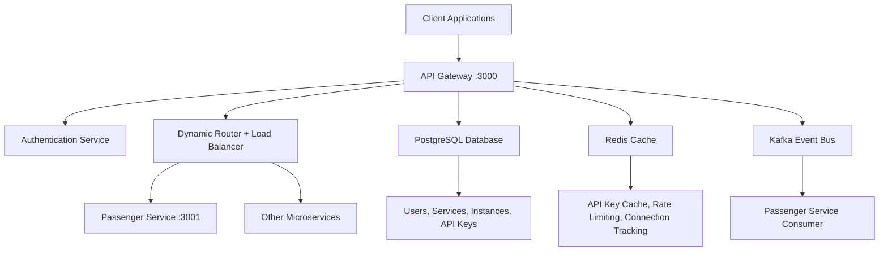

# API Gateway - Metro Backend

The API Gateway serves as the central entry point for all client requests in our microservices architecture. It provides authentication, dynamic routing, load balancing, circuit breaker patterns, and event-driven communication with integrated Redis caching and Kafka messaging.

## 🏗️ Architecture Overview



## ✨ Core Features

### Authentication & Security
- **Dual Authentication System**: JWT tokens for service management + API keys for routing
- **Advanced Rate Limiting**: Multiple tiers (auth, sensitive, API, user-specific)
- **Account Security**: Auto-locking, temporary blocks, admin controls
- **Input Validation**: Joi schema validation, CORS, security headers

### Dynamic Service Routing
- **HTTP Proxy System**: Express-http-proxy with path resolution
- **Load Balancing**: Connection tracking with Redis-backed least connections algorithm
- **Circuit Breaker**: Opossum-based fault tolerance with automatic fallback
- **Service Discovery**: PostgreSQL-based service and instance registry

### Performance & Caching
- **Redis Integration**: API key validation cache (10-50x faster than PostgreSQL)
- **Connection Tracking**: Real-time load balancing with Redis sorted sets
- **TTL Management**: Automatic cleanup of expired keys and sessions

### Event-Driven Architecture
- **Kafka Producer**: Publishes user lifecycle events (user.created)
- **Microservice Integration**: Automatic passenger creation on user registration
- **Asynchronous Processing**: Decoupled service communication

## 🛠️ Technology Stack

- **Runtime**: Node.js 18+ with Express.js
- **Database**: PostgreSQL 15 (service registry, user management)
- **Cache**: Redis 7 (API keys, rate limiting, load balancing)
- **Message Broker**: Apache Kafka (event streaming)
- **Monitoring**: Winston logging, custom metrics
- **Documentation**: Swagger/OpenAPI 3.0

## 📋 Prerequisites

- Node.js 18 or higher
- PostgreSQL 15
- Redis 7
- Apache Kafka
- Docker and Docker Compose (recommended)

## 🚀 Quick Start

### 1. Environment Setup

Create a `.env` file:

```env
# Application
NODE_ENV=development
PORT=3000

# Database
DB_HOST=postgres
DB_PORT=5432
DB_NAME=auth_db
DB_USER=auth_user
DB_PASSWORD=authpass

# JWT
JWT_ACCESS_SECRET=ad9be0a348b0e7825a4f3487cb27db4779628e0e4d4c2c6bf1375feb80571b56
JWT_REFRESH_SECRET=270351fdf27329e0bcf49f6b232256f3c1d91846d01e4d2556feafbdc867b7d3
JWT_ACCESS_EXPIRY=15m
JWT_REFRESH_EXPIRY=7d
SERVICE_JWT_SECRET=ad9be0a348b0e7825a2f3487cb27db4779628e0e4d4c2c6bf1375feb80571b56
DEFAULT_ADMIN_USER_ID=00000000-0000-0000-0000-000000000001


#API KEY
API_KEY_HASH_SECRET=e4da29a6440eb433cc052462d4a872aabc9580ee6272bdd24919e3a2eeb8fe0d7b917859
# NEED_API_KEY=false


# Redis
REDIS_HOST=redis
REDIS_PORT=6379
REDIS_PASSWORD=${REDIS_PASSWORD:-redispass123}
REDIS_KEY_PREFIX=${REDIS_KEY_PREFIX:-api_gateway_dev_}


# CORS
CORS_ORIGIN=${CORS_ORIGIN:-http://localhost:3000}
CORS_METHODS=GET,HEAD,PUT,PATCH,POST,DELETE
CORS_HEADERS=Content-Type,Authorization


# KAFKA
KAFKA_BROKERS=kafka-1:19092,kafka-2:19093,kafka-3:19094
KAFKA_CLIENT_ID=api-gateway
KAFKA_BROKERS_INTERNAL=kafka-1:19092,kafka-2:19093,kafka-3:19094
KAFKA_GROUP_ID=api-gateway-group
USER_CREATED_TOPIC=user.created
USER_DELETED_TOPIC=user.deleted
ADMIN_DELETED_TOPIC=admin.deleted
ADMIN_UPDATED_TOPIC=admin.updated
PASSENGER_DELETED_TOPIC=passenger.deleted
PASSENGER_UPDATED_TOPIC=passenger.updated
STAFF_DELETED_TOPIC=staff.deleted
STAFF_UPDATED_TOPIC=staff.updated 
STAFF_STATUS_CHANGED_TOPIC=staff.status.changed


#email
EMAIL_HOST=smtp.gmail.com
EMAIL_PORT=587
EMAIL_SECURE=false
EMAIL_USER=metrosystem365@gmail.com
EMAIL_PASS=djbmwwzmglbsqjgp
EMAIL_FROM_NAME=Metro System
EMAIL_FROM=metrosystem365@gmail.com


```

### 2. Installation & Startup

```bash
# Clone and install
git clone <repository-url>
cd api-gateway
npm install

# Start with Docker Compose (recommended)
docker-compose up -d

# Or start development server
npm run dev
```

### 3. Verify Installation

```bash
# Health check
curl http://localhost:3000/health

# API documentation
open http://localhost:3000/api-docs
```

## 📚 API Endpoints

### Authentication Routes (`/v1/auth/*`)
```bash
POST /v1/auth/register     # User registration
POST /v1/auth/login        # User login  
POST /v1/auth/refresh      # Token refresh
POST /v1/auth/logout       # User logout
GET  /v1/auth/key/:userId  # Generate API key (JWT required)
```

### Service Management (`/v1/services/*`) - JWT Required
```bash
POST /v1/services                           # Register new service
GET  /v1/services                           # List all services
POST /v1/services/:serviceId/instances      # Register service instance
GET  /v1/services/:serviceId/health         # Health check instances
```

### Dynamic Routing (`/v1/route/*`) - API Key Required
```bash
# Route to any registered microservice
ALL /v1/route/:endPoint/*

# Examples:
GET  /v1/route/passengers              # List passengers
POST /v1/route/passengers              # Create passenger
GET  /v1/route/passengers/123          # Get passenger 123
PUT  /v1/route/passengers/123          # Update passenger 123
DELETE /v1/route/passengers/123        # Delete passenger 123
```

## 🏗️ Project Structure

```
api-gateway/
├── src/
│   ├── config/           # Database, Redis, Swagger configs
│   ├── controllers/      # Request handlers
│   ├── events/           # Kafka producer/consumer
│   ├── helpers/          # Crypto, error handling utilities
│   ├── middlewares/      # Auth, rate limiting, validation
│   ├── models/           # PostgreSQL models (User, Service, etc.)
│   ├── routes/           # Express route definitions
│   ├── services/         # Business logic layer
│   └── utils/            # Common utilities
├── tests/                # Unit and integration tests
├── docker-compose.yml    # Multi-service Docker setup
└── package.json
```

## 🔧 Development

### Running Tests
```bash
npm test                  # Run all tests
npm run test:unit         # Unit tests only
npm run test:integration  # Integration tests only
```

### Code Quality
```bash
npm run lint              # ESLint checks
npm run lint:fix          # Fix linting issues
npm run format            # Prettier formatting
```

### Database Management
```bash
npm run db:migrate        # Run database migrations
npm run db:seed           # Seed development data
npm run db:reset          # Reset database
```

## 📊 Monitoring & Operations

### Health Endpoints
- **Gateway Health**: `GET /health`
- **Service Health**: `GET /v1/services/:serviceId/health`
- **Database Health**: `GET /health/db`
- **Redis Health**: `GET /health/redis`

### Management Tools
- **API Documentation**: http://localhost:3000/api-docs
- **Redis Commander**: http://localhost:8081
- **pgAdmin**: http://localhost:5050
- **Kafka UI**: http://localhost:8080

### Performance Metrics
- **Request/Response Logging**: Winston with correlation IDs
- **Rate Limiting Metrics**: Redis-based tracking
- **Circuit Breaker Stats**: Opossum metrics
- **Connection Pool Monitoring**: PostgreSQL connection stats

## 🔒 Security Features

### Rate Limiting Tiers
- **General**: 100 requests/15 minutes per IP
- **Authentication**: 10 requests/15 minutes per IP
- **Sensitive Operations**: 5 requests/hour per IP
- **API Endpoints**: 1000 requests/hour per IP
- **Per-User**: 60 requests/minute per authenticated user

### Security Headers & Validation
- **Helmet.js**: Security headers
- **CORS**: Cross-origin request handling
- **Joi Validation**: Request schema validation
- **SQL Injection Prevention**: Parameterized queries
- **XSS Protection**: Input sanitization

## 📖 Usage Examples

### Complete Workflow Example

```bash
# 1. Register user
curl -X POST http://localhost:3000/v1/auth/register \
  -H "Content-Type: application/json" \
  -d '{
    "firstName": "John",
    "lastName": "Doe",
    "email": "john@example.com",
    "password": "SecurePass123!",
    "phoneNumber": "1234567890"
  }'

# 2. Login to get JWT
curl -X POST http://localhost:3000/v1/auth/login \
  -H "Content-Type: application/json" \
  -d '{
    "email": "john@example.com",
    "password": "SecurePass123!"
  }'

# 3. Generate API key (use JWT from step 2)
curl -X GET http://localhost:3000/v1/auth/key/USER_ID \
  -H "Authorization: Bearer YOUR_JWT_TOKEN"

# 4. Use API key to access microservices
curl -X GET http://localhost:3000/v1/route/passengers \
  -H "x-api-key: YOUR_API_KEY"
```

## 🚀 Deployment

### Docker Production Deployment
```bash
# Build production image
docker build -t metro-api-gateway:latest .

# Run with production compose
docker-compose -f docker-compose.prod.yml up -d
```

### Environment-Specific Configs
- **Development**: `.env.development`
- **Staging**: `.env.staging`  
- **Production**: `.env.production`

## 🤝 Contributing

1. Fork the repository
2. Create feature branch: `git checkout -b feature/awesome-feature`
3. Run tests: `npm test`
4. Commit changes: `git commit -m 'Add awesome feature'`
5. Push branch: `git push origin feature/awesome-feature`
6. Open Pull Request

### Code Standards
- **ESLint**: JavaScript linting
- **Prettier**: Code formatting
- **Jest**: Testing framework
- **Conventional Commits**: Commit message format

## 📄 Documentation

- **[API Documentation](./ROUTES_DOCUMENTATION.md)**: Comprehensive route and architecture guide
- **[Swagger UI](http://localhost:3000/api-docs)**: Interactive API explorer
- **[Postman Collection](./postman/)**: Ready-to-use API collection

## 📝 License

This project is licensed under the MIT License - see the [LICENSE](LICENSE) file for details.

---

**Made with ❤️ for Metro Backend Architecture** 