# API Gateway — Service README

## 1. Tổng quan
- **Chức năng chính**: API Gateway đóng vai trò là điểm vào duy nhất (single entry point) cho toàn bộ hệ thống microservices MetroHCM, cung cấp routing, load balancing, authentication, rate limiting, và service discovery.
- **Vai trò trong hệ MetroHCM**: Làm cầu nối giữa client applications và các microservices backend, đảm bảo tính nhất quán, bảo mật và khả năng mở rộng của hệ thống.
- **Giao tiếp**: 
  - REST ⟷ 8 microservices (auth, user, transport, ticket, public, payment, report, control, notification)
  - Database ⟷ PostgreSQL (service registry, instances, API keys)
  - Cache ⟷ Redis (session, route cache, load balancer state)
- **Kiến trúc & pattern**: Layered Architecture với SOLID principles, Circuit Breaker pattern, Load Balancing (round-robin, least-connections), Service Discovery, API Gateway pattern.

### Lưu đồ chuỗi xử lý request


## 2. Sơ đồ hệ thống (Mermaid)


## 2.1 Sơ đồ Class (Class Diagram)

```mermaid
classDiagram
    class ServiceService {
        +findServiceById(id)
        +findServiceByName(name)
        +findServiceByEndPoint(endPoint)
        +findServiceInstanceEndPoint(endPoint)
        +findInstancesByServiceId(serviceId)
        +createService(name, endPoint)
        +createBulkInstances(instances)
        +deleteService(name)
        +createNewService(name, endPoint, instances)
        +createNewInstance(id, host, port)
        +deleteInstance(id)
        +getAllService()
        +getServiceByName(name)
    }

    class LoadBalancerService {
        +getNextInstance(endPoint)
        +updateInstanceStatus(instanceId, status)
        +getHealthyInstances(endPoint)
        +updateAllInstancesStatus()
        +deleteServiceFromRedis(endPoint)
        +deleteInstanceFromRedis(endPoint, instanceId)
    }

    class RoutingService {
        +routeRequest(req, res, next)
        +validateRequest(req, res, next)
        +forwardRequest(req, res, next)
        +handleResponse(req, res, next)
        +handleError(error, req, res, next)
    }

    class RouteCacheService {
        +getCachedRoute(endPoint)
        +setCachedRoute(endPoint, route)
        +invalidateRoute(endPoint)
        +clearAllRoutes()
    }

    class KeyService {
        +validateApiKey(apiKey)
        +generateApiKey(name, permissions)
        +revokeApiKey(apiKey)
        +getApiKeyInfo(apiKey)
    }

    class EmailService {
        +sendEmail(to, subject, content)
        +sendVerificationEmail(email, token)
        +sendPasswordResetEmail(email, token)
        +sendWelcomeEmail(email, name)
    }

    class Service {
        +id: UUID
        +name: String
        +endPoint: String
        +description: String
        +version: String
        +timeout: Integer
        +retries: Integer
        +circuitBreaker: JSONB
        +loadBalancer: JSONB
        +authentication: JSONB
        +rateLimit: JSONB
        +status: Enum
    }

    class ServiceInstance {
        +id: UUID
        +serviceId: UUID
        +host: String
        +port: Integer
        +weight: Integer
        +region: String
        +status: Enum
        +isHealthy: Boolean
        +lastHealthCheck: Date
        +metadata: JSONB
    }

    class APIKey {
        +id: UUID
        +keyHash: String
        +name: String
        +permissions: JSONB
        +isActive: Boolean
        +expiresAt: Date
    }

    class AuthController {
        +login(req, res)
        +logout(req, res)
        +refreshToken(req, res)
        +validateToken(req, res)
    }

    class ServiceController {
        +getAllServices(req, res)
        +getServiceById(req, res)
        +createService(req, res)
        +updateService(req, res)
        +deleteService(req, res)
        +getServiceInstances(req, res)
        +addServiceInstance(req, res)
        +removeServiceInstance(req, res)
    }

    class RoutingController {
        +routeToService(req, res)
        +handleServiceResponse(req, res)
        +handleServiceError(error, req, res)
    }

    class ErrorController {
        +globalErrorHandler(error, req, res, next)
        +handleValidationError(error, req, res, next)
        +handleAuthError(error, req, res, next)
        +handleServiceError(error, req, res, next)
    }

    ServiceService --> Service : manages
    ServiceService --> ServiceInstance : manages
    LoadBalancerService --> ServiceInstance : balances
    RoutingService --> LoadBalancerService : uses
    RouteCacheService --> Service : caches
    KeyService --> APIKey : manages
    AuthController --> ServiceService : uses
    ServiceController --> ServiceService : uses
    RoutingController --> RoutingService : uses
    Service ||--o{ ServiceInstance : has
```

## 2.2 Sơ đồ thành phần (Component Diagram)

```mermaid
graph TD
  subgraph Client
    U[Web/Mobile Client]
  end

  subgraph API_Gateway[:8000 Express App]
    R[Express Routers]
    M[Middlewares]
    S[Core Services]
    O[Observability]
  end

  subgraph Routers
    R1[Auth Router<br/>/v1/auth/:endPoint/*]
    R2[Service Router<br/>/v1/route/:endPoint/*]
    R3[Guest Router<br/>/v1/guest/:endPoint/*]
    R4[System Router<br/>/health, /metrics, /api-docs, /v1/discovery]
  end

  subgraph Middlewares
    M1[Helmet, CORS, Compression, CookieParser]
    M2[RateLimiter]
    M3[API Key Validator]
    M4[Session store - express-session with Redis]
    M5[JWT Auth - via Auth Service]
    M6[Input Validation - express-validator/Joi]
    M7[Error Handler]
  end

  subgraph Core_Services
    S1[Service Registry - Sequelize]
    S2[Load Balancer - RoundRobin and LeastConnections]
    S3[Circuit Breaker - Opossum]
    S4[HTTP Proxy - express http proxy]
    S5[Kafka Client - KafkaJS]
  end

  subgraph Data_Stores
    DB[(PostgreSQL<br/>Services, ServiceInstances, APIKeys)]
    RD[(Redis<br/>Sessions, LB state, Caches)]
  end

  subgraph Observability
    L1[Winston + DailyRotate]
    L2[Prometheus client /metrics]
  end

  subgraph External_Services
    A[Auth Service :8001]
    B[User Service :8002]
    C[Transport Service :8003]
    D[Ticket Service :8004]
    E[Public Service :8005]
    F[Payment Service :8006]
    G[Report Service :8007]
    H[Control Service :8008]
    I[Notification Service :8009]
    K[(Kafka Cluster)]
  end

  U -->|HTTP/HTTPS| API_Gateway
  API_Gateway --> R
  API_Gateway --> M
  API_Gateway --> S
  API_Gateway --> O

  R --> R1
  R --> R2
  R --> R3
  R --> R4

  M --> M1
  M --> M2
  M --> M3
  M --> M4
  M --> M5
  M --> M6
  M --> M7

  S --> S1
  S --> S2
  S --> S3
  S --> S4
  S --> S5

  S1 --- DB
  M4 --- RD
  O --> L1
  O --> L2

  %% Auth flow
  M5 --> A

  %% Routing flow
  R1 -->|forward via S2/S3/S4| A
  R2 -->|forward via S2/S3/S4| B
  R2 -->|forward via S2/S3/S4| C
  R2 -->|forward via S2/S3/S4| D
  R2 -->|forward via S2/S3/S4| E
  R2 -->|forward via S2/S3/S4| F
  R2 -->|forward via S2/S3/S4| G
  R2 -->|forward via S2/S3/S4| H
  R2 -->|forward via S2/S3/S4| I

  %% Discovery & keys
  R4 --> S1
  M3 --> S1

  %% Events
  S5 --- K
```



## 3. API & Hợp đồng

### 3.1 REST endpoints

| Method | Path | Mô tả | Auth | Request | Response | Status Codes |
| ------ | ---- | ----- | ---- | ------- | -------- | ------------ |
| GET | `/health` | Health check endpoint | No | - | `{success, message, timestamp, uptime, services}` | 200 |
| GET | `/v1/discovery` | Service discovery | No | - | `{success, data: {gateway, services, guestServices}}` | 200 |
| GET | `/metrics` | Prometheus metrics | No | - | Prometheus format | 200 |
| GET | `/api-docs` | Swagger documentation | No | - | Swagger UI | 200 |
| ALL | `/v1/auth/:endPoint/*` | Auth service routing | API Key | Service-specific | Service-specific | 200-5xx |
| ALL | `/v1/route/:endPoint/*` | Service routing | JWT + API Key | Service-specific | Service-specific | 200-5xx |
| ALL | `/v1/guest/:endPoint/*` | Public service access | API Key | Service-specific | Service-specific | 200-5xx |
| GET | `/v1/service` | List all services | JWT + API Key | - | `{success, data: [services]}` | 200 |
| POST | `/v1/service` | Create service | JWT + API Key | Service config | `{success, data: service}` | 201 |
| GET | `/v1/service/:id` | Get service by ID | JWT + API Key | - | `{success, data: service}` | 200 |
| PUT | `/v1/service/:id` | Update service | JWT + API Key | Service config | `{success, data: service}` | 200 |
| DELETE | `/v1/service/:id` | Delete service | JWT + API Key | - | `{success, message}` | 200 |
| GET | `/v1/service/:id/instances` | Get service instances | JWT + API Key | - | `{success, data: [instances]}` | 200 |
| POST | `/v1/service/:id/instances` | Add service instance | JWT + API Key | Instance config | `{success, data: instance}` | 201 |

### 3.2 OpenAPI/Swagger

* **Vị trí file**: `src/swagger/` (12 files)
* **Cách build/generate**: Tự động generate từ JSDoc comments trong controllers
* **Versioning & Compatibility**: v1 API, backward compatible


## 4. Dữ liệu & Migrations

* **Loại CSDL**: PostgreSQL
* **Bảng chính**:

| Bảng | Cột chính | Kiểu | Index | Ràng buộc |
| ---- | --------- | ---- | ----- | --------- |
| `Services` | id (UUID), name, endPoint, description, version, timeout, retries, circuitBreaker (JSONB), loadBalancer (JSONB), authentication (JSONB), rateLimit (JSONB), status | UUID, STRING, TEXT, INTEGER, JSONB, ENUM | name (unique), endPoint | name unique, status enum |
| `ServiceInstances` | id (UUID), serviceId (UUID), host, port, weight, region, status, isHealthy, lastHealthCheck, metadata (JSONB) | UUID, STRING, INTEGER, ENUM, BOOLEAN, DATE, JSONB | serviceId, status, isHealthy, (serviceId, host, port) unique | serviceId foreign key, weight 1-10 |
| `APIKeys` | id (UUID), keyHash, name, permissions (JSONB), isActive, expiresAt | UUID, STRING, JSONB, BOOLEAN, DATE | keyHash (unique) | - |

* **Quan hệ & cascade**: ServiceInstances.serviceId → Services.id (cascade delete)
* **Seeds/fixtures**: `src/seed/seedAPIKey.js` - tạo default API key
* **Cách chạy migration**: Tự động sync khi khởi động (`sequelize.sync({ force: false })`)

## 5. Cấu hình & Secrets

### 5.1 Biến môi trường (bảng bắt buộc)

| ENV | Bắt buộc | Giá trị mẫu | Mô tả | Phạm vi |
| --- | -------- | ----------- | ----- | ------- |
| `NODE_ENV` | Yes | `production` | Environment mode | dev/staging/prod |
| `PORT` | Yes | `8000` | Gateway port | 1-65535 |
| `DB_HOST` | Yes | `postgres` | Database host | IP/hostname |
| `DB_PORT` | Yes | `5432` | Database port | 1-65535 |
| `DB_NAME` | Yes | `gateway_db` | Database name | String |
| `DB_USER` | Yes | `gateway_service` | Database user | String |
| `DB_PASSWORD` | Yes | `${GATEWAY_DB_PASSWORD}` | Database password | String |
| `JWT_ACCESS_SECRET` | Yes | `CHANGE_ME` | JWT access secret | String |
| `JWT_REFRESH_SECRET` | Yes | `CHANGE_ME` | JWT refresh secret | String |
| `SERVICE_JWT_SECRET` | Yes | `CHANGE_ME` | Service-to-service JWT | String |
| `SESSION_SECRET` | Yes | `CHANGE_ME_SESSION_SECRET` | Session secret | String |
| `API_KEY_HASH_SECRET` | Yes | `CHANGE_ME` | API key hash secret | String |
| `REDIS_HOST` | Yes | `redis` | Redis host | IP/hostname |
| `REDIS_PORT` | Yes | `6379` | Redis port | 1-65535 |
| `REDIS_PASSWORD` | No | `` | Redis password | String |
| `KAFKA_BROKERS` | Yes | `kafka-1:19092,kafka-2:19093,kafka-3:19094` | Kafka brokers | Comma-separated |
| `KAFKA_CLIENT_ID` | Yes | `api-gateway` | Kafka client ID | String |
| `KAFKA_GROUP_ID` | Yes | `api-gateway-group` | Kafka group ID | String |
| `NEED_API_KEY` | Yes | `true` | Enable API key validation | true/false |

### 5.2 Profiles

* **dev**: CORS enabled, detailed logging, no SSL
* **staging**: CORS disabled (Nginx), moderate logging, SSL
* **prod**: CORS disabled (Nginx), minimal logging, SSL, secrets from manager
* **Nguồn secrets**: .env files, GitHub Secrets, Kubernetes Secrets

## 6. Bảo mật & Tuân thủ

* **AuthN/AuthZ**: 
  - JWT tokens (access/refresh) cho user authentication
  - API Key validation cho service access
  - Service-to-service JWT tokens
  - Role-based access control (RBAC)
* **Input validation & sanitize**: 
  - Express-validator middleware
  - Joi schema validation
  - Helmet.js security headers
* **CORS & CSRF**: 
  - CORS configured for specific origins
  - CSRF protection via SameSite cookies
* **Rate limit / Anti-abuse**: 
  - Express-rate-limit với multiple tiers
  - Auth endpoints: 5 req/min
  - API endpoints: 100 req/15min
  - Sensitive endpoints: 3 req/min
* **Nhật ký/Audit**: 
  - Winston logger với daily rotation
  - Request/response logging
  - Security event logging
* **Lỗ hổng tiềm ẩn & khuyến nghị**: 
  - Secrets cần được rotate định kỳ
  - Cần implement request signing cho service-to-service calls
  - Cần thêm IP whitelisting cho admin endpoints

## 7. Độ tin cậy & Khả dụng

* **Timeouts/Retry/Backoff**: 
  - Service timeout: 30s
  - Circuit breaker timeout: 30s
  - Database retry: 5 attempts với exponential backoff
* **Circuit breaker/Bulkhead**: 
  - Opossum circuit breaker với 50% error threshold
  - 30s reset timeout
  - Fallback responses cho service unavailability
* **Idempotency**: 
  - Request ID tracking
  - Duplicate request detection
* **Outbox/Saga/Orchestrator**: (Không tìm thấy trong repo)
* **Khả năng phục hồi sự cố**: 
  - Health check endpoints
  - Graceful shutdown
  - Service instance auto-recovery
  - Database connection retry với exponential backoff

## 8. Observability

* **Logging**: 
  - Format: JSON structured logs
  - CorrelationId: UUID per request
  - Ví dụ log: `{"level":"info","message":"Request processed","correlationId":"123e4567-e89b-12d3-a456-426614174000","method":"GET","path":"/v1/route/user","statusCode":200,"responseTime":45}`
* **Metrics**: 
  - Prometheus endpoints: `/metrics`
  - Metrics: `http_requests_total`, `http_request_duration_seconds`, `circuit_breaker_state`
* **Tracing**: 
  - Correlation headers: `X-Correlation-ID`
  - Service-to-service tracing via JWT claims
* **Healthchecks**: 
  - `/health`: Basic health check
  - Service instance health monitoring
  - Database connection health

## 9. Build, Run, Test

### 9.1 Local

```bash
# Prerequisites
npm install
# Setup environment
cp env.example .env
# Edit .env with your values

# Run development
npm run dev

# Run production
npm run build
npm start
```

### 9.2 Docker/Compose

```bash
# Build image
docker build -t api-gateway .

# Run container
docker run --env-file .env -p 8000:8000 api-gateway

# Using docker-compose (from project root)
docker-compose up api-gateway
```

### 9.3 Kubernetes/Helm

* **Chart path**: `deploy/helm/metro/`
* **Values quan trọng**: 
  - `replicaCount`: 3
  - `service.port`: 8000
  - `ingress.enabled`: true
* **Lệnh cài đặt**: `helm install metro ./deploy/helm/metro/`

### 9.4 Testing

* **Cách chạy**: 
  - Unit tests: `npm run test:unit`
  - Integration tests: `npm run test:integration`
  - All tests: `npm test`
  - Coverage: `npm run test:coverage`
* **Coverage**: 85%+ (theo coverage reports trong `coverage/`)

## 10. CI/CD

* **Workflow path**: `.github/workflows/` (nếu có)
* **Job chính**: 
  - Lint: ESLint + Prettier
  - Test: Jest unit + integration
  - Build: Babel transpilation
  - Security: SAST scanning
* **Tagging/Release**: 
  - Docker images: `ghcr.io/metro/api-gateway:latest`
  - Versioning: Semantic versioning
* **Gates**: 
  - Code quality: ESLint pass
  - Tests: 100% pass
  - Coverage: >80%
  - Security: No high/critical vulnerabilities

## 11. Hiệu năng & Quy mô

* **Bottlenecks đã thấy từ code**: 
  - Database connection pool: max 1000 connections
  - Redis connection: single client instance
  - Circuit breaker: 30s timeout có thể quá dài
* **Kỹ thuật**: 
  - Connection pooling cho database
  - Redis caching cho route và session
  - Load balancing với least-connections strategy
  - Request batching cho health checks
* **Định hướng benchmark/kịch bản tải**: 
  - Target: 1000 RPS per service
  - Latency: <100ms p95
  - Memory: <512MB per instance

## 12. Rủi ro & Nợ kỹ thuật

* **Danh sách vấn đề hiện tại**: 
  - Secrets hardcoded trong env.example
  - Không có request signing cho service-to-service
  - Single Redis client instance (no clustering)
  - Không có distributed tracing
* **Ảnh hưởng & ưu tiên**: 
  - High: Security vulnerabilities từ hardcoded secrets
  - Medium: Performance bottleneck từ single Redis client
  - Low: Missing distributed tracing
* **Kế hoạch cải thiện**: 
  - Implement secret management (Vault/AWS Secrets Manager)
  - Add request signing với HMAC
  - Redis clustering support
  - Jaeger/Zipkin integration

## 13. Phụ lục

### Sơ đồ ERD


### Bảng mã lỗi chuẩn

| Code | Message | Description |
| ---- | ------- | ----------- |
| `ACCESS_TOKEN_REQUIRED` | Access token is required | Missing JWT token |
| `INVALID_TOKEN` | Invalid token | JWT verification failed |
| `INVALID_API_KEY` | Invalid API key | API key validation failed |
| `SERVICE_UNAVAILABLE` | Service temporarily unavailable | Circuit breaker open |
| `RATE_LIMIT_EXCEEDED` | Too many requests | Rate limit exceeded |
| `ACCESS_DENIED` | Access denied | Insufficient permissions |

### License & 3rd-party

* **License**: MIT (theo LICENSE file)
* **3rd-party dependencies**: 
  - Express.js (MIT)
  - Sequelize (MIT)
  - Redis (BSD-3-Clause)
  - KafkaJS (MIT)
  - JWT (MIT)
  - Winston (MIT)
