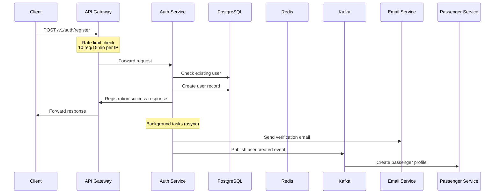
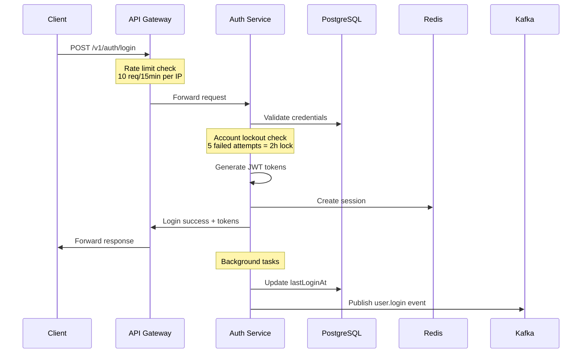
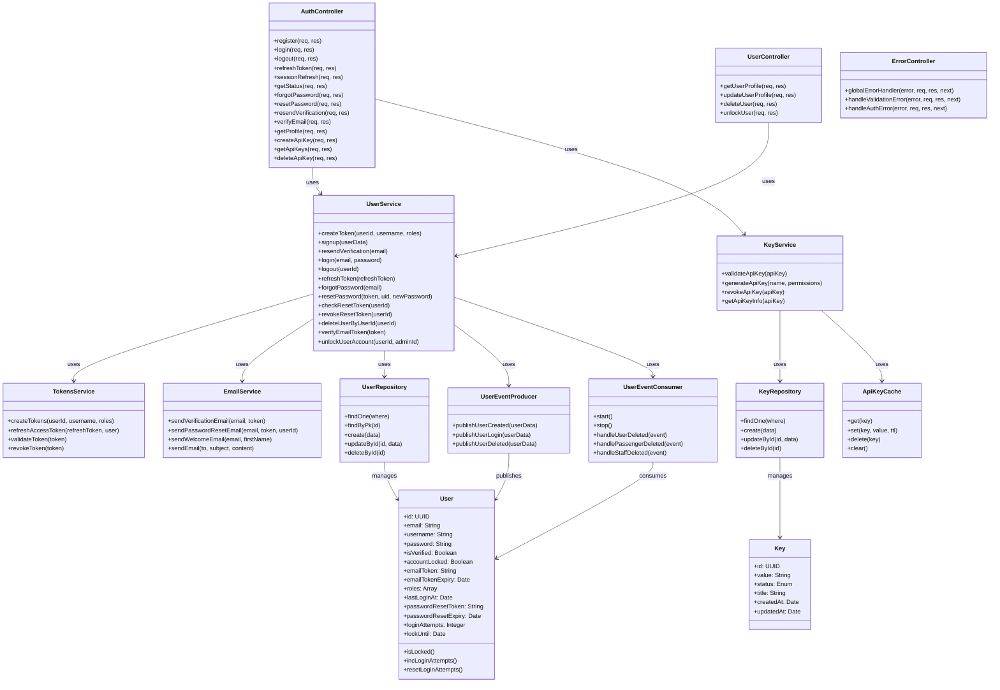
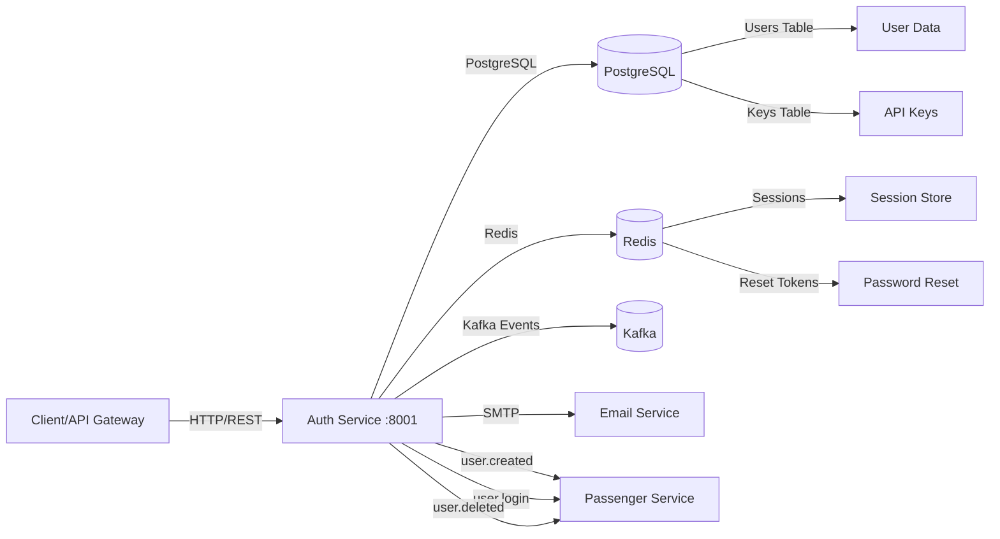
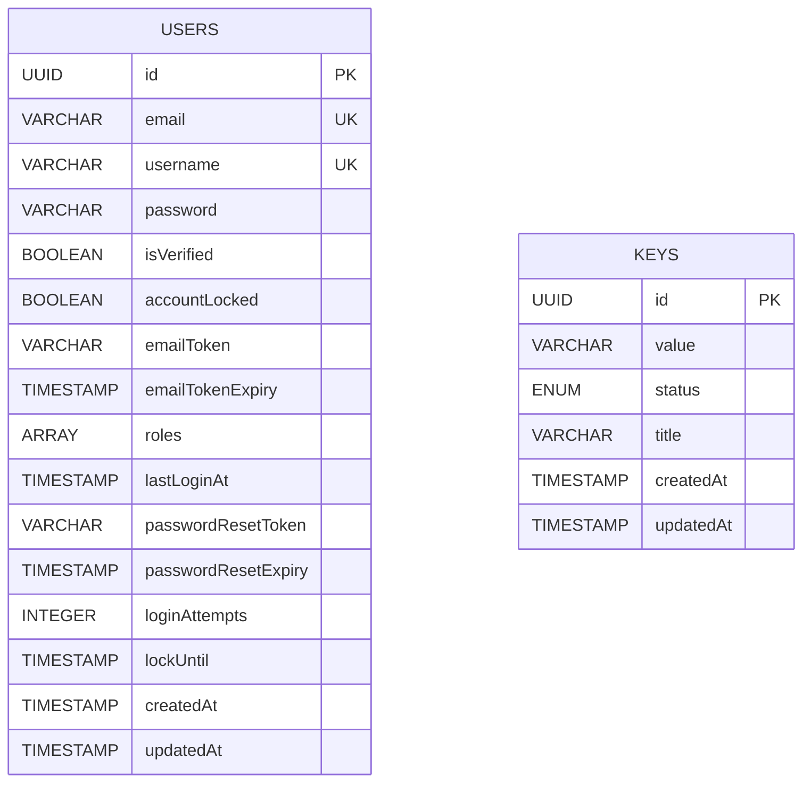

# Auth Service — Service README

## 1. Tổng quan
- **Chức năng chính**: Quản lý xác thực và phân quyền người dùng trong hệ thống MetroHCM, bao gồm đăng ký, đăng nhập, quản lý token JWT, API keys, và session management
- **Vai trò trong hệ MetroHCM**: Service trung tâm cho authentication & authorization, cung cấp JWT tokens và API keys cho các microservices khác
- **Giao tiếp**: 
  - REST ⟷ API Gateway, Frontend applications
  - Event (Kafka) ⟷ User Service
  - Database ⟷ PostgreSQL (user data, API keys)
  - Cache ⟷ Redis (sessions, password reset tokens)
- **Kiến trúc & pattern**: Layered Architecture với SOLID principles, Repository pattern, Event-driven architecture, Session-based + JWT dual authentication

### Lưu đồ chuỗi đăng ký người dùng:


### Lưu đồ chuỗi đăng nhập:


## 2. Sơ đồ Class (Class Diagram)



## 2.1 Sơ đồ hệ thống (Mermaid)



## 3. API & Hợp đồng

### 3.1 REST endpoints

| Method | Path | Mô tả | Auth | Request | Response | Status Codes |
| ------ | ---- | ----- | ---- | ------- | -------- | ------------ |
| POST | `/v1/auth/register` | Đăng ký người dùng mới | None | `{firstName, lastName, email, password, username, phoneNumber, dateOfBirth, gender, address, roles}` | `{success, message, data: {user}}` | 200, 409, 400, 500 |
| POST | `/v1/auth/login` | Đăng nhập người dùng | None | `{email, password}` | `{success, message, data: {user, accessToken}}` | 200, 401, 403, 423, 500 |
| POST | `/v1/auth/logout` | Đăng xuất người dùng | JWT | None | `{success, message}` | 200, 401, 500 |
| POST | `/v1/auth/refresh` | Làm mới access token | Refresh Token | None | `{success, message, data: {user, accessToken}}` | 200, 401, 500 |
| POST | `/v1/auth/session-refresh` | Làm mới session | Session | None | `{success, message}` | 200, 401, 500 |
| GET | `/v1/auth/status` | Kiểm tra trạng thái đăng nhập | Optional | None | `{success, authenticated, method, user, session?}` | 200, 401, 500 |
| POST | `/v1/auth/forgot-password` | Yêu cầu reset mật khẩu | None | `{email}` | `{success, message}` | 200, 400, 503, 500 |
| POST | `/v1/auth/reset-password` | Reset mật khẩu | None | `{token, uid, newPassword}` | `{success, message}` | 200, 400, 500 |
| POST | `/v1/auth/resend-verification` | Gửi lại email xác thực | None | `{email}` | `{success, message}` | 200, 400, 404, 500 |
| POST | `/v1/auth/verify-email` | Xác thực email | None | `{token}` | `{success, message}` | 200, 400, 500 |
| GET | `/v1/auth/profile` | Lấy thông tin profile | Session | None | `{success, user, session}` | 200, 401, 500 |
| GET | `/v1/auth/key/:id` | Tạo API key cho user | JWT | None | `{success, message, data: {token, keyId}}` | 200, 401, 500 |
| GET | `/v1/auth/keys/:userId` | Lấy danh sách API keys | JWT | None | `{success, data: {keys}}` | 200, 400, 401, 500 |
| DELETE | `/v1/auth/key/:id` | Xóa API key | JWT | None | `{success, message}` | 200, 401, 404, 500 |
| GET | `/health` | Health check | None | None | `{status, service, timestamp}` | 200 |
| GET | `/metrics` | Prometheus metrics | None | None | Prometheus format | 200 |

### 3.2 Event (Kafka)

| Topic | Direction | Key | Schema | Semantics | Retry/DLQ |
| ----- | --------- | --- | ------ | --------- | --------- |
| `user.created` | Producer | `userId` | `{userId, email, username, roles, firstName, lastName, phoneNumber, dateOfBirth, gender, address, status}` | At-least-once | Auto-retry |
| `user.login` | Producer | `userId` | `{userId, email, username, roles, source?}` | At-least-once | Auto-retry |
| `user.deleted` | Consumer | `userId` | `{userId, email, source}` | At-least-once | Manual retry |
| `passenger.deleted` | Consumer | `passengerId` | `{data: {passengerId, userId, email}, source}` | At-least-once | Manual retry |
| `staff.deleted` | Consumer | `staffId` | `{data: {staffId, userId, email}, source}` | At-least-once | Manual retry |

## 4. Dữ liệu & Migrations

* **Loại CSDL**: PostgreSQL 15
* **Bảng chính**:

### Users Table
| Cột | Kiểu | Ràng buộc | Index | Mô tả |
| --- | ---- | --------- | ----- | ----- |
| `id` | UUID | PRIMARY KEY | Primary | User identifier |
| `email` | VARCHAR(100) | UNIQUE, NOT NULL | Unique | Email address |
| `username` | VARCHAR(50) | UNIQUE, NOT NULL | - | Username |
| `password` | VARCHAR(255) | NOT NULL | - | Hashed password |
| `isVerified` | BOOLEAN | DEFAULT false | - | Email verification status |
| `accountLocked` | BOOLEAN | DEFAULT false | - | Account lock status |
| `emailToken` | VARCHAR(6) | NULL | Index | Email verification token |
| `emailTokenExpiry` | TIMESTAMP | NULL | - | Token expiry |
| `roles` | ARRAY(STRING) | DEFAULT ['user'] | - | User roles |
| `lastLoginAt` | TIMESTAMP | NULL | - | Last login timestamp |
| `passwordResetToken` | VARCHAR | NULL | Index | Password reset token |
| `passwordResetExpiry` | TIMESTAMP | NULL | - | Reset token expiry |
| `loginAttempts` | INTEGER | DEFAULT 0 | - | Failed login attempts |
| `lockUntil` | TIMESTAMP | NULL | - | Temporary lock expiry |
| `createdAt` | TIMESTAMP | NOT NULL | - | Creation timestamp |
| `updatedAt` | TIMESTAMP | NOT NULL | - | Update timestamp |

### Keys Table
| Cột | Kiểu | Ràng buộc | Index | Mô tả |
| --- | ---- | --------- | ----- | ----- |
| `id` | UUID | PRIMARY KEY | Primary | Key identifier |
| `value` | VARCHAR | NOT NULL | - | API key value |
| `status` | ENUM | DEFAULT 'activated' | - | Key status |
| `title` | VARCHAR | NULL | - | Key description |
| `createdAt` | TIMESTAMP | NOT NULL | - | Creation timestamp |
| `updatedAt` | TIMESTAMP | NOT NULL | - | Update timestamp |

* **Quan hệ**: Users ↔ Keys (1:N) - Một user có thể có nhiều API keys
* **Seeds**: Admin user và default API keys được tạo tự động
* **Cách chạy migration**: `sequelize.sync({ force: false })` - Auto-sync trong production

## 5. Cấu hình & Secrets

### 5.1 Biến môi trường (bảng bắt buộc)

| ENV | Bắt buộc | Giá trị mẫu | Mô tả | Phạm vi |
| --- | -------- | ----------- | ----- | ------- |
| `NODE_ENV` | Yes | `production` | Environment mode | dev/staging/prod |
| `PORT` | Yes | `8001` | Service port | 8001 |
| `DB_HOST` | Yes | `postgres` | Database host | Docker service name |
| `DB_PORT` | Yes | `5432` | Database port | 5432 |
| `DB_NAME` | Yes | `auth_db` | Database name | auth_db |
| `DB_USER` | Yes | `auth_service` | Database user | auth_service |
| `DB_PASSWORD` | Yes | `${AUTH_DB_PASSWORD}` | Database password | Secret manager |
| `JWT_ACCESS_SECRET` | Yes | `CHANGE_ME` | JWT access secret | Secret manager |
| `JWT_REFRESH_SECRET` | Yes | `CHANGE_ME` | JWT refresh secret | Secret manager |
| `JWT_ACCESS_EXPIRY` | No | `15m` | Access token expiry | 15m |
| `JWT_REFRESH_EXPIRY` | No | `7d` | Refresh token expiry | 7d |
| `SERVICE_JWT_SECRET` | Yes | `CHANGE_ME` | Service-to-service JWT | Secret manager |
| `SESSION_SECRET` | Yes | `CHANGE_ME_SESSION_SECRET` | Session secret | Secret manager |
| `API_KEY_HASH_SECRET` | Yes | `CHANGE_ME` | API key hash secret | Secret manager |
| `REDIS_HOST` | Yes | `redis` | Redis host | Docker service name |
| `REDIS_PORT` | Yes | `6379` | Redis port | 6379 |
| `REDIS_PASSWORD` | No | `${REDIS_PASSWORD}` | Redis password | Secret manager |
| `KAFKA_BROKERS` | Yes | `kafka-1:19092,kafka-2:19093,kafka-3:19094` | Kafka brokers | Comma-separated |
| `KAFKA_CLIENT_ID` | Yes | `auth-service` | Kafka client ID | auth-service |
| `KAFKA_GROUP_ID` | Yes | `auth-service` | Kafka group ID | auth-service |
| `EMAIL_HOST` | Yes | `smtp.gmail.com` | SMTP host | SMTP server |
| `EMAIL_PORT` | Yes | `587` | SMTP port | 587 |
| `EMAIL_USER` | Yes | - | SMTP username | Email account |
| `EMAIL_PASS` | Yes | - | SMTP password | Secret manager |
| `EMAIL_FROM` | Yes | `noreply@example.com` | From email | Email address |
| `NEED_EMAIL_VERIFICATION` | No | `false` | Enable email verification | true/false |
| `SEND_ACCESS_TOKEN_TO_CLIENT` | No | `false` | Send token in response | true/false |
| `API_GATEWAY_ORIGIN` | Yes | `https://api.metrohcm.io.vn` | API Gateway origin | Production URL |
| `ALLOWED_ORIGINS` | No | - | Additional CORS origins | Comma-separated |

### 5.2 Profiles

* **dev**: CORS enabled, email verification disabled, debug logging
* **staging**: CORS via Nginx, email verification enabled, info logging  
* **prod**: CORS via Nginx, email verification enabled, warn+ logging, secrets from Vault
* **Nguồn secrets**: GitHub Secrets (CI/CD), HashiCorp Vault (production), .env (development)

## 6. Bảo mật & Tuân thủ

* **AuthN/AuthZ**: 
  - JWT tokens (access + refresh) với RS256 signing
  - Session-based authentication với Redis store
  - API keys cho service-to-service communication
  - Role-based access control (admin, passenger, staff)
* **Input validation & sanitize**: 
  - Joi schema validation cho request bodies
  - SQL injection prevention via Sequelize ORM
  - XSS protection via helmet.js
  - Password hashing với bcryptjs (10 rounds)
* **CORS & CSRF**: 
  - CORS configuration cho development
  - Production CORS handled by Nginx
  - CSRF protection via SameSite cookies
* **Rate limit / Anti-abuse**: 
  - Account lockout sau 5 failed login attempts (2 hours)
  - Redis-based rate limiting cho sensitive operations
  - Network source validation (chỉ cho phép API Gateway)
* **Nhật ký/Audit**: 
  - Winston logging với correlation IDs
  - Security events logging (login attempts, account locks)
  - Request/response logging với user context
* **Lỗ hổng tiềm ẩn & khuyến nghị**: 
  - Secrets management cần được cải thiện (Vault integration)
  - API key rotation mechanism chưa có
  - Password complexity requirements cần được thêm

## 7. Độ tin cậy & Khả dụng

* **Timeouts/Retry/Backoff**: 
  - Database connection timeout: 60s với exponential backoff (5 retries)
  - Redis connection với auto-reconnect
  - Kafka producer với retry mechanism
* **Circuit breaker/Bulkhead**: 
  - Database connection pool: max 1000, min 0
  - Redis connection với error handling
  - Graceful degradation khi Redis unavailable
* **Idempotency**: 
  - User registration với email uniqueness check
  - Password reset tokens với single-use validation
  - API key generation với unique constraints
* **Outbox/Saga/Orchestrator**: 
  - Event publishing trong background tasks (setImmediate)
  - User deletion cascade qua Kafka events
  - Eventual consistency cho user profile creation
* **Khả năng phục hồi sự cố**: 
  - Health check endpoint cho load balancer
  - Graceful shutdown với SIGTERM handling
  - Database migration với auto-sync

## 8. Observability

* **Logging**: 
  - Format: JSON structured logging
  - CorrelationId: Request tracking
  - Ví dụ log: `{"level":"info","message":"User logged in successfully","userId":"uuid","email":"user@example.com","timestamp":"2024-01-01T00:00:00.000Z"}`
* **Metrics**: 
  - Prometheus metrics endpoint: `/metrics`
  - Custom metrics: request count, response time, error rate
  - Database connection pool metrics
* **Tracing**: 
  - Request correlation headers: `x-user-id`, `x-user-email`, `x-user-roles`
  - Session tracking với Redis
  - Event publishing tracking
* **Healthchecks**: 
  - `/health`: Basic service health
  - Database connectivity check
  - Redis connectivity check

## 9. Build, Run, Test

### 9.1 Local

```bash
# Prerequisites
Node.js 18+, PostgreSQL 15, Redis 7, Kafka

# Install dependencies
npm install

# Setup environment
cp env.example .env
# Edit .env with your configuration

# Run database migrations
npm run db:migrate

# Start development server
npm run dev

# Run tests
npm test

# Run tests with coverage
npm run test:coverage
```

### 9.2 Docker/Compose

```bash
# Build image
docker build -t auth-service:latest .

# Run container
docker run --env-file .env -p 8001:8001 auth-service:latest

# Or use docker-compose
docker-compose up -d
```

### 9.3 Kubernetes/Helm (nếu có)

* Chart path: `deploy/helm/auth-service/`
* Values quan trọng: database connection, Redis config, Kafka brokers
* Lệnh cài đặt: `helm install auth-service ./deploy/helm/auth-service/`

### 9.4 Testing

* **Cách chạy**: 
  - Unit tests: `npm test`
  - Integration tests: `npm run test:integration`
  - Coverage: `npm run test:coverage`
* **Coverage**: 
  - Lines: 75% (threshold)
  - Statements: 75% (threshold)
  - Branches: 65% (threshold)
  - Functions: 80% (threshold)

## 10. CI/CD

* **Workflow path**: `.github/workflows/auth-service.yml`
* **Job chính**: 
  - Lint: ESLint + Prettier
  - Test: Jest với coverage
  - Build: Docker image build
  - Deploy: Helm deployment
* **Tagging/Release**: 
  - Semantic versioning (semver)
  - Docker tags: `latest`, `v1.0.0`
  - GitHub Container Registry
* **Gates**: 
  - Code quality: ESLint, Prettier
  - Security: npm audit, SAST
  - Testing: Jest coverage thresholds
  - Build: Docker build success

## 11. Hiệu năng & Quy mô

* **Bottlenecks đã thấy từ code**: 
  - Database connection pool có thể cần tuning
  - Redis connection handling có thể được optimize
  - Email sending blocking response (đã move to background)
* **Kỹ thuật**: 
  - Pagination: Chưa implement (cần cho user listing)
  - Batch operations: API key operations có thể batch
  - Cache: Session cache với Redis, API key cache
  - N+1: Sử dụng Sequelize để tránh N+1 queries
* **Định hướng benchmark/kịch bản tải**: 
  - Load testing với Artillery hoặc k6
  - Database performance monitoring
  - Redis memory usage optimization

## 12. Rủi ro & Nợ kỹ thuật

* **Danh sách vấn đề hiện tại**: 
  - API key rotation mechanism chưa có
  - Password complexity requirements chưa implement
  - User profile data không được store trong Auth Service
  - Email template management chưa flexible
* **Ảnh hưởng & ưu tiên**: 
  - High: API key security (rotation)
  - Medium: Password complexity
  - Low: Email template flexibility
* **Kế hoạch cải thiện**: 
  - Implement API key rotation với TTL
  - Add password complexity validation
  - Move user profile data to dedicated service
  - Implement email template engine

## 13. Phụ lục

### Sơ đồ ERD



### Bảng mã lỗi chuẩn & cấu trúc response lỗi

| Mã lỗi | HTTP Status | Mô tả | Cấu trúc Response |
| ------ | ----------- | ----- | ----------------- |
| `DUPLICATE_EMAIL` | 409 | Email đã tồn tại | `{success: false, message: "Email already exists", error: "DUPLICATE_EMAIL"}` |
| `DUPLICATE_USERNAME` | 409 | Username đã tồn tại | `{success: false, message: "Username already exists", error: "DUPLICATE_USERNAME"}` |
| `USER_NOT_FOUND_LOGIN` | 404 | User không tồn tại | `{success: false, message: "User not found", error: "USER_NOT_FOUND_LOGIN"}` |
| `INVALID_CREDENTIALS_LOGIN` | 401 | Sai thông tin đăng nhập | `{success: false, message: "Invalid email or password", error: "INVALID_CREDENTIALS_LOGIN"}` |
| `ACCOUNT_LOCKED_LOGIN` | 423 | Tài khoản bị khóa | `{success: false, message: "Account is temporarily locked", error: "ACCOUNT_LOCKED_LOGIN"}` |
| `EMAIL_NOT_VERIFIED_LOGIN` | 403 | Email chưa xác thực | `{success: false, message: "Please verify your email address", error: "EMAIL_NOT_VERIFIED_LOGIN"}` |
| `REFRESH_TOKEN_EXPIRED` | 401 | Refresh token hết hạn | `{success: false, message: "Refresh token expired", error: "REFRESH_TOKEN_EXPIRED_REFRESH_TOKEN"}` |
| `INVALID_RESET_TOKEN` | 400 | Token reset không hợp lệ | `{success: false, message: "Invalid or expired reset token", error: "INVALID_OR_EXPIRED_TOKEN_RESET_PASSWORD"}` |
| `REDIS_UNAVAILABLE` | 503 | Redis không khả dụng | `{success: false, message: "Service temporarily unavailable", error: "REDIS_UNAVAILABLE_FORGOT_PASSWORD"}` |

### License & 3rd-party

* **License**: MIT License
* **3rd-party dependencies**: 
  - Express.js (MIT)
  - Sequelize (MIT)
  - Redis (MIT)
  - KafkaJS (MIT)
  - JWT (MIT)
  - bcryptjs (MIT)
  - Winston (MIT)
  - Jest (MIT)
