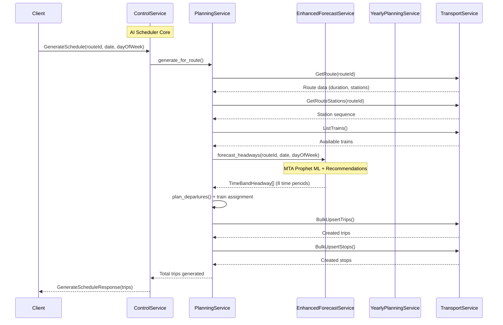
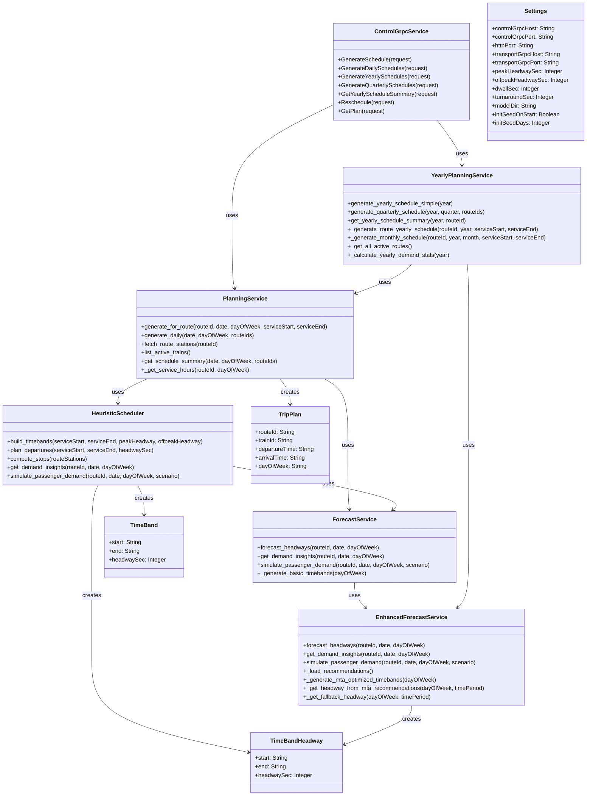
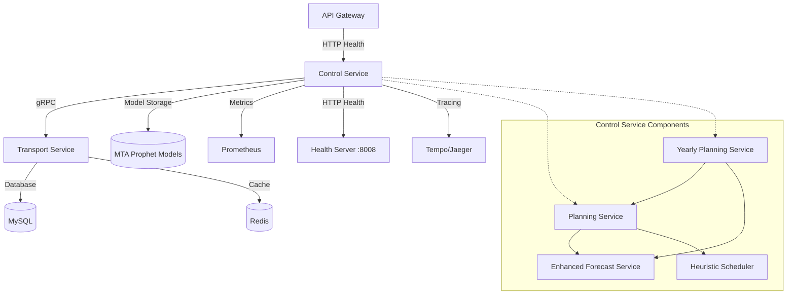
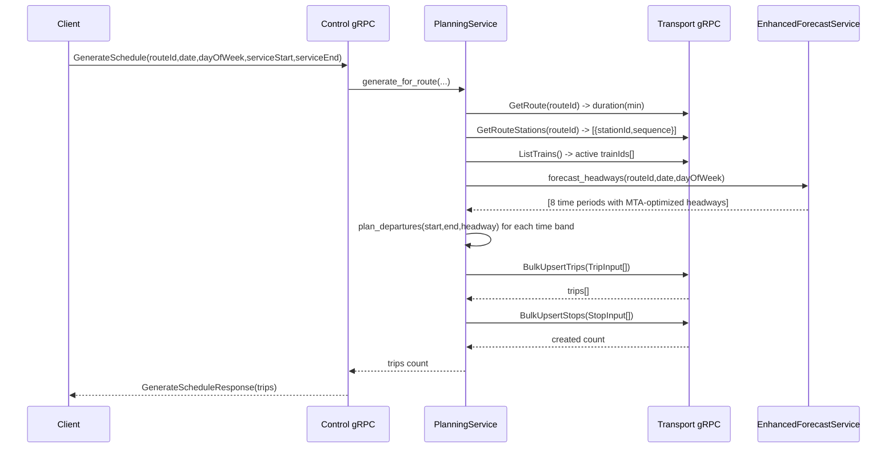

# Control Service — Service README
> Mục đích: Mô tả kiến trúc, API, dữ liệu, vận hành, và tiêu chuẩn chất lượng cho service AI-powered Metro scheduling này.

## 1. Tổng quan
- **Chức năng chính**: AI-powered Metro schedule optimization system sử dụng MTA Prophet ML forecasting và heuristic scheduling algorithms để tạo lịch trình tàu thông minh, thích ứng với nhu cầu hành khách
- **Vai trò trong hệ MetroHCM**: Core scheduling engine - tạo và tối ưu hóa lịch trình tàu cho toàn bộ hệ thống Metro TPHCM với khả năng lập lịch hàng ngày, hàng tuần, hàng tháng và hàng năm.
- **Giao tiếp**: 
  - gRPC ⟷ Transport Service (route data, train fleet, trip persistence)
  - HTTP ⟷ API Gateway (health checks, metrics)
  - OpenTelemetry ⟷ Tempo (distributed tracing)
- **Kiến trúc & pattern**: Layered Architecture với Service Layer, Dependency Injection, Strategy Pattern cho scheduling algorithms, Factory Pattern cho ML models, và Yearly Planning Service cho lập lịch dài hạn

**Lưu đồ chuỗi cho luồng tạo lịch trình AI-optimized:**



## 2. Sơ đồ Class (Class Diagram)



## 2.1 Sơ đồ hệ thống (Mermaid)



## 3. API & Hợp đồng

### 3.1 gRPC endpoints

| Method | RPC | Mô tả | Request | Response | Status Codes |
| ------ | --- | ----- | ------- | -------- | ------------ |
| GenerateSchedule | control.ControlService/GenerateSchedule | Tạo lịch trình AI-optimized cho 1 route | routeId, date, dayOfWeek, serviceStart, serviceEnd, direction | trips (int32) | OK, INTERNAL |
| GenerateDailySchedules | control.ControlService/GenerateDailySchedules | Tạo lịch trình cho tất cả routes trong ngày | date, dayOfWeek, routeIds[] | trips (int32) | OK, INTERNAL |
| GenerateYearlySchedules | control.ControlService/GenerateYearlySchedules | Tạo lịch trình cho cả năm sử dụng MTA Prophet model | year, routeIds[], serviceStart, serviceEnd | trips (int32) | OK, INTERNAL |
| GenerateQuarterlySchedules | control.ControlService/GenerateQuarterlySchedules | Tạo lịch trình cho quý sử dụng MTA Prophet model | year, quarter, routeIds[], serviceStart, serviceEnd | trips (int32) | OK, INTERNAL |
| GetYearlyScheduleSummary | control.ControlService/GetYearlyScheduleSummary | Lấy tóm tắt lịch trình năm với MTA insights | year, routeId | items[] | OK, INTERNAL |
| Reschedule | control.ControlService/Reschedule | Reschedule real-time (placeholder) | fromTime, horizonMin, affectedRoutes[], reasons[] | tripsAdjusted (int32) | OK, INTERNAL |
| GetPlan | control.ControlService/GetPlan | Lấy plan đã tạo với demo analytics | routeId, date | items[] | OK, INTERNAL |

### 3.2 HTTP endpoints

| Method | Path | Mô tả | Auth | Request | Response | Status Codes |
| ------ | ---- | ----- | ---- | ------- | -------- | ------------ |
| GET | /health | Health check | None | None | {"status":"ok"} | 200 |
| GET | /metrics | Prometheus metrics | None | None | Prometheus format | 200, 500 |

### 3.3 Proto files

* **Vị trí file**: `proto/control.proto`, `proto/transport.proto`
* **Cách build/generate**: 
  ```bash
  python -m grpc_tools.protoc -Iproto \
    --python_out=src/ai_scheduler/proto \
    --grpc_python_out=src/ai_scheduler/proto \
    proto/control.proto proto/transport.proto
  ```
* **Versioning & Compatibility**: Proto3 syntax, backward compatible

### 3.4 Event (Kafka/Queue)

| Topic | Direction | Key | Schema | Semantics | Retry/DLQ |
| ----- | --------- | --- | ------ | --------- | --------- |
| (Không tìm thấy trong repo) | - | - | - | - | - |

## 3.5 Cách model/thuật toán hoạt động (thực tế trong code)

- Thành phần chính:
  - `PlanningService`: điều phối toàn bộ lập lịch cho một tuyến/ngày; gọi Transport-service, gọi dự báo, tạo trips & stops.
  - `YearlyPlanningService`: tạo lịch trình cho cả năm với khả năng lập lịch theo quý và tháng.
  - `HeuristicScheduler`: sinh danh sách giờ xuất phát đều nhau theo `headway` trong các time-band.
  - `EnhancedForecastService`: sử dụng MTA Prophet model với 8 time periods và recommendations từ `mta_subway_prophet_recommendations.json`.
  - `ForecastService`: wrapper service tích hợp Enhanced service với fallback patterns.

- Dòng dữ liệu chi tiết


- MTA Prophet Model Integration:
  - Loads recommendations from `models/mta_subway_prophet_recommendations.json`
  - 8 time periods: early_morning, morning_rush, mid_morning, lunch, afternoon, evening_rush, evening, late_evening
  - Dynamic headways based on day type: high_demand_days (Wed,Thu,Tue), low_demand_days (Sun,Sat), standard (Mon,Fri)
  - Rush hour headways: 2.5min (high), 4.5min (standard), 7min (low)

- Tính toán thời gian:
  - `num_segments = len(routeStations) - 1`
  - `segment_run_time_sec = (route.duration_min * 60) / num_segments`
  - Ga đầu: chỉ có `departureTime`. Ga cuối: chỉ `arrivalTime`.
  - Ga giữa: `arrival = prev + segment_run_time_sec`, `departure = arrival + dwell_sec`.

- Phân công tàu: vòng lặp modulo theo số tàu active (`trainId = trains[idx % len(trains)]`).

- Yearly Planning Features:
  - Auto-generation on startup with marker files to prevent duplicates
  - Quarterly maintenance jobs for schedule adjustments
  - Monthly breakdown with demand distribution tracking
  - MTA insights integration for seasonal patterns

### 3.6 Tham số đầu vào/ra (mapping nhanh)
- Input từ client (gRPC): `routeId`, `date`, `dayOfWeek`, `serviceStart`, `serviceEnd`.
- Env (`settings`): `TRANSPORT_GRPC_HOST|PORT`, `DEFAULT_DWELL_SEC`, `DEFAULT_TURNAROUND_SEC`, `MODEL_DIR`.
- Từ Transport-service: `GetRoute.duration`, `GetRouteStations[]`, `ListTrains()` (lọc `status=='active'`).
- Output: `GenerateScheduleResponse.trips` (số trips đã tạo); thực thể Trips/Stops được lưu qua Transport-service.

## 4. Dữ liệu & Migrations

* **Loại CSDL**: Không có database riêng - sử dụng Transport Service MySQL
* **Dữ liệu chính**: 
  - Prophet ML models (Joblib format): `models/prophet_{routeId}.joblib`
  - Time series data: Synthetic patterns cho training
  - Trip/Stop data: Lưu trong Transport Service
* **Quan hệ & cascade**: N/A - stateless service
* **Seeds/fixtures**: Synthetic Prophet training data
* **Cách chạy migration**: N/A

## 5. Cấu hình & Secrets

### 5.1 Biến môi trường (bảng bắt buộc)

| ENV | Bắt buộc | Giá trị mẫu | Mô tả | Phạm vi |
| --- | -------- | ----------- | ----- | ------- |
| CONTROL_GRPC_HOST | No | 0.0.0.0 | gRPC server host | dev/prod |
| CONTROL_GRPC_PORT | No | 50053 | gRPC server port | dev/prod |
| PORT | No | 8008 | HTTP health server port | dev/prod |
| TRANSPORT_GRPC_HOST | Yes | transport-service | Transport service host | dev/prod |
| TRANSPORT_GRPC_PORT | Yes | 50051 | Transport service port | dev/prod |
| DEFAULT_PEAK_HEADWAY_SEC | No | 360 | Peak hour headway (6 min) | dev/prod |
| DEFAULT_OFFPEAK_HEADWAY_SEC | No | 600 | Off-peak headway (10 min) | dev/prod |
| DEFAULT_DWELL_SEC | No | 40 | Station dwell time | dev/prod |
| DEFAULT_DWELL_BIG_STATION_SEC | No | 75 | Major station dwell time | dev/prod |
| DEFAULT_TURNAROUND_SEC | No | 600 | Train turnaround time | dev/prod |
| MODEL_DIR | No | models | MTA Prophet model storage path | dev/prod |
| INIT_SEED_ON_START | No | true | Generate yearly schedules on startup | dev/prod |
| INIT_SEED_DAYS | No | 1 | Days to seed on startup (fallback) | dev/prod |
| SERVICE_NAME | No | control-service | OpenTelemetry service name | dev/prod |
| SERVICE_VERSION | No | 1.0.0 | OpenTelemetry service version | dev/prod |
| OTLP_ENDPOINT | No | http://tempo:4318/v1/traces | OpenTelemetry endpoint | dev/prod |
| ENVIRONMENT | No | development | Deployment environment | dev/prod |

### 5.2 Profiles

* **dev**: Local development với localhost transport service
* **staging**: Containerized với transport-service hostname
* **prod**: Production với full monitoring và persistence
* **Nguồn secrets**: Environment variables, Docker secrets

## 6. Bảo mật & Tuân thủ

* **AuthN/AuthZ**: Không có authentication - internal service
* **Input validation & sanitize**: gRPC proto validation, basic error handling
* **CORS & CSRF**: N/A - gRPC service
* **Rate limit / Anti-abuse**: ThreadPoolExecutor(max_workers=10)
* **Nhật ký/Audit**: Console logging, structured error messages
* **Lỗ hổng tiềm ẩn & khuyến nghị**: 
  - Cần thêm authentication cho production
  - Cần input validation cho date/time formats
  - Cần rate limiting cho gRPC calls

## 7. Độ tin cậy & Khả dụng

* **Timeouts/Retry/Backoff**: gRPC default timeouts, no retry logic
* **Circuit breaker/Bulkhead**: ThreadPoolExecutor isolation
* **Idempotency**: Daily scheduling với marker files để tránh duplicate
* **Outbox/Saga/Orchestrator**: N/A
* **Khả năng phục hồi sự cố**: 
  - Graceful degradation khi Prophet unavailable
  - Fallback synthetic patterns
  - Error recovery cho transport service failures

## 8. Observability

* **Logging**: Console logging với structured messages
  ```json
  {"level": "INFO", "message": "AI Scheduler: Generating schedule for route tuyen-metro-so-1", "routeId": "tuyen-metro-so-1", "date": "2024-01-15"}
  ```
* **Metrics**: Prometheus metrics qua `/metrics` endpoint
* **Tracing**: OpenTelemetry distributed tracing với Tempo/Jaeger integration
  - Auto-instrumentation cho gRPC server và HTTP requests
  - Custom spans cho scheduling operations
  - Service name: `control-service`, version: `1.0.0`
  - OTLP endpoint: `http://tempo:4318/v1/traces`
* **Healthchecks**: 
  - `/health`: Basic health check
  - gRPC health: Service availability
  - Transport service connectivity check

## 9. Build, Run, Test

### 9.1 Local

```bash
# prerequisites
python 3.11+
pip install -r requirements.txt

# generate gRPC stubs
python -m grpc_tools.protoc -Iproto \
  --python_out=src/ai_scheduler/proto \
  --grpc_python_out=src/ai_scheduler/proto \
  proto/control.proto proto/transport.proto

# fix relative imports in generated files
python - <<'PY'
import io, os
targets = [
    'src/ai_scheduler/proto/control_pb2_grpc.py',
    'src/ai_scheduler/proto/transport_pb2_grpc.py',
]
for fn in targets:
    if os.path.isfile(fn):
        with open(fn, 'r+', encoding='utf-8') as f:
            s = f.read()
            s2 = s.replace('import control_pb2 as', 'from . import control_pb2 as')
            s2 = s2.replace('import transport_pb2 as', 'from . import transport_pb2 as')
            if s2 != s:
                f.seek(0)
                f.write(s2)
                f.truncate()
PY

# run
export PYTHONPATH=src
python src/app.py
```

### 9.2 Docker/Compose

```bash
docker build -t control-service:dev .
docker run --env-file .env -p 8008:8008 control-service:dev
```

### 9.3 Kubernetes/Helm (nếu có)

* (Không tìm thấy trong repo)

### 9.4 Testing & Demo

* **Cách chạy demo**:

  **Docker Development:**
  ```bash
  # Start control-service container
  docker-compose up -d control-service transport-service
  
  # Exec into container for interactive demo
  docker exec -it control-service bash
  cd /app/src/ai_scheduler/examples
  
  # Quick test dynamic headway calculation
  python test_dynamic_demo.py
  
  # Full detailed demo (recommended for presentations)
  python detailed_demand_demo.py
  ```
  
  **Docker Production:**
  ```bash
  # Use production compose file
  docker-compose -f docker-compose.prod.yml up -d control-service
  
  # Exec into production container
  docker exec -it control-service bash
  cd /app/src/ai_scheduler/examples
  python detailed_demand_demo.py
  ```

  **Local Development (without Docker):**
  ```bash
  # Prophet model test
  python -m ai_scheduler.tests.smoke_forecast
  
  # Model pre-training
  python -m ai_scheduler.tests.pretrain
  ```

* **Demo Features**:
  - MTA Prophet model integration với 8 time periods
  - Dynamic headway adjustment (2.5-7 minutes) based on MTA recommendations
  - Yearly schedule generation với quarterly maintenance
  - Real-time scenario testing (rush hour, events, weather)
  - Business impact metrics and ROI analysis
  - Interactive presentation mode cho board meetings
  
* **Key Capabilities**:
  - Auto-generation of yearly schedules on startup
  - Quarterly maintenance jobs for schedule adjustments
  - MTA insights integration for seasonal patterns
  - OpenTelemetry distributed tracing
  - Fallback patterns when MTA model unavailable
  
* **Coverage**: (Không tìm thấy trong repo)

## 10. CI/CD

* **Workflow path**: (Không tìm thấy trong repo)
* **Tagging/Release**: (Không tìm thấy trong repo)
* **Gates**: (Không tìm thấy trong repo)

## 11. Hiệu năng & Quy mô

* **Bottlenecks đã thấy từ code**: 
  - Yearly schedule generation có thể chậm (365 days × multiple routes)
  - Sequential route processing trong daily generation
  - No caching cho MTA model predictions
  - Quarterly maintenance jobs chạy đồng thời
* **Kỹ thuật**: 
  - ThreadPoolExecutor(max_workers=10) cho concurrent gRPC calls
  - MTA Prophet model persistence trong JSON format
  - Fallback patterns khi MTA model unavailable
  - Marker files để tránh duplicate yearly generation
  - OpenTelemetry tracing cho performance monitoring
* **Định hướng benchmark/kịch bản tải**: 
  - 10+ concurrent gRPC calls
  - 50+ routes với 1000+ trips per day
  - Sub-second prediction cho single routes
  - Yearly generation: ~100,000+ trips across all routes
  - Quarterly updates: ~25,000+ trips per quarter

## 12. Rủi ro & Nợ kỹ thuật

* **Danh sách vấn đề hiện tại**:
  - Reschedule method chưa implement (placeholder)
  - GetPlan method chỉ có demo analytics
  - Không có authentication/authorization
  - Không có comprehensive error handling
  - Không có Kafka integration
  - gRPC client auto-instrumentation bị disable do compatibility issues
* **Ảnh hưởng & ưu tiên**:
  - High: Authentication cho production
  - Medium: Complete API implementation (Reschedule, GetPlan)
  - Medium: Fix gRPC client instrumentation
  - Low: Advanced monitoring features
* **Kế hoạch cải thiện**:
  - Implement real-time rescheduling với MTA insights
  - Add comprehensive testing
  - Add authentication middleware
  - Add Kafka event publishing
  - Upgrade opentelemetry-instrumentation-grpc để fix client instrumentation

## 13.1 Docker Demo Setup

* **Quick Start Guide**: [`DOCKER_DEMO_QUICKSTART.md`](DOCKER_DEMO_QUICKSTART.md) - Complete workflow cho Docker environment
* **Detailed Demo Guide**: [`DEMO_GUIDE.md`](DEMO_GUIDE.md) - Comprehensive demo instructions
* **Docker Setup**: [`docker-demo-setup.md`](docker-demo-setup.md) - Technical Docker configuration
* **Validation Script**: [`validate-docker-demo.sh`](validate-docker-demo.sh) - Pre-demo health check

* **5-Minute Setup**:
  ```bash
  # Start services
  docker-compose up -d control-service transport-service
  
  # Validate environment
  bash control-service/validate-docker-demo.sh
  
  # Run demo  
  docker exec -it control-service bash
  cd /app/src/ai_scheduler/examples
  python detailed_demand_demo.py
  ```

## 14. Đưa vào thực tế (checklist triển khai)

### 14.1 Tối thiểu để chạy production
- Cấu hình môi trường:
  - `TRANSPORT_GRPC_HOST`/`PORT` trỏ đúng Transport-service.
  - `DEFAULT_DWELL_SEC`, `DEFAULT_TURNAROUND_SEC` theo tiêu chuẩn vận hành.
  - `MODEL_DIR` có quyền đọc/ghi (nếu dùng Prophet).
- Nâng cao độ tin cậy:
  - Tăng `ThreadPoolExecutor` (nếu có) hoặc chạy multi-replica.
  - Health/metrics được scrape bởi Prometheus, alerting sẵn sàng.
- Bảo mật/cứng hoá:
  - Bổ sung auth/ACL cho gRPC (mTLS hoặc token-based) nếu cần.
  - Validate chặt chẽ `date`, `dayOfWeek`, `serviceStart`/`End`.

### 14.2 Nâng cấp dùng ML thật sự
- MTA Prophet Model Integration đã được implement:
  - `EnhancedForecastService` sử dụng `mta_subway_prophet_recommendations.json`
  - 8 time periods với dynamic headways: 2.5min (high demand), 4.5min (standard), 7min (low demand)
  - Day-type classification: high_demand_days (Wed,Thu,Tue), low_demand_days (Sun,Sat), standard (Mon,Fri)
  - Fallback patterns khi MTA model unavailable
- Quản trị model:
  - MTA recommendations được load từ JSON file trong `MODEL_DIR`
  - Có thể extend để load từ external API hoặc database
  - Theo dõi drift: có thể implement monitoring cho accuracy metrics

### 14.3 Hiệu năng & chi phí
- Cache dữ liệu ít thay đổi trong ngày: `routeStations`, `trains`.
- Batch routes khi `GenerateDailySchedules` (song song hoá per route).
- Giới hạn số departures (ví dụ không vượt 23:00) để tránh trùng.

### 14.4 Quy trình vận hành
- Trước giờ chạy: seed lịch cho ngày hôm sau (`INIT_SEED_ON_START=true`, `INIT_SEED_DAYS=1..n`).
- Yearly planning: Auto-generation on startup với marker files để tránh duplicates.
- Quarterly maintenance: Tự động chạy vào đầu mỗi quý (Jan 1, Apr 1, Jul 1, Oct 1) lúc 2:00 AM.
- Khi thay đổi phương án chạy tàu: gọi `GenerateSchedule` với khung giờ mới.
- Khi có cố/điều chỉnh: triển khai `Reschedule` dựa trên nguyên nhân (`reasons[]`) và phạm vi (`affectedRoutes[]`).
- Monitoring: Sử dụng OpenTelemetry tracing để theo dõi performance và errors.

## 13. Phụ lục

* **Sơ đồ ERD**: N/A - stateless service

* **Bảng mã lỗi chuẩn & cấu trúc response lỗi**:
  ```protobuf
  // gRPC Status Codes
  OK = 0
  INTERNAL = 13
  
  // Error Response Structure
  message ErrorResponse {
    int32 code = 1;
    string message = 2;
    string details = 3;
  }
  ```

* **License & 3rd-party**:
  - MIT License
  - Prophet (Facebook) - BSD License
  - gRPC - Apache 2.0
  - Pandas, NumPy - BSD License
  - OpenTelemetry - Apache 2.0
  - Prometheus Client - Apache 2.0
  - Joblib - BSD License