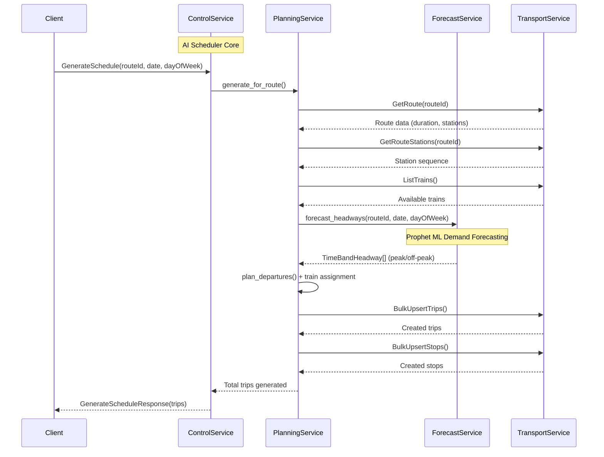
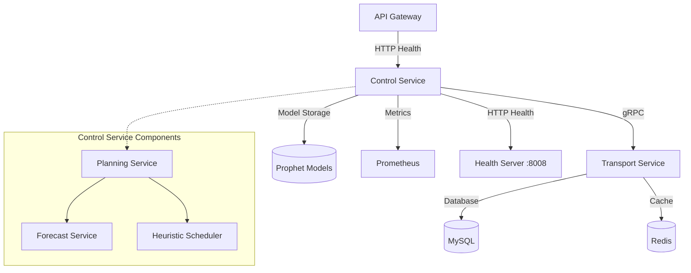

# Control Service — Service README
> Mục đích: Mô tả kiến trúc, API, dữ liệu, vận hành, và tiêu chuẩn chất lượng cho service AI-powered Metro scheduling này.

## 1. Tổng quan
- **Chức năng chính**: AI-powered Metro schedule optimization system sử dụng Prophet ML forecasting và heuristic scheduling algorithms để tạo lịch trình tàu thông minh, thích ứng với nhu cầu hành khách
- **Vai trò trong hệ MetroHCM**: Core scheduling engine - tạo và tối ưu hóa lịch trình tàu cho toàn bộ hệ thống Metro TPHCM
- **Giao tiếp**: 
  - gRPC ⟷ Transport Service (route data, train fleet, trip persistence)
  - HTTP ⟷ API Gateway (health checks, metrics)
  - Event ⟷ (Kafka integration - planned)
- **Kiến trúc & pattern**: Layered Architecture với Service Layer, Dependency Injection, Strategy Pattern cho scheduling algorithms, Factory Pattern cho ML models

**Lưu đồ chuỗi cho luồng tạo lịch trình AI-optimized:**



## 2. Sơ đồ hệ thống (Mermaid)



## 3. API & Hợp đồng

### 3.1 gRPC endpoints

| Method | RPC | Mô tả | Request | Response | Status Codes |
| ------ | --- | ----- | ------- | -------- | ------------ |
| GenerateSchedule | control.ControlService/GenerateSchedule | Tạo lịch trình AI-optimized cho 1 route | routeId, date, dayOfWeek, serviceStart, serviceEnd, direction | trips (int32) | OK, INTERNAL |
| GenerateDailySchedules | control.ControlService/GenerateDailySchedules | Tạo lịch trình cho tất cả routes trong ngày | date, dayOfWeek, routeIds[] | trips (int32) | OK, INTERNAL |
| Reschedule | control.ControlService/Reschedule | Reschedule real-time (placeholder) | fromTime, horizonMin, affectedRoutes[], reasons[] | tripsAdjusted (int32) | OK, INTERNAL |
| GetPlan | control.ControlService/GetPlan | Lấy plan đã tạo (placeholder) | routeId, date | TripWithStopsPlan[] | OK, INTERNAL |

### 3.2 HTTP endpoints

| Method | Path | Mô tả | Auth | Request | Response | Status Codes |
| ------ | ---- | ----- | ---- | ------- | -------- | ------------ |
| GET | /health | Health check | None | None | {"status":"ok"} | 200 |
| GET | /metrics | Prometheus metrics | None | None | Prometheus format | 200, 500 |

### 3.3 Proto files

* **Vị trí file**: `proto/control.proto`, `proto/transport.proto`
* **Cách build/generate**: 
  ```bash
  python -m grpc_tools.protoc -Iproto \
    --python_out=src/ai_scheduler/proto \
    --grpc_python_out=src/ai_scheduler/proto \
    proto/control.proto proto/transport.proto
  ```
* **Versioning & Compatibility**: Proto3 syntax, backward compatible

### 3.4 Event (Kafka/Queue)

| Topic | Direction | Key | Schema | Semantics | Retry/DLQ |
| ----- | --------- | --- | ------ | --------- | --------- |
| (Không tìm thấy trong repo) | - | - | - | - | - |

## 4. Dữ liệu & Migrations

* **Loại CSDL**: Không có database riêng - sử dụng Transport Service MySQL
* **Dữ liệu chính**: 
  - Prophet ML models (Joblib format): `models/prophet_{routeId}.joblib`
  - Time series data: Synthetic patterns cho training
  - Trip/Stop data: Lưu trong Transport Service
* **Quan hệ & cascade**: N/A - stateless service
* **Seeds/fixtures**: Synthetic Prophet training data
* **Cách chạy migration**: N/A

## 5. Cấu hình & Secrets

### 5.1 Biến môi trường (bảng bắt buộc)

| ENV | Bắt buộc | Giá trị mẫu | Mô tả | Phạm vi |
| --- | -------- | ----------- | ----- | ------- |
| CONTROL_GRPC_HOST | No | 0.0.0.0 | gRPC server host | dev/prod |
| CONTROL_GRPC_PORT | No | 50053 | gRPC server port | dev/prod |
| PORT | No | 8008 | HTTP health server port | dev/prod |
| TRANSPORT_GRPC_HOST | Yes | transport-service | Transport service host | dev/prod |
| TRANSPORT_GRPC_PORT | Yes | 50051 | Transport service port | dev/prod |
| DEFAULT_PEAK_HEADWAY_SEC | No | 360 | Peak hour headway (6 min) | dev/prod |
| DEFAULT_OFFPEAK_HEADWAY_SEC | No | 600 | Off-peak headway (10 min) | dev/prod |
| DEFAULT_DWELL_SEC | No | 40 | Station dwell time | dev/prod |
| DEFAULT_DWELL_BIG_STATION_SEC | No | 75 | Major station dwell time | dev/prod |
| DEFAULT_TURNAROUND_SEC | No | 600 | Train turnaround time | dev/prod |
| MODEL_DIR | No | models | Prophet model storage path | dev/prod |
| INIT_SEED_ON_START | No | true | Generate initial schedules on startup | dev/prod |
| INIT_SEED_DAYS | No | 1 | Days to seed on startup | dev/prod |

### 5.2 Profiles

* **dev**: Local development với localhost transport service
* **staging**: Containerized với transport-service hostname
* **prod**: Production với full monitoring và persistence
* **Nguồn secrets**: Environment variables, Docker secrets

## 6. Bảo mật & Tuân thủ

* **AuthN/AuthZ**: Không có authentication - internal service
* **Input validation & sanitize**: gRPC proto validation, basic error handling
* **CORS & CSRF**: N/A - gRPC service
* **Rate limit / Anti-abuse**: ThreadPoolExecutor(max_workers=10)
* **Nhật ký/Audit**: Console logging, structured error messages
* **Lỗ hổng tiềm ẩn & khuyến nghị**: 
  - Cần thêm authentication cho production
  - Cần input validation cho date/time formats
  - Cần rate limiting cho gRPC calls

## 7. Độ tin cậy & Khả dụng

* **Timeouts/Retry/Backoff**: gRPC default timeouts, no retry logic
* **Circuit breaker/Bulkhead**: ThreadPoolExecutor isolation
* **Idempotency**: Daily scheduling với marker files để tránh duplicate
* **Outbox/Saga/Orchestrator**: N/A
* **Khả năng phục hồi sự cố**: 
  - Graceful degradation khi Prophet unavailable
  - Fallback synthetic patterns
  - Error recovery cho transport service failures

## 8. Observability

* **Logging**: Console logging với structured messages
  ```json
  {"level": "INFO", "message": "AI Scheduler: Generating schedule for route tuyen-metro-so-1", "routeId": "tuyen-metro-so-1", "date": "2024-01-15"}
  ```
* **Metrics**: Prometheus metrics qua `/metrics` endpoint
* **Tracing**: Không có distributed tracing
* **Healthchecks**: 
  - `/health`: Basic health check
  - gRPC health: Service availability
  - Transport service connectivity check

## 9. Build, Run, Test

### 9.1 Local

```bash
# prerequisites
python 3.11+
pip install -r requirements.txt

# generate gRPC stubs
python -m grpc_tools.protoc -Iproto \
  --python_out=src/ai_scheduler/proto \
  --grpc_python_out=src/ai_scheduler/proto \
  proto/control.proto proto/transport.proto

# run
export PYTHONPATH=src
python src/app.py
```

### 9.2 Docker/Compose

```bash
docker build -t control-service:dev .
docker run --env-file .env -p 8008:8008 control-service:dev
```

### 9.3 Kubernetes/Helm (nếu có)

* (Không tìm thấy trong repo)

### 9.4 Testing

* **Cách chạy**: 
  ```bash
  # Demo application
  python src/ai_scheduler/examples/ai_scheduler_demo.py
  
  # Prophet model test
  python -m ai_scheduler.tests.smoke_forecast
  
  # Model pre-training
  python -m ai_scheduler.tests.pretrain
  ```
* **Coverage**: (Không tìm thấy trong repo)

## 10. CI/CD

* **Workflow path**: (Không tìm thấy trong repo)
* **Tagging/Release**: (Không tìm thấy trong repo)
* **Gates**: (Không tìm thấy trong repo)

## 11. Hiệu năng & Quy mô

* **Bottlenecks đã thấy từ code**: 
  - Prophet model training có thể chậm
  - Sequential route processing
  - No caching cho model predictions
* **Kỹ thuật**: 
  - ThreadPoolExecutor cho concurrent gRPC calls
  - Joblib model persistence
  - Synthetic fallback patterns
* **Định hướng benchmark/kịch bản tải**: 
  - 10+ concurrent gRPC calls
  - 50+ routes với 1000+ trips per day
  - Sub-second prediction cho single routes

## 12. Rủi ro & Nợ kỹ thuật

* **Danh sách vấn đề hiện tại**:
  - Reschedule và GetPlan methods chưa implement
  - Không có authentication/authorization
  - Không có comprehensive error handling
  - Không có distributed tracing
  - Không có Kafka integration
* **Ảnh hưởng & ưu tiên**:
  - High: Authentication cho production
  - Medium: Complete API implementation
  - Low: Advanced monitoring features
* **Kế hoạch cải thiện**:
  - Implement real-time rescheduling
  - Add comprehensive testing
  - Add authentication middleware
  - Add Kafka event publishing

## 13. Phụ lục

* **Sơ đồ ERD**: N/A - stateless service

* **Bảng mã lỗi chuẩn & cấu trúc response lỗi**:
  ```protobuf
  // gRPC Status Codes
  OK = 0
  INTERNAL = 13
  
  // Error Response Structure
  message ErrorResponse {
    int32 code = 1;
    string message = 2;
    string details = 3;
  }
  ```

* **License & 3rd-party**:
  - MIT License
  - Prophet (Facebook) - BSD License
  - gRPC - Apache 2.0
  - Pandas, NumPy - BSD License