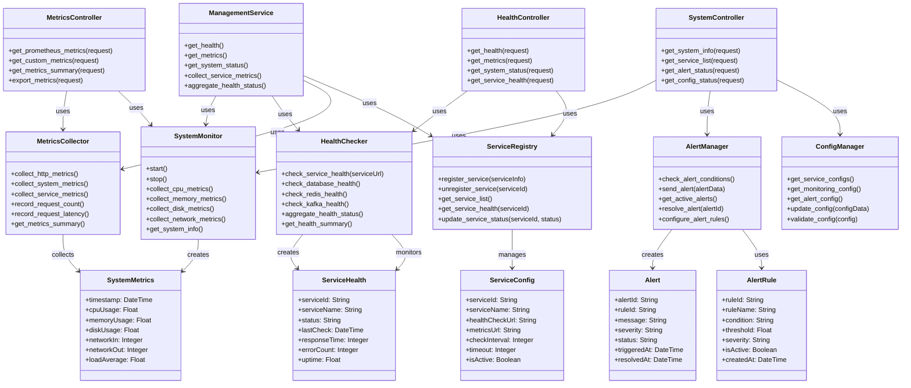
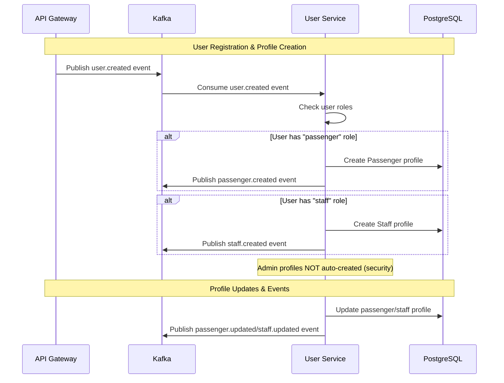

# Management Service — Service README

## 1. Tổng quan
- **Chức năng chính**: System monitoring và metrics collection service cho toàn bộ hệ thống Metro HCM, cung cấp health checks, performance metrics, và system status monitoring
- **Vai trò trong hệ MetroHCM**: Centralized monitoring hub - thu thập và cung cấp metrics từ tất cả services, health monitoring, và system observability
- **Giao tiếp**: 
  - HTTP ⟷ API Gateway (health endpoints, metrics)
  - HTTP ⟷ All Services (health checks, metrics scraping)
  - Prometheus ⟷ Metrics collection
- **Kiến trúc & pattern**: Flask-based monitoring service với Prometheus metrics, system monitoring, health aggregation

## 2. Sơ đồ Class (Class Diagram)



## 3. API & Hợp đồng

### 3.1 REST endpoints

| Method | Path | Mô tả | Auth | Request | Response | Status Codes |
| ------ | ---- | ----- | ---- | ------- | -------- | ------------ |
| GET | `/health` | Health check | None | - | `{status: "ok", service: "management-service"}` | 200 |
| GET | `/metrics` | Prometheus metrics | None | - | Prometheus format | 200 |
| GET | `/system/status` | System status | None | - | System status data | 200 |
| GET | `/services/health` | All services health | None | - | Service health data | 200 |
| GET | `/services/{serviceId}/health` | Specific service health | None | - | Service health data | 200 |
| GET | `/alerts` | Active alerts | None | - | Alert data | 200 |
| GET | `/config` | Service configuration | None | - | Config data | 200 |

## 4. Dữ liệu & Migrations

- **Loại CSDL**: In-memory storage (no persistent database)
- **Dữ liệu chính**: 
  - Service health status (in-memory)
  - System metrics (temporary storage)
  - Alert rules (configuration-based)
- **Quan hệ & cascade**: N/A - stateless service
- **Seeds/fixtures**: Default service configurations
- **Cách chạy migration**: N/A

## 5. Cấu hình & Secrets

### 5.1 Biến môi trường

| ENV | Bắt buộc | Giá trị mẫu | Mô tả | Phạm vi |
| --- | -------- | ----------- | ----- | ------- |
| `NODE_ENV` | No | `production` | Môi trường chạy | dev/staging/prod |
| `PORT` | No | `8008` | Port service | 1-65535 |
| `LOG_LEVEL` | No | `info` | Log level | debug/info/warn/error |
| `METRICS_ENABLED` | No | `true` | Enable metrics collection | Boolean |
| `HEALTH_CHECK_INTERVAL` | No | `30` | Health check interval (seconds) | Integer |
| `SERVICE_TIMEOUT` | No | `5` | Service timeout (seconds) | Integer |

## 6. Bảo mật & Tuân thủ

- **AuthN/AuthZ**: No authentication - internal monitoring service
- **Input validation & sanitize**: Basic input validation
- **CORS & CSRF**: N/A - internal service
- **Rate limit / Anti-abuse**: N/A
- **Nhật ký/Audit**: Structured logging với system events
- **Lỗ hổng tiềm ẩn & khuyến nghị**: 
  - Cần thêm authentication cho production
  - Cần rate limiting cho health check endpoints

## 7. Độ tin cậy & Khả dụng

- **Timeouts/Retry/Backoff**: Configurable timeouts cho service health checks
- **Circuit breaker/Bulkhead**: N/A
- **Idempotency**: N/A
- **Outbox/Saga/Orchestrator**: N/A
- **Khả năng phục hồi sự cố**: Graceful degradation khi services unavailable

## 8. Observability

- **Logging**: Structured logging với system events
- **Metrics**: Prometheus metrics endpoint
- **Tracing**: N/A
- **Healthchecks**: `/health` endpoint

## 9. Build, Run, Test

### 9.1 Local

```bash
# prerequisites
pip install -r requirements.txt

# run
python app/main.py
```

### 9.2 Docker/Compose

```bash
docker build -t management-service .
docker run --env-file .env -p 8008:8008 management-service
```

## 10. Hiệu năng & Quy mô

- **Bottlenecks**: Health check frequency có thể impact performance
- **Kỹ thuật**: Async health checks, metrics caching
- **Định hướng benchmark**: Load testing cho concurrent health checks

## 11. Rủi ro & Nợ kỹ thuật

- **Danh sách vấn đề hiện tại**:
  1. Không có persistent storage cho historical data
  2. Không có authentication
  3. Không có alerting system
- **Ảnh hưởng & ưu tiên**:
  - High: Authentication cho production
  - Medium: Alerting system
  - Low: Historical data storage
- **Kế hoạch cải thiện**:
  1. Implement authentication
  2. Add alerting system
  3. Add historical data storage

## Overview

This service consolidates three previously separate services:
- `admin-service` - Admin user management
- `passenger-service` - Passenger user management  
- `staff-service` - Staff user management

By merging these services, we reduce the operational complexity and resource usage while maintaining all functionality.

### Key Benefits:
- ✅ **Unified Architecture**: Single service reduces deployment complexity
- ✅ **Event-Driven**: Automatic profile creation from Kafka user events  
- ✅ **Role-Based Processing**: Smart handling based on user roles
- ✅ **Backward Compatible**: All original API endpoints maintained
- ✅ **Security Enhanced**: Admin profiles NOT auto-created for security
- ✅ **Performance Optimized**: Shared database connections and resources

## Features

### Admin Management
- Admin profile CRUD operations
- Admin self-service endpoints
- Admin-specific event publishing

### Passenger Management
- Passenger profile CRUD operations
- Passenger self-service endpoints
- Ticket management (add/remove/list tickets)
- Passenger-specific event publishing

### Staff Management
- Staff profile CRUD operations
- Staff self-service endpoints
- Staff status management (active/inactive)
- Staff-specific event publishing

### Unified Event Handling
- Consumes `user.created` events from api-gateway
- Automatically creates appropriate profiles based on user roles
- Publishes domain-specific events for other services

## API Endpoints

### Admin Routes (`/v1/admins`)
- `GET /getAllAdmins` - Get all admins (admin only)
- `GET /getAdminById/:id` - Get admin by ID (admin only)
- `PUT /updateAdmin/:id` - Update admin (admin only)
- `DELETE /deleteAdmin/:id` - Delete admin (admin only)
- `GET /me` - Get current admin profile
- `DELETE /me` - Delete current admin profile

### Passenger Routes (`/v1/passengers`)
- `GET /getallPassengers` - Get all passengers (staff/admin only)
- `GET /getPassengerById/:id` - Get passenger by ID (staff/admin only)
- `POST /createPassenger` - Create passenger (staff/admin only)
- `PUT /updatePassenger/:id` - Update passenger (staff/admin only)
- `DELETE /deletePassenger/:id` - Delete passenger (staff/admin only)
- `GET /me` - Get current passenger profile
- `PUT /me` - Update current passenger profile
- `DELETE /me` - Delete current passenger profile
- `GET /me/tickets` - Get my tickets
- `POST /me/tickets` - Add ticket
- `DELETE /me/tickets/:ticketId` - Remove ticket

### Staff Routes (`/v1/staff`)
- `GET /getAllStaff` - Get all staff (staff/admin only)
- `GET /getStaffById/:id` - Get staff by ID (staff/admin only)
- `POST /createStaff` - Create staff (staff/admin only)
- `PUT /updateStaff/:id` - Update staff (staff/admin only)
- `DELETE /deleteStaff/:id` - Delete staff (staff/admin only)
- `PUT /updateStaffStatus/:id` - Update staff status (admin only)
- `GET /me` - Get current staff profile
- `PUT /me` - Update current staff profile
- `DELETE /me` - Delete current staff profile

## Architecture

```
user-service/
├── src/
│   ├── config/          # Database, logger, etc.
│   ├── models/          # Sequelize models (Admin, Passenger, Staff)
│   ├── controllers/     # HTTP request handlers
│   ├── services/        # Business logic
│   ├── routes/          # Express routes
│   ├── events/          # Kafka event handlers
│   ├── kafka/           # Kafka utilities
│   ├── middlewares/     # Authorization, etc.
│   ├── helpers/         # Utility functions
│   ├── app.js           # Express application
│   └── index.js         # Entry point
├── package.json
├── Dockerfile
└── README.md
```

## Environment Variables

Create a `.env` file in the user-service directory:

```env
# Application Configuration
NODE_ENV=development
PORT=3001
SERVICE_NAME=user-service

# Database Configuration
DB_HOST=postgres
DB_PORT=5432
DB_NAME=postgres
DB_USER=postgres
DB_PASSWORD=postgres

# Kafka Configuration
KAFKA_BROKERS=kafka-1:19092
KAFKA_CLIENT_ID=user-service
KAFKA_GROUP_ID=user-service-group

# Kafka Topics - Consumer (Listen to these events)
USER_CREATED_TOPIC=user.created
USER_UPDATED_TOPIC=user.updated
USER_DELETED_TOPIC=user.deleted

# Kafka Topics - Producer (Publish these events)
ADMIN_CREATED_TOPIC=admin.created
ADMIN_UPDATED_TOPIC=admin.updated
ADMIN_DELETED_TOPIC=admin.deleted
PASSENGER_CREATED_TOPIC=passenger.created
PASSENGER_UPDATED_TOPIC=passenger.updated
PASSENGER_DELETED_TOPIC=passenger.deleted
STAFF_CREATED_TOPIC=staff.created
STAFF_UPDATED_TOPIC=staff.updated
STAFF_DELETED_TOPIC=staff.deleted
STAFF_STATUS_CHANGED_TOPIC=staff.status.changed

# Database Sync Options
DB_FORCE_SYNC=true
DB_ALTER_SYNC=false

# Logging Configuration
LOG_LEVEL=info
LOG_MAX_SIZE=20m
LOG_MAX_FILES=14d

# Security
BCRYPT_ROUNDS=12
```

### Environment Variables Explanation:

#### 📊 **Database Configuration**
- **DB_FORCE_SYNC**: Forces database recreation on startup (development only)
- **DB_ALTER_SYNC**: Allows automatic table alterations (use with caution)

#### 📨 **Event System**
- **Consumer Topics**: Events this service listens to from other services
- **Producer Topics**: Events this service publishes for other services to consume

#### 🔍 **Logging & Monitoring**
- **LOG_LEVEL**: Winston logging level (error, warn, info, debug)
- **LOG_MAX_SIZE**: Maximum log file size before rotation
- **LOG_MAX_FILES**: How long to keep rotated log files

#### 🛡️ **Security**
- **BCRYPT_ROUNDS**: Password hashing rounds (higher = more secure but slower)

## Getting Started

### Development
```bash
# Install dependencies
npm install

# Start development server
npm run dev
```

### Docker
```bash
# Build and run with docker-compose
docker-compose up user-service
```

## Migration from Previous Services

This service replaces:
- `admin-service` (port 3xxx)
- `passenger-service` (port 3001)
- `staff-service` (port 3002)

All API endpoints maintain backward compatibility. Update your API Gateway routing to point to:
- `user-service:3001` instead of individual services

### Migration Benefits:
- ✅ **Resource Optimization**: 3 services → 1 service = 66% reduction in containers
- ✅ **Simplified Deployment**: Single Docker image and configuration
- ✅ **Unified Database**: Shared connections and transactions
- ✅ **Event Consolidation**: Single Kafka consumer for all user events
- ✅ **Maintenance Reduction**: One codebase instead of three

## Event Flow



### Event Processing Logic:

1. **User Registration**: API Gateway publishes `user.created` event
2. **Role-Based Processing**: User Service creates profiles based on user roles:
   - `passenger` role → Creates Passenger profile
   - `staff` role → Creates Staff profile
   - `admin` role → **NOT auto-created for security**
3. **Event Publishing**: Service publishes domain-specific events for other services
4. **Profile Updates**: All CRUD operations publish corresponding events

### Security Note:
Admin profiles are **never** automatically created from user registration events. Admin accounts must be manually created by existing administrators for security reasons.

## Health Check & Monitoring

### Endpoints:
- **Health Check**: `GET /metrics` - Service health status
- **Database Check**: Included in health endpoint
- **Kafka Check**: Included in health endpoint

### Monitoring Features:
- **Winston Logging**: Structured logging with daily rotation
- **Error Tracking**: Comprehensive error handling with correlation IDs
- **Performance Metrics**: Request timing and database query performance
- **Event Tracking**: Kafka message processing status 