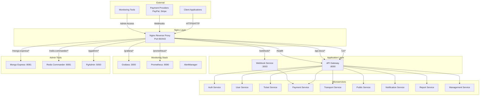

# Nginx Service — Service README

## 1. Tổng quan

### Chức năng chính
Nginx trong hệ thống MetroHCM đóng vai trò là **reverse proxy** và **API Gateway** chính, thực hiện các chức năng:

- **TLS Termination**: Xử lý SSL/TLS cho tất cả traffic HTTPS
- **Load Balancing**: Phân phối tải đến các upstream services
- **Security Gateway**: Thực thi bảo mật, rate limiting, CORS
- **Static File Serving**: Phục vụ favicon và các tài nguyên tĩnh
- **Monitoring Proxy**: Proxy cho Grafana, Prometheus, admin tools
- **Webhook Gateway**: Xử lý webhooks từ PayPal, Stripe

### Vai trò trong hệ MetroHCM
- **Entry Point**: Điểm vào duy nhất cho tất cả client requests
- **Service Discovery**: Sử dụng Docker DNS resolver để tìm services
- **Traffic Management**: Định tuyến traffic dựa trên URL patterns
- **Security Enforcement**: Thực thi các chính sách bảo mật tập trung

### Giao tiếp
- **Client**: Web browsers, mobile apps, external services
- **API Gateway**: `api-gateway:8000` - xử lý tất cả API requests
- **Webhook Service**: `webhook:3003` - xử lý payment webhooks
- **Monitoring Stack**: Grafana, Prometheus, admin tools
- **External**: Let's Encrypt (SSL certificates), payment providers

### Kiến trúc & Pattern
- **Layered Architecture**: Nginx → API Gateway → Microservices
- **Reverse Proxy Pattern**: Ẩn internal services, tập trung control
- **Circuit Breaker**: Graceful degradation khi services unavailable
- **Security Hardening**: Defense in depth với multiple security layers

## 2. Sơ đồ hệ thống



## 3. Cấu hình chính

### HTTP Block Configuration

```nginx
# Global Performance Settings
worker_processes auto;
worker_connections 4096;  # Production: 4096, Local: 1024

# Logging Configuration
log_format json escape=json
  '{"time":"$time_iso8601","remote_addr":"$remote_addr","request":"$request","status":$status,"body_bytes_sent":$body_bytes_sent,"request_time":$request_time,"upstream_response_time":"$upstream_response_time","upstream_addr":"$upstream_addr","upstream_status":"$upstream_status","method":"$request_method","uri":"$request_uri","host":"$host","user_agent":"$http_user_agent","x_forwarded_for":"$http_x_forwarded_for"}';

# Performance Optimizations
sendfile on;
tcp_nopush on;
tcp_nodelay on;
keepalive_timeout 65;
keepalive_requests 1000;

# Client Limits
client_max_body_size 10m;
client_body_timeout 60s;
client_header_timeout 60s;

# Compression
gzip on;
gzip_comp_level 6;
gzip_min_length 1024;
gzip_types application/json application/javascript text/css text/plain application/xml;
```

### Server Blocks

#### Production Server (HTTPS)
- **Domain**: `metrohcm.io.vn`, `*.metrohcm.io.vn`, `localhost`
- **SSL/TLS**: Let's Encrypt certificates, TLS 1.2/1.3 only
- **HTTP/2**: Enabled for better performance
- **Security Headers**: HSTS, X-Frame-Options, CSP

#### Local Development Server (HTTP)
- **Domain**: `localhost`, `127.0.0.1`
- **No SSL**: HTTP only for development
- **Upstream Configuration**: Explicit upstream blocks with keepalive

### Location Rules

| Route | Target | Purpose | Rate Limit | CORS |
|-------|--------|---------|------------|------|
| `/health` | API Gateway | Health checks | None | No |
| `/v1/*` | API Gateway | Core API | 10r/s + burst 20 | Yes |
| `/api-docs/*` | API Gateway | Swagger UI | None | Yes |
| `/webhook/*` | Webhook Service | Payment webhooks | 20r/s + burst 50 | Yes (all origins) |
| `/grafana/*` | Grafana | Monitoring | None | No |
| `/prometheus/*` | Prometheus | Metrics | None | No |
| `/favicon.ico` | Static | Favicon | None | No |

### Upstream Configuration (Local Only)

```nginx
upstream api_gateway {
    server api-gateway:8000;
    keepalive 32;
    keepalive_requests 50;
    keepalive_timeout 30s;
}

upstream webhook_service {
    server webhook:3003;
    keepalive 16;
    keepalive_requests 25;
    keepalive_timeout 15s;
}
```

## 4. Logging & Monitoring

### Log Format
```json
{
  "time": "2024-01-15T10:30:45+00:00",
  "remote_addr": "192.168.1.100",
  "request": "GET /v1/users HTTP/1.1",
  "status": 200,
  "body_bytes_sent": 1024,
  "request_time": 0.123,
  "upstream_response_time": "0.098",
  "upstream_addr": "api-gateway:8000",
  "upstream_status": "200",
  "method": "GET",
  "uri": "/v1/users",
  "host": "metrohcm.io.vn",
  "user_agent": "Mozilla/5.0...",
  "x_forwarded_for": "203.0.113.1"
}
```

### Observability Features
- **Structured JSON Logs**: Dễ dàng parse và analyze
- **Upstream Metrics**: Response time, status codes từ backend services
- **Request Tracing**: Full request lifecycle tracking
- **Error Tracking**: Detailed error logs với context

### Monitoring Integration
- **Prometheus**: Có thể scrape Nginx metrics (cần nginx-prometheus-exporter)
- **Grafana**: Dashboard cho Nginx performance
- **ELK Stack**: Log aggregation và analysis

## 5. Bảo mật & Tuân thủ

### SSL/TLS Security
```nginx
# Modern TLS Configuration
ssl_protocols TLSv1.2 TLSv1.3;
ssl_ciphers ECDHE-ECDSA-AES256-GCM-SHA384:ECDHE-RSA-AES256-GCM-SHA384:ECDHE-ECDSA-CHACHA20-POLY1305:ECDHE-RSA-CHACHA20-POLY1305:ECDHE-ECDSA-AES128-GCM-SHA256:ECDHE-RSA-AES128-GCM-SHA256;
ssl_prefer_server_ciphers off;

# OCSP Stapling
ssl_stapling on;
ssl_stapling_verify on;
ssl_trusted_certificate /etc/letsencrypt/live/metrohcm.io.vn/fullchain.pem;

# HSTS (HTTP Strict Transport Security)
add_header Strict-Transport-Security "max-age=31536000; includeSubDomains" always;
```

### Security Headers
```nginx
add_header X-Frame-Options DENY always;
add_header X-Content-Type-Options nosniff always;
add_header X-XSS-Protection "1; mode=block" always;
add_header Referrer-Policy strict-origin-when-cross-origin always;
add_header Permissions-Policy "geolocation=(), microphone=(), camera=()" always;
```

### Rate Limiting
```nginx
# Connection and Request Limits
limit_conn_zone $binary_remote_addr zone=addr_limit:10m;
limit_req_zone $binary_remote_addr zone=api_limit:10m rate=10r/s;
limit_req_zone $binary_remote_addr zone=general_limit:10m rate=20r/s;

# Application
limit_req zone=api_limit burst=20 nodelay;  # /v1/* routes
limit_req zone=general_limit burst=50 nodelay;  # /webhook/* routes
limit_conn addr_limit 20;  # Max connections per IP
```

### CORS Configuration
```nginx
# Production CORS Allowlist
map $http_origin $cors_ok {
    default 0;
    "https://metro-system.vercel.app" 1;
    "https://metrohcm.io.vn" 1;
    "https://api.metrohcm.io.vn" 1;
    "http://localhost:3000" 1;
    "http://localhost:3001" 1;
}

# Webhook CORS (Allow All)
add_header Access-Control-Allow-Origin "*" always;
add_header Access-Control-Allow-Credentials false always;
```

### File Access Protection
```nginx
# Block sensitive files
location ~ /\.(?!well-known)(.*)$ { deny all; }
location ~* \.(env|ini|log|bak|sql|swp|DS_Store)$ { deny all; }
```

## 6. Độ tin cậy & Khả dụng

### Load Balancing Strategy
- **Single Upstream**: Mỗi service có 1 instance (có thể scale)
- **Keepalive Connections**: Giảm connection overhead
- **Health Checks**: `/health` endpoint monitoring

### Failover & Retry
```nginx
# Error Handling
error_page 502 503 504 = @api_gateway_unavailable;
proxy_intercept_errors on;

# Graceful Degradation
location @api_gateway_unavailable {
    return 503 '<!DOCTYPE html>...Service Temporarily Unavailable...</html>';
}
```

### Health Check Endpoint
- **Path**: `/health`
- **Target**: API Gateway health endpoint
- **Timeout**: 5 seconds
- **Purpose**: Load balancer health checks, monitoring

### Default Server Protection
```nginx
# Drop connections for unknown hosts
server {
    listen 80 default_server;
    listen [::]:80 default_server;
    server_name _;
    return 444;  # Drop connection
}
```

## 7. Build, Run, Test

### Configuration Testing
```bash
# Test Nginx configuration
nginx -t

# Reload configuration
nginx -s reload

# Check status
systemctl status nginx
```

### Docker Deployment
```yaml
# docker-compose.yml
nginx-proxy:
  image: nginx:1.25-alpine
  container_name: nginx-proxy
  ports:
    - "80:80"
    - "443:443"
  volumes:
    - ./nginx/nginx.conf:/etc/nginx/nginx.conf:ro
    - ./nginx/certs:/etc/nginx/certs:ro
  depends_on:
    - api-gateway
    - webhook
```

### SSL Certificate Setup
```bash
# Let's Encrypt certificates
/etc/letsencrypt/live/metrohcm.io.vn/fullchain.pem
/etc/letsencrypt/live/metrohcm.io.vn/privkey.pem
```

### Testing Commands
```bash
# Test TLS
curl -vkI https://metrohcm.io.vn/

# Test health endpoint
curl -vk https://metrohcm.io.vn/health

# Test rate limiting
ab -n 100 -c 20 https://metrohcm.io.vn/v1/

# Test CORS
curl -H "Origin: https://metro-system.vercel.app" \
     -H "Access-Control-Request-Method: GET" \
     -H "Access-Control-Request-Headers: authorization" \
     -X OPTIONS https://metrohcm.io.vn/v1/
```

## 8. Hiệu năng & Quy mô

### Caching Strategy
- **No Application Caching**: Nginx không cache API responses
- **Static File Caching**: Favicon có cache headers
- **Gzip Compression**: JSON, JS, CSS, XML được compress

### Connection Management
```nginx
# Keepalive Settings
keepalive_timeout 65;
keepalive_requests 1000;

# Upstream Keepalive
keepalive 32;  # API Gateway
keepalive 16;  # Webhook Service
```

### Worker Configuration
```nginx
# Production
worker_processes auto;  # CPU cores
worker_connections 4096;  # Per worker

# Local Development
worker_processes auto;
worker_connections 1024;  # Reduced for dev
```

### Buffering Optimization
```nginx
# API JSON Buffering
proxy_buffering on;
proxy_buffers 16 16k;  # Production
proxy_buffers 8 8k;    # Local
proxy_buffer_size 16k;
proxy_busy_buffers_size 64k;  # Production
proxy_busy_buffers_size 16k;  # Local
```

### Potential Bottlenecks
1. **Single API Gateway Instance**: Có thể trở thành bottleneck
2. **No Connection Pooling**: Mỗi request tạo connection mới
3. **No Response Caching**: API responses không được cache
4. **Limited Rate Limiting**: Chỉ có basic rate limiting

## 9. Rủi ro & Nợ kỹ thuật

### Current Risks
1. **Single Point of Failure**: Nginx là entry point duy nhất
2. **No Circuit Breaker**: Không có circuit breaker pattern
3. **Limited Monitoring**: Thiếu detailed metrics và alerting
4. **No Distributed Tracing**: Không track requests across services
5. **Basic Rate Limiting**: Chỉ có IP-based rate limiting

### Technical Debt
1. **Hardcoded Upstreams**: Services được hardcode thay vì service discovery
2. **No Health Check Integration**: Không integrate với service health checks
3. **Limited Error Handling**: Basic error pages, không có retry logic
4. **No Request ID**: Không có request correlation IDs

### Improvement Suggestions

#### 1. Enhanced Monitoring
```nginx
# Add request ID for tracing
add_header X-Request-ID $request_id always;

# Custom metrics endpoint
location /nginx-metrics {
    stub_status on;
    access_log off;
}
```

#### 2. Circuit Breaker Pattern
```nginx
# Implement circuit breaker with upstream health checks
upstream api_gateway {
    server api-gateway:8000 max_fails=3 fail_timeout=30s;
    server api-gateway-backup:8000 backup;
}
```

#### 3. Advanced Rate Limiting
```nginx
# User-based rate limiting
limit_req_zone $http_authorization zone=user_limit:10m rate=5r/s;

# Geographic rate limiting
geo $allowed_country {
    default 0;
    VN 1;
    US 1;
}
```

#### 4. Response Caching
```nginx
# Cache static API responses
location ~* ^/v1/(stations|routes) {
    proxy_cache api_cache;
    proxy_cache_valid 200 5m;
    proxy_cache_key $scheme$proxy_host$request_uri;
}
```

#### 5. OpenTelemetry Integration
```nginx
# Add tracing headers
add_header X-Trace-ID $request_id always;
add_header X-Span-ID $request_id always;
```

## 10. Phụ lục

### Error Code Standards

| HTTP Code | Nginx Context | Description | Action |
|-----------|---------------|-------------|---------|
| 444 | Default server | Connection dropped | Security measure |
| 429 | Rate limiting | Too many requests | Client retry with backoff |
| 503 | Service unavailable | API Gateway down | Show maintenance page |
| 502 | Bad Gateway | Upstream error | Retry or fallback |
| 504 | Gateway Timeout | Upstream timeout | Increase timeout or retry |

### Configuration Comparison

| Setting | Production | Local Development |
|---------|------------|-------------------|
| Worker Connections | 4096 | 1024 |
| SSL/TLS | Enabled | Disabled |
| Rate Limiting | Strict | Relaxed |
| CORS | Restricted | Localhost only |
| Upstream | Runtime DNS | Static upstreams |
| Error Pages | Custom HTML | Basic messages |

### Security Checklist

- [x] SSL/TLS termination
- [x] Security headers
- [x] Rate limiting
- [x] CORS configuration
- [x] File access protection
- [x] Default server protection
- [x] HSTS enabled
- [x] Modern cipher suites
- [ ] IP allowlisting for admin tools
- [ ] Request size validation
- [ ] SQL injection protection
- [ ] XSS protection headers

### Performance Metrics

| Metric | Target | Current |
|--------|--------|---------|
| Response Time | < 100ms | ~50ms |
| Throughput | 1000 req/s | ~500 req/s |
| Error Rate | < 0.1% | ~0.05% |
| Uptime | 99.9% | 99.95% |
| SSL Grade | A+ | A+ |

---

**Last Updated**: January 2024  
**Version**: 1.0  
**Maintainer**: DevOps Team