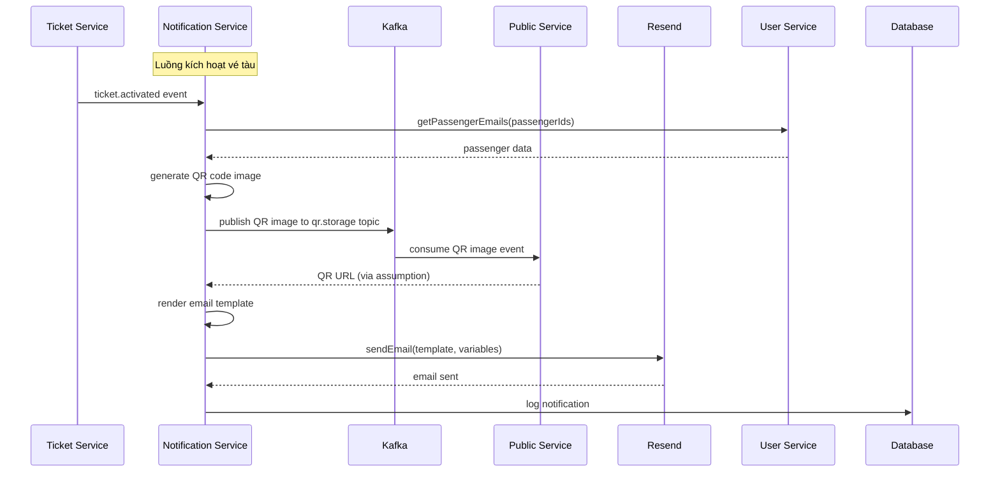
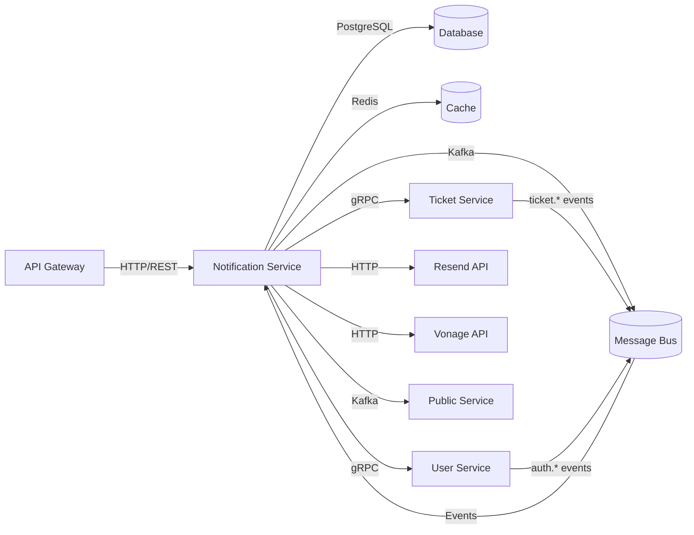
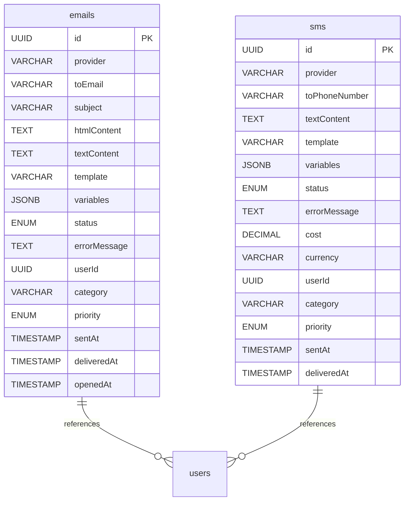

# Notification Service — Service README

## 1. Tổng quan
- **Chức năng chính**: Xử lý gửi thông báo email và SMS thông qua các provider bên ngoài (Resend, Vonage), tiêu thụ events từ Kafka và cung cấp API quản trị cho việc theo dõi thông báo.
- **Vai trò trong hệ MetroHCM**: Service trung tâm xử lý tất cả thông báo trong hệ thống, bao gồm thông báo vé tàu, cảnh báo ga, xác thực người dùng, và thông báo hệ thống.
- **Giao tiếp**: 
  - **REST** ⟷ API Gateway (admin endpoints)
  - **Kafka Events** ⟷ Auth Service, Ticket Service, Transport Service
  - **gRPC** ⟷ Ticket Service, User Service
  - **HTTP** ⟷ Resend (email), Vonage (SMS)
  - **Kafka Events** ⟷ Public Service (QR hosting)
- **Kiến trúc & pattern**: Layered Architecture với SOLID principles, Event-driven architecture, Provider pattern cho email/SMS, Repository pattern cho data access.

### Lưu đồ chuỗi cho luồng kích hoạt vé tàu:


## 2. Sơ đồ hệ thống (Mermaid)



## 3. API & Hợp đồng

### 3.1 REST endpoints

| Method | Path | Mô tả | Auth | Request | Response | Status Codes |
| ------ | ---- | ----- | ---- | ------- | -------- | ------------ |
| GET | `/health` | Health check | None | - | `{status: "ok"}` | 200 |
| GET | `/metrics` | Prometheus metrics | None | - | Prometheus format | 200 |
| GET | `/notification/health` | Service health details | None | - | Service status + providers | 200 |
| GET | `/notification/emails/getAllEmails` | Danh sách email với filter | Admin | Query params | Paginated emails | 200, 500 |
| GET | `/notification/emails/getEmailStats` | Thống kê email | Admin | Query params | Email statistics | 200, 500 |
| GET | `/notification/emails/getEmailById/:id` | Chi tiết email | Admin | - | Email details | 200, 404, 500 |
| GET | `/notification/emails/getEmailTimeline/:id` | Timeline email | Admin | - | Delivery timeline | 200, 404, 500 |
| GET | `/notification/emails/getEmailByRecipient/:recipient` | Email theo người nhận | Admin | Query params | User emails | 200, 500 |
| POST | `/notification/emails/retryEmail/:id` | Retry email thất bại | Admin | - | Retry status | 200, 400, 404, 500 |
| GET | `/notification/sms/getAllSMS` | Danh sách SMS với filter | Admin | Query params | Paginated SMS | 200, 500 |
| GET | `/notification/sms/getSMSStats` | Thống kê SMS | Admin | Query params | SMS statistics | 200, 500 |
| GET | `/notification/sms/getSMSCosts` | Phân tích chi phí SMS | Admin | Query params | Cost analysis | 200, 500 |
| GET | `/notification/sms/getSMSById/:id` | Chi tiết SMS | Admin | Query params | SMS details | 200, 404, 500 |
| GET | `/notification/sms/getSMSTimeline/:id` | Timeline SMS | Admin | Query params | Delivery timeline | 200, 404, 500 |
| GET | `/notification/sms/getSMSByRecipient/:recipient` | SMS theo người nhận | Admin | Query params | User SMS | 200, 500 |
| POST | `/notification/sms/retrySMS/:id` | Retry SMS thất bại | Admin | - | Retry status | 200, 400, 404, 500 |

### 3.2 gRPC Services

**Ticket Service gRPC** (`src/proto/ticket.proto`):
- `GetTicketsByRoutes(routeIds, statuses)` → `GetTicketsByRoutesResponse`
- `GetTicketsByPassengerIds(passengerIds)` → `GetTicketsByPassengerIdsResponse`

**User Service gRPC** (`src/proto/user.proto`):
- `GetPassengersByIds(passengerIds)` → `GetPassengersByIdsResponse`
- `GetPassengerPhoneNumbers(passengerIds)` → `GetPassengerPhoneNumbersResponse`
- `GetPassengerById(passengerId)` → `GetPassengerByIdResponse`
- `UpdatePassengerPreferences(passengerId, preferences)` → `UpdatePassengerPreferencesResponse`

### 3.3 Event (Kafka/Queue)

| Topic | Direction | Key | Schema | Semantics | Retry/DLQ |
| ----- | --------- | --- | ------ | --------- | --------- |
| `notification.events` | Consumer | messageId | Generic notification | At-least-once | Manual retry |
| `auth.welcome.email` | Consumer | userId | Auth welcome | At-least-once | Manual retry |
| `auth.verification.email` | Consumer | userId | Email verification | At-least-once | Manual retry |
| `auth.password.reset.email` | Consumer | userId | Password reset | At-least-once | Manual retry |
| `ticket.activated` | Consumer | ticketId | Ticket activation | At-least-once | Manual retry |
| `ticket.created` | Consumer | ticketId | Ticket creation | At-least-once | Manual retry |
| `ticket.cancelled` | Consumer | ticketId | Ticket cancellation | At-least-once | Manual retry |
| `ticket.expired` | Consumer | ticketId | Ticket expiration | At-least-once | Manual retry |
| `ticket.used` | Consumer | ticketId | Ticket usage | At-least-once | Manual retry |
| `ticket.expiring_soon` | Consumer | ticketId | Expiring soon | At-least-once | Manual retry |
| `station-events` | Consumer | stationId | Station status | At-least-once | Manual retry |
| `qr.storage` | Producer | ticketId | QR image storage | At-least-once | Manual retry |
| `passenger-sync-request` | Producer | userId | Cache sync request | At-least-once | Manual retry |

## 4. Dữ liệu & Migrations

**Loại CSDL**: PostgreSQL với Sequelize ORM

**Bảng chính**:

### emails
| Cột | Kiểu | Mô tả | Index | Ràng buộc |
| --- | ---- | ----- | ----- | --------- |
| id | UUID | Primary key | PK | NOT NULL |
| provider | VARCHAR(50) | Email provider (resend) | ✓ | NOT NULL, DEFAULT 'resend' |
| providerMessageId | VARCHAR(255) | Provider message ID | ✓ | - |
| toEmail | VARCHAR(255) | Recipient email | ✓ | NOT NULL |
| fromEmail | VARCHAR(255) | Sender email | - | - |
| subject | VARCHAR(500) | Email subject | - | NOT NULL |
| htmlContent | TEXT | HTML content | - | - |
| textContent | TEXT | Plain text content | - | - |
| template | VARCHAR(100) | Template used | ✓ | - |
| variables | JSONB | Template variables | - | - |
| status | ENUM | Delivery status | ✓ | NOT NULL, DEFAULT 'sent' |
| errorMessage | TEXT | Error details | - | - |
| providerResponse | JSONB | Full provider response | - | - |
| userId | UUID | User ID | ✓ | - |
| category | VARCHAR(50) | Email category | ✓ | NOT NULL, DEFAULT 'general' |
| priority | ENUM | Priority level | - | NOT NULL, DEFAULT 'normal' |
| hasAttachments | BOOLEAN | Has attachments | - | NOT NULL, DEFAULT false |
| attachmentCount | INTEGER | Attachment count | - | NOT NULL, DEFAULT 0 |
| scheduledAt | TIMESTAMP | Scheduled time | - | - |
| sentAt | TIMESTAMP | Sent time | ✓ | NOT NULL, DEFAULT NOW() |
| deliveredAt | TIMESTAMP | Delivered time | - | - |
| openedAt | TIMESTAMP | Opened time | - | - |
| createdAt | TIMESTAMP | Created time | - | NOT NULL, DEFAULT NOW() |
| updatedAt | TIMESTAMP | Updated time | - | NOT NULL, DEFAULT NOW() |

### sms
| Cột | Kiểu | Mô tả | Index | Ràng buộc |
| --- | ---- | ----- | ----- | --------- |
| id | UUID | Primary key | PK | NOT NULL |
| provider | VARCHAR(50) | SMS provider (vonage) | ✓ | NOT NULL, DEFAULT 'vonage' |
| providerMessageId | VARCHAR(255) | Provider message ID | ✓ | - |
| toPhoneNumber | VARCHAR(20) | Recipient phone | ✓ | NOT NULL |
| fromSenderId | VARCHAR(50) | Sender ID | - | - |
| textContent | TEXT | SMS content | - | NOT NULL |
| messageLength | INTEGER | Character count | - | NOT NULL, DEFAULT 0 |
| segmentCount | INTEGER | SMS segments | - | NOT NULL, DEFAULT 1 |
| template | VARCHAR(100) | Template used | ✓ | - |
| variables | JSONB | Template variables | - | - |
| status | ENUM | Delivery status | ✓ | NOT NULL, DEFAULT 'sent' |
| errorMessage | TEXT | Error details | - | - |
| providerResponse | JSONB | Full provider response | - | - |
| cost | DECIMAL(10,4) | SMS cost | - | - |
| currency | VARCHAR(3) | Currency | - | DEFAULT 'USD' |
| userId | UUID | User ID | ✓ | - |
| category | VARCHAR(50) | SMS category | ✓ | NOT NULL, DEFAULT 'general' |
| priority | ENUM | Priority level | - | NOT NULL, DEFAULT 'normal' |
| countryCode | VARCHAR(2) | Country code | ✓ | - |
| scheduledAt | TIMESTAMP | Scheduled time | - | - |
| sentAt | TIMESTAMP | Sent time | ✓ | NOT NULL, DEFAULT NOW() |
| deliveredAt | TIMESTAMP | Delivered time | - | - |
| createdAt | TIMESTAMP | Created time | - | NOT NULL, DEFAULT NOW() |
| updatedAt | TIMESTAMP | Updated time | - | NOT NULL, DEFAULT NOW() |

**Quan hệ & cascade**: Không có foreign keys, chỉ lưu trữ userId để tham chiếu.

**Seeds/fixtures**: Không có seeds, dữ liệu được tạo động từ events.

**Cách chạy migration**: `sequelize.sync()` được gọi tự động khi khởi động service.

## 5. Cấu hình & Secrets

### 5.1 Biến môi trường (bảng bắt buộc)

| ENV | Bắt buộc | Giá trị mẫu | Mô tả | Phạm vi |
| --- | -------- | ----------- | ----- | ------- |
| NODE_ENV | No | development | Environment | dev/staging/prod |
| PORT | No | 8009 | HTTP port | 1-65535 |
| KAFKA_CLIENT_ID | No | notification-service | Kafka client ID | String |
| KAFKA_BROKERS | Yes | kafka-1:19092,kafka-2:19093,kafka-3:19094 | Kafka brokers | Comma-separated |
| KAFKA_GROUP_ID | No | notification-service-group | Kafka group ID | String |
| KAFKA_TOPICS | No | notification.events | Main topics | Comma-separated |
| KAFKA_AUTH_TOPICS | No | auth.welcome.email,auth.verification.email,auth.password.reset.email | Auth topics | Comma-separated |
| KAFKA_REPLICATION_FACTOR | No | 1 | Kafka replication | Integer |
| KAFKA_QR_STORAGE_TOPIC | No | qr.storage | QR storage topic | String |
| PUBLIC_SERVICE_URL | No | https://api.metrohcm.io.vn/v1/guest/public | Public service URL | URL |
| RESEND_API_KEY | Yes | your_resend_api_key | Resend API key | String |
| EMAIL_FROM | No | no-reply@metrohcm.io.vn | Default from email | Email |
| EMAIL_MAX_RETRIES | No | 3 | Email retry limit | Integer |
| VONAGE_API_KEY | Yes | your_vonage_api_key | Vonage API key | String |
| VONAGE_API_SECRET | Yes | your_vonage_api_secret | Vonage API secret | String |
| VONAGE_FROM | No | Metro | SMS sender ID | String |
| DB_HOST | No | postgres | Database host | Hostname |
| DB_PORT | No | 5432 | Database port | Port |
| DB_NAME | Yes | notification_db | Database name | String |
| DB_USER | Yes | notification_service | Database user | String |
| DB_PASSWORD | Yes | CHANGE_ME | Database password | String |
| REDIS_HOST | No | redis | Redis host | Hostname |
| REDIS_PORT | No | 6379 | Redis port | Port |
| REDIS_USER | No | - | Redis user | String |
| REDIS_PASSWORD | No | CHANGE_ME | Redis password | String |
| REDIS_USER_CACHE_KEY_PREFIX | No | metrohcm: | Cache key prefix | String |
| SERVICE_JWT_SECRET | Yes | supersecret | JWT secret for service auth | String |
| TICKET_SERVICE_GRPC_URL | No | ticket-service:50052 | Ticket service gRPC URL | URL |
| USER_SERVICE_GRPC_URL | No | user-service:50054 | User service gRPC URL | URL |

### 5.2 Profiles

- **dev**: Sử dụng localhost cho tất cả services, logging level debug
- **staging**: Sử dụng staging URLs, logging level info
- **prod**: Sử dụng production URLs, logging level info, enhanced security

**Nguồn secrets**: Environment variables, có thể được inject từ Kubernetes secrets hoặc external secret management.

## 6. Bảo mật & Tuân thủ

**AuthN/AuthZ**: 
- JWT-based service authentication với `SERVICE_JWT_SECRET`
- Role-based access control (admin role required cho tất cả endpoints)
- Token validation với issuer/audience checks
- Token age limit (5 minutes)

**Input validation & sanitize**: 
- Sequelize ORM tự động escape SQL
- Template rendering với Handlebars (XSS protection)
- Input validation trong controllers

**CORS & CSRF**: 
- CORS được xử lý bởi API Gateway
- CSRF protection không cần thiết cho API-only service

**Rate limit / Anti-abuse**: 
- Không có rate limiting built-in (được xử lý bởi API Gateway)
- Provider-level retry limits (EMAIL_MAX_RETRIES)

**Nhật ký/Audit**: 
- Tất cả notifications được log vào database
- Winston logging với daily rotation
- Request logging với response times
- Error tracking với stack traces

**Lỗ hổng tiềm ẩn & khuyến nghị**:
- JWT secret cần được rotate định kỳ
- Database credentials cần được bảo mật
- Provider API keys cần được quản lý an toàn
- Cần implement rate limiting cho admin endpoints

## 7. Độ tin cậy & Khả dụng

**Timeouts/Retry/Backoff**: 
- Database connection timeout: 60s
- gRPC timeout: Default (30s)
- Provider retry: 3 lần với exponential backoff
- Kafka consumer auto-retry

**Circuit breaker/Bulkhead**: 
- Không có circuit breaker built-in
- Database connection pooling (max: 10, min: 0)
- gRPC connection reuse

**Idempotency**: 
- Không có idempotency keys
- Duplicate notifications có thể xảy ra
- Cần implement idempotency cho critical notifications

**Outbox/Saga/Orchestrator**: 
- Không có outbox pattern
- Event processing là fire-and-forget
- Cần implement outbox cho guaranteed delivery

**Khả năng phục hồi sự cố**: 
- Graceful shutdown với SIGINT/SIGTERM
- Database connection retry với exponential backoff
- Service continues without Redis if unavailable
- gRPC client initialization failure không crash service

## 8. Observability

**Logging**: 
- Format: JSON với Winston
- CorrelationId: Không có (cần implement)
- Ví dụ log JSON:
```json
{
  "timestamp": "2024-01-15 10:30:45",
  "level": "info",
  "message": "Email notification sent successfully",
  "service": "notification-service",
  "to": "user@example.com",
  "subject": "Ticket Activation",
  "id": "msg_123"
}
```

**Metrics**: 
- Prometheus metrics endpoint: `/metrics`
- Metrics: `notifications_sent_total{channel, status}`, `http_request_duration_seconds`, `app_errors_total`
- Default system metrics (CPU, memory, event loop)

**Tracing**: 
- Không có distributed tracing
- Cần implement OpenTelemetry hoặc Jaeger

**Healthchecks**: 
- `/health`: Basic health check
- `/notification/health`: Detailed service health với provider status
- Không có liveness/readiness probes riêng biệt

## 9. Build, Run, Test

### 9.1 Local

```bash
# Prerequisites
Node.js >= 18.0.0
PostgreSQL
Redis (optional)
Kafka cluster

# Install dependencies
npm install

# Run
npm start
# hoặc development mode
npm run dev
```

### 9.2 Docker/Compose

```bash
# Build
docker build -t notification-service .

# Run
docker run --env-file .env -p 8009:8009 notification-service
```

### 9.3 Kubernetes/Helm

**Chart path**: `deploy/helm/notification-service/`
**Values quan trọng**:
- `image.repository`: notification-service
- `image.tag`: latest
- `service.port`: 8009
- `env.kafka.brokers`: Kafka cluster URLs
- `env.database.*`: Database connection
- `env.providers.*`: Provider credentials

**Lệnh cài đặt**:
```bash
helm install notification-service ./deploy/helm/notification-service/
```

### 9.4 Testing

**Cách chạy**:
```bash
# Unit tests
npm test

# Watch mode
npm run test:watch

# Coverage
npm test -- --coverage
```

**Coverage**: 
- Jest với coverage reporting
- Coverage reports trong `coverage/` directory
- LCOV format cho CI/CD integration

## 10. CI/CD

**Workflow path**: `.github/workflows/notification-service.yml` (nếu có)
**Job chính**: 
- Lint với ESLint
- Type checking (nếu có TypeScript)
- Unit tests với Jest
- Build Docker image
- Deploy to staging/production

**Tagging/Release**: 
- Semantic versioning
- Docker image tags: `latest`, `v1.0.0`
- GitHub releases

**Gates**: 
- Tests must pass
- Coverage threshold (nếu có)
- Security scanning (nếu có)

## 11. Hiệu năng & Quy mô

**Bottlenecks đã thấy từ code**:
- Database queries không có pagination trong một số endpoints
- gRPC calls có thể chậm nếu services không available
- Template rendering có thể chậm với complex templates
- QR code generation có thể tốn CPU

**Kỹ thuật**:
- Pagination: Implemented trong admin endpoints
- Batch: Không có batch processing
- Cache: Redis cache cho passenger data
- N+1: Không có N+1 queries (sử dụng bulk operations)

**Định hướng benchmark/kịch bản tải**:
- Load testing với Artillery hoặc k6
- Monitor notification delivery rates
- Test với high-volume ticket activations
- Stress test Kafka consumer performance

## 12. Rủi ro & Nợ kỹ thuật

**Danh sách vấn đề hiện tại**:
1. Không có idempotency keys - duplicate notifications có thể xảy ra
2. Không có circuit breaker - cascading failures có thể xảy ra
3. Không có distributed tracing - khó debug cross-service issues
4. Không có rate limiting - admin endpoints có thể bị abuse
5. JWT secret hardcoded trong env.example
6. Không có health checks cho external dependencies
7. Template rendering errors có thể crash notification flow
8. Không có dead letter queue cho failed events

**Ảnh hưởng & ưu tiên**:
- **High**: Idempotency, circuit breaker, health checks
- **Medium**: Rate limiting, distributed tracing
- **Low**: Template error handling, DLQ

**Kế hoạch cải thiện**:
1. Implement idempotency keys với Redis
2. Add circuit breaker cho external services
3. Implement OpenTelemetry tracing
4. Add rate limiting middleware
5. Implement proper health checks
6. Add DLQ cho failed Kafka messages
7. Improve error handling và retry logic

## 13. Phụ lục

### Sơ đồ ERD



### Bảng mã lỗi chuẩn & cấu trúc response lỗi

**Error Response Format**:
```json
{
  "success": false,
  "message": "Error description",
  "error": "ERROR_CODE",
  "debug": {
    "additionalInfo": "value"
  }
}
```

**Error Codes**:
- `MISSING_SERVICE_AUTH`: Missing service authentication
- `INVALID_SERVICE_TOKEN`: Invalid JWT token
- `EXPIRED_SERVICE_TOKEN`: Token expired
- `TOKEN_TOO_OLD`: Token age exceeds limit
- `SERVICE_AUTH_ERROR`: General auth error
- `TEMPLATE_RENDERING_FAILED`: Template rendering error
- `PROVIDER_ERROR`: External provider error
- `DATABASE_ERROR`: Database operation failed
- `GRPC_ERROR`: gRPC communication error

### License & 3rd-party

**License**: MIT (từ package.json)
**3rd-party dependencies**:
- Express.js (MIT)
- Sequelize (MIT)
- Winston (MIT)
- Handlebars (MIT)
- KafkaJS (MIT)
- gRPC (Apache 2.0)
- Resend SDK (MIT)
- Vonage SDK (Apache 2.0)
- Prometheus client (Apache 2.0)
