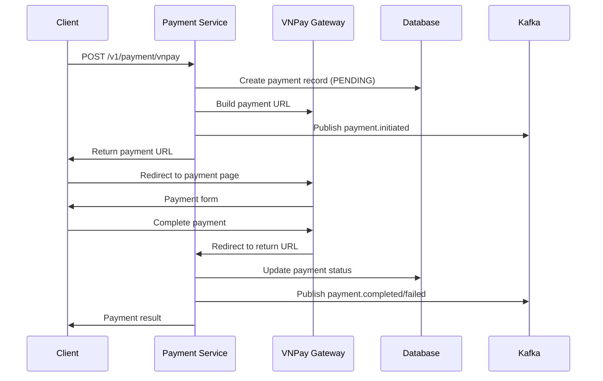
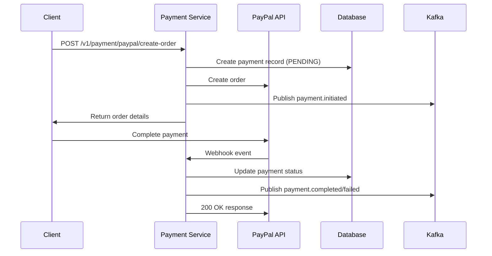

# Payment Service

Microservice handling payment processing for the Metro backend system, supporting multiple payment gateways including VNPay and PayPal.

## Overview

This service provides a unified payment processing system that supports:
- **VNPay Integration**: Vietnamese payment gateway
- **PayPal Integration**: International payment gateway
- **Event-Driven Architecture**: Kafka-based payment event publishing
- **Multi-Currency Support**: VND (VNPay) and USD (PayPal)
- **Webhook Handling**: Secure payment status updates
- **Transaction Logging**: Comprehensive payment audit trail

### Key Features:
- ✅ **Multi-Gateway Support**: VNPay and PayPal integration
- ✅ **Event-Driven**: Automatic payment event publishing to Kafka
- ✅ **Webhook Security**: Secure payment status verification
- ✅ **Transaction Tracking**: Complete payment audit trail
- ✅ **Multi-Currency**: Support for VND and USD payments
- ✅ **Error Handling**: Comprehensive error handling and logging

## Supported Payment Methods

### VNPay (Vietnamese Payment Gateway)
- **Currency**: VND (Vietnamese Dong)
- **Payment Flow**: Redirect-based payment
- **Features**: IPN callbacks, return URL handling
- **Use Case**: Domestic Vietnamese payments

### PayPal (International Payment Gateway)
- **Currency**: USD (US Dollar)
- **Payment Flow**: API-based payment with webhooks
- **Features**: Order creation, payment capture, webhook events
- **Use Case**: International payments

## API Endpoints

### VNPay Routes (`/v1/payment/vnpay`)
- `POST /vnpay` - Initiate VNPay payment
- `GET /vnpay/return` - Handle VNPay return URL
- `POST /vnpay/ipn` - Handle VNPay IPN callback

### PayPal Routes (`/v1/payment/paypal`)
- `POST /create-order` - Create PayPal order
- `POST /capture/:orderId` - Capture PayPal payment
- `GET /order/:orderId` - Get PayPal order details
- `POST /webhook` - Handle PayPal webhook events

## Payment Flow

### VNPay Payment Flow


### PayPal Payment Flow


## Architecture

```
payment-service/
├── src/
│   ├── config/          # Database, logger, PayPal config
│   ├── models/          # Sequelize models (Payment, Transaction, PaymentLog)
│   ├── controllers/     # HTTP request handlers
│   │   ├── payment.controller.js  # VNPay controller
│   │   └── papal.controller.js    # PayPal controller
│   ├── services/        # Business logic
│   │   ├── payment.service.js     # Main payment service
│   │   ├── paypal.service.js      # PayPal integration
│   │   └── vnpay.service.js       # VNPay integration
│   ├── routes/          # Express routes
│   │   ├── index.js              # Main routes
│   │   ├── payment.route.js      # VNPay routes
│   │   └── paypal.route.js       # PayPal routes
│   ├── kafka/           # Kafka utilities
│   ├── middlewares/     # Authorization, metrics
│   ├── app.js           # Express application
│   └── index.js         # Entry point
├── package.json
├── Dockerfile
└── README.md
```

## Environment Variables

Create a `.env` file in the payment-service directory:

```env
# Application Configuration
NODE_ENV=production
PORT=8002
SERVICE_NAME=payment-service

# Database Configuration
DB_HOST=postgres
DB_PORT=5432
DB_NAME=payment_db
DB_USER=payment_service
DB_PASSWORD=1

# Kafka Configuration
KAFKA_BROKERS=kafka-1:19092,kafka-2:19093,kafka-3:19094
KAFKA_CLIENT_ID=payment_service
KAFKA_BROKERS_INTERNAL=kafka-1:19092,kafka-2:19093,kafka-3:19094

# Service JWT
SERVICE_JWT_SECRET=ad9be0a348b0e7825a2f3487cb27db4779628e0e4d4c2c6bf1375feb80571b56

# PayPal Configuration
PAYPAL_CLIENT_ID=your_paypal_client_id_here
PAYPAL_SECRET=your_paypal_secret_here

# VNPay Configuration (in vnpay.service.js)
VNPAY_TMN_CODE=your_vnpay_tmn_code
VNPAY_HASH_SECRET=your_vnpay_hash_secret
VNPAY_URL=https://sandbox.vnpayment.vn/paymentv2/vpcpay.html
VNPAY_RETURN_URL=https://your-domain.com/v1/payment/vnpay/return
```

### Environment Variables Explanation:

#### 🔐 **Security**
- **SERVICE_JWT_SECRET**: JWT secret for service-to-service authentication
- **PAYPAL_CLIENT_ID/SECRET**: PayPal API credentials
- **VNPAY_TMN_CODE/HASH_SECRET**: VNPay merchant credentials

#### 📊 **Database & Kafka**
- **DB_***: PostgreSQL database configuration
- **KAFKA_***: Kafka broker and client configuration

## Getting Started

### Development
```bash
# Install dependencies
npm install

# Start development server
npm run dev
```

### Docker
```bash
# Build and run with docker-compose
docker-compose up payment-service
```

## Payment Integration Guide

### VNPay Integration

1. **Configure VNPay Credentials**:
   - Get TMN code and hash secret from VNPay
   - Update environment variables

2. **Initiate Payment**:
   ```bash
   POST /v1/payment/vnpay
   {
     "ticketId": 123,
     "passengerId": 456,
     "amount": 50000,
     "orderInfo": "Metro ticket payment",
     "returnUrl": "https://your-app.com/payment/return"
   }
   ```

3. **Handle Return URL**:
   - VNPay redirects user to your return URL
   - Service automatically verifies payment signature
   - Updates payment status in database

### PayPal Integration

1. **Configure PayPal Credentials**:
   - Get client ID and secret from PayPal Developer Dashboard
   - Update environment variables

2. **Create PayPal Order**:
   ```bash
   POST /v1/payment/paypal/create-order
   {
     "ticketId": 123,
     "passengerId": 456,
     "amount": 5.00,
     "currency": "USD",
     "orderInfo": "Metro ticket payment"
   }
   ```

3. **Capture Payment**:
   ```bash
   POST /v1/payment/paypal/capture/{orderId}
   ```

4. **Handle Webhooks**:
   - Configure webhook URL in PayPal Dashboard
   - Service automatically processes webhook events
   - Updates payment status based on events

## Event System

### Published Events
- `payment.initiated` - Payment creation
- `payment.completed` - Successful payment
- `payment.failed` - Failed payment

### Event Payload Example
```json
{
  "paymentId": 123,
  "ticketId": 456,
  "passengerId": 789,
  "amount": 50000,
  "paymentMethod": "VNPAY",
  "status": "COMPLETED",
  "gatewayResponse": {...}
}
```

## Database Schema

### Payment Table
- `paymentId` (Primary Key)
- `ticketId` (Foreign Key)
- `passengerId` (Foreign Key)
- `paymentAmount` (Decimal)
- `paymentMethod` (ENUM: VNPAY, PAYPAL, etc.)
- `paymentStatus` (ENUM: PENDING, COMPLETED, FAILED)
- `paymentDate` (DateTime)
- `paymentGatewayResponse` (JSON)

### Transaction Table
- `transactionId` (Primary Key)
- `paymentId` (Foreign Key)
- `transactionAmount` (Decimal)
- `transactionStatus` (ENUM: PENDING, COMPLETED, FAILED)

### PaymentLog Table
- `logId` (Primary Key)
- `paymentId` (Foreign Key)
- `paymentLogType` (ENUM: PAYMENT, REFUND, etc.)
- `paymentLogDate` (DateTime)
- `paymentLogStatus` (ENUM: PENDING, COMPLETED, FAILED)

## Security Features

### Payment Verification
- **VNPay**: HMAC signature verification
- **PayPal**: Webhook signature verification
- **Database**: Transaction logging for audit trail

### Service Authentication
- JWT-based service-to-service authentication
- Network source validation
- CORS configuration for API Gateway

## Health Check & Monitoring

### Endpoints:
- **Health Check**: `GET /health` - Service health status
- **Metrics**: `GET /metrics` - Prometheus metrics

### Monitoring Features:
- **Payment Success Rate**: Track payment completion rates
- **Gateway Response Times**: Monitor payment gateway performance
- **Error Tracking**: Comprehensive error logging
- **Event Publishing**: Kafka message processing status

## Error Handling

### Common Error Scenarios:
1. **Invalid Payment Data**: Returns 400 with validation errors
2. **Gateway Timeout**: Retry mechanism with exponential backoff
3. **Signature Verification Failed**: Logs security event
4. **Database Connection Issues**: Graceful degradation

### Error Response Format:
```json
{
  "success": false,
  "message": "Payment failed",
  "error": "PAYMENT_GATEWAY_ERROR",
  "details": {
    "gateway": "VNPAY",
    "errorCode": "INVALID_SIGNATURE"
  }
}
``` 