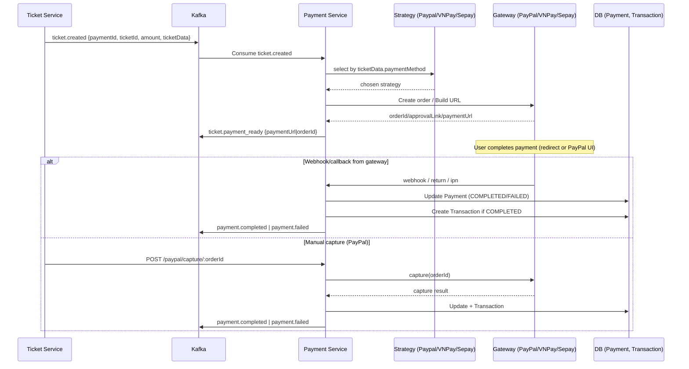
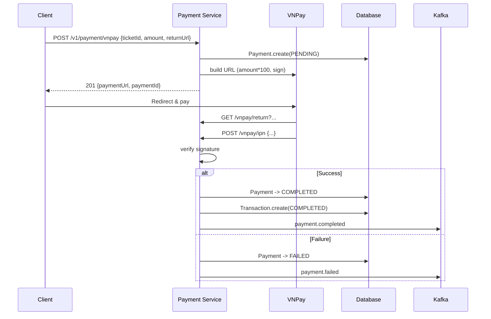
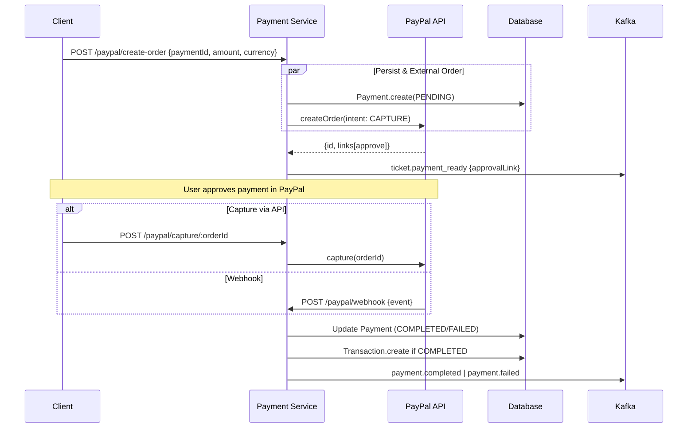
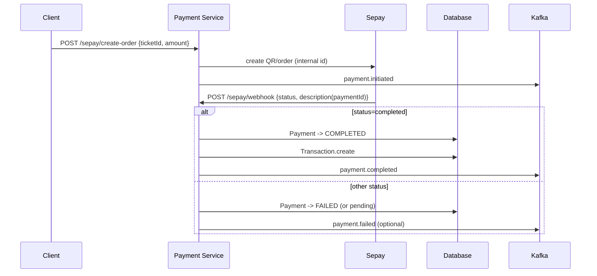
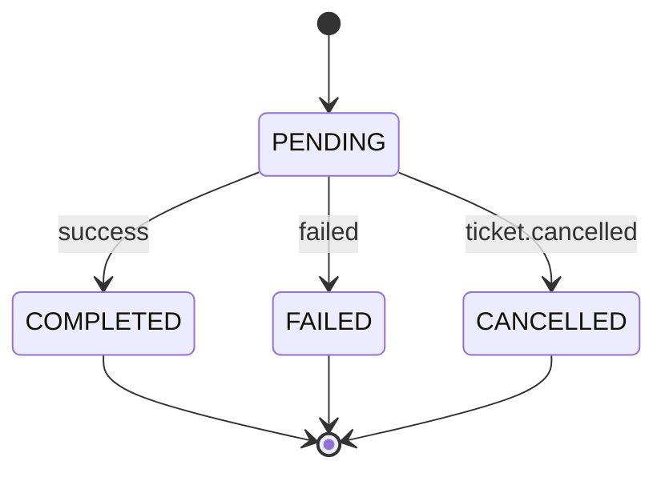
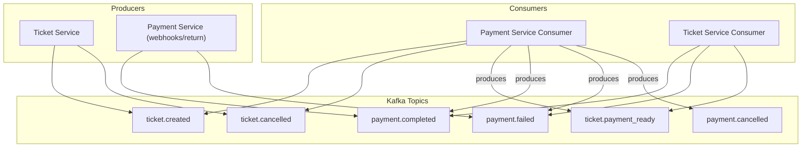

# Payment Service — Metro Backend

> Xử lý thanh toán đa cổng (PayPal, VNPay, Sepay) cho hệ Metro. Hỗ trợ event-driven qua Kafka, bảo mật S2S JWT, health/metrics, và audit logs.

## 1. Tổng quan
- **Chức năng**: Tạo phiên thanh toán, điều phối qua chiến lược gateway, nhận webhook/callback, cập nhật trạng thái và phát sự kiện.
- **Gateways hiện có**: PayPal, VNPay, Sepay (QR/Bank BIN)
- **Kiến trúc**: Express + Sequelize (PostgreSQL) + Kafka + Strategy Pattern (`strategies/payment/*`)
- **Dòng sự kiện**: Consumes `ticket.created`, `ticket.cancelled`; Publishes `ticket.payment_ready`, `payment.completed`, `payment.failed`, `payment.cancelled`

```text
payment-service/
├─ src/
│  ├─ app.js                    # Express app wiring (CORS, routes, metrics)
│  ├─ index.js                  # Bootstrap, DB sync, start consumers, graceful shutdown
│  ├─ config/                   # database, logger, metrics, paypal config
│  ├─ controllers/              # HTTP handlers: VNPay, PayPal, Sepay
│  ├─ events/
│  │  ├─ ticket.consumer.js     # Consume ticket events → process payment via strategies
│  │  ├─ payment.producer.js    # Publish payment.* events
│  │  └─ producers/             # Publish ticket.payment_ready per-gateway
│  ├─ kafka/                    # Kafka producer/consumer utils
│  ├─ middlewares/              # AuthZ (S2S JWT), metrics middleware
│  ├─ models/                   # Sequelize models: Payment, Transaction, PaymentLog
│  ├─ routes/                   # /v1/payment/* routes per gateway + generic queries
│  ├─ services/                 # VNPay/PayPal/Sepay services & payment.service
│  └─ strategies/payment/       # Strategy factory + concrete strategies
└─ README.md
```

## 2. Sơ đồ Class (Class Diagram)

```mermaid
classDiagram
    class PaymentService {
        +createVnpayPayment(params)
        +handleVnpayReturn(query)
        +handleVnpayIpn(query)
        +createPaypalPayment(params)
        +capturePaypalPayment(orderId)
        +createPayment(params)
        +getPaypalOrder(orderId)
    }

    class PayPalService {
        +createOrder(orderData)
        +captureOrder(orderId)
        +getOrder(orderId)
        +verifyWebhookSignature(payload, signature)
        +processWebhookEvent(event)
    }

    class VNPayService {
        +buildPaymentUrl(params)
        +verifyReturnUrl(query)
        +verifyIpnCallback(query)
        +generateSignature(params)
        +validateSignature(params, signature)
    }

    class SepayService {
        +createOrder(orderData)
        +captureOrder(orderId)
        +getOrder(orderId)
        +verifyWebhookSignature(payload, signature)
        +processWebhookEvent(event)
    }

    class PaymentStrategyFactory {
        +createStrategy(paymentMethod)
        +getSupportedMethods()
        +validateMethod(method)
    }

    class DefaultPaymentStrategy {
        +processPayment(paymentData)
        +handleCallback(callbackData)
        +validatePayment(paymentData)
    }

    class PayPalPaymentStrategy {
        +processPayment(paymentData)
        +handleCallback(callbackData)
        +validatePayment(paymentData)
        +createOrder(paymentData)
        +captureOrder(orderId)
    }

    class SepayPaymentStrategy {
        +processPayment(paymentData)
        +handleCallback(callbackData)
        +validatePayment(paymentData)
        +createOrder(paymentData)
        +captureOrder(orderId)
    }

    class IPaymentStrategy {
        <<interface>>
        +processPayment(paymentData)
        +handleCallback(callbackData)
        +validatePayment(paymentData)
    }

    class PaymentController {
        +createPayment(req, res)
        +getPaymentStatus(req, res)
        +handlePaymentCallback(req, res)
        +getPaymentById(req, res)
    }

    class PayPalController {
        +createOrder(req, res)
        +captureOrder(req, res)
        +getOrder(req, res)
        +checkStatus(req, res)
        +handleWebhook(req, res)
    }

    class SepayController {
        +createOrder(req, res)
        +captureOrder(req, res)
        +getOrder(req, res)
        +checkStatus(req, res)
        +handleWebhook(req, res)
    }

    class TicketConsumer {
        +start()
        +stop()
        +handleTicketCreated(event)
        +handleTicketCancelled(event)
        +processPaymentForTicket(ticketData)
    }

    class PaymentProducer {
        +publishPaymentReady(paymentData)
        +publishPaymentCompleted(paymentData)
        +publishPaymentFailed(paymentData)
        +publishPaymentCancelled(paymentData)
    }

    class PayPalProducer {
        +publishPaypalOrderCreated(orderData)
        +publishPaypalOrderCaptured(orderData)
        +publishPaypalOrderFailed(orderData)
    }

    class SepayProducer {
        +publishSepayOrderCreated(orderData)
        +publishSepayOrderCompleted(orderData)
        +publishSepayOrderFailed(orderData)
    }

    class VNPayProducer {
        +publishVnpayOrderCreated(orderData)
        +publishVnpayOrderCompleted(orderData)
        +publishVnpayOrderFailed(orderData)
    }

    class PayPalHookConsumer {
        +start()
        +stop()
        +handlePaypalWebhook(event)
        +processWebhookEvent(event)
    }

    class SepayHookConsumer {
        +start()
        +stop()
        +handleSepayWebhook(event)
        +processWebhookEvent(event)
    }

    class Payment {
        +paymentId: UUID
        +ticketId: UUID
        +passengerId: UUID
        +paymentAmount: Decimal
        +paymentMethod: Enum
        +paymentStatus: Enum
        +paymentDate: Date
        +paymentGatewayResponse: JSON
        +createdAt: Date
        +updatedAt: Date
    }

    class Transaction {
        +transactionId: UUID
        +paymentId: UUID
        +transactionAmount: Decimal
        +transactionStatus: Enum
        +transactionDate: Date
        +gatewayTransactionId: String
        +createdAt: Date
        +updatedAt: Date
    }

    class PaymentLog {
        +logId: UUID
        +paymentId: UUID
        +paymentLogType: Enum
        +paymentLogDate: Date
        +paymentLogStatus: Enum
        +logMessage: String
        +logData: JSON
        +createdAt: Date
    }

    PaymentService --> PayPalService : uses
    PaymentService --> VNPayService : uses
    PaymentService --> SepayService : uses
    PaymentService --> PaymentStrategyFactory : uses

    PaymentStrategyFactory --> DefaultPaymentStrategy : creates
    PaymentStrategyFactory --> PayPalPaymentStrategy : creates
    PaymentStrategyFactory --> SepayPaymentStrategy : creates

    DefaultPaymentStrategy ..|> IPaymentStrategy : implements
    PayPalPaymentStrategy ..|> IPaymentStrategy : implements
    SepayPaymentStrategy ..|> IPaymentStrategy : implements

    PaymentController --> PaymentService : uses
    PayPalController --> PayPalService : uses
    SepayController --> SepayService : uses

    TicketConsumer --> PaymentStrategyFactory : uses
    TicketConsumer --> PaymentProducer : uses
    TicketConsumer --> PayPalProducer : uses
    TicketConsumer --> SepayProducer : uses
    TicketConsumer --> VNPayProducer : uses

    PayPalHookConsumer --> PayPalService : uses
    PayPalHookConsumer --> PaymentProducer : uses
    SepayHookConsumer --> SepayService : uses
    SepayHookConsumer --> PaymentProducer : uses

    PaymentService --> Payment : manages
    PaymentService --> Transaction : manages
    PaymentService --> PaymentLog : manages

    Payment ||--o{ Transaction : has
    Payment ||--o{ PaymentLog : has
```

## 2.1 API
Base path: `/v1/payment`

### 2.1 Generic
- `GET /ticket/:ticketId` → Trả về `paymentUrl` hoặc `gatewayOrderId` nếu có
- `GET /status/:ticketId` → Trả về trạng thái thanh toán của vé


Phản hồi tạo phiên (201): `{ success, paymentUrl, paymentId }`

### 2.3 PayPal (`/v1/payment/paypal`)
- `POST /create-order` → Tạo PayPal order. Body gợi ý: `{paymentId, ticketId, passengerId, amount, currency, orderInfo, returnUrl, cancelUrl}`
- `POST /capture/:orderId` → Capture thanh toán
- `GET /order/:orderId` → Lấy chi tiết order
- `GET /check-status/:orderId` → Kiểm tra order đã sẵn sàng capture
- `POST /webhook` → Xử lý webhook sự kiện PayPal

### 2.4 Sepay (`/v1/payment/sepay`)
- `POST /create-order` → Tạo order/QR. Body: `{ticketId, passengerId, amount, orderDescription}`
- `POST /capture/:orderId` → Capture thanh toán (nếu áp dụng)
- `GET /order/:orderId` → Lấy chi tiết order
- `GET /check-status/:orderId` → Kiểm tra trạng thái order
- `POST /webhook` → Xử lý webhook từ Sepay

## 3. Luồng xử lý

### 3.1 Event-driven (ticket → payment)
- Consume `ticket.created` → `strategies/payment/*` chọn gateway theo `ticketData.paymentMethod` (mặc định `paypal`) → tạo phiên/paypal order hoặc VNPay URL → Publish `ticket.payment_ready`
- Consume `ticket.cancelled` → cập nhật Payment sang `CANCELLED` (nếu chưa hoàn tất) hoặc giữ nguyên `COMPLETED` (nếu đã hoàn tất), sau đó Publish `payment.cancelled`

### 3.2 VNPay (điển hình)
1) `POST /v1/payment/vnpay` → tạo bản ghi Payment (PENDING) + build URL (amount × 100) → trả `paymentUrl`
2) User redirect tới VNPay, sau thanh toán: VNPay gọi `GET /return` và/hoặc `POST /ipn`
3) Service verify signature → cập nhật Payment (COMPLETED/FAILED) → tạo Transaction nếu success → Publish `payment.completed`/`payment.failed`

### 3.3 PayPal (điển hình)
1) `POST /v1/payment/paypal/create-order` → tạo Payment (PENDING) + gọi PayPal `createOrder` → lưu `paypalOrderId` → emit `ticket.payment_ready` (kèm approval link)
2) User approve + capture (`POST /capture/:orderId`) hoặc webhook đẩy về `POST /webhook`
3) Cập nhật Payment + tạo Transaction (nếu COMPLETED) → Publish `payment.completed`/`payment.failed`

### 3.4 Sepay (điển hình)
1) `POST /v1/payment/sepay/create-order` → tạo QR/paymentId (nội bộ) → Publish `payment.initiated`
2) Webhook `POST /webhook` với trạng thái `completed` → Publish `payment.completed`

### 3.5 Biểu đồ luồng chi tiết (Mermaid)

#### 3.5.1 End-to-End (Event-driven)


#### 3.5.2 VNPay Flow


#### 3.5.3 PayPal Flow


#### 3.5.4 Sepay Webhook Flow


#### 3.5.5 Payment State Machine


#### 3.5.6 Kafka Topology


## 4. Sự kiện (Kafka)
- Consume: `ticket.created`, `ticket.cancelled`
- Publish:
  - `ticket.payment_ready` — khi có URL/approval link sẵn sàng
  - `payment.completed`
  - `payment.failed`
  - `payment.cancelled`

Ví dụ payload `payment.completed`:
```json
{
  "paymentId": "...",
  "ticketId": "...",
  "passengerId": "...",
  "status": "COMPLETED",
  "paymentData": {
    "amount": 15000,
    "paymentMethod": "paypal",
    "webhookProcessed": true
  },
  "completedAt": "2025-09-17T10:00:00.000Z"
}
```

## 5. Mô hình dữ liệu (Sequelize)
- `Payment`: `paymentId`, `ticketId`, `passengerId`, `paymentAmount`, `paymentMethod` (`paypal`/`vnpay`/`sepay`), `paymentStatus` (`PENDING|COMPLETED|FAILED|CANCELLED|REFUND_PENDING`), `paymentDate`, `paymentGatewayResponse`
- `Transaction`: `transactionId`, `paymentId`, `transactionAmount`, `transactionStatus`
- `PaymentLog`: `logId`, `paymentId`, `paymentLogType`, `paymentLogDate`, `paymentLogStatus`

## 6. Bảo mật
- **Service-to-Service JWT**: Header `x-service-auth: Bearer <token>` với HS256, `iss=api-gateway`, `aud=internal-services`, max age 5 phút. Secret: `SERVICE_JWT_SECRET`.
- **CORS**: Whitelist qua `API_GATEWAY_ORIGIN`, `ALLOWED_ORIGINS`.
- **Logging**: Winston + daily rotate. Audit đầy đủ theo `paymentId/ticketId`.

## 7. Cấu hình môi trường
Tham khảo `.env.example` (trích):
```env
NODE_ENV=production
PORT=8006
SERVICE_JWT_SECRET=CHANGE_ME
DB_HOST=postgres
DB_PORT=5432
DB_NAME=payment_db
DB_USER=payment_service
DB_PASSWORD=${PAYMENT_DB_PASSWORD}
KAFKA_BROKERS=kafka-1:19092,kafka-2:19093,kafka-3:19094
KAFKA_CLIENT_ID=payment-service
PAYPAL_CLIENT_ID=CHANGE_ME
PAYPAL_SECRET=CHANGE_ME
SEPAY_BANK_BIN=CHANGE_ME
SEPAY_ACCOUNT_NO=CHANGE_ME
API_GATEWAY_ORIGIN=https://api.metrohcm.io.vn
ALLOWED_ORIGINS=https://api.metrohcm.io.vn
```
- Lưu ý: VNPay config đặt trong service VNPay tương ứng; PayPal amount với `VND` sẽ được làm tròn (PayPal không hỗ trợ thập phân cho VND).

## 8. Chạy & Triển khai
### Local
```bash
npm install
npm run dev
```

### Docker/Compose
```bash
docker-compose up payment-service
```

## 9. Health & Observability
- `GET /health` — tình trạng service
- `GET /metrics` — Prometheus metrics (`prom-client`)
- Metrics tiêu biểu: HTTP reqs, latency, Kafka processed, payment success/failure

## 10. Quy tắc lỗi chuẩn
```json
{
  "success": false,
  "message": "Error description",
  "error": "ERROR_CODE"
}
```
`ERROR_CODE` phổ biến: `MISSING_SERVICE_AUTH`, `INVALID_SERVICE_TOKEN`, `EXPIRED_SERVICE_TOKEN`.

## 11. Ghi chú triển khai
- Áp dụng Strategy Pattern để chọn cổng thanh toán theo `ticketData.paymentMethod`.
- `ticket.created` yêu cầu các trường: `ticketId`, `paymentId`, `passengerId`, `amount`, `ticketType`, `status`, optional `currency`, `ticketData`.
- VNPay: lưu ý `amount × 100`, verify chữ ký cho `return`/`ipn`.
- PayPal: dùng `@paypal/checkout-server-sdk`, lưu `paypalOrderId`, xử lý capture/webhook.
- Sepay: xác thực webhook, publish `payment.completed` khi `status=completed`.

## 12. Roadmap ngắn
- Circuit breaker cho HTTP/gateway
- Nâng cấp idempotency trên consumer và webhook
