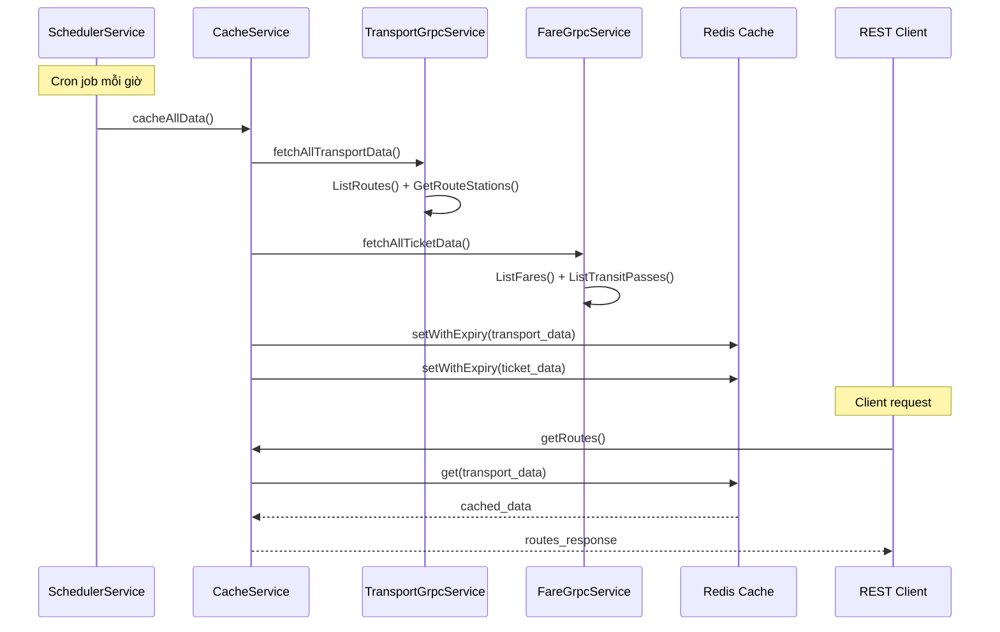
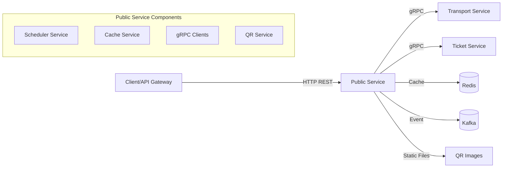

# Public Service — Service README

## 1. Tổng quan
- **Chức năng chính**: Service cache và aggregation layer cung cấp dữ liệu transport và ticket thông qua REST API, đồng bộ dữ liệu từ Transport Service và Ticket Service qua gRPC
- **Vai trò trong hệ MetroHCM**: Làm lớp cache trung gian, giảm tải cho các service backend, cung cấp API công khai cho client applications
- **Giao tiếp**: 
  - gRPC ⟷ Transport Service (port 50051)
  - gRPC ⟷ Ticket Service (port 50052) 
  - Kafka ⟷ QR Storage Topic
  - REST ⟷ Client applications
- **Kiến trúc & pattern**: Layered Architecture, Dependency Injection, SOLID principles, Cache-Aside pattern, Event-driven architecture
- **Lưu đồ chuỗi (Mermaid sequence) cho luồng đồng bộ dữ liệu**:



## 2. Sơ đồ hệ thống (Mermaid)



## 3. API & Hợp đồng

### 3.1 REST endpoints

| Method | Path | Mô tả | Auth | Request | Response | Status Codes |
| ------ | ---- | ----- | ---- | ------- | -------- | ------------ |
| GET | `/health` | Basic health check | None | - | `{status, service, version, uptime}` | 200, 503 |
| GET | `/health/detailed` | Detailed health with dependencies | None | - | `{status, checks: {transportService, ticketService, dataAvailability}}` | 200, 503 |
| GET | `/health/ready` | Readiness probe | None | - | `{ready: boolean, checks}` | 200, 503 |
| GET | `/health/live` | Liveness probe | None | - | `{alive: boolean}` | 200, 503 |
| GET | `/metrics` | Prometheus metrics | None | - | Prometheus format | 200 |
| GET | `/transport/routes` | All cached routes | None | - | `{success, data: routes[], count, cached}` | 200, 404, 500 |
| GET | `/transport/routes/:id` | Specific route | None | - | `{success, data: route, routeId}` | 200, 404, 500 |
| GET | `/transport/routes/search` | Search routes by origin/destination | None | `?origin=id&destination=id` | `{success, data: routes[], search}` | 200, 400, 500 |
| GET | `/transport/stations` | All cached stations | None | - | `{success, data: stations[], count}` | 200, 404, 500 |
| GET | `/transport/stations/:id` | Specific station | None | - | `{success, data: station, stationId}` | 200, 404, 500 |
| GET | `/transport/routes/:routeId/stations` | Stations for route | None | - | `{success, data: stations[], routeId}` | 200, 404, 500 |
| GET | `/ticket/fares` | All cached fares | None | - | `{success, data: fares[], count}` | 200, 404, 500 |
| GET | `/ticket/fares/route/:routeId` | Fares for route | None | - | `{success, data: fares[], routeId}` | 200, 404, 500 |
| GET | `/ticket/fares/search` | Search fares by criteria | None | `?routeId&currency&isActive&minPrice&maxPrice` | `{success, data: fares[], filters}` | 200, 500 |
| GET | `/ticket/fares/route/:routeId/calculate` | Fare calculation example | None | `?stations=5&tripType=oneway` | `{success, data: calculation, baseFare}` | 200, 400, 404, 500 |
| GET | `/ticket/transit-passes` | All transit passes | None | - | `{success, data: passes[], count}` | 200, 404, 500 |
| GET | `/ticket/transit-passes/:type` | Transit pass by type | None | - | `{success, data: pass, type}` | 200, 404, 500 |
| GET | `/ticket/passenger-discounts` | All passenger discounts | None | - | `{success, data: discounts[], count}` | 200, 404, 500 |
| GET | `/ticket/passenger-discounts/:type` | Discount by type | None | - | `{success, data: discount, type}` | 200, 404, 500 |
| GET | `/cache/status` | Cache status and statistics | None | - | `{success, cache, scheduler}` | 200, 500 |
| GET | `/cache/stats` | Cache statistics | None | - | `{success, data: {cache, scheduler}}` | 200, 500 |
| POST | `/cache/refresh` | Manual cache refresh | None | `{force?: boolean}` | `{success, message, data}` | 200, 409, 500 |
| DELETE | `/cache/clear` | Clear all cached data | None | - | `{success, message}` | 200, 500 |
| GET | `/cache/health` | Cache health check | None | - | `{success, data: {healthy, components}}` | 200, 503 |
| GET | `/cache/metadata` | Cache metadata | None | - | `{success, data: {cacheStatus, dataAvailability}}` | 200, 500 |
| GET | `/cache/scheduler` | Scheduler status | None | - | `{success, data: {status, health, description}}` | 200, 500 |
| POST | `/cache/scheduler/control` | Control scheduler | None | `{action: "start"\|"stop"}` | `{success, message, action}` | 200, 400, 500 |
| POST | `/cache/reset-stats` | Reset cache statistics | None | - | `{success, message}` | 200, 500 |
| GET | `/qr/:ticketId` | Get QR code image | None | - | Image file | 200, 404 |

### 3.2 OpenAPI/Proto

* **Vị trí file**: `src/proto/transport.proto`, `src/proto/fare.proto`, `src/proto/transitPass.proto`, `src/proto/passengerDiscount.proto`
* **Cách build/generate client/server**: Sử dụng `@grpc/proto-loader` và `@grpc/grpc-js` để load proto files
* **Versioning & Compatibility**: gRPC services sử dụng proto3 syntax, backward compatible

### 3.3 Event (Kafka/Queue)

| Topic | Direction | Key | Schema | Semantics | Retry/DLQ |
| ----- | --------- | --- | ------ | --------- | --------- |
| `qr.storage` | Consumer | `ticketId` | `{ticketId, imageBase64, mimeType}` | At-least-once | Built-in retry with exponential backoff |

## 4. Dữ liệu & Migrations

* **Loại CSDL**: Không có database riêng, sử dụng Redis làm cache layer
* **Bảng/collection chính**: 
  - Redis keys với prefix `service:public-service:`
  - `transport:all` - Complete transport data
  - `fare:all` - Complete fare data  
  - `transport:routes` - Routes array
  - `transport:route_stations` - Route-station mappings
  - `fare:fares` - Fares array
  - `fare:transit_passes` - Transit passes array
  - `fare:passenger_discounts` - Passenger discounts array
  - `cache:last_update` - Last update timestamp
* **Quan hệ & cascade**: N/A (cache-only service)
* **Seeds/fixtures**: N/A
* **Cách chạy migration**: N/A

## 5. Cấu hình & Secrets

### 5.1 Biến môi trường (bảng bắt buộc)

| ENV | Bắt buộc | Giá trị mẫu | Mô tả | Phạm vi |
| --- | -------- | ----------- | ----- | ------- |
| `PORT` | Yes | `8005` | HTTP server port | 1-65535 |
| `NODE_ENV` | No | `production` | Environment mode | development/production |
| `REDIS_HOST` | Yes | `redis` | Redis server hostname | Valid hostname/IP |
| `REDIS_PORT` | No | `6379` | Redis server port | 1-65535 |
| `REDIS_PASSWORD` | No | - | Redis authentication password | String |
| `REDIS_KEY_PREFIX` | No | `service:public-service:` | Redis key prefix | String |
| `TRANSPORT_GRPC_URL` | Yes | `transport-service:50051` | Transport service gRPC URL | Valid gRPC URL |
| `TICKET_GRPC_URL` | Yes | `ticket-service:50052` | Ticket service gRPC URL | Valid gRPC URL |
| `SCHEDULER_ENABLED` | No | `true` | Enable/disable scheduler | true/false |
| `SCHEDULER_CRON` | No | `"0 * * * *"` | Cron schedule for data sync | Valid cron expression |
| `SCHEDULER_INITIAL_DELAY_MS` | No | `10000` | Initial delay before first fetch | 0-60000 |
| `KAFKA_BROKERS` | No | `localhost:9092` | Kafka broker addresses | Comma-separated list |
| `KAFKA_CLIENT_ID` | No | `public-service` | Kafka client ID | String |
| `KAFKA_QR_STORAGE_TOPIC` | No | `qr.storage` | QR storage topic name | Valid topic name |
| `KAFKA_QR_GROUP_ID` | No | `public-service-qr-group` | QR consumer group ID | String |

### 5.2 Profiles

* **dev**: CORS enabled, debug logging, scheduler có thể disabled
* **production**: CORS handled by Nginx, info logging, scheduler enabled
* **Nguồn secrets**: Environment variables, Docker secrets, Kubernetes secrets

## 6. Bảo mật & Tuân thủ

* **AuthN/AuthZ**: Không có authentication (public API service)
* **Input validation & sanitize**: Parameter validation trong controllers, JSON parsing với limits
* **CORS & CSRF**: CORS enabled trong development, production sử dụng Nginx
* **Rate limit / Anti-abuse**: Không có rate limiting built-in (có thể implement qua Nginx)
* **Nhật ký/Audit**: Winston logging với structured format, request/response logging
* **Lỗ hổng tiềm ẩn & khuyến nghị**: 
  - Cần implement rate limiting
  - Cần authentication cho admin endpoints
  - Cần input sanitization cho user inputs

## 7. Độ tin cậy & Khả dụng

* **Timeouts/Retry/Backoff**: 
  - gRPC calls: 3 retries với exponential backoff
  - Redis operations: Built-in retry logic
  - Kafka consumer: 10 retries với 5s delay
* **Circuit breaker/Bulkhead**: Không có circuit breaker pattern
* **Idempotency (keys, store)**: Cache operations là idempotent
* **Outbox/Saga/Orchestrator**: Không có distributed transactions
* **Khả năng phục hồi sự cố**: 
  - Graceful shutdown handling
  - Automatic Kafka consumer restart
  - Redis connection recovery
  - Partial failure handling trong data sync

## 8. Observability

* **Logging**: Winston với JSON format, daily rotation, correlation ID trong request logs
* **Metrics**: Prometheus metrics (`http_request_duration_seconds`, `app_errors_total`)
* **Tracing**: Không có distributed tracing
* **Healthchecks**: 
  - `/health` - Basic health
  - `/health/detailed` - Comprehensive health
  - `/health/ready` - Readiness probe
  - `/health/live` - Liveness probe

## 9. Build, Run, Test

### 9.1 Local

```bash
# Prerequisites
Node.js 18+, Redis, Kafka (for QR functionality)

# Install dependencies
npm install

# Set up environment
cp env.example .env
# Edit .env with your configuration

# Run
npm start
# or for development
npm run dev
```

### 9.2 Docker/Compose

```bash
# Build
docker build -t public-service .

# Run
docker run --env-file .env -p 8005:8005 public-service

# With docker-compose
docker-compose up public-service
```

### 9.3 Kubernetes/Helm (nếu có)

* (Không tìm thấy trong repo)

### 9.4 Testing

```bash
# Run all tests
npm test

# Run with coverage
npm run test:coverage

# Run specific test suites
npm run test:unit
npm run test:integration

# Generate coverage CSV
npm run coverage:csv
```

## 10. CI/CD

* **Workflow path**: (Không tìm thấy trong repo)
* **Tagging/Release**: (Không tìm thấy trong repo)
* **Gates**: Jest tests với coverage threshold (75% statements, 60% branches, 75% functions, 75% lines)

## 11. Hiệu năng & Quy mô

* **Bottlenecks đã thấy từ code**: 
  - gRPC calls có thể chậm nếu transport/ticket services không responsive
  - Redis operations có thể bottleneck nếu cache miss
* **Kỹ thuật**: 
  - Redis caching với TTL 1 hour
  - Parallel data fetching từ multiple services
  - HTTP compression enabled
  - Static file serving cho QR images
* **Định hướng benchmark/kịch bản tải**: Cần load testing cho cache hit/miss scenarios

## 12. Rủi ro & Nợ kỹ thuật

* **Danh sách vấn đề hiện tại**:
  - Không có circuit breaker cho gRPC calls
  - Không có rate limiting
  - Không có authentication cho admin endpoints
  - Không có distributed tracing
  - Limited error handling cho partial failures
* **Ảnh hưởng & ưu tiên**:
  - High: Circuit breaker và rate limiting
  - Medium: Authentication và tracing
  - Low: Enhanced error handling
* **Kế hoạch cải thiện**:
  - Implement circuit breaker pattern
  - Add rate limiting middleware
  - Add authentication cho cache management endpoints
  - Implement distributed tracing với OpenTelemetry

## 13. Phụ lục

* **Sơ đồ ERD**: N/A (cache-only service)

* **Bảng mã lỗi chuẩn & cấu trúc response lỗi**:
```json
{
  "success": false,
  "error": {
    "message": "Error description",
    "status": 500
  },
  "timestamp": "2024-01-01T00:00:00.000Z",
  "path": "/api/endpoint",
  "method": "GET"
}
```

* **License & 3rd-party**: MIT License, dependencies trong `package.json`