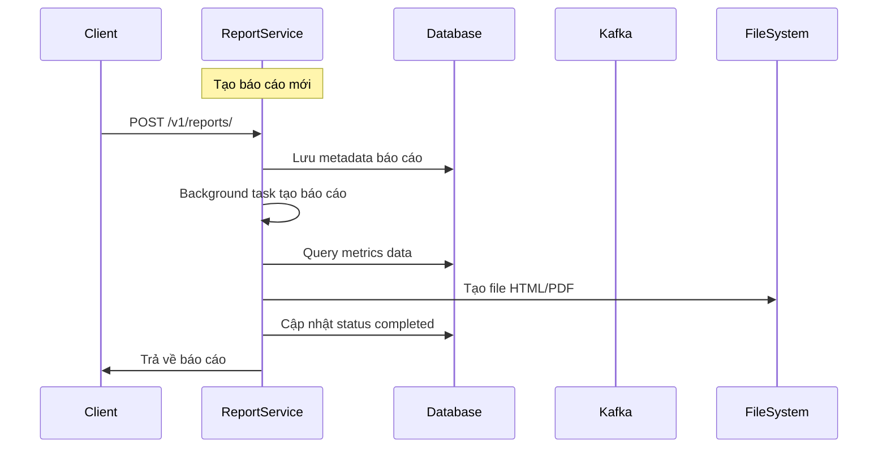
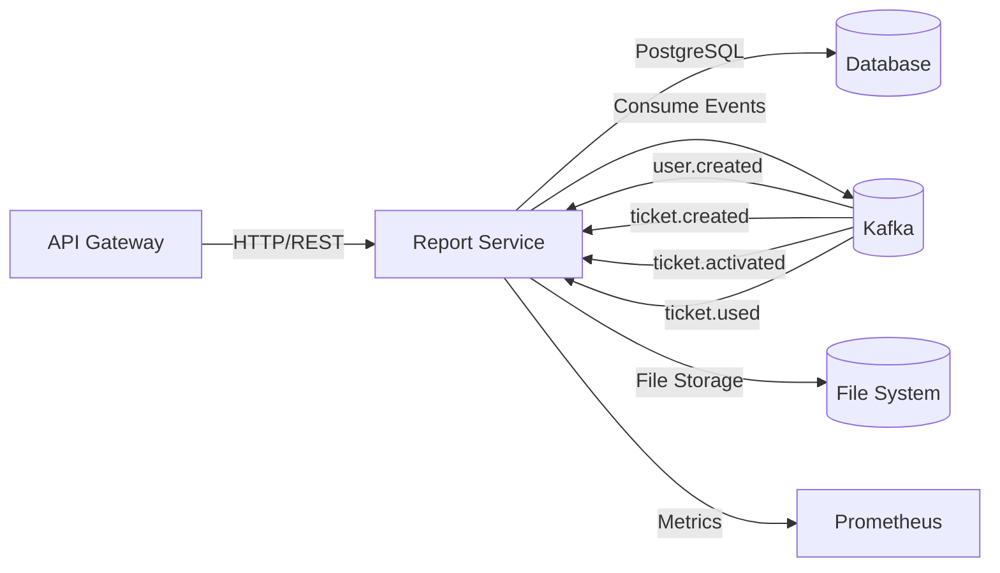
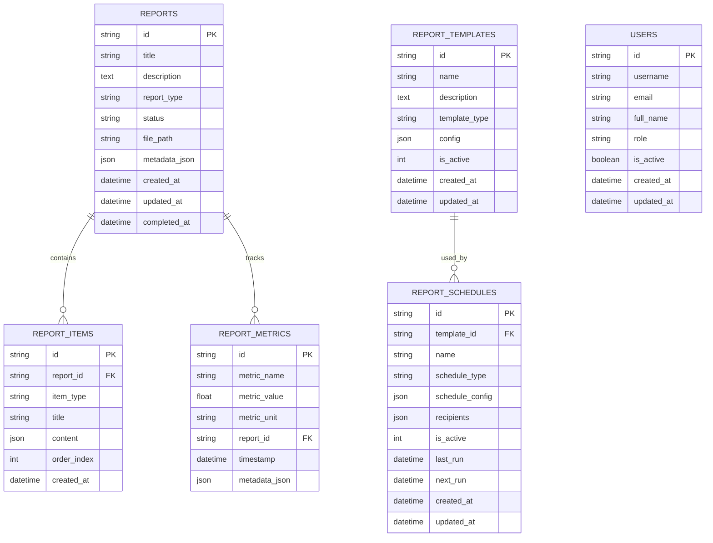

# Report Service — Service README

## 1. Tổng quan
- **Chức năng chính**: Tạo và quản lý báo cáo tự động cho hệ thống Metro HCM, bao gồm báo cáo hàng ngày/tuần/tháng và phân tích dữ liệu thời gian thực từ các sự kiện Kafka
- **Vai trò trong hệ MetroHCM**: Thu thập metrics từ các service khác, tạo báo cáo phân tích và cung cấp API cho dashboard quản trị
- **Giao tiếp**: 
  - REST API ⟷ API Gateway, Dashboard
  - Kafka Consumer ⟷ User Service, Ticket Service, Payment Service, Transport Service
  - Database ⟷ PostgreSQL
- **Kiến trúc & pattern**: Layered Architecture với FastAPI, SQLAlchemy ORM, Event-driven processing, SOLID principles
- **Lưu đồ chuỗi** cho luồng tạo báo cáo:



## 2. Sơ đồ Class (Class Diagram)

```mermaid
classDiagram
    class ReportService {
        +create_report(reportData)
        +get_reports(skip, limit, reportType, status)
        +get_report(reportId)
        +delete_report(reportId)
        +generate_report(reportId)
        +_generate_daily_report(report)
        +_generate_weekly_report(report)
        +_generate_monthly_report(report)
        +_generate_custom_report(report)
        +_create_report_items(report, data)
        +_generate_report_file(report, data)
    }

    class ReportTemplateService {
        +create_template(templateData)
        +get_templates()
        +get_template_by_id(templateId)
        +update_template(templateId, updateData)
        +delete_template(templateId)
        +validate_template(templateData)
    }

    class ReportScheduleService {
        +create_schedule(scheduleData)
        +get_schedules()
        +get_schedule_by_id(scheduleId)
        +update_schedule(scheduleId, updateData)
        +delete_schedule(scheduleId)
        +execute_scheduled_reports()
        +get_next_run_time(schedule)
    }

    class AnalyticsService {
        +get_daily_analytics()
        +get_weekly_analytics()
        +get_monthly_analytics()
        +get_custom_analytics(startDate, endDate, metrics)
        +calculate_user_metrics()
        +calculate_ticket_metrics()
        +calculate_revenue_metrics()
        +calculate_usage_metrics()
    }

    class KafkaEventConsumer {
        +start()
        +stop()
        +handle_user_created(event)
        +handle_user_login(event)
        +handle_ticket_created(event)
        +handle_ticket_activated(event)
        +handle_ticket_cancelled(event)
        +handle_ticket_used(event)
        +process_event(event)
    }

    class ReportGenerator {
        +generate_html_report(data, template)
        +generate_pdf_report(htmlContent)
        +create_chart_image(data, chartType)
        +format_metrics_data(metrics)
        +apply_template_variables(template, variables)
    }

    class MetricsCollector {
        +collect_user_metrics()
        +collect_ticket_metrics()
        +collect_revenue_metrics()
        +collect_usage_metrics()
        +aggregate_metrics_by_period(period)
        +calculate_growth_rates(metrics)
    }

    class FileManager {
        +save_report_file(reportId, content, format)
        +get_report_file(reportId)
        +delete_report_file(reportId)
        +cleanup_old_files(retentionDays)
        +get_file_size(reportId)
        +get_storage_usage()
    }

    class ReportController {
        +create_report(request)
        +get_reports(request)
        +get_report_by_id(request)
        +delete_report(request)
        +get_health(request)
        +get_metrics(request)
    }

    class TemplateController {
        +create_template(request)
        +get_templates(request)
        +get_template_by_id(request)
        +update_template(request)
        +delete_template(request)
    }

    class ScheduleController {
        +create_schedule(request)
        +get_schedules(request)
        +get_schedule_by_id(request)
        +update_schedule(request)
        +delete_schedule(request)
    }

    class AnalyticsController {
        +get_daily_analytics(request)
        +get_weekly_analytics(request)
        +get_monthly_analytics(request)
        +get_custom_analytics(request)
    }

    class Report {
        +id: String
        +title: String
        +description: Text
        +reportType: String
        +status: String
        +filePath: String
        +metadataJson: JSON
        +createdAt: DateTime
        +updatedAt: DateTime
        +completedAt: DateTime
    }

    class ReportItem {
        +id: String
        +reportId: String
        +itemType: String
        +title: String
        +content: JSON
        +orderIndex: Integer
        +createdAt: DateTime
    }

    class ReportTemplate {
        +id: String
        +name: String
        +description: Text
        +templateType: String
        +config: JSON
        +isActive: Integer
        +createdAt: DateTime
        +updatedAt: DateTime
    }

    class ReportSchedule {
        +id: String
        +templateId: String
        +name: String
        +scheduleType: String
        +scheduleConfig: JSON
        +recipients: JSON
        +isActive: Integer
        +lastRun: DateTime
        +nextRun: DateTime
        +createdAt: DateTime
        +updatedAt: DateTime
    }

    class ReportMetric {
        +id: String
        +metricName: String
        +metricValue: Float
        +metricUnit: String
        +reportId: String
        +timestamp: DateTime
        +metadataJson: JSON
    }

    class User {
        +id: String
        +username: String
        +email: String
        +fullName: String
        +role: String
        +isActive: Boolean
        +createdAt: DateTime
        +updatedAt: DateTime
    }

    class DatabaseService {
        +connect()
        +disconnect()
        +get_session()
        +create_tables()
        +get_connection_status()
    }

    class KafkaService {
        +connect()
        +disconnect()
        +consume_messages()
        +get_consumer_status()
        +get_lag_info()
    }

    ReportService --> Report : manages
    ReportService --> ReportItem : manages
    ReportService --> ReportGenerator : uses
    ReportService --> MetricsCollector : uses
    ReportService --> FileManager : uses

    ReportTemplateService --> ReportTemplate : manages
    ReportScheduleService --> ReportSchedule : manages
    ReportScheduleService --> ReportTemplate : uses

    AnalyticsService --> MetricsCollector : uses
    AnalyticsService --> ReportMetric : manages

    KafkaEventConsumer --> KafkaService : uses
    KafkaEventConsumer --> MetricsCollector : uses

    ReportController --> ReportService : uses
    TemplateController --> ReportTemplateService : uses
    ScheduleController --> ReportScheduleService : uses
    AnalyticsController --> AnalyticsService : uses

    ReportGenerator --> FileManager : uses
    MetricsCollector --> DatabaseService : uses

    Report ||--o{ ReportItem : contains
    Report ||--o{ ReportMetric : tracks
    ReportTemplate ||--o{ ReportSchedule : used_by
```

## 2.1 Sơ đồ hệ thống (Mermaid)



## 3. API & Hợp đồng

### 3.1 REST endpoints

| Method | Path | Mô tả | Auth | Request | Response | Status Codes |
| ------ | ---- | ----- | ---- | ------- | -------- | ------------ |
| POST | `/v1/reports/` | Tạo báo cáo mới | Service Auth | `ReportCreate` | `ReportResponse` | 200, 500 |
| GET | `/v1/reports/` | Lấy danh sách báo cáo | Service Auth | Query params | `ReportListResponse` | 200, 500 |
| GET | `/v1/reports/{report_id}` | Lấy báo cáo theo ID | Service Auth | Path param | `ReportResponse` | 200, 404, 500 |
| DELETE | `/v1/reports/{report_id}` | Xóa báo cáo | Service Auth | Path param | `{message}` | 200, 404, 500 |
| POST | `/v1/reports/templates` | Tạo template báo cáo | Service Auth | `ReportTemplateCreate` | `ReportTemplateResponse` | 200, 500 |
| GET | `/v1/reports/templates` | Lấy danh sách template | Service Auth | - | `List[ReportTemplateResponse]` | 200, 500 |
| POST | `/v1/reports/schedules` | Tạo lịch báo cáo | Service Auth | `ReportScheduleCreate` | `ReportScheduleResponse` | 200, 500 |
| GET | `/v1/reports/analytics/daily` | Phân tích hàng ngày | Service Auth | - | Analytics data | 200, 500 |
| GET | `/v1/reports/analytics/weekly` | Phân tích hàng tuần | Service Auth | - | Analytics data | 200, 500 |
| GET | `/v1/reports/analytics/monthly` | Phân tích hàng tháng | Service Auth | - | Analytics data | 200, 500 |
| GET | `/health` | Health check | None | - | `{status, service, timestamp}` | 200 |
| GET | `/metrics` | Prometheus metrics | None | - | Prometheus format | 200 |

### 3.2 OpenAPI/Proto
- **Vị trí file**: (Không tìm thấy trong repo)
- **Cách build/generate client/server**: FastAPI tự động tạo OpenAPI spec tại `/docs`
- **Versioning & Compatibility**: API version v1, backward compatible

### 3.3 Event (Kafka/Queue)

| Topic | Direction | Key | Schema | Semantics | Retry/DLQ |
| ----- | --------- | --- | ------ | --------- | --------- |
| `user.created` | Consumer | user_id | `{userId, username, email, roles, registeredAt}` | At-least-once | Auto-retry |
| `user.login` | Consumer | user_id | `{userId, username, roles, loggedAt}` | At-least-once | Auto-retry |
| `ticket.created` | Consumer | ticket_id | `{ticketId, passengerId, amount, ticketData}` | At-least-once | Auto-retry |
| `ticket.activated` | Consumer | ticket_id | `{ticketId, passengerId, activatedAt}` | At-least-once | Auto-retry |
| `ticket.cancelled` | Consumer | ticket_id | `{ticketId, passengerId, reason, cancelledAt}` | At-least-once | Auto-retry |
| `ticket.used` | Consumer | ticket_id | `{ticketId, passengerId, usageData}` | At-least-once | Auto-retry |

## 4. Dữ liệu & Migrations

- **Loại CSDL**: PostgreSQL với SQLAlchemy ORM
- **Bảng chính**:

| Bảng | Cột chính | Kiểu | Index | Ràng buộc |
| ---- | --------- | ---- | ----- | --------- |
| `reports` | id (PK), title, report_type, status, file_path, metadata_json, created_at | String, Text, JSON, DateTime | - | NOT NULL constraints |
| `report_items` | id (PK), report_id (FK), item_type, title, content, order_index | String, JSON, Integer | - | Foreign key to reports |
| `report_templates` | id (PK), name, template_type, config, is_active | String, JSON, Integer | - | NOT NULL constraints |
| `report_schedules` | id (PK), template_id (FK), name, schedule_type, schedule_config, recipients | String, JSON | - | Foreign key to templates |
| `report_metrics` | id (PK), metric_name, metric_value, report_id (FK), timestamp, metadata_json | String, Float, DateTime, JSON | - | Foreign key to reports |
| `users` | id (PK), username, email, full_name, role, is_active | String, Boolean | - | Unique constraints |

- **Quan hệ & cascade**: 
  - `reports` → `report_items` (1:N, CASCADE DELETE)
  - `report_templates` → `report_schedules` (1:N)
  - `reports` → `report_metrics` (1:N)
- **Seeds/fixtures**: (Không tìm thấy trong repo)
- **Cách chạy migration**: SQLAlchemy tự động tạo bảng khi khởi động (`Base.metadata.create_all()`)

## 5. Cấu hình & Secrets

### 5.1 Biến môi trường (bảng bắt buộc)

| ENV | Bắt buộc | Giá trị mẫu | Mô tả | Phạm vi |
| --- | -------- | ----------- | ----- | ------- |
| `NODE_ENV` | No | `production` | Môi trường chạy | dev/staging/prod |
| `PORT` | No | `8007` | Port service | 1-65535 |
| `DB_HOST` | Yes | `postgres` | Database host | IP/hostname |
| `DB_PORT` | Yes | `5432` | Database port | 1-65535 |
| `DB_NAME` | Yes | `report_db` | Database name | String |
| `DB_USER` | Yes | `report_service` | Database user | String |
| `DB_PASSWORD` | Yes | `${REPORT_DB_PASSWORD}` | Database password | String |
| `KAFKA_BROKERS` | Yes | `kafka-1:19092,kafka-2:19093,kafka-3:19094` | Kafka brokers | Comma-separated |
| `KAFKA_CLIENT_ID` | Yes | `report-service` | Kafka client ID | String |
| `KAFKA_GROUP_ID` | Yes | `report-service` | Kafka consumer group | String |
| `SERVICE_JWT_SECRET` | Yes | `CHANGE_ME` | JWT secret cho service auth | String |
| `LOG_LEVEL` | No | `info` | Log level | debug/info/warn/error |
| `REPORTS_DIR` | No | `reports` | Thư mục lưu báo cáo | Path |
| `API_GATEWAY_ORIGIN` | No | `https://api.metrohcm.io.vn` | API Gateway origin | URL |

### 5.2 Profiles
- **dev**: `NODE_ENV=development`, debug logging, auto-reload
- **staging**: `NODE_ENV=staging`, info logging, production-like config
- **prod**: `NODE_ENV=production`, info logging, optimized settings
- **Nguồn secrets**: Environment variables, Docker secrets, Kubernetes secrets

## 6. Bảo mật & Tuân thủ

- **AuthN/AuthZ**: JWT-based service-to-service authentication với `x-service-auth` header
- **Input validation & sanitize**: Pydantic schemas với field validation, SQLAlchemy ORM protection
- **CORS & CSRF**: CORS middleware cho phép API Gateway origin, CSRF protection qua service auth
- **Rate limit / Anti-abuse**: Network validation middleware chặn direct access, chỉ cho phép từ API Gateway
- **Nhật ký/Audit**: Structured logging với structlog, ghi log tất cả operations
- **Lỗ hổng tiềm ẩn & khuyến nghị**: 
  - Cần cập nhật `SERVICE_JWT_SECRET` mặc định
  - Cần thêm rate limiting cho API endpoints
  - Cần thêm input sanitization cho file uploads

## 7. Độ tin cậy & Khả dụng

- **Timeouts/Retry/Backoff**: 
  - Kafka consumer: 30s session timeout, 3s heartbeat, auto-retry với exponential backoff
  - Database: Connection pool với pre-ping, 300s recycle
- **Circuit breaker/Bulkhead**: (Không tìm thấy trong repo)
- **Idempotency**: Report creation không idempotent, cần thêm idempotency key
- **Outbox/Saga/Orchestrator**: (Không tìm thấy trong repo)
- **Khả năng phục hồi sự cố**: Graceful shutdown, background task cancellation, database connection cleanup

## 8. Observability

- **Logging**: 
  - Format: JSON structured logs với structlog
  - CorrelationId: (Không tìm thấy trong repo)
  - Ví dụ log JSON: `{"event": "Report created", "report_id": "uuid", "timestamp": "2024-01-01T00:00:00Z"}`
- **Metrics**: 
  - Prometheus endpoints: `/metrics`
  - Metrics chính: `http_requests_total`, `http_request_duration_seconds`, `kafka_messages_processed_total`, `kafka_consumer_lag`
- **Tracing**: (Không tìm thấy trong repo)
- **Healthchecks**: 
  - `/health`: Basic health check
  - `/metrics`: Prometheus metrics endpoint
  - Docker healthcheck: `curl -f http://localhost:8007/health`

## 9. Build, Run, Test

### 9.1 Local

```bash
# prerequisites
pip install -r requirements.txt

# run
python src/main.py
# hoặc
uvicorn src.app:app --host 0.0.0.0 --port 8007
```

### 9.2 Docker/Compose

```bash
docker build -t report-service .
docker run --env-file .env -p 8007:8007 report-service
```

### 9.3 Kubernetes/Helm (nếu có)
- **Chart path**: (Không tìm thấy trong repo)
- **Values quan trọng**: (Không tìm thấy trong repo)
- **Lệnh cài đặt**: (Không tìm thấy trong repo)

### 9.4 Testing

```bash
# Cách chạy
pytest tests/ -v

# Coverage
pytest --cov=src --cov-report=term-missing --cov-report=html

# Coverage hiện tại: 100% (2/2 lines covered)
```

## 10. CI/CD

- **Workflow path**: (Không tìm thấy trong repo)
- **Job chính**: (Không tìm thấy trong repo)
- **Ma trận build**: (Không tìm thấy trong repo)
- **Tagging/Release**: (Không tìm thấy trong repo)
- **Gates**: (Không tìm thấy trong repo)

## 11. Hiệu năng & Quy mô

- **Bottlenecks đã thấy từ code**:
  - Report generation chạy trong background task, có thể block nếu file I/O chậm
  - Database queries không có pagination cho large datasets
  - Kafka consumer chạy trong single thread
- **Kỹ thuật**: 
  - Pagination: Có trong API endpoints (`skip`, `limit`)
  - Batch: Kafka batch processing với `max_poll_records=500`
  - Cache: (Không tìm thấy trong repo)
  - N+1: Sử dụng SQLAlchemy relationships để tránh N+1 queries
- **Định hướng benchmark/kịch bản tải**: Cần load testing cho report generation với large datasets

## 12. Rủi ro & Nợ kỹ thuật

- **Danh sách vấn đề hiện tại**:
  1. Report generation không có retry mechanism nếu fail
  2. Không có cleanup job cho old reports
  3. File storage không có backup/replication
  4. Không có monitoring cho report generation time
  5. Test coverage thấp (chỉ 2 lines tested)
- **Ảnh hưởng & ưu tiên**:
  - High: Test coverage thấp → khó maintain
  - Medium: Không có cleanup → disk space issues
  - Low: File backup → data loss risk
- **Kế hoạch cải thiện**:
  1. Tăng test coverage lên 80%+
  2. Thêm cleanup job cho old reports
  3. Implement retry mechanism cho report generation
  4. Thêm monitoring metrics cho report generation

## 13. Phụ lục

### Sơ đồ ERD



### Bảng mã lỗi chuẩn & cấu trúc response lỗi

| Mã lỗi | HTTP Status | Mô tả | Cấu trúc Response |
| ------ | ----------- | ----- | ----------------- |
| `DIRECT_ACCESS_FORBIDDEN` | 403 | Truy cập trực tiếp bị chặn | `{success: false, message: "...", error: "DIRECT_ACCESS_FORBIDDEN"}` |
| `ROUTE_NOT_FOUND` | 404 | Route không tồn tại | `{success: false, message: "Route not found", error: "ROUTE_NOT_FOUND"}` |
| `INTERNAL_ERROR` | 500 | Lỗi server nội bộ | `{success: false, message: "Internal server error", error: "INTERNAL_ERROR"}` |

### License & 3rd-party
- **License**: MIT License
- **3rd-party dependencies**: FastAPI, SQLAlchemy, Kafka-Python, Prometheus Client, Pydantic, structlog, pandas, matplotlib, seaborn 