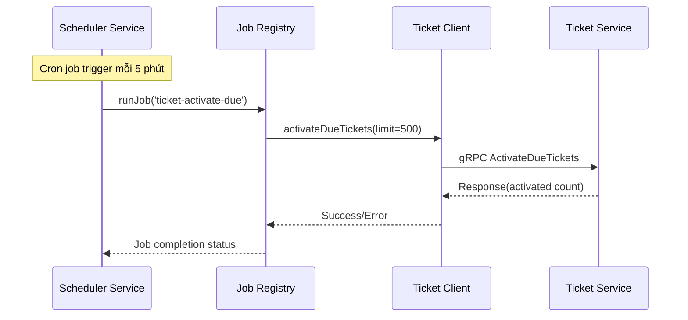
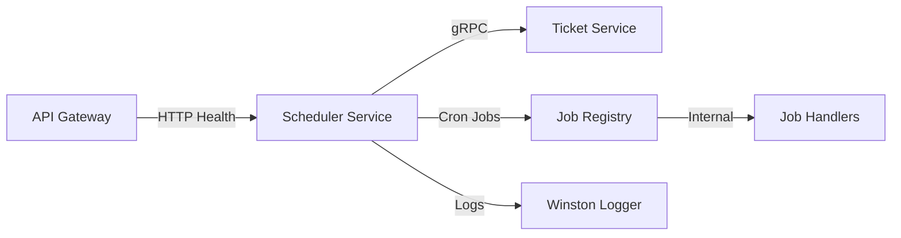

# Scheduler Service — Service README
> Mục đích: Mô tả kiến trúc, API, dữ liệu, vận hành, và tiêu chuẩn chất lượng cho service này.

## 1. Tổng quan
- **Chức năng chính**: Quản lý và thực thi các cron jobs trong hệ thống MetroHCM, đặc biệt là các tác vụ định kỳ liên quan đến vé tàu
- **Vai trò trong hệ MetroHCM**: Service trung tâm điều phối các tác vụ định kỳ, đảm bảo các business logic được thực thi đúng thời gian
- **Giao tiếp**: 
  - gRPC ⟷ ticket-service (ActivateDueTickets, PublishExpiringSoon)
  - HTTP ⟷ API Gateway (health checks)
- **Kiến trúc & pattern**: Layered Architecture với Job Registry pattern, SOLID principles, Dependency Injection
- **Lưu đồ chuỗi** cho luồng kích hoạt vé hết hạn:



## 2. Sơ đồ hệ thống (Mermaid)



## 3. API & Hợp đồng

### 3.1 gRPC endpoints

| RPC Method | Mô tả | Request | Response | Status Codes |
| ---------- | ----- | ------- | -------- | ------------ |
| GetStatus | Lấy trạng thái scheduler và danh sách jobs | GetStatusRequest (empty) | GetStatusResponse | OK, INTERNAL |
| Start | Khởi động tất cả jobs | StartRequest (empty) | StartResponse | OK, INTERNAL |
| Stop | Dừng tất cả jobs | StopRequest (empty) | StopResponse | OK, INTERNAL |
| TriggerJob | Kích hoạt job thủ công | TriggerJobRequest {jobId, force} | TriggerJobResponse | OK, NOT_FOUND |
| UpdateJob | Cập nhật cấu hình job | UpdateJobRequest {jobId, cron, enabled} | UpdateJobResponse | OK, NOT_FOUND |
| ListJobs | Liệt kê tất cả jobs | ListJobsRequest (empty) | ListJobsResponse | OK, INTERNAL |

### 3.2 HTTP Health endpoints

| Method | Path | Mô tả | Response |
| ------ | ---- | ----- | -------- |
| GET | /health | Health check với thông tin scheduler | JSON status |

### 3.3 Proto files

* **Vị trí file**: `src/proto/scheduler.proto`, `src/proto/ticketCron.proto`
* **Cách build/generate**: Sử dụng `@grpc/proto-loader` runtime loading
* **Versioning & Compatibility**: Proto3 syntax, backward compatible

### 3.4 Event (Kafka/Queue)

(Không tìm thấy trong repo) - Service này không sử dụng message queue, chỉ gRPC communication

## 4. Dữ liệu & Migrations

* **Loại CSDL**: Không sử dụng database - in-memory job registry
* **Bảng/collection chính**: (Không có - sử dụng Map trong memory)
* **Quan hệ & cascade**: (Không áp dụng)
* **Seeds/fixtures**: (Không có)
* **Cách chạy migration**: (Không áp dụng)

## 5. Cấu hình & Secrets

### 5.1 Biến môi trường (bảng bắt buộc)

| ENV | Bắt buộc | Giá trị mẫu | Mô tả | Phạm vi |
| --- | -------- | ----------- | ----- | ------- |
| NODE_ENV | Có | production | Môi trường chạy | development/production |
| SCHEDULER_GRPC_PORT | Có | 50060 | Port gRPC server | 1-65535 |
| SCHEDULER_TZ | Không | Asia/Ho_Chi_Minh | Timezone cho cron jobs | IANA timezone |
| PORT | Có | 8010 | Port HTTP health server | 1-65535 |
| NOOP_CRON | Không | * * * * * | Cron expression cho demo job | Valid cron |
| TICKET_GRPC_HOST | Có | ticket-service | Host ticket service | Hostname/IP |
| TICKET_GRPC_PORT | Có | 50052 | Port ticket service gRPC | 1-65535 |
| TICKET_ACTIVATE_CRON | Không | */5 * * * * | Cron cho activate tickets | Valid cron |
| TICKET_ACTIVATE_LIMIT | Không | 500 | Số lượng vé tối đa activate | Integer |
| TICKET_EXPIRING_CRON | Không | 0 8 * * * | Cron cho publish expiring | Valid cron |
| TICKET_EXPIRING_LIMIT | Không | 1000 | Số lượng vé tối đa publish | Integer |

### 5.2 Profiles

* **dev**: NODE_ENV=development, debug logging enabled
* **production**: NODE_ENV=production, info logging, optimized performance
* **Nguồn secrets**: .env file, Docker environment variables

## 6. Bảo mật & Tuân thủ

* **AuthN/AuthZ**: (Không tìm thấy trong repo) - gRPC server chạy insecure
* **Input validation & sanitize**: Cron expression validation trong JobRegistry
* **CORS & CSRF**: (Không áp dụng - gRPC service)
* **Rate limit / Anti-abuse**: Job concurrency control (1 job instance tại 1 thời điểm)
* **Nhật ký/Audit**: Winston logger với structured logging, daily rotation
* **Lỗ hổng tiềm ẩn & khuyến nghị**: 
  - Thiếu authentication cho gRPC endpoints
  - Không có rate limiting
  - Không có input sanitization cho job parameters

## 7. Độ tin cậy & Khả dụng

* **Timeouts/Retry/Backoff**: (Không tìm thấy trong repo) - cần implement
* **Circuit breaker/Bulkhead**: (Không tìm thấy trong repo)
* **Idempotency**: Job execution có force flag để override concurrency
* **Outbox/Saga/Orchestrator**: (Không áp dụng)
* **Khả năng phục hồi sự cố**: Graceful shutdown với SIGTERM/SIGINT handling

## 8. Observability

* **Logging**: Winston với JSON format, daily rotation, structured logging
  ```json
  {
    "timestamp": "2024-01-15 10:30:00",
    "level": "info",
    "message": "Job completed",
    "service": "scheduler-service",
    "jobId": "ticket-activate-due",
    "trigger": "scheduled",
    "duration": 1250
  }
  ```
* **Metrics**: (Không tìm thấy trong repo) - cần implement Prometheus metrics
* **Tracing**: (Không tìm thấy trong repo)
* **Healthchecks**: `/health` endpoint với scheduler status

## 9. Build, Run, Test

### 9.1 Local

```bash
# prerequisites
Node.js 20+, npm

# install dependencies
npm install

# run development
npm run dev

# run production
npm start
```

### 9.2 Docker/Compose

```bash
# build image
docker build -t scheduler-service .

# run container
docker run --env-file .env -p 50060:50060 -p 8010:8010 scheduler-service
```

### 9.3 Kubernetes/Helm (nếu có)

(Không tìm thấy trong repo)

### 9.4 Testing

(Không tìm thấy trong repo) - Không có test files

## 10. CI/CD

(Không tìm thấy trong repo) - Không có GitHub workflows

## 11. Hiệu năng & Quy mô

* **Bottlenecks đã thấy từ code**: 
  - In-memory job registry (không persistent)
  - Không có job queuing mechanism
  - Single-threaded job execution
* **Kỹ thuật**: 
  - Job duration tracking (last 20 runs)
  - Average duration calculation
  - Success rate approximation
* **Định hướng benchmark/kịch bản tải**: Cần load testing với multiple concurrent jobs

## 12. Rủi ro & Nợ kỹ thuật

* **Danh sách vấn đề hiện tại**:
  - Không có authentication/authorization
  - Không có persistent storage cho job state
  - Không có comprehensive error handling
  - Không có monitoring/metrics
  - Không có tests
* **Ảnh hưởng & ưu tiên**:
  - **High**: Security vulnerabilities, no persistence
  - **Medium**: No monitoring, no tests
* **Kế hoạch cải thiện**:
  - Implement JWT authentication
  - Add Redis for job persistence
  - Add Prometheus metrics
  - Implement comprehensive test suite

## 13. Phụ lục

* **Sơ đồ ERD**: (Không áp dụng - không có database)

* **Bảng mã lỗi chuẩn & cấu trúc response lỗi**:

| Error Code | Description | HTTP Status | gRPC Status |
| ---------- | ----------- | ----------- | ----------- |
| JOB_NOT_FOUND | Job ID không tồn tại | - | NOT_FOUND |
| JOB_DISABLED | Job đã bị disable | - | FAILED_PRECONDITION |
| JOB_RUNNING | Job đang chạy | - | ALREADY_EXISTS |
| INVALID_CRON | Cron expression không hợp lệ | - | INVALID_ARGUMENT |

* **License & 3rd-party**:
  - MIT License (inferred from package.json)
  - Dependencies: @grpc/grpc-js, node-cron, winston, express
