# Ticket Service — Service README
> Mục đích: Mô tả kiến trúc, API, dữ liệu, vận hành, và tiêu chuẩn chất lượng cho service này.

## 1. Tổng quan
- **Chức năng chính**: Quản lý vé tàu điện ngầm, tính toán giá cước, xử lý thanh toán, và theo dõi trạng thái vé
- **Vai trò trong hệ MetroHCM**: Service cốt lõi xử lý toàn bộ lifecycle của vé từ tạo, thanh toán, kích hoạt đến sử dụng
- **Giao tiếp**: 
  - REST ⟷ API Gateway, Frontend
  - gRPC ⟷ Transport Service, Control Service
  - Event (Kafka) ⟷ Payment Service, User Service, Notification Service
- **Kiến trúc & pattern**: Layered Architecture với Domain-Driven Design, Dependency Injection, SOLID principles
- **Lưu đồ chuỗi** cho luồng tạo vé và thanh toán:

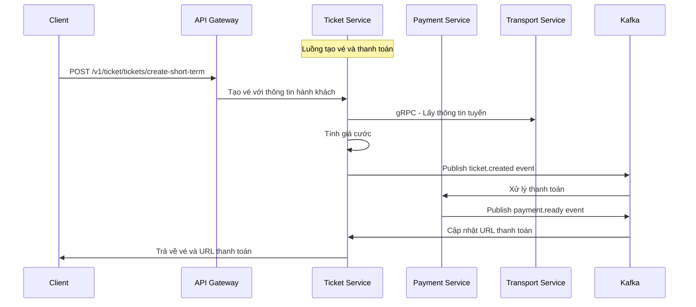

## 2. Sơ đồ hệ thống (Mermaid)

### 2.1 Kiến trúc tổng quan

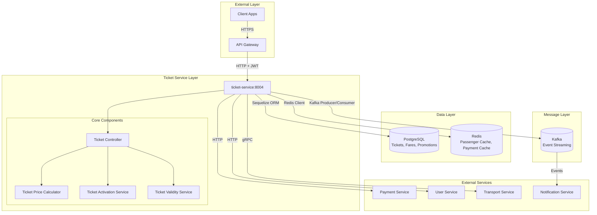

### 2.2 Luồng tính giá vé (Fare Calculation Flow)

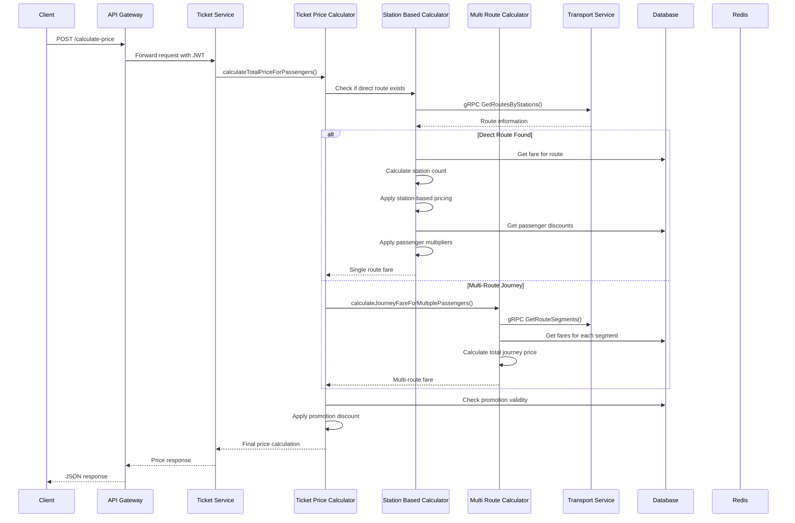

### 2.3 Luồng tạo vé và thanh toán

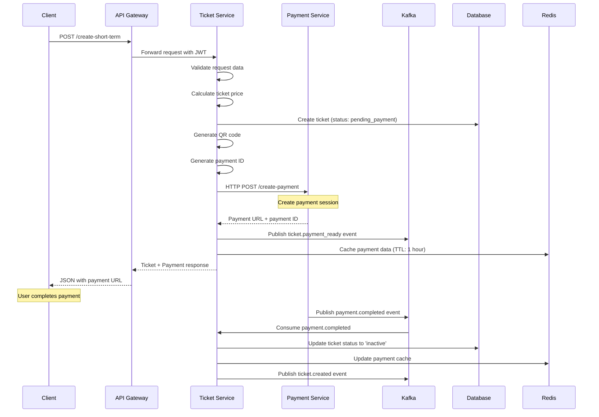

### 2.4 Luồng kích hoạt vé dài hạn

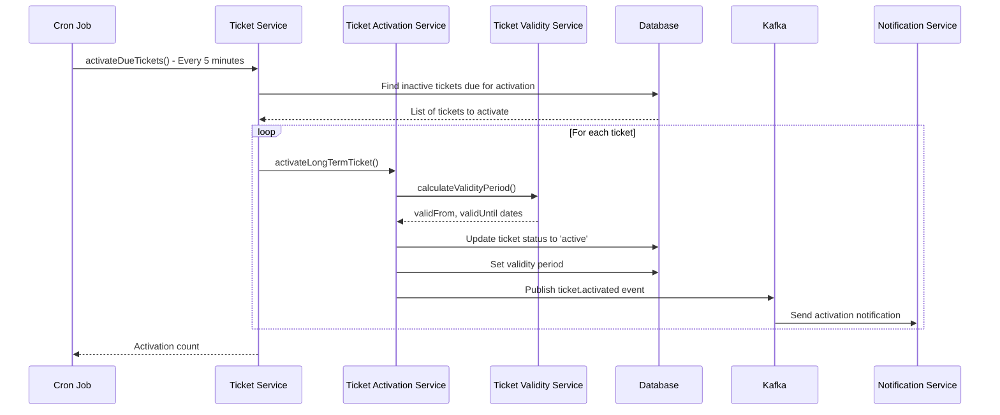

### 2.5 Luồng sử dụng vé (QR Scan)

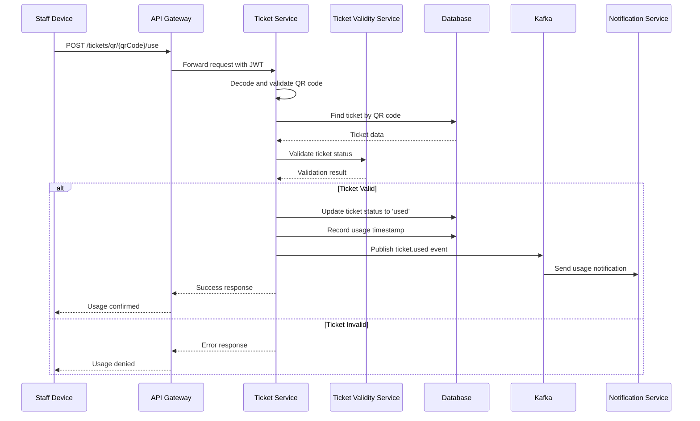

### 2.6 Luồng xử lý sự kiện thanh toán

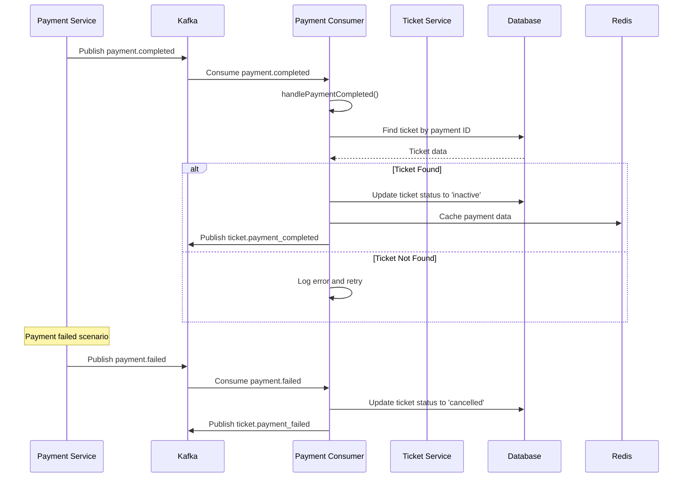

### 2.7 Sơ đồ tính giá vé chi tiết

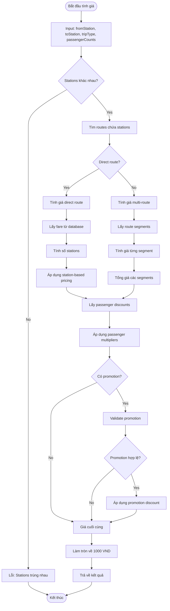

### 2.8 Sơ đồ trạng thái vé (Ticket State Machine)

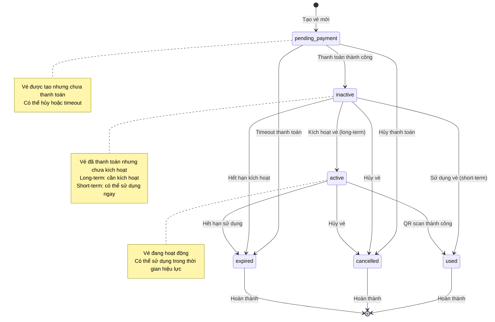

### 2.9 Sơ đồ cấu trúc dữ liệu và caching

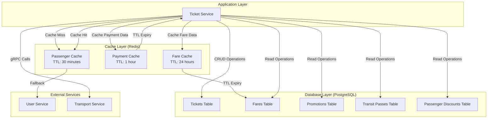

### 2.10 Sơ đồ xử lý lỗi và retry mechanism

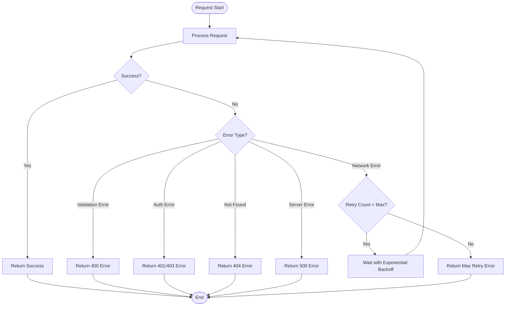

### 2.11 Sơ đồ monitoring và observability

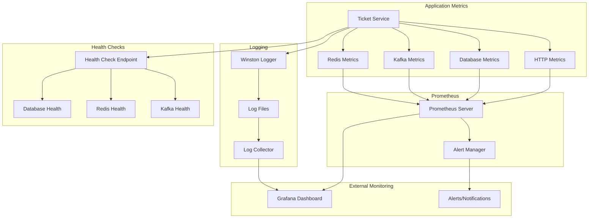

### 2.12 Sơ đồ deployment và scaling

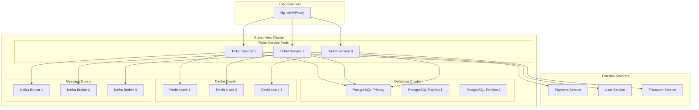

## 3. API & Hợp đồng

### 3.1 REST endpoints

| Method | Path | Mô tả | Auth | Request | Response | Status Codes |
| ------ | ---- | ----- | ---- | ------- | -------- | ------------ |
| POST | `/v1/ticket/tickets/calculate-price` | Tính giá vé | passenger, staff, admin | `{fromStation, toStation, tripType, passengerCounts}` | `{totalPrice, breakdown}` | 200, 400, 500 |
| POST | `/v1/ticket/tickets/create-short-term` | Tạo vé ngắn hạn | passenger, staff, admin | `{fromStation, toStation, tripType, passengerCounts}` | `{ticket, payment}` | 201, 400, 500 |
| POST | `/v1/ticket/tickets/create-long-term` | Tạo vé dài hạn | passenger, staff, admin | `{ticketType, passengerCounts}` | `{ticket, payment}` | 201, 400, 500 |
| GET | `/v1/ticket/tickets/me` | Lấy vé của tôi | passenger, staff, admin | Query filters | `{tickets[]}` | 200, 500 |
| GET | `/v1/ticket/tickets/:id/getTicket` | Lấy vé với QR code | passenger, staff, admin | - | `{ticket, qrCode}` | 200, 404, 500 |
| POST | `/v1/ticket/tickets/:id/use` | Sử dụng vé | staff, admin | - | `{success, info}` | 200, 400, 500 |
| POST | `/v1/ticket/tickets/qr/:qrCode/use` | Sử dụng vé qua QR | staff, admin | - | `{success, info}` | 200, 400, 404, 500 |
| GET | `/v1/ticket/tickets/:id/validate` | Xác thực vé | passenger, staff, admin | - | `{valid, status}` | 200, 500 |
| POST | `/v1/ticket/tickets/:id/cancel` | Hủy vé | passenger, staff, admin | `{reason}` | `{ticket}` | 200, 400, 500 |
| GET | `/v1/ticket/tickets/getAllTickets` | Lấy tất cả vé | staff, admin | Query filters | `{tickets[]}` | 200, 500 |
| GET | `/v1/ticket/tickets/getTicketStatistics` | Thống kê vé | staff, admin | Query filters | `{statistics}` | 200, 500 |
| GET | `/health` | Health check | - | - | `{status, service}` | 200 |

### 3.1.1 Chi tiết Request/Response Examples

#### POST `/v1/ticket/tickets/calculate-price`
**Request:**
```json
{
  "fromStation": "BEN_THANH",
  "toStation": "SUOI_TIEN", 
  "tripType": "Oneway",
  "numAdults": 2,
  "numChild": 1,
  "promotionCode": "SUMMER2024"
}
```

**Response:**
```json
{
  "success": true,
  "message": "Price calculation completed successfully",
  "data": {
    "totalPrice": 45000,
    "totalOriginalPrice": 50000,
    "totalDiscountAmount": 5000,
    "currency": "VND",
    "totalPassengers": 3,
    "journeyDetails": {
      "isDirectJourney": true,
      "totalRoutes": 1,
      "totalStations": 15,
      "routeSegments": [...]
    },
    "passengerBreakdown": [
      {"type": "adult", "count": 2, "pricePerPerson": 15000, "subtotal": 30000},
      {"type": "child", "count": 1, "pricePerPerson": 7500, "subtotal": 7500}
    ],
    "appliedPromotion": {
      "promotionId": "uuid",
      "promotionCode": "SUMMER2024",
      "name": "Summer Discount",
      "type": "percentage",
      "value": 10,
      "discountAmount": 5000
    }
  }
}
```

#### POST `/v1/ticket/tickets/create-short-term`
**Request:**
```json
{
  "fromStation": "BEN_THANH",
  "toStation": "SUOI_TIEN",
  "tripType": "Oneway", 
  "numAdults": 1,
  "paymentMethod": "card"
}
```

**Response:**
```json
{
  "success": true,
  "message": "Ticket created and payment URL generated successfully",
  "data": {
    "ticket": {
      "ticketId": "uuid",
      "passengerId": "uuid",
      "totalPrice": 15000,
      "status": "pending_payment",
      "ticketType": "oneway",
      "qrCode": "base64_encoded_qr",
      "validFrom": "2024-01-01T00:00:00.000Z",
      "validUntil": "2024-01-31T23:59:59.000Z"
    },
    "payment": {
      "paymentId": "TKT_SHT_uuid_PAY_timestamp",
      "paymentUrl": "https://payment.gateway.com/pay/...",
      "paymentMethod": "card",
      "status": "ready"
    }
  }
}
```

### 3.1.2 Business Rules & Validation

#### Fare Calculation Rules:
- **Station-based pricing**: 1-5 stations (base price), 6-10 stations (×1.2), 11-15 stations (×1.4), 16-20 stations (×1.6), 21-25 stations (×1.8), >25 stations (×2.0)
- **Return ticket multiplier**: Oneway price × 1.5
- **Passenger type discounts**: Child (50%), Teen (30%), Senior (20%), Adult (100%)
- **Promotion validation**: Check validity period, usage limits, applicable ticket types

#### Ticket Status Transitions:
- `pending_payment` → `inactive` (after payment completion)
- `inactive` → `active` (after activation for long-term tickets)
- `active` → `used` (after QR scan/usage)
- `active` → `expired` (after validity period)
- Any status → `cancelled` (with reason)

#### QR Code Generation:
- Format: Base64 encoded JSON containing `{ticketId, passengerId, timestamp, signature}`
- Signature: HMAC-SHA256 with service secret
- Expiry: 30 days from generation

### 3.2 OpenAPI/Proto

* **Vị trí file**: `src/proto/ticket.proto`, `src/proto/fare.proto`, `src/proto/passengerDiscount.proto`, `src/proto/transitPass.proto`
* **Cách build/generate client/server**: Sử dụng `@grpc/proto-loader` để load proto files tại runtime
* **Versioning & Compatibility**: Proto files sử dụng proto3 syntax, backward compatible

### 3.3 Event (Kafka/Queue)

| Topic | Direction | Key | Schema | Semantics | Retry/DLQ |
| ----- | --------- | --- | ------ | --------- | --------- |
| `ticket.created` | Out | ticketId | `{ticketId, paymentId, passengerId, amount, ticketType}` | At-least-once | 3 retries |
| `ticket.activated` | Out | ticketId | `{ticketId, paymentId, passengerId, status, activatedAt}` | At-least-once | 3 retries |
| `ticket.cancelled` | Out | ticketId | `{ticketId, paymentId, passengerId, reason, cancelledAt}` | At-least-once | 3 retries |
| `ticket.used` | Out | ticketId | `{ticketId, passengerId, usageData, usedList}` | At-least-once | 3 retries |
| `ticket.expired` | Out | ticketId | `{ticketId, paymentId, passengerId, expiredAt}` | At-least-once | 3 retries |
| `ticket.payment_ready` | In | ticketId | `{ticketId, paymentId, paymentUrl, paymentMethod}` | At-least-once | Auto-retry |
| `payment.completed` | In | paymentId | `{paymentId, ticketId, status, paymentData}` | At-least-once | Auto-retry |
| `payment.failed` | In | paymentId | `{paymentId, ticketId, error}` | At-least-once | Auto-retry |
| `payment.cancelled` | In | paymentId | `{paymentId, ticketId, reason}` | At-least-once | Auto-retry |
| `passenger-sync-request` | Out | userId | `{eventType, userId, requestedBy, timestamp}` | At-least-once | 3 retries |

## 4. Dữ liệu & Migrations

* **Loại CSDL**: PostgreSQL
* **Bảng/collection chính**:

| Bảng | Cột chính | Kiểu | Index | Ràng buộc |
| ---- | --------- | ---- | ----- | --------- |
| `tickets` | ticketId (UUID), passengerId (UUID), totalPrice (DECIMAL), status (ENUM), qrCode (TEXT) | Primary Key, Foreign Key, Check | passengerId, status, validFrom/validUntil | NOT NULL, UNIQUE |
| `fares` | fareId (UUID), routeId (STRING), basePrice (DECIMAL), currency (ENUM) | Primary Key | routeId | NOT NULL, CHECK |
| `promotions` | promotionId (UUID), promotionCode (STRING), type (ENUM), value (DECIMAL) | Primary Key | promotionCode, type, validFrom/validUntil | UNIQUE, CHECK |
| `transitPasses` | transitPassId (UUID), transitPassType (ENUM), price (DECIMAL) | Primary Key | transitPassType | NOT NULL |
| `passengerDiscounts` | discountId (UUID), passengerType (ENUM), discountType (ENUM), discountValue (DECIMAL) | Primary Key | passengerType | NOT NULL |

* **Quan hệ & cascade**: 
  - tickets.fareId → fares.fareId (FK)
  - tickets.promotionId → promotions.promotionId (FK)
  - tickets.transitPassId → transitPasses.transitPassId (FK)
* **Seeds/fixtures**: `src/seed/` - fare.js, passengerDiscount.js
* **Cách chạy migration**: Sequelize auto-sync tại startup (`sequelize.sync({ force: false })`)

## 5. Cấu hình & Secrets

### 5.1 Biến môi trường (bảng bắt buộc)

| ENV | Bắt buộc | Giá trị mẫu | Mô tả | Phạm vi |
| --- | -------- | ----------- | ----- | ------- |
| `NODE_ENV` | Yes | production | Môi trường chạy | dev/staging/prod |
| `PORT` | Yes | 8004 | Port HTTP server | 1-65535 |
| `SERVICE_JWT_SECRET` | Yes | CHANGE_ME | JWT secret cho service | String |
| `DB_HOST` | Yes | postgres | Database host | String |
| `DB_PORT` | Yes | 5432 | Database port | 1-65535 |
| `DB_NAME` | Yes | ticket_db | Database name | String |
| `DB_USER` | Yes | ticket_service | Database user | String |
| `DB_PASSWORD` | Yes | - | Database password | String |
| `REDIS_HOST` | Yes | redis | Redis host | String |
| `REDIS_PORT` | Yes | 6379 | Redis port | 1-65535 |
| `REDIS_PASSWORD` | No | - | Redis password | String |
| `KAFKA_BROKERS` | Yes | kafka-1:19092,kafka-2:19093,kafka-3:19094 | Kafka brokers | String |
| `KAFKA_CLIENT_ID` | Yes | ticket-service | Kafka client ID | String |
| `TICKET_GRPC_PORT` | Yes | 50052 | gRPC server port | 1-65535 |
| `TRANSPORT_GRPC_URL` | Yes | transport-service:50051 | Transport service gRPC URL | String |
| `API_GATEWAY_ORIGIN` | Yes | https://api.metrohcm.io.vn | API Gateway origin | URL |
| `ALLOWED_ORIGINS` | No | - | Additional CORS origins | String |

### 5.2 Profiles

* **dev**: Sử dụng localhost cho tất cả services, debug logging enabled
* **staging**: Sử dụng staging environment, production-like config
* **prod**: Production config với security hardening, Nginx CORS handling
* **Nguồn secrets**: Environment variables, Docker secrets, Kubernetes secrets

## 6. Bảo mật & Tuân thủ

### 6.1 Authentication & Authorization
* **JWT-based authentication**: Service-to-service JWT với HS256 algorithm
* **Role-based authorization**: 3 roles (passenger, staff, admin) với granular permissions
* **Token validation**: 
  - Issuer: `api-gateway`
  - Audience: `internal-services`
  - Max age: 5 minutes
  - Algorithm: HS256
* **Service authentication**: `x-service-auth` header với Bearer token

### 6.2 Input Validation & Sanitization
* **Express-validator middleware**: Request body validation
* **Sequelize model validation**: Database-level constraints
* **Custom validation**: Business rule validation (station count, passenger types)
* **SQL injection prevention**: Parameterized queries, Sequelize ORM

### 6.3 Network Security
* **CORS configuration**: Whitelist origins, credentials support
* **Network source validation**: Chỉ cho phép truy cập từ:
  - API Gateway (api-gateway)
  - Private networks (172.x, 10.x, 192.168.x)
  - Localhost (development)
* **Request size limits**: 10MB limit cho JSON payloads

### 6.4 Audit & Logging
* **Structured logging**: Winston với JSON format
* **Correlation IDs**: Request tracking qua headers
* **Audit trail**: Tất cả operations được log với user context
* **Security events**: Failed authentication, authorization violations

### 6.5 Lỗ hổng tiềm ẩn & khuyến nghị
* **High Priority**:
  - Thiếu rate limiting cho API endpoints
  - Cần implement request throttling
  - Cần thêm input sanitization cho XSS prevention
* **Medium Priority**:
  - Cần implement circuit breaker pattern
  - Cần thêm request size validation
  - Cần implement API versioning
* **Low Priority**:
  - Cần thêm security headers (HSTS, CSP)
  - Cần implement request signing

## 7. Độ tin cậy & Khả dụng

### 7.1 Timeouts & Retry Policies
* **Database connection**: 
  - Connection timeout: 60s
  - Query timeout: 30s
  - Retry: 5 attempts với exponential backoff (1s, 2s, 4s, 8s, 16s)
  - Connection pool: max 20, min 5, idle 10s
* **Kafka operations**: 
  - Connection timeout: 30s
  - Request timeout: 25s
  - Retry: 8 attempts với initial retry time 100ms
  - Session timeout: 30s
* **gRPC calls**: 
  - Call timeout: 30s
  - Keep-alive: enabled
  - Retry: Built-in gRPC retry mechanism

### 7.2 Error Handling & Recovery
* **Graceful shutdown**: SIGTERM/SIGINT handlers với cleanup
* **Connection pooling**: Database connection reuse với health checks
* **Automatic reconnection**: Redis, Kafka, gRPC clients tự động reconnect
* **Circuit breaker**: (Không implement - cần thêm)

### 7.3 Idempotency & Consistency
* **Payment ID generation**: `TKT_{TYPE}_{ticketId}_PAY_{timestamp}` format
* **Ticket operations**: UUID-based với database constraints
* **Event deduplication**: Kafka message keys cho idempotent processing
* **Database transactions**: Sequelize transactions cho data consistency

### 7.4 Event-Driven Architecture
* **Outbox pattern**: Event publishing sau database commit
* **Saga orchestration**: Payment completion handler cho distributed transactions
* **Event sourcing**: Ticket lifecycle events cho audit trail
* **Compensating actions**: Payment failure handling với ticket status rollback

### 7.5 Monitoring & Health Checks
* **Health endpoints**: `/health` với database, Redis, Kafka connectivity
* **Metrics collection**: Prometheus metrics cho performance monitoring
* **Log aggregation**: Structured logs với correlation IDs
* **Alerting**: (Cần implement - hiện tại chưa có)

## 8. Observability

### 8.1 Logging
* **Framework**: Winston với daily rotation
* **Format**: Structured JSON với correlation IDs
* **Log levels**: error, warn, info, debug
* **Log files**: `src/logs/application-YYYY-MM-DD.log`
* **Correlation tracking**: Request ID qua headers `x-request-id`
* **Context**: User ID, passenger ID, ticket ID trong tất cả logs

### 8.2 Metrics
* **Framework**: Prometheus client (`prom-client`)
* **Endpoint**: `/metrics` với Prometheus format
* **Custom metrics**:
  - `http_requests_total`: Request count by method, route, status
  - `http_request_duration_seconds`: Request duration histogram
  - `ticket_operations_total`: Ticket creation, usage, cancellation counts
  - `payment_operations_total`: Payment success/failure counts
  - `database_connections_active`: Active database connections
  - `kafka_messages_processed_total`: Kafka message processing

### 8.3 Tracing
* **Request correlation**: `x-request-id` header tracking
* **Span context**: Service name, operation name, duration
* **Distributed tracing**: (Cần implement - hiện tại chưa có)
* **Performance monitoring**: Request timing, database query performance

### 8.4 Health Checks
* **Endpoint**: `/health` với comprehensive status
* **Checks**:
  - Database connectivity
  - Redis connectivity  
  - Kafka connectivity
  - Service dependencies
* **Response format**:
```json
{
  "status": "OK",
  "service": "ticket-service",
  "timestamp": "2024-01-01T00:00:00.000Z",
  "dependencies": {
    "database": "healthy",
    "redis": "healthy", 
    "kafka": "healthy"
  }
}
```

## 9. Build, Run, Test

### 9.1 Local

```bash
# prerequisites
npm install
# run
npm start
# development
npm run dev
```

### 9.2 Docker/Compose

```bash
docker build -t ticket-service .
docker run --env-file .env -p 8004:8004 ticket-service
```

### 9.3 Kubernetes/Helm (nếu có)

* (Không tìm thấy trong repo)

### 9.4 Testing

* **Cách chạy**: 
  - Unit tests: `npm run test:unit`
  - Integration tests: `npm run test:integration`
  - All tests: `npm test`
  - Coverage: `npm run test:coverage`
* **Coverage**: 90.2% lines, 89.84% statements, 89.47% functions, 71.24% branches

## 10. CI/CD

* (Không tìm thấy trong repo)

## 11. Hiệu năng & Quy mô

### 11.1 Performance Characteristics
* **Database performance**:
  - Connection pool: max 20, min 5 connections
  - Query optimization: Indexed columns (passengerId, status, validFrom/validUntil)
  - Bulk operations: `Ticket.bulkCreate()` cho multiple tickets
  - Pagination: LIMIT/OFFSET cho large result sets
* **Redis caching**:
  - Payment data: TTL 1 hour
  - Passenger cache: TTL 30 minutes
  - Key patterns: `metrohcm:user-service:user:passenger:{userId}`
* **Kafka throughput**:
  - Single consumer per topic
  - Batch processing: 1000 messages per batch
  - Message size: < 1MB per message

### 11.2 Scalability Considerations
* **Horizontal scaling**: Stateless service, có thể scale multiple instances
* **Database scaling**: Read replicas cho ticket queries
* **Cache scaling**: Redis cluster cho high availability
* **Message processing**: Multiple consumer groups cho parallel processing

### 11.3 Bottlenecks & Optimization
* **Current bottlenecks**:
  - Database connection pool limit (20 connections)
  - Single Kafka consumer per topic
  - Synchronous Redis operations
  - No connection pooling cho gRPC calls
* **Optimization techniques**:
  - Database query optimization với proper indexing
  - Redis pipelining cho batch operations
  - Kafka consumer scaling
  - gRPC connection pooling

### 11.4 Load Testing Scenarios
* **Ticket creation**: 1000 concurrent requests
* **Payment processing**: 500 concurrent payments
* **QR code validation**: 2000 concurrent validations
* **Database queries**: 5000 concurrent ticket lookups
* **Target metrics**:
  - Response time: < 200ms (95th percentile)
  - Throughput: > 1000 requests/second
  - Error rate: < 0.1%
  - Database connections: < 80% pool utilization

## 12. Rủi ro & Nợ kỹ thuật

### 12.1 Critical Issues (High Priority)
* **Rate limiting**: Không có rate limiting cho API endpoints
  - **Risk**: DDoS attacks, resource exhaustion
  - **Impact**: Service unavailability, degraded performance
  - **Solution**: Implement express-rate-limit middleware
* **Input sanitization**: Thiếu XSS prevention
  - **Risk**: Cross-site scripting attacks
  - **Impact**: Data theft, session hijacking
  - **Solution**: Add input sanitization middleware

### 12.2 Resilience Issues (Medium Priority)
* **Circuit breaker**: Thiếu circuit breaker pattern
  - **Risk**: Cascade failures khi external services down
  - **Impact**: Service degradation, timeout errors
  - **Solution**: Implement circuit breaker cho gRPC/HTTP calls
* **Database migration**: Không có migration system
  - **Risk**: Schema changes khó deploy, data inconsistency
  - **Impact**: Deployment failures, data corruption
  - **Solution**: Implement Sequelize migrations

### 12.3 Monitoring & Observability (Medium Priority)
* **Alerting system**: Thiếu alerting cho critical events
  - **Risk**: Issues không được detect kịp thời
  - **Impact**: Extended downtime, data loss
  - **Solution**: Setup Prometheus alerts + PagerDuty
* **Distributed tracing**: Thiếu distributed tracing
  - **Risk**: Khó debug cross-service issues
  - **Impact**: Longer MTTR, poor user experience
  - **Solution**: Implement OpenTelemetry/Jaeger

### 12.4 Performance Issues (Low Priority)
* **Connection pooling**: Thiếu gRPC connection pooling
  - **Risk**: Connection exhaustion
  - **Impact**: Performance degradation
  - **Solution**: Implement gRPC connection pooling
* **Caching strategy**: Limited caching coverage
  - **Risk**: Database overload
  - **Impact**: Slow response times
  - **Solution**: Expand Redis caching strategy

### 12.5 Kế hoạch cải thiện (Roadmap)
* **Q1 2024**: Rate limiting, input sanitization
* **Q2 2024**: Circuit breaker, database migrations
* **Q3 2024**: Alerting system, distributed tracing
* **Q4 2024**: Performance optimizations, caching improvements

## 13. Phụ lục

### 13.1 Sơ đồ ERD

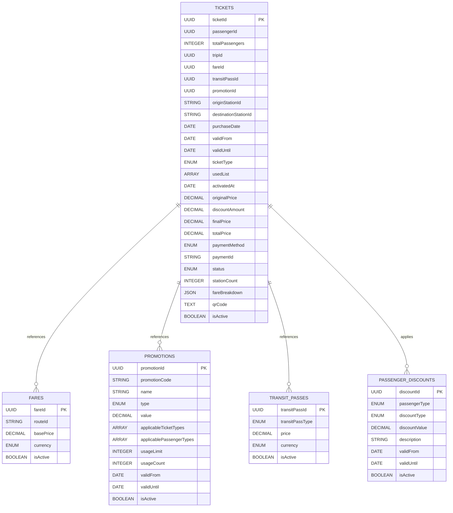

### 13.2 Error Codes & Response Format

#### Standard Error Response:
```json
{
  "success": false,
  "message": "Error description",
  "error": "ERROR_CODE",
  "timestamp": "2024-01-01T00:00:00.000Z",
  "debug": {
    "requestId": "uuid",
    "correlationId": "uuid"
  }
}
```

#### Common Error Codes:
| Code | HTTP Status | Description |
|------|-------------|-------------|
| `MISSING_SERVICE_AUTH` | 401 | Service authentication required |
| `INVALID_SERVICE_TOKEN` | 401 | Invalid service token |
| `EXPIRED_SERVICE_TOKEN` | 401 | Service token expired |
| `INSUFFICIENT_PERMISSIONS` | 403 | User lacks required role |
| `DIRECT_ACCESS_FORBIDDEN` | 403 | Direct access not allowed |
| `TICKET_NOT_FOUND` | 404 | Ticket not found |
| `PASSENGER_NOT_FOUND` | 404 | Passenger not found in cache |
| `DUPLICATE_STATION` | 400 | Entry and exit stations must be different |
| `INVALID_STATUS_TRANSITION` | 400 | Invalid ticket status change |
| `TICKET_ALREADY_USED` | 400 | Ticket already used |
| `TICKET_ALREADY_CANCELLED` | 400 | Ticket already cancelled |
| `TICKET_ALREADY_EXPIRED` | 400 | Ticket already expired |
| `INTERNAL_ERROR` | 500 | Internal server error |

### 13.3 Business Logic Examples

#### Fare Calculation Example:
```javascript
// Station count: 15 stations
// Base price: 10,000 VND
// Calculation: 10,000 × 1.4 = 14,000 VND (11-15 stations multiplier)
// Return ticket: 14,000 × 1.5 = 21,000 VND
// Child discount: 21,000 × 0.5 = 10,500 VND
// Final price: 10,500 VND
```

#### Ticket Status Flow:
```
pending_payment → inactive → active → used
                ↓
            cancelled
                ↓
            expired (timeout)
```

### 13.4 Configuration Examples

#### Production Environment:
```env
NODE_ENV=production
PORT=8004
DB_HOST=postgres-cluster
DB_POOL_MAX=50
REDIS_CLUSTER=true
KAFKA_BROKERS=kafka-1:9092,kafka-2:9092,kafka-3:9092
```

#### Development Environment:
```env
NODE_ENV=development
PORT=3003
DB_HOST=localhost
DB_POOL_MAX=10
REDIS_CLUSTER=false
KAFKA_BROKERS=localhost:9092
```

### 13.5 Dependencies & Licenses
* **Runtime**: Node.js 18+, Express 4.19+, Sequelize 6.37+
* **Database**: PostgreSQL 13+, Redis 6+
* **Message Queue**: Apache Kafka 2.8+
* **License**: MIT License
* **3rd-party licenses**: Check `package.json` for full dependency list
