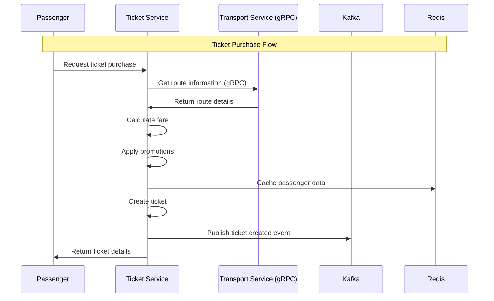

# Ticket Service

Microservice handling ticket management, fare calculation, and promotions for the Metro backend system.

## Overview

The Ticket Service manages:
- **Ticket Management**: Creation, validation, and lifecycle management of transit tickets
- **Fare Calculation**: Dynamic pricing based on routes, zones, and passenger types
- **Promotion System**: Discount codes, promotional campaigns, and special offers
- **Passenger Cache**: Redis-based caching for improved performance

### Key Features:
- ✅ **Flexible Fare System**: Zone-based, distance-based, and time-based pricing
- ✅ **Promotion Engine**: Percentage and fixed-amount discounts
- ✅ **Passenger Caching**: Fast access to passenger data via Redis
- ✅ **Event-Driven**: Kafka integration for real-time updates
- ✅ **gRPC Integration**: Efficient communication with transport service

## Features

### Ticket Management
- Ticket creation and validation
- QR code generation for digital tickets
- Ticket expiration and usage tracking
- Multi-ride ticket support

### Fare System
- Zone-based fare calculation
- Distance-based pricing
- Time-based fare adjustments
- Passenger type discounts (student, senior, etc.)

### Promotion Management
- Promotional code system
- Percentage and fixed-amount discounts
- Campaign management with validity periods
- Usage limit enforcement

### Passenger Caching
- Redis-based passenger data caching
- Automatic cache invalidation
- Performance optimization for frequent operations

## API Endpoints

### Ticket Routes (`/v1/tickets`)
- `POST /create` - Create new ticket
- `GET /:id` - Get ticket details
- `PUT /:id/validate` - Validate ticket for use
- `GET /passenger/:passengerId` - Get passenger tickets
- `DELETE /:id` - Cancel/refund ticket

### Fare Routes (`/v1/fares`)
- `GET /` - Get all fare rules
- `POST /calculate` - Calculate fare for route
- `GET /zones` - Get zone information
- `POST /` - Create fare rule (admin only)
- `PUT /:id` - Update fare rule (admin only)
- `DELETE /:id` - Delete fare rule (admin only)

### Promotion Routes (`/v1/promotions`)
- `GET /` - Get active promotions
- `POST /apply` - Apply promotion code
- `GET /:code` - Get promotion details
- `POST /` - Create promotion (admin only)
- `PUT /:id` - Update promotion (admin only)
- `DELETE /:id` - Delete promotion (admin only)

## Architecture

```
ticket-service/
├── src/
│   ├── config/          # Database, Redis, logger configs
│   ├── models/          # Sequelize models (Ticket, Fare, Promotion)
│   ├── controllers/     # HTTP request handlers
│   ├── services/        # Business logic
│   ├── routes/          # Express routes
│   ├── events/          # Kafka event handlers
│   ├── grpc/            # gRPC client for transport service
│   ├── proto/           # Protocol buffer definitions
│   ├── kafka/           # Kafka utilities
│   ├── middlewares/     # Authorization, etc.
│   ├── helpers/         # Utility functions
│   ├── app.js           # Express application
│   └── index.js         # Entry point
├── package.json
├── Dockerfile
└── README.md
```

## Environment Variables

Create a `.env` file in the ticket-service directory:

```env
NODE_ENV=production
PORT=3003

#Service JWT
SERVICE_JWT_SECRET=ad9be0a348b0e7825a2f3487cb27db4779628e0e4d4c2c6bf1375feb80571b56

# Database
DB_HOST=postgres
DB_PORT=5432
DB_NAME=ticket_db
DB_USER=ticket_service
DB_PASSWORD=ticketpass


# Redis
REDIS_HOST=redis
REDIS_PORT=6379
REDIS_PASSWORD=${REDIS_PASSWORD:-redispass123}
REDIS_KEY_PREFIX=${REDIS_KEY_PREFIX:-api_gateway_dev_}


KAFKA_BROKERS=kafka-1:19092,kafka-2:19093,kafka-3:19094
KAFKA_CLIENT_ID=ticket-service
KAFKA_BROKERS_INTERNAL=kafka-1:19092,kafka-2:19093,kafka-3:19094
```

### Environment Variables Explanation:

#### 🏗️ **Application Configuration**
- **NODE_ENV**: Runtime environment (development/production)
- **PORT**: Service port (default: 3003)

#### 🔐 **Authentication**
- **SERVICE_JWT_SECRET**: JWT secret for inter-service communication

#### 📊 **Database Configuration**
- **DB_HOST**: PostgreSQL host
- **DB_PORT**: PostgreSQL port
- **DB_NAME**: Database name for ticket service
- **DB_USER**: Database username
- **DB_PASSWORD**: Database password

#### 🚀 **Redis Configuration**
- **REDIS_HOST**: Redis server host
- **REDIS_PORT**: Redis server port
- **REDIS_PASSWORD**: Redis authentication password
- **REDIS_KEY_PREFIX**: Key prefix for ticket service cache

#### 📨 **Event System (Kafka)**
- **KAFKA_BROKERS**: Kafka broker addresses
- **KAFKA_CLIENT_ID**: Unique client identifier
- **KAFKA_BROKERS_INTERNAL**: Internal Kafka broker addresses

## Getting Started

### Development
```bash
# Install dependencies
npm install

# Start development server
npm run dev
```

### Docker
```bash
# Build and run with docker-compose
docker-compose up ticket-service
```

## Fare Calculation Logic

### Zone-Based Fares
- Metro system divided into fare zones
- Price increases with zone crossings
- Base fare + zone multiplier

### Distance-Based Pricing
- Calculated using station coordinates
- Linear pricing based on distance
- Minimum fare guarantee

### Promotional Discounts
- Percentage discounts (e.g., 20% off)
- Fixed amount discounts (e.g., $5 off)
- Conditional discounts (minimum purchase, specific routes)

## Event Flow



### Event Processing:

1. **Passenger Cache Updates**: Redis caching for performance
2. **Fare Calculations**: Real-time pricing based on routes
3. **Promotion Application**: Automatic discount application
4. **Event Publishing**: Ticket lifecycle events for other services

## Integration

### gRPC Communication
- **Transport Service**: Route and station information
- **Protocol Buffers**: Efficient data serialization
- **Load Balancing**: Automatic service discovery

### Redis Caching
- **Passenger Data**: Frequently accessed passenger information
- **Fare Rules**: Cached fare calculations
- **Promotion Codes**: Fast promotion validation

## Health Check & Monitoring

### Endpoints:
- **Health Check**: `GET /health` - Service health status
- **Database Check**: Included in health endpoint
- **Redis Check**: Included in health endpoint
- **Kafka Check**: Included in health endpoint

### Monitoring Features:
- **Winston Logging**: Structured logging with daily rotation
- **Error Tracking**: Comprehensive error handling with correlation IDs
- **Performance Metrics**: Request timing and database query performance
- **Event Tracking**: Kafka message processing status
- **Cache Metrics**: Redis performance and hit rates 