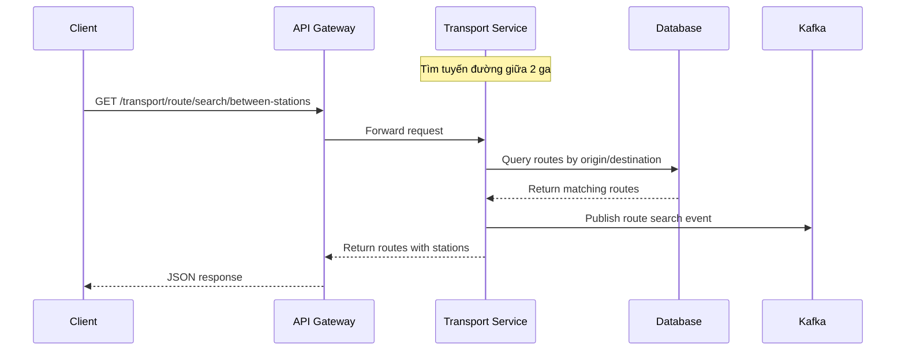
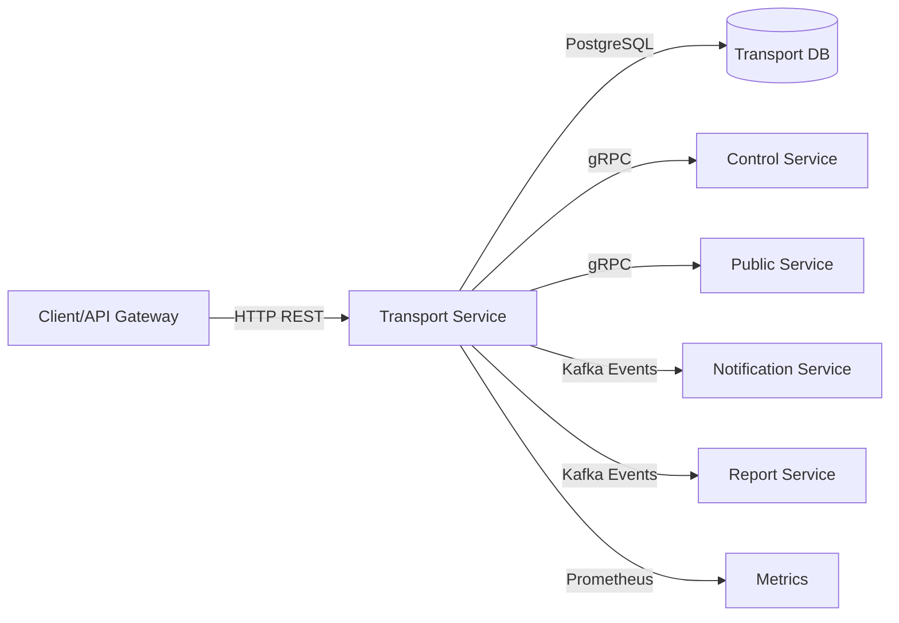
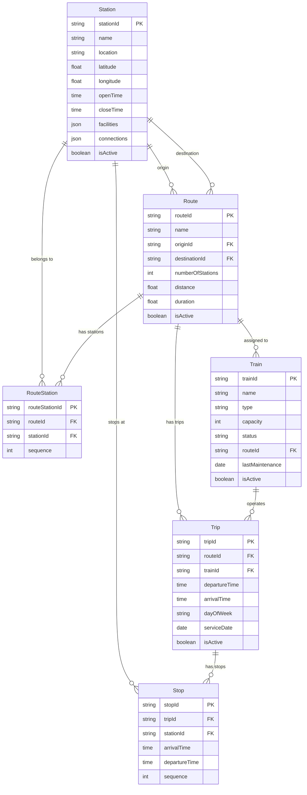

# Transport Service — Service README

## 1. Tổng quan
- **Chức năng chính**: Quản lý hệ thống giao thông Metro TPHCM bao gồm tuyến đường, ga tàu, chuyến tàu, tàu và điểm dừng
- **Vai trò trong hệ MetroHCM**: Service cốt lõi cung cấp thông tin giao thông công cộng cho các service khác (ticket, user, notification)
- **Giao tiếp**: 
  - REST API ⟷ API Gateway, User Service, Ticket Service
  - gRPC ⟷ Control Service, Public Service
  - Kafka Events ⟷ Notification Service, Report Service
- **Kiến trúc & pattern**: Layered Architecture với SOLID principles, Dependency Injection, Repository pattern
- **Lưu đồ chuỗi** cho luồng tìm tuyến đường:



## 2. Sơ đồ hệ thống (Mermaid)



## 3. API & Hợp đồng

### 3.1 REST endpoints

| Method | Path | Mô tả | Auth | Request | Response | Status Codes |
| ------ | ---- | ----- | ---- | ------- | -------- | ------------ |
| GET | `/v1/transport/route/` | Lấy tất cả tuyến | passenger/staff/admin | - | `{routes: Route[]}` | 200, 401, 403 |
| GET | `/v1/transport/route/active` | Lấy tuyến đang hoạt động | passenger/staff/admin | - | `{routes: Route[]}` | 200, 401, 403 |
| GET | `/v1/transport/route/search/between-stations` | Tìm tuyến giữa 2 ga | passenger/staff/admin | `?originId&destinationId` | `{routes: Route[]}` | 200, 400, 401, 403 |
| GET | `/v1/transport/route/:id` | Lấy tuyến theo ID | passenger/staff/admin | - | `{route: Route}` | 200, 404, 401, 403 |
| GET | `/v1/transport/route/:routeId/stations` | Lấy ga theo tuyến | passenger/staff/admin | - | `{stations: Station[]}` | 200, 404, 401, 403 |
| POST | `/v1/transport/route/` | Tạo tuyến mới | admin | `{name, originId, destinationId, distance, duration}` | `{route: Route}` | 201, 400, 401, 403 |
| PUT | `/v1/transport/route/:id` | Cập nhật tuyến | admin | `{name?, distance?, duration?, isActive?}` | `{route: Route}` | 200, 404, 400, 401, 403 |
| DELETE | `/v1/transport/route/:id` | Xóa tuyến | admin | - | `{message: string}` | 200, 404, 401, 403 |
| GET | `/v1/transport/station/` | Lấy tất cả ga | passenger/staff/admin | - | `{stations: Station[]}` | 200, 401, 403 |
| GET | `/v1/transport/station/:id` | Lấy ga theo ID | passenger/staff/admin | - | `{station: Station}` | 200, 404, 401, 403 |
| GET | `/v1/transport/train/` | Lấy tất cả tàu | passenger/staff/admin | - | `{trains: Train[]}` | 200, 401, 403 |
| GET | `/v1/transport/trip/` | Lấy tất cả chuyến | passenger/staff/admin | - | `{trips: Trip[]}` | 200, 401, 403 |
| GET | `/health` | Health check | - | - | `{status: "OK", service: string}` | 200 |

### 3.2 gRPC (Proto)

* **Vị trí file**: `src/proto/transport.proto`
* **Cách build/generate**: Sử dụng `@grpc/proto-loader` để load proto file
* **Versioning & Compatibility**: Proto3 syntax, backward compatible

**Các RPC methods**:
- `GetRoute(GetRouteRequest) returns (RouteResponse)`
- `GetStation(GetStationRequest) returns (StationResponse)`
- `GetTrip(GetTripRequest) returns (TripResponse)`
- `GetRoutesByStations(GetRoutesByStationsRequest) returns (RoutesResponse)`
- `GetRouteStations(GetRouteStationsRequest) returns (RouteStationsResponse)`
- `CalculateStationCount(CalculateStationCountRequest) returns (StationCountResponse)`
- `ListRoutes(ListRoutesRequest) returns (RoutesResponse)`
- `ListTrains(ListTrainsRequest) returns (TrainsResponse)`
- `BulkUpsertTrips(BulkUpsertTripsRequest) returns (BulkUpsertTripsResponse)`
- `BulkUpsertStops(BulkUpsertStopsRequest) returns (BulkUpsertStopsResponse)`

### 3.3 Event (Kafka)

| Topic | Direction | Key | Schema | Semantics | Retry/DLQ |
| ----- | --------- | --- | ------ | --------- | --------- |
| `route.created` | Producer | routeId | `{routeId, name, originId, destinationId}` | At-least-once | 8 retries |
| `route.updated` | Producer | routeId | `{routeId, changes: object}` | At-least-once | 8 retries |
| `station.created` | Producer | stationId | `{stationId, name, location, coordinates}` | At-least-once | 8 retries |
| `trip.created` | Producer | tripId | `{tripId, routeId, trainId, schedule}` | At-least-once | 8 retries |
| `transport.search` | Producer | searchId | `{query, results, timestamp}` | At-least-once | 8 retries |

## 4. Dữ liệu & Migrations

* **Loại CSDL**: PostgreSQL
* **Bảng chính**:

| Bảng | Cột chính | Kiểu | Index | Ràng buộc |
| ---- | --------- | ---- | ----- | --------- |
| `Stations` | `stationId` (PK), `name`, `location`, `latitude`, `longitude`, `openTime`, `closeTime`, `facilities` (JSON), `connections` (JSON), `isActive` | STRING(100), STRING(100), STRING(100), FLOAT, FLOAT, TIME, TIME, JSON, JSON, BOOLEAN | `stationId`, `name` | NOT NULL constraints |
| `Routes` | `routeId` (PK), `name`, `originId` (FK), `destinationId` (FK), `numberOfStations`, `distance`, `duration`, `isActive` | STRING(100), STRING(100), STRING(100), STRING(100), INTEGER, FLOAT, FLOAT, BOOLEAN | `routeId`, `originId`, `destinationId` | Foreign keys to Stations |
| `RouteStations` | `routeStationId` (PK), `routeId` (FK), `stationId` (FK), `sequence` | STRING(100), STRING(100), STRING(100), INTEGER | `routeId`, `stationId`, `sequence` | Composite unique on (routeId, sequence) |
| `Trains` | `trainId` (PK), `name`, `type`, `capacity`, `status`, `routeId` (FK), `lastMaintenance`, `isActive` | STRING(100), STRING(100), STRING(50), INTEGER, STRING(50), STRING(100), DATE, BOOLEAN | `trainId`, `routeId`, `status` | Foreign key to Routes |
| `Trips` | `tripId` (PK), `routeId` (FK), `trainId` (FK), `departureTime`, `arrivalTime`, `dayOfWeek`, `serviceDate`, `isActive` | STRING(100), STRING(100), STRING(100), TIME, TIME, STRING(20), DATE, BOOLEAN | `tripId`, `routeId`, `trainId`, `serviceDate` | Foreign keys to Routes, Trains |
| `Stops` | `stopId` (PK), `tripId` (FK), `stationId` (FK), `arrivalTime`, `departureTime`, `sequence` | STRING(100), STRING(100), STRING(100), TIME, TIME, INTEGER | `tripId`, `stationId`, `sequence` | Foreign keys to Trips, Stations |

* **Quan hệ & cascade**: 
  - Route → Station (origin/destination): CASCADE DELETE
  - Route → RouteStation: CASCADE DELETE
  - Route → Trip: CASCADE DELETE
  - Train → Trip: CASCADE DELETE
  - Trip → Stop: CASCADE DELETE
* **Seeds/fixtures**: `src/seed/` - Khởi tạo dữ liệu Metro TPHCM thực tế
* **Cách chạy migration**: Tự động sync khi khởi động service (`sequelize.sync()`)

## 5. Cấu hình & Secrets

### 5.1 Biến môi trường

| ENV | Bắt buộc | Giá trị mẫu | Mô tả | Phạm vi |
| --- | -------- | ----------- | ----- | ------- |
| `NODE_ENV` | ✅ | `production` | Môi trường chạy | dev/staging/prod |
| `PORT` | ✅ | `8003` | Port HTTP server | 1-65535 |
| `SERVICE_JWT_SECRET` | ✅ | `CHANGE_ME` | Secret cho JWT service-to-service | String |
| `DB_HOST` | ✅ | `postgres` | Host PostgreSQL | IP/Domain |
| `DB_PORT` | ✅ | `5432` | Port PostgreSQL | 1-65535 |
| `DB_NAME` | ✅ | `transport_db` | Tên database | String |
| `DB_USER` | ✅ | `transport_service` | Username database | String |
| `DB_PASSWORD` | ✅ | `${TRANSPORT_DB_PASSWORD}` | Password database | String |
| `TRANSPORT_GRPC_HOST` | ✅ | `transport-service` | Host gRPC server | IP/Domain |
| `TRANSPORT_GRPC_PORT` | ✅ | `50051` | Port gRPC server | 1-65535 |
| `KAFKA_BROKERS` | ✅ | `kafka-1:19092,kafka-2:19093,kafka-3:19094` | Kafka brokers | Comma-separated |
| `KAFKA_CLIENT_ID` | ✅ | `transport-service` | Kafka client ID | String |
| `API_GATEWAY_ORIGIN` | ✅ | `https://api.metrohcm.io.vn` | Origin API Gateway | URL |
| `ALLOWED_ORIGINS` | ❌ | `https://api.metrohcm.io.vn` | Origins được phép CORS | Comma-separated |

### 5.2 Profiles

* **dev**: CORS enabled, debug logging, local Kafka/DB
* **staging**: CORS disabled, info logging, staging infrastructure
* **prod**: CORS disabled, error logging, production infrastructure
* **Nguồn secrets**: Environment variables, Docker secrets, Kubernetes secrets

## 6. Bảo mật & Tuân thủ

* **AuthN/AuthZ**: JWT-based với role-based access control (passenger/staff/admin)
* **Input validation & sanitize**: Express-validator middleware, Sequelize model validation
* **CORS & CSRF**: CORS configurable per environment, Helmet.js for security headers
* **Rate limit / Anti-abuse**: Network source validation middleware, chỉ cho phép request từ API Gateway
* **Nhật ký/Audit**: Winston logger với daily rotation, structured JSON logs
* **Lỗ hổng tiềm ẩn & khuyến nghị**: 
  - Direct access protection (chỉ API Gateway)
  - Input sanitization cần tăng cường
  - Cần thêm rate limiting per user/IP

## 7. Độ tin cậy & Khả dụng

* **Timeouts/Retry/Backoff**: Kafka retry 8 lần với exponential backoff
* **Circuit breaker/Bulkhead**: (Không tìm thấy trong repo)
* **Idempotency**: BulkUpsertTrips có idempotency key dựa trên (routeId, serviceDate)
* **Outbox/Saga/Orchestrator**: (Không tìm thấy trong repo)
* **Khả năng phục hồi sự cố**: Graceful shutdown, database connection pooling, Kafka consumer auto-restart

## 8. Observability

* **Logging**: Winston với JSON format, daily rotation, correlation ID qua request headers
* **Metrics**: Prometheus metrics (`/metrics` endpoint):
  - `http_request_duration_seconds` - HTTP request duration
  - `app_errors_total` - Application error counter
  - Default Node.js metrics (CPU, memory, event loop)
* **Tracing**: (Không tìm thấy trong repo)
* **Healthchecks**: `/health` endpoint trả về service status

## 9. Build, Run, Test

### 9.1 Local

```bash
# prerequisites
Node.js 18+, PostgreSQL 13+, Kafka 2.8+

# install dependencies
npm install

# setup environment
cp env.example .env
# Edit .env with your database and Kafka settings

# run
npm start
# or for development
npm run dev
```

### 9.2 Docker/Compose

```bash
docker build -t transport-service .
docker run --env-file .env -p 8003:8003 -p 50051:50051 transport-service
```

### 9.3 Kubernetes/Helm

* (Không tìm thấy trong repo)

### 9.4 Testing

```bash
# Run all tests
npm test

# Run with coverage
npm run test:coverage

# Generate coverage CSV
npm run coverage:csv
```

* **Coverage**: Jest với threshold 90% lines, 80% branches (khi ENFORCE_COVERAGE=true)

## 10. CI/CD

* (Không tìm thấy trong repo)

## 11. Hiệu năng & Quy mô

* **Bottlenecks đã thấy từ code**: 
  - N+1 queries trong gRPC responses (cần eager loading)
  - Bulk operations không có pagination
* **Kỹ thuật**: Sequelize eager loading, database indexing, connection pooling
* **Định hướng benchmark/kịch bản tải**: Cần load testing cho route search và bulk operations

## 12. Rủi ro & Nợ kỹ thuật

* **Danh sách vấn đề hiện tại**:
  - Thiếu circuit breaker pattern
  - Không có distributed tracing
  - Bulk operations có thể gây timeout với dataset lớn
  - Thiếu caching layer cho frequent queries
* **Ảnh hưởng & ưu tiên**:
  - High: Performance issues với large datasets
  - Medium: Observability gaps
  - Low: Missing resilience patterns
* **Kế hoạch cải thiện**:
  - Implement Redis caching
  - Add OpenTelemetry tracing
  - Implement circuit breaker cho external calls
  - Add pagination cho bulk operations

## 13. Phụ lục

### Sơ đồ ERD



### Bảng mã lỗi chuẩn

| Code | HTTP Status | Mô tả |
| ---- | ----------- | ----- |
| `ROUTE_NOT_FOUND` | 404 | Tuyến không tồn tại |
| `STATION_NOT_FOUND` | 404 | Ga không tồn tại |
| `TRIP_NOT_FOUND` | 404 | Chuyến tàu không tồn tại |
| `TRAIN_NOT_FOUND` | 404 | Tàu không tồn tại |
| `INVALID_ROUTE_SEQUENCE` | 400 | Thứ tự ga không hợp lệ |
| `DIRECT_ACCESS_FORBIDDEN` | 403 | Truy cập trực tiếp bị cấm |
| `UNAUTHORIZED` | 401 | Chưa xác thực |
| `FORBIDDEN` | 403 | Không có quyền |
| `INTERNAL_ERROR` | 500 | Lỗi hệ thống |

### License & 3rd-party

* **License**: (Không tìm thấy trong repo)
* **3rd-party dependencies**: Express, Sequelize, KafkaJS, gRPC, Winston, Prometheus client