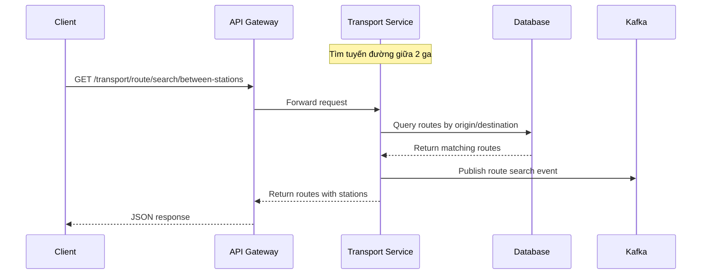
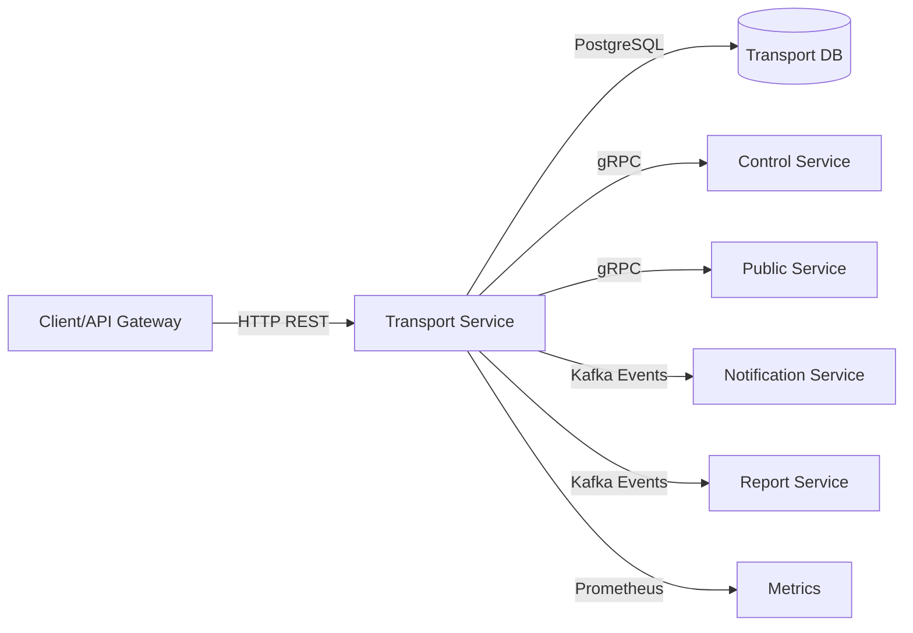
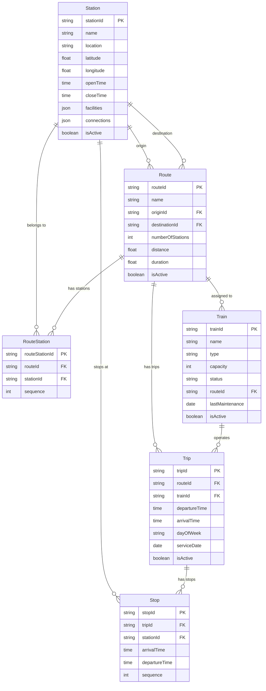

# Transport Service — Service README

## 1. Tổng quan
- **Chức năng chính**: Quản lý hệ thống giao thông Metro TPHCM bao gồm tuyến đường, ga tàu, chuyến tàu, tàu và điểm dừng
- **Vai trò trong hệ MetroHCM**: Service cốt lõi cung cấp thông tin giao thông công cộng cho các service khác (ticket, user, notification)
- **Giao tiếp**: 
  - REST API ⟷ API Gateway, User Service, Ticket Service
  - gRPC ⟷ Control Service, Public Service
  - Kafka Events ⟷ Notification Service, Report Service
- **Kiến trúc & pattern**: Layered Architecture với SOLID principles, Dependency Injection, Repository pattern
- **Lưu đồ chuỗi** cho luồng tìm tuyến đường:



## 2. Sơ đồ Class (Class Diagram)

```mermaid
classDiagram
    class RouteService {
        +createRoute(routeData)
        +getAllRoutes(filters)
        +getRouteById(routeId)
        +updateRoute(routeId, updateData)
        +deleteRoute(routeId)
        +getActiveRoutes()
        +getRoutesByStation(stationId)
        +findRoutesBetweenStations(originId, destinationId)
        +calculateRouteDistance(routeId)
    }

    class StationService {
        +createStation(stationData)
        +getAllStations(filters)
        +getStationById(stationId)
        +updateStation(stationId, updateData)
        +deleteStation(stationId)
        +getActiveStations()
        +getStationsByOperatingTime(currentTime)
        +getNextStops(stationId, currentTime, dayOfWeek, limit)
        +getRoutesByStation(stationId)
        +updateStationFacilities(stationId, facilities)
    }

    class TrainService {
        +createTrain(trainData)
        +getAllTrains(filters)
        +getTrainById(trainId)
        +updateTrain(trainId, updateData)
        +deleteTrain(trainId)
        +getActiveTrains()
        +getTrainsByType(type)
        +getTrainsByStatus(status)
        +updateTrainStatus(trainId, status)
        +scheduleMaintenance(trainId, maintenanceDate)
        +getTrainUtilization(trainId)
    }

    class TripService {
        +createTrip(tripData)
        +getAllTrips(filters)
        +getTripById(tripId)
        +updateTrip(tripId, updateData)
        +deleteTrip(tripId)
        +getActiveTrips()
        +getUpcomingTrips(currentTime, dayOfWeek)
        +findTripsBetweenStations(originStationId, destinationStationId, dayOfWeek)
        +getTripsByRoute(routeId)
        +getTripsByTrain(trainId)
        +getTripsByDay(dayOfWeek)
        +getTripStatistics(tripId)
    }

    class StopService {
        +createStop(stopData)
        +createMultipleStops(stopsData)
        +getAllStops()
        +getStopsByTrip(tripId)
        +getStopsByStation(stationId)
        +updateStop(stopId, updateData)
        +deleteStop(stopId)
        +validateStopSequence(tripId, stops)
    }

    class RouteStationService {
        +createRouteStation(routeStationData)
        +getRouteStationsByRoute(routeId)
        +getRouteStationsByStation(stationId)
        +updateRouteStationSequence(routeStationId, sequence)
        +deleteRouteStation(routeStationId)
        +findRoutesBetweenTwoStations(originStationId, destinationStationId)
        +findShortestPathWithTransfers(originStationId, destinationStationId, transferPenalty)
        +validateRouteStationSequence(routeId)
        +setupRouteStations(routeId, stationSequences)
        +reorderRouteStations(routeId, newSequences)
    }

    class TransportGrpcService {
        +getRoute(request)
        +getStation(request)
        +getTrip(request)
        +getRoutesByStations(request)
        +getRouteStations(request)
        +calculateStationCount(request)
        +listRoutes(request)
        +listTrains(request)
        +bulkUpsertTrips(request)
        +bulkUpsertStops(request)
    }

    class TransportEventProducer {
        +publishStationStatusChanged(stationData)
        +publishStationDeactivated(stationData)
        +publishRouteUpdated(routeData)
        +publishTripScheduled(tripData)
    }

    class TransportEventConsumer {
        +start()
        +stop()
        +handleControlServiceEvent(event)
        +handlePublicServiceEvent(event)
    }

    class RouteController {
        +getAllRoutes(req, res)
        +getActiveRoutes(req, res)
        +searchRoutesBetweenStations(req, res)
        +getRouteById(req, res)
        +getRouteStations(req, res)
        +getRoutePath(req, res)
        +validateRoute(req, res)
        +reorderRouteStations(req, res)
        +setupRoute(req, res)
        +createRoute(req, res)
        +updateRoute(req, res)
        +deleteRoute(req, res)
    }

    class StationController {
        +getAllStations(req, res)
        +getActiveStations(req, res)
        +getStationsByOperatingTime(req, res)
        +getNextStops(req, res)
        +getRoutesByStation(req, res)
        +getStationById(req, res)
        +createStation(req, res)
        +updateStation(req, res)
        +updateStationFacilities(req, res)
        +deleteStation(req, res)
    }

    class TrainController {
        +getAllTrains(req, res)
        +getActiveTrains(req, res)
        +getTrainsByType(req, res)
        +getTrainsByStatus(req, res)
        +getTrainById(req, res)
        +getTrainUtilization(req, res)
        +createTrain(req, res)
        +updateTrain(req, res)
        +updateTrainStatus(req, res)
        +scheduleMaintenance(req, res)
    }

    class TripController {
        +getAllTrips(req, res)
        +getActiveTrips(req, res)
        +getUpcomingTrips(req, res)
        +searchTripsBetweenStations(req, res)
        +getTripsByRoute(req, res)
        +getTripsByTrain(req, res)
        +getTripsByDay(req, res)
        +getTripById(req, res)
        +getTripStatistics(req, res)
        +createTrip(req, res)
        +updateTrip(req, res)
        +deleteTrip(req, res)
    }

    class StopController {
        +getAllStops(req, res)
        +getStopsByTrip(req, res)
        +getStopsByStation(req, res)
        +createStop(req, res)
        +createMultipleStops(req, res)
        +updateStop(req, res)
        +deleteStop(req, res)
        +validateStopSequence(req, res)
    }

    class Route {
        +routeId: String
        +name: String
        +originId: String
        +destinationId: String
        +numberOfStations: Integer
        +distance: Float
        +duration: Float
        +isActive: Boolean
        +createdAt: Date
        +updatedAt: Date
    }

    class Station {
        +stationId: String
        +name: String
        +location: String
        +latitude: Float
        +longitude: Float
        +openTime: Time
        +closeTime: Time
        +facilities: JSON
        +connections: JSON
        +isActive: Boolean
        +createdAt: Date
        +updatedAt: Date
    }

    class RouteStation {
        +routeStationId: String
        +routeId: String
        +stationId: String
        +sequence: Integer
        +createdAt: Date
        +updatedAt: Date
    }

    class Train {
        +trainId: String
        +name: String
        +type: String
        +capacity: Integer
        +status: String
        +routeId: String
        +lastMaintenance: Date
        +isActive: Boolean
        +createdAt: Date
        +updatedAt: Date
    }

    class Trip {
        +tripId: String
        +routeId: String
        +trainId: String
        +departureTime: Time
        +arrivalTime: Time
        +dayOfWeek: String
        +serviceDate: Date
        +isActive: Boolean
        +createdAt: Date
        +updatedAt: Date
    }

    class Stop {
        +stopId: String
        +tripId: String
        +stationId: String
        +arrivalTime: Time
        +departureTime: Time
        +sequence: Integer
        +createdAt: Date
        +updatedAt: Date
    }

    RouteService --> Route : manages
    StationService --> Station : manages
    TrainService --> Train : manages
    TripService --> Trip : manages
    StopService --> Stop : manages
    RouteStationService --> RouteStation : manages

    RouteController --> RouteService : uses
    StationController --> StationService : uses
    TrainController --> TrainService : uses
    TripController --> TripService : uses
    StopController --> StopService : uses

    TransportGrpcService --> RouteService : uses
    TransportGrpcService --> StationService : uses
    TransportGrpcService --> TripService : uses
    TransportGrpcService --> StopService : uses

    TransportEventProducer --> Route : publishes
    TransportEventProducer --> Station : publishes
    TransportEventProducer --> Trip : publishes

    TransportEventConsumer --> RouteService : uses
    TransportEventConsumer --> StationService : uses

    Route ||--o{ RouteStation : has
    Route ||--o{ Trip : has
    Route ||--o{ Train : assigned
    Station ||--o{ RouteStation : belongs
    Station ||--o{ Stop : stops
    Train ||--o{ Trip : operates
    Trip ||--o{ Stop : has
```

## 2.1 Sơ đồ hệ thống (Mermaid)



## 3. API & Hợp đồng

### 3.1 REST endpoints

| Method | Path | Mô tả | Auth | Request | Response (envelope) | Status Codes |
| ------ | ---- | ----- | ---- | ------- | ------------------- | ------------ |
| GET | `/v1/transport/route/` | Lấy tất cả tuyến (filterable) | passenger/staff/admin | `?name?&originId?&destinationId?&isActive?` | `{success, data: Route[]}` | 200, 401, 403 |
| GET | `/v1/transport/route/active` | Lấy tuyến đang hoạt động | passenger/staff/admin | - | `{success, data: Route[]}` | 200, 401, 403 |
| GET | `/v1/transport/route/search/between-stations` | Tìm tuyến giữa 2 ga | passenger/staff/admin | `?originId&destinationId` | Nếu có cùng tuyến: `{success, data: Route[]}`; nếu không có: `{success, data: {shortestPath}}` (Dijkstra) | 200, 400, 401, 403 |
| GET | `/v1/transport/route/:id` | Lấy tuyến theo ID | passenger/staff/admin | - | `{success, data: Route}` | 200, 404, 401, 403 |
| GET | `/v1/transport/route/:routeId/stations` | Lấy ga theo tuyến | passenger/staff/admin | - | `{success, data: RouteStation[]}` | 200, 404, 401, 403 |
| GET | `/v1/transport/route/:routeId/path` | Lấy path tuyến (kèm chi tiết ga) | passenger/staff/admin | - | `{success, data: {routeInfo, path[], totalStations}}` | 200, 404, 401, 403 |
| GET | `/v1/transport/route/:routeId/validate` | Validate thứ tự ga | staff/admin | - | `{success, data: {valid, message, totalStations}}` | 200, 401, 403 |
| PUT | `/v1/transport/route/:routeId/reorder` | Sắp xếp lại thứ tự ga | admin | `{newSequences: {routeStationId, sequence}[]}` | `{success, data: {message, validation}}` | 200, 400, 401, 403 |
| POST | `/v1/transport/route/:routeId/setup` | Thiết lập toàn bộ tuyến | admin | `{stationSequences: {stationId, sequence}[]}` | `{success, data: RouteStation[]}` | 200, 400, 401, 403 |
| POST | `/v1/transport/route/` | Tạo tuyến mới | admin | `{routeId, name, originId, destinationId, distance, duration}` | `{success, data: Route}` | 201, 400, 401, 403 |
| PUT | `/v1/transport/route/:id` | Cập nhật tuyến | admin | `{name?, distance?, duration?, isActive?}` | `{success, data: Route}` | 200, 404, 400, 401, 403 |
| DELETE | `/v1/transport/route/:id` | Xóa tuyến | admin | - | `{success, message}` | 200, 404, 401, 403 |
| GET | `/v1/transport/station/` | Lấy tất cả ga (filterable) | passenger/staff/admin | `?name?&location?&isActive?` | `{success, data: Station[]}` | 200, 401, 403 |
| GET | `/v1/transport/station/active` | Lấy ga đang hoạt động | passenger/staff/admin | - | `{success, data: Station[]}` | 200, 401, 403 |
| GET | `/v1/transport/station/operating/current` | Lọc theo giờ hoạt động | passenger/staff/admin | `?currentTime=HH:mm:ss` | `{success, data: Station[]}` | 200, 401, 403 |
| GET | `/v1/transport/station/:stationId/next-stops` | Chuyến sắp đến tại ga | passenger/staff/admin | `?currentTime&dayOfWeek&limit?` | `{success, data: Stop[]}` | 200, 401, 403 |
| GET | `/v1/transport/station/:stationId/routes` | Tuyến qua một ga | passenger/staff/admin | - | `{success, data: {route, sequence}[]}` | 200, 401, 403 |
| GET | `/v1/transport/station/:id` | Lấy ga theo ID | passenger/staff/admin | - | `{success, data: Station}` | 200, 404, 401, 403 |
| POST | `/v1/transport/station/` | Tạo ga | admin | Station body | `{success, data: Station}` | 201, 400, 401, 403 |
| PUT | `/v1/transport/station/:id` | Cập nhật ga | admin | Partial Station | `{success, data: Station}` | 200, 400, 401, 403 |
| PUT | `/v1/transport/station/:id/facilities` | Cập nhật tiện ích | admin | `{facilities: JSON}` | `{success, data: Station}` | 200, 400, 401, 403 |
| DELETE | `/v1/transport/station/:id` | Xóa ga | admin | - | `{success, message}` | 200, 404, 401, 403 |
| GET | `/v1/transport/train/` | Lấy tất cả tàu (filterable) | staff/admin | `?name?&type?&status?&routeId?&isActive?` | `{success, data: Train[]}` | 200, 401, 403 |
| GET | `/v1/transport/train/active` | Tàu hoạt động | passenger/staff/admin | - | `{success, data: Train[]}` | 200, 401, 403 |
| GET | `/v1/transport/train/type/:type` | Lọc theo loại | passenger/staff/admin | - | `{success, data: Train[]}` | 200, 401, 403 |
| GET | `/v1/transport/train/status/:status` | Lọc theo trạng thái | staff/admin | - | `{success, data: Train[]}` | 200, 401, 403 |
| GET | `/v1/transport/train/:id` | Lấy tàu theo ID | staff/admin | - | `{success, data: Train}` | 200, 404, 401, 403 |
| GET | `/v1/transport/train/:id/utilization` | Chỉ số sử dụng | admin | - | `{success, data: {utilization...}}` | 200, 401, 403 |
| POST | `/v1/transport/train/` | Tạo tàu | admin | Train body | `{success, data: Train}` | 201, 400, 401, 403 |
| PUT | `/v1/transport/train/:id` | Cập nhật tàu | admin | Partial Train | `{success, data: Train}` | 200, 400, 401, 403 |
| PUT | `/v1/transport/train/:id/status` | Cập nhật trạng thái | staff/admin | `{status}` | `{success, data: Train}` | 200, 400, 401, 403 |
| POST | `/v1/transport/train/:id/maintenance` | Lên lịch bảo trì | admin | `{maintenanceDate}` | `{success, data: Train}` | 200, 400, 401, 403 |
| GET | `/v1/transport/trip/` | Lấy tất cả chuyến (filterable) | staff/admin | `?routeId?&trainId?&dayOfWeek?&isActive?&departureTimeFrom?&departureTimeTo?` | `{success, data: Trip[]}` | 200, 401, 403 |
| GET | `/v1/transport/trip/active` | Chuyến hoạt động | passenger/staff/admin | - | `{success, data: Trip[]}` | 200, 401, 403 |
| GET | `/v1/transport/trip/upcoming` | Chuyến sắp khởi hành | passenger/staff/admin | `?currentTime&dayOfWeek` | `{success, data: Trip[]}` | 200, 401, 403 |
| GET | `/v1/transport/trip/search/between-stations` | Tìm chuyến giữa 2 ga | passenger/staff/admin | `?originStationId&destinationStationId&dayOfWeek` | `{success, data: Trip[]}` | 200, 401, 403 |
| GET | `/v1/transport/trip/route/:routeId` | Chuyến theo tuyến | passenger/staff/admin | - | `{success, data: Trip[]}` | 200, 401, 403 |
| GET | `/v1/transport/trip/train/:trainId` | Chuyến theo tàu | staff/admin | - | `{success, data: Trip[]}` | 200, 401, 403 |
| GET | `/v1/transport/trip/day/:dayOfWeek` | Chuyến theo thứ | passenger/staff/admin | - | `{success, data: Trip[]}` | 200, 401, 403 |
| GET | `/v1/transport/trip/:id` | Lấy chuyến theo ID | passenger/staff/admin | - | `{success, data: Trip}` | 200, 404, 401, 403 |
| GET | `/v1/transport/trip/:id/statistics` | Thống kê chuyến | staff/admin | - | `{success, data: {...}}` | 200, 401, 403 |
| POST | `/v1/transport/trip/` | Tạo chuyến | admin | Trip body | `{success, data: Trip}` | 201, 400, 401, 403 |
| PUT | `/v1/transport/trip/:id` | Cập nhật chuyến | admin | Partial Trip | `{success, data: Trip}` | 200, 400, 401, 403 |
| DELETE | `/v1/transport/trip/:id` | Xóa chuyến | admin | - | `{success, message}` | 200, 404, 401, 403 |
| GET | `/v1/transport/stop/` | Lấy tất cả điểm dừng | staff/admin | - | `{success, data: Stop[]}` | 200, 401, 403 |
| GET | `/v1/transport/stop/trip/:tripId` | Điểm dừng theo chuyến | passenger/staff/admin | - | `{success, data: Stop[]}` | 200, 401, 403 |
| GET | `/v1/transport/stop/station/:stationId` | Điểm dừng theo ga | passenger/staff/admin | - | `{success, data: Stop[]}` | 200, 401, 403 |
| POST | `/v1/transport/stop/` | Tạo điểm dừng | admin | Stop body | `{success, data: Stop}` | 201, 400, 401, 403 |
| POST | `/v1/transport/stop/multiple` | Tạo nhiều điểm dừng | admin | `{stopsData: Stop[]}` | `{success, data: Stop[]}` | 201, 400, 401, 403 |
| PUT | `/v1/transport/stop/:id` | Cập nhật điểm dừng | admin | Partial Stop | `{success, data: Stop}` | 200, 400, 401, 403 |
| DELETE | `/v1/transport/stop/:id` | Xóa điểm dừng | admin | - | `{success, message}` | 200, 404, 401, 403 |
| POST | `/v1/transport/trip/:tripId/stops/validate` | Validate thứ tự điểm dừng | staff/admin | `{stops: Stop[]}` | `{success, data: {valid,...}}` | 200, 400, 401, 403 |
| GET | `/health` | Health check | - | - | `{status: "OK", service}` | 200 |

Lưu ý: Tất cả REST trả về theo envelope `{success, data, message?}` (khác bảng ví dụ cũ).

### 3.2 gRPC (Proto)

* **Vị trí file**: `src/proto/transport.proto`
* **Cách build/generate**: Sử dụng `@grpc/proto-loader` để load proto file
* **Versioning & Compatibility**: Proto3 syntax, backward compatible

**Các RPC methods**:
- `GetRoute(GetRouteRequest) returns (RouteResponse)`
- `GetStation(GetStationRequest) returns (StationResponse)`
- `GetTrip(GetTripRequest) returns (TripResponse)`
- `GetRoutesByStations(GetRoutesByStationsRequest) returns (RoutesResponse)`
- `GetRouteStations(GetRouteStationsRequest) returns (RouteStationsResponse)`
- `CalculateStationCount(CalculateStationCountRequest) returns (StationCountResponse)`
- `ListRoutes(ListRoutesRequest) returns (RoutesResponse)`
- `ListTrains(ListTrainsRequest) returns (TrainsResponse)`
- `BulkUpsertTrips(BulkUpsertTripsRequest) returns (BulkUpsertTripsResponse)`
- `BulkUpsertStops(BulkUpsertStopsRequest) returns (BulkUpsertStopsResponse)`

### 3.3 Event (Kafka)

Hiện trạng triển khai trong code:

| Topic | Direction | Key | Event type | Payload (enveloped) | Retry |
| ----- | --------- | --- | ---------- | -------------------- | ----- |
| `station-events` | Producer | `stationId` | `STATION_STATUS_CHANGED` | `{type, version, timestamp, data:{stationId, stationName, location, previousStatus, newStatus, reason, updatedBy, affectedRoutes[], metadata}}` | KafkaJS retry=8 |
| `station-events` | Producer | `stationId` | `STATION_DEACTIVATED` | `{type, version, timestamp, data:{stationId, stationName, location, reason, updatedBy, deactivatedAt, affectedRoutes[], metadata}}` | KafkaJS retry=8 |

Ghi chú:
- Tên topic và schema khác bảng định nghĩa trước đây. Cần thống nhất lại hợp đồng (đổi tên topic theo chuẩn trong README, hoặc cập nhật tài liệu của các service tiêu thụ).
- `clientId` Kafka nên là `transport-service` (đặt qua `KAFKA_CLIENT_ID`).

## 4. Dữ liệu & Migrations

* **Loại CSDL**: PostgreSQL
* **Bảng chính**:

| Bảng | Cột chính | Kiểu | Index | Ràng buộc |
| ---- | --------- | ---- | ----- | --------- |
| `Stations` | `stationId` (PK), `name`, `location`, `latitude`, `longitude`, `openTime`, `closeTime`, `facilities` (JSON), `connections` (JSON), `isActive` | STRING(100), STRING(100), STRING(100), FLOAT, FLOAT, TIME, TIME, JSON, JSON, BOOLEAN | `stationId`, `name` | NOT NULL constraints |
| `Routes` | `routeId` (PK), `name`, `originId` (FK), `destinationId` (FK), `numberOfStations`, `distance`, `duration`, `isActive` | STRING(100), STRING(100), STRING(100), STRING(100), INTEGER, FLOAT, FLOAT, BOOLEAN | `routeId`, `originId`, `destinationId` | Foreign keys to Stations |
| `RouteStations` | `routeStationId` (PK), `routeId` (FK), `stationId` (FK), `sequence` | STRING(100), STRING(100), STRING(100), INTEGER | `routeId`, `stationId`, `sequence` | Composite unique on (routeId, sequence) |
| `Trains` | `trainId` (PK), `name`, `type`, `capacity`, `status`, `routeId` (FK), `lastMaintenance`, `isActive` | STRING(100), STRING(100), STRING(50), INTEGER, STRING(50), STRING(100), DATE, BOOLEAN | `trainId`, `routeId`, `status` | Foreign key to Routes |
| `Trips` | `tripId` (PK), `routeId` (FK), `trainId` (FK), `departureTime`, `arrivalTime`, `dayOfWeek`, `serviceDate`, `isActive` | STRING(100), STRING(100), STRING(100), TIME, TIME, STRING(20), DATE, BOOLEAN | `tripId`, `routeId`, `trainId`, `serviceDate` | Foreign keys to Routes, Trains |
| `Stops` | `stopId` (PK), `tripId` (FK), `stationId` (FK), `arrivalTime`, `departureTime`, `sequence` | STRING(100), STRING(100), STRING(100), TIME, TIME, INTEGER | `tripId`, `stationId`, `sequence` | Foreign keys to Trips, Stations |

* **Quan hệ & cascade**: 
  - Route → Station (origin/destination): CASCADE DELETE
  - Route → RouteStation: CASCADE DELETE
  - Route → Trip: CASCADE DELETE
  - Train → Trip: CASCADE DELETE
  - Trip → Stop: CASCADE DELETE
* **Seeds/fixtures**: `src/seed/` - Khởi tạo dữ liệu Metro TPHCM thực tế
* **Cách chạy migration**: Tự động sync khi khởi động service (`sequelize.sync({ force: false })`)
* **Xóa dữ liệu**: Hiện dùng hard delete (`destroy()`); nếu cần audit/cascade an toàn, cân nhắc soft delete hoặc ràng buộc ON DELETE CASCADE ở DB.
* **Kết nối DB**: Pool mặc định trong code `max=1000, acquire=30000, idle=10000`. Khuyến nghị chỉnh theo hạ tầng (ví dụ `max=20-50`) để tránh cạn kết nối Postgres.

## 5. Cấu hình & Secrets

### 5.1 Biến môi trường

| ENV | Bắt buộc | Giá trị mẫu | Mô tả | Phạm vi |
| --- | -------- | ----------- | ----- | ------- |
| `NODE_ENV` | ✅ | `production` | Môi trường chạy | dev/staging/prod |
| `PORT` | ✅ | `8003` | Port HTTP server | 1-65535 |
| `SERVICE_JWT_SECRET` | ✅ | `CHANGE_ME` | Secret cho JWT service-to-service | String |
| `DB_HOST` | ✅ | `postgres` | Host PostgreSQL | IP/Domain |
| `DB_PORT` | ✅ | `5432` | Port PostgreSQL | 1-65535 |
| `DB_NAME` | ✅ | `transport_db` | Tên database | String |
| `DB_USER` | ✅ | `transport_service` | Username database | String |
| `DB_PASSWORD` | ✅ | `${TRANSPORT_DB_PASSWORD}` | Password database | String |
| `TRANSPORT_GRPC_HOST` | ✅ | `transport-service` | Host gRPC server | IP/Domain |
| `TRANSPORT_GRPC_PORT` | ✅ | `50051` | Port gRPC server | 1-65535 |
| `KAFKA_BROKERS` | ✅ | `kafka-1:19092,kafka-2:19093,kafka-3:19094` | Kafka brokers | Comma-separated |
| `KAFKA_CLIENT_ID` | ✅ | `transport-service` | Kafka client ID | String |
| `API_GATEWAY_ORIGIN` | ✅ | `https://api.metrohcm.io.vn` | Origin API Gateway | URL |
| `ALLOWED_ORIGINS` | ❌ | `https://api.metrohcm.io.vn` | Origins được phép CORS | Comma-separated |

### 5.2 Profiles

* **dev**: CORS enabled, debug logging, local Kafka/DB
* **staging**: CORS disabled, info logging, staging infrastructure
* **prod**: CORS disabled, error logging, production infrastructure
* **Nguồn secrets**: Environment variables, Docker secrets, Kubernetes secrets

## 6. Bảo mật & Tuân thủ

* **AuthN/AuthZ**: JWT-based với role-based access control (passenger/staff/admin)
* **Input validation & sanitize**: Express-validator middleware, Sequelize model validation
* **CORS & CSRF**: CORS configurable per environment, Helmet.js for security headers
* **Rate limit / Anti-abuse**: Network source validation middleware, chỉ cho phép request từ API Gateway
* **Nhật ký/Audit**: Winston logger với daily rotation, structured JSON logs
* **Lỗ hổng tiềm ẩn & khuyến nghị**: 
  - Direct access protection (chỉ API Gateway)
  - Input sanitization cần tăng cường
  - Cần thêm rate limiting per user/IP

### 6.1 Service-to-service Auth
- Header bắt buộc: `X-Service-Auth: Bearer <JWT>` do API Gateway phát hành.
- Xác minh: `HS256`, `issuer=api-gateway`, `audience=internal-services`, bí mật `SERVICE_JWT_SECRET`.
- Token age: tối đa 5 phút (kiểm tra `iat`).
- `req.user` chứa `{id, email, roles}` để dùng cho `authorizeRoles(...)` ở tất cả endpoints.

### 6.2 Network Source Guard
- Middleware kiểm tra IP/host header cho phép (`api-gateway`, `localhost/127.0.0.1`, dải `172.*`, `10.*`, `192.168.*`). Nếu không hợp lệ và thiếu `X-Service-Auth` → 403 `DIRECT_ACCESS_FORBIDDEN`.
- Khuyến nghị triển khai chặn ở layer hạ tầng (Nginx, SG, mTLS) thay vì dựa vào header/IP heuristic.

## 7. Độ tin cậy & Khả dụng

* **Timeouts/Retry/Backoff**: Kafka retry 8 lần với exponential backoff
* **Circuit breaker/Bulkhead**: (Không tìm thấy trong repo)
* **Idempotency**: gRPC `BulkUpsertTrips` bỏ qua tạo mới nếu đã tồn tại cặp `(routeId, serviceDate)`.
* **Outbox/Saga/Orchestrator**: (Không tìm thấy trong repo)
* **Khả năng phục hồi sự cố**: Graceful shutdown, database connection pooling, Kafka consumer auto-restart

## 8. Observability

* **Logging**: Winston với JSON format, daily rotation, correlation ID qua request headers
* **Metrics**: Prometheus metrics (`/metrics` endpoint):
  - `http_request_duration_seconds` - HTTP request duration
  - `app_errors_total` - Application error counter
  - Default Node.js metrics (CPU, memory, event loop)
* **Tracing**: (Không tìm thấy trong repo)
* **Healthchecks**: `/health` endpoint trả về service status

## 9. Build, Run, Test

### 9.1 Local

```bash
# prerequisites
Node.js 18+, PostgreSQL 13+, Kafka 2.8+

# install dependencies
npm install

# setup environment
cp env.example .env
# Edit .env with your database and Kafka settings

# run
npm start
# or for development
npm run dev
```

### 9.2 Docker/Compose

```bash
docker build -t transport-service .
docker run --env-file .env -p 8003:8003 -p 50051:50051 transport-service
```

### 9.3 Kubernetes/Helm

* (Không tìm thấy trong repo)

### 9.4 Testing

```bash
# Run all tests
npm test

# Run with coverage
npm run test:coverage

# Generate coverage CSV
npm run coverage:csv
```

* **Coverage**: Jest với threshold 90% lines, 80% branches (khi ENFORCE_COVERAGE=true)

## 10. CI/CD

* (Không tìm thấy trong repo)

## 11. Hiệu năng & Quy mô

* **Bottlenecks đã thấy từ code**: 
  - N+1 queries trong gRPC responses (cần eager loading)
  - Bulk operations không có pagination
* **Kỹ thuật**: Sequelize eager loading, database indexing, connection pooling
* **Định hướng benchmark/kịch bản tải**: Cần load testing cho route search và bulk operations
* **Lưu ý Sequelize**: `order` bên trong `include` có thể không áp dụng như kỳ vọng; nên đặt `order` top-level với alias đúng hoặc dùng `separate` cho tập con lớn.

### 11.1 Thuật toán tìm đường (báo cáo kỹ thuật)

- Mục tiêu: Tìm đường đi giữa hai ga bất kỳ, ưu tiên cùng tuyến; nếu không, cho phép chuyển tuyến với chi phí chuyển tuyến có thể cấu hình.
- Ràng buộc dữ liệu: Quan hệ ga–tuyến được lưu trong `RouteStations(routeId, stationId, sequence)`; các ga liền kề trên cùng tuyến có `sequence` liên tiếp.

#### 11.1.1 Chiến lược 1 — Cùng tuyến, không chuyển tuyến
- Ý tưởng: Tìm giao các tuyến chứa cả hai ga và kiểm tra thứ tự `sequence(origin) < sequence(destination)`. Nếu có tuyến hợp lệ, trả về đoạn ga giữa hai điểm theo `sequence`.
- Độ phức tạp: 2 truy vấn `RouteStation` + 1 truy vấn lấy chi tiết tuyến, lọc tuyến giao nhau: O(A·B) với A,B là số bản ghi `RouteStation` theo từng ga.

Code trích đoạn:
```javascript
// services/routeStation.service.js
async findRoutesBetweenTwoStations(originStationId, destinationStationId) {
  // Tìm các routeId chứa origin & destination cùng với sequence
  const routesWithOrigin = await RouteStation.findAll({
    where: { stationId: originStationId },
    attributes: ['routeId', 'sequence']
  });
  const routesWithDestination = await RouteStation.findAll({
    where: { stationId: destinationStationId },
    attributes: ['routeId', 'sequence']
  });

  // Lọc các tuyến chung có thứ tự hợp lệ
  const commonRoutes = routesWithOrigin.filter(o =>
    routesWithDestination.some(d => d.routeId === o.routeId && d.sequence > o.sequence)
  );

  // Nếu không có tuyến chung → fallback Dijkstra (bên dưới)
  if (commonRoutes.length === 0) {
    const shortest = await this.findShortestPathWithTransfers(originStationId, destinationStationId, 2);
    return { shortestPath: shortest };
  }

  // Lấy chi tiết tuyến và cắt đoạn stationsBetween theo sequence
  const routeIds = commonRoutes.map(r => r.routeId);
  const routes = await Route.findAll({
    where: { routeId: { [Op.in]: routeIds }, isActive: true },
    include: [{ model: RouteStation, as: 'stations', include: [{ model: Station, attributes: ['stationId','name','location'] }], order: [['sequence','ASC']] }]
  });

  return routes.map(r => {
    const o = r.stations.find(rs => rs.stationId === originStationId);
    const d = r.stations.find(rs => rs.stationId === destinationStationId);
    return {
      routeInfo: { routeId: r.routeId, name: r.name, distance: r.distance, duration: r.duration },
      originSequence: o.sequence,
      destinationSequence: d.sequence,
      stationsBetween: r.stations.filter(rs => rs.sequence >= o.sequence && rs.sequence <= d.sequence)
    };
  });
}
```

#### 11.1.2 Chiến lược 2 — Dijkstra cho phép chuyển tuyến (fallback)
- Mô hình đồ thị:
  - Đỉnh: `stationId`.
  - Cạnh: giữa hai ga liền kề trên cùng `routeId` (song hướng), trọng số cơ bản = 1.
  - Trạng thái Dijkstra: cặp `(stationId, routeId)` để nhận biết chuyển tuyến; khi cạnh tiếp theo có `routeId` khác, cộng thêm `transferPenalty` (mặc định 2).
- Tiêu chí tối ưu: Tổng chi phí = số bước qua ga liền kề + số lần chuyển tuyến × `transferPenalty`.
- Độ phức tạp: O((V + E) log V), với V là số ga, E là số cạnh liền kề.

Code trích đoạn:
```javascript
// services/routeStation.service.js
async findShortestPathWithTransfers(originStationId, destinationStationId, transferPenalty = 2) {
  // Xây adjacency từ RouteStation theo từng routeId
  const all = await RouteStation.findAll({ attributes: ['routeId','stationId','sequence'], order: [['routeId','ASC'],['sequence','ASC']] });
  const neighbors = new Map();
  const addEdge = (from, to, routeId) => { if (!neighbors.has(from)) neighbors.set(from, []); neighbors.get(from).push({ to, routeId, weight: 1 }); };
  const byRoute = new Map();
  for (const rs of all) { if (!byRoute.has(rs.routeId)) byRoute.set(rs.routeId, []); byRoute.get(rs.routeId).push({ stationId: rs.stationId, sequence: rs.sequence }); }
  for (const [routeId, arr] of byRoute.entries()) { arr.sort((a,b)=>a.sequence-b.sequence); for (let i=0;i<arr.length-1;i++){ addEdge(arr[i].stationId, arr[i+1].stationId, routeId); addEdge(arr[i+1].stationId, arr[i].stationId, routeId); } }

  // Dijkstra trên trạng thái (stationId, routeId)
  const keyOf = (s, r) => `${s}|${r || '-'}`; const dist = new Map(); const prev = new Map();
  class MinHeap{constructor(){this.arr=[];}push(n){this.arr.push(n);this.#u(this.arr.length-1);}pop(){if(!this.arr.length)return null;const t=this.arr[0];const l=this.arr.pop();if(this.arr.length){this.arr[0]=l;this.#d(0);}return t;}size(){return this.arr.length;}#u(i){while(i>0){const p=(i-1>>1);if(this.arr[p].dist<=this.arr[i].dist)break;[this.arr[p],this.arr[i]]=[this.arr[i],this.arr[p]];i=p;}}#d(i){const n=this.arr.length;while(true){let s=i;const L=2*i+1,R=2*i+2;if(L<n&&this.arr[L].dist<this.arr[s].dist)s=L;if(R<n&&this.arr[R].dist<this.arr[s].dist)s=R;if(s===i)break;[this.arr[s],this.arr[i]]=[this.arr[i],this.arr[s]];i=s;}}}
  const heap=new MinHeap(); heap.push({ stationId: originStationId, routeId: null, dist: 0 }); dist.set(keyOf(originStationId,null),0);
  let best=null; while(heap.size()>0){ const cur=heap.pop(); const curKey=keyOf(cur.stationId,cur.routeId); if(cur.dist!==dist.get(curKey)) continue; if(cur.stationId===destinationStationId){ best=curKey; break; }
    for(const edge of (neighbors.get(cur.stationId)||[])){ let w=edge.weight; if(cur.routeId!==null && cur.routeId!==edge.routeId) w+=Number(transferPenalty)||0; const nextKey=keyOf(edge.to, edge.routeId); const nd=cur.dist+w; if(nd < (dist.has(nextKey)?dist.get(nextKey):Infinity)){ dist.set(nextKey, nd); prev.set(nextKey, { stationId: cur.stationId, routeId: cur.routeId }); heap.push({ stationId: edge.to, routeId: edge.routeId, dist: nd }); } } }
  if(!best) return { path: [], totalCost: Infinity, transfers: 0, segments: [] };

  // Phục hồi đường đi và nhóm theo segment tuyến
  const keys=[]; let k=best; while(k){ keys.push(k); const p=prev.get(k); if(!p) break; k=keyOf(p.stationId,p.routeId);} keys.reverse();
  const nodes = keys.map(kk=>({ stationId: kk.split('|')[0], routeId: (kk.split('|')[1]==='-')?null:kk.split('|')[1] }));
  const segments=[]; for(const n of nodes){ if(!segments.length) segments.push({routeId:n.routeId,stations:[n.stationId]}); else { const last=segments[segments.length-1]; if(last.routeId===n.routeId) last.stations.push(n.stationId); else segments.push({routeId:n.routeId,stations:[n.stationId]}); } }
  const cleaned = segments.filter(s=>s.routeId!==null);
  let transfers=0; for(let i=1;i<nodes.length;i++){ const a=nodes[i-1], b=nodes[i]; if(a.routeId && b.routeId && a.routeId!==b.routeId) transfers++; }
  const uniqueIds=[...new Set(nodes.map(n=>n.stationId))]; const stations=await Station.findAll({ where:{ stationId:{ [Op.in]: uniqueIds } } }); const map=new Map(stations.map(s=>[s.stationId,s]));
  const detailedPath = nodes.map(n=>({ station: map.get(n.stationId)||{stationId:n.stationId}, viaRouteId: n.routeId }));
  return { path: detailedPath, totalCost: dist.get(best), transfers, segments: cleaned };
}
```

#### 11.1.3 Giao diện API và hành vi
- REST hỗ trợ 2 cách:
  - `GET /v1/transport/route/search/between-stations?originId&destinationId`:
    - Nếu có cùng tuyến: trả về danh sách tuyến và `stationsBetween`.
    - Nếu không có: trả về `{ shortestPath: { path, totalCost, transfers, segments } }` (kết quả Dijkstra).
  - `GET /v1/transport/route-station/shortest-path?originStationId&destinationStationId&transferPenalty?`:
    - Trả về trực tiếp đường đi tối ưu (Dijkstra) với `transferPenalty` tuỳ chọn.

#### 11.1.4 Tham số và khuyến nghị
- `transferPenalty` (mặc định 2): tăng để ưu tiên ít chuyển tuyến; giảm để ưu tiên tổng số ga đi qua ít.
- Có thể mở rộng trọng số cạnh theo thời gian/ khoảng cách thực, hoặc thêm phí chờ/đổi tuyến theo dữ liệu vận hành.

## 12. Rủi ro & Nợ kỹ thuật

* **Danh sách vấn đề hiện tại**:
  - Thiếu circuit breaker pattern
  - Không có distributed tracing
  - Bulk operations có thể gây timeout với dataset lớn
  - Thiếu caching layer cho frequent queries
* **Ảnh hưởng & ưu tiên**:
  - High: Performance issues với large datasets
  - Medium: Observability gaps
  - Low: Missing resilience patterns
* **Kế hoạch cải thiện**:
  - Implement Redis caching
  - Add OpenTelemetry tracing
  - Implement circuit breaker cho external calls
  - Add pagination cho bulk operations
  - Chuẩn hóa Kafka topics/schema theo hợp đồng liên dịch vụ

## 13. Phụ lục

### Sơ đồ ERD



### Bảng mã lỗi chuẩn

| Code | HTTP Status | Mô tả |
| ---- | ----------- | ----- |
| `ROUTE_NOT_FOUND` | 404 | Tuyến không tồn tại |
| `STATION_NOT_FOUND` | 404 | Ga không tồn tại |
| `TRIP_NOT_FOUND` | 404 | Chuyến tàu không tồn tại |
| `TRAIN_NOT_FOUND` | 404 | Tàu không tồn tại |
| `INVALID_ROUTE_SEQUENCE` | 400 | Thứ tự ga không hợp lệ |
| `DIRECT_ACCESS_FORBIDDEN` | 403 | Truy cập trực tiếp bị cấm |
| `UNAUTHORIZED` | 401 | Chưa xác thực |
| `FORBIDDEN` | 403 | Không có quyền |
| `INTERNAL_ERROR` | 500 | Lỗi hệ thống |

### License & 3rd-party

* **License**: (Không tìm thấy trong repo)
* **3rd-party dependencies**: Express, Sequelize, KafkaJS, gRPC, Winston, Prometheus client