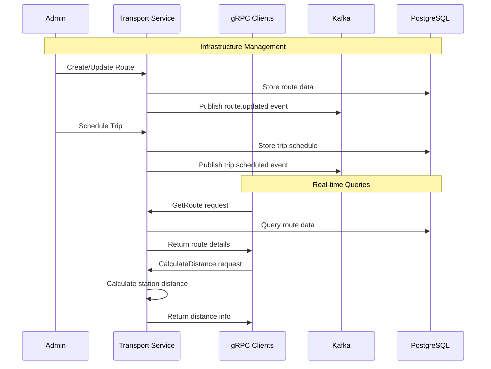

# Transport Service

Microservice handling transportation infrastructure management for the Metro backend system.

## Overview

The Transport Service manages the core transportation infrastructure including:
- **Routes**: Metro line definitions and route management
- **Stations**: Station information and geographical data
- **Trains**: Train fleet management and specifications
- **Trips**: Scheduled trips and real-time operations
- **Stops**: Individual stop points and timing
- **Route-Station Relationships**: Complex routing and connectivity

### Key Features:
- ✅ **Comprehensive Route Management**: Full metro line and route definitions
- ✅ **Station Network**: Complete station database with geographical information
- ✅ **Fleet Management**: Train inventory and operational status
- ✅ **Schedule Management**: Trip planning and real-time schedule updates
- ✅ **gRPC Server**: High-performance API for other services
- ✅ **Event-Driven Architecture**: Kafka integration for real-time updates

## Features

### Route Management
- Metro line definitions and route creation
- Route optimization and path planning
- Multi-modal transportation support
- Route-station relationship management

### Station Management
- Station geographical data and metadata
- Accessibility information and facilities
- Station capacity and platform management
- Real-time station status updates

### Train Management
- Train fleet inventory and specifications
- Maintenance scheduling and tracking
- Train assignment to routes
- Real-time train location and status

### Trip Management
- Schedule creation and management
- Real-time trip tracking
- Delay notifications and updates
- Trip analytics and reporting

### Stop Management
- Individual stop point management
- Timing and schedule coordination
- Stop accessibility and amenities
- Real-time arrival/departure information

## API Endpoints

### Route Routes (`/v1/routes`)
- `GET /` - Get all routes
- `GET /:id` - Get route details
- `POST /` - Create new route (admin only)
- `PUT /:id` - Update route (admin only)
- `DELETE /:id` - Delete route (admin only)
- `GET /:id/stations` - Get stations on route

### Station Routes (`/v1/stations`)
- `GET /` - Get all stations
- `GET /:id` - Get station details
- `POST /` - Create new station (admin only)
- `PUT /:id` - Update station (admin only)
- `DELETE /:id` - Delete station (admin only)
- `GET /:id/routes` - Get routes serving station

### Train Routes (`/v1/trains`)
- `GET /` - Get all trains
- `GET /:id` - Get train details
- `POST /` - Create new train (admin only)
- `PUT /:id` - Update train (admin only)
- `DELETE /:id` - Delete train (admin only)
- `GET /:id/schedule` - Get train schedule

### Trip Routes (`/v1/trips`)
- `GET /` - Get all trips
- `GET /:id` - Get trip details
- `POST /` - Create new trip (admin only)
- `PUT /:id` - Update trip (admin only)
- `DELETE /:id` - Delete trip (admin only)
- `GET /schedule` - Get trip schedules

### Stop Routes (`/v1/stops`)
- `GET /` - Get all stops
- `GET /:id` - Get stop details
- `POST /` - Create new stop (admin only)
- `PUT /:id` - Update stop (admin only)
- `DELETE /:id` - Delete stop (admin only)

### Route-Station Routes (`/v1/route-stations`)
- `GET /` - Get all route-station relationships
- `POST /` - Create route-station relationship (admin only)
- `PUT /:id` - Update relationship (admin only)
- `DELETE /:id` - Delete relationship (admin only)

## Architecture

```
transport-service/
├── src/
│   ├── config/          # Database, logger configs
│   ├── models/          # Sequelize models (Route, Station, Train, Trip, Stop)
│   ├── controllers/     # HTTP request handlers
│   ├── services/        # Business logic
│   ├── routes/          # Express routes
│   ├── grpc/            # gRPC server implementation
│   ├── proto/           # Protocol buffer definitions
│   ├── kafka/           # Kafka utilities
│   ├── middlewares/     # Authorization, etc.
│   ├── helpers/         # Utility functions
│   ├── app.js           # Express application
│   └── index.js         # Entry point
├── package.json
├── Dockerfile
└── README.md
```

## Environment Variables

Create a `.env` file in the transport-service directory:

```env
NODE_ENV=production
PORT=3002

#Service JWT
SERVICE_JWT_SECRET=ad9be0a348b0e7825a2f3487cb27db4779628e0e4d4c2c6bf1375feb80571b56

# Database
DB_HOST=postgres
DB_PORT=5432
DB_NAME=transport_db    
DB_USER=transport_service
DB_PASSWORD=transportpass

KAFKA_BROKERS=kafka-1:19092,kafka-2:19093,kafka-3:19094
KAFKA_CLIENT_ID=transport_service
KAFKA_BROKERS_INTERNAL=kafka-1:19092,kafka-2:19093,kafka-3:19094
```

### Environment Variables Explanation:

#### 🏗️ **Application Configuration**
- **NODE_ENV**: Runtime environment (development/production)
- **PORT**: Service port (default: 3002)

#### 🔐 **Authentication**
- **SERVICE_JWT_SECRET**: JWT secret for inter-service communication

#### 📊 **Database Configuration**
- **DB_HOST**: PostgreSQL host
- **DB_PORT**: PostgreSQL port
- **DB_NAME**: Database name for transport service
- **DB_USER**: Database username
- **DB_PASSWORD**: Database password

#### 📨 **Event System (Kafka)**
- **KAFKA_BROKERS**: Kafka broker addresses
- **KAFKA_CLIENT_ID**: Unique client identifier
- **KAFKA_BROKERS_INTERNAL**: Internal Kafka broker addresses

## Getting Started

### Development
```bash
# Install dependencies
npm install

# Start development server
npm run dev
```

### Docker
```bash
# Build and run with docker-compose
docker-compose up transport-service
```

## gRPC Server

The Transport Service provides a gRPC server for high-performance communication with other services:

### Available gRPC Methods:
- `GetRoute(RouteRequest)` - Get route information
- `GetStation(StationRequest)` - Get station details
- `GetRouteStations(RouteRequest)` - Get all stations on a route
- `CalculateDistance(DistanceRequest)` - Calculate distance between stations
- `GetNextTrips(TripRequest)` - Get upcoming trips for a route

### Protocol Buffers:
```protobuf
service TransportService {
  rpc GetRoute(RouteRequest) returns (RouteResponse);
  rpc GetStation(StationRequest) returns (StationResponse);
  rpc GetRouteStations(RouteRequest) returns (RouteStationsResponse);
  rpc CalculateDistance(DistanceRequest) returns (DistanceResponse);
  rpc GetNextTrips(TripRequest) returns (TripsResponse);
}
```

## Data Models

### Route
- Route ID, name, and description
- Start and end stations
- Route type (metro, bus, tram)
- Operational status

### Station
- Station ID, name, and code
- Geographical coordinates (latitude, longitude)
- Address and accessibility information
- Platform and facility details

### Train
- Train ID, model, and specifications
- Capacity and configuration
- Maintenance status and schedule
- Current route assignment

### Trip
- Trip ID and schedule information
- Route and train assignment
- Start and end times
- Real-time status updates

### Stop
- Stop ID and timing information
- Station and trip relationships
- Arrival and departure times
- Platform assignments

## Event Flow



### Event Processing:

1. **Infrastructure Updates**: Real-time updates for routes, stations, and schedules
2. **Trip Management**: Schedule changes and real-time trip updates
3. **Performance Monitoring**: Service health and operational metrics
4. **Integration Events**: Cross-service communication via Kafka

## Integration

### gRPC Communication
- **High Performance**: Binary protocol for efficient data transfer
- **Type Safety**: Protocol buffer definitions ensure data integrity
- **Streaming Support**: Real-time updates for trip and route information
- **Load Balancing**: Automatic service discovery and load distribution

### REST API
- **Admin Operations**: Full CRUD operations for all entities
- **Public Queries**: Read-only access for public transportation data
- **Authentication**: JWT-based authorization for admin operations

## Health Check & Monitoring

### Endpoints:
- **Health Check**: `GET /health` - Service health status
- **Database Check**: Included in health endpoint
- **gRPC Health**: gRPC health checking protocol
- **Kafka Check**: Included in health endpoint

### Monitoring Features:
- **Winston Logging**: Structured logging with daily rotation
- **Error Tracking**: Comprehensive error handling with correlation IDs
- **Performance Metrics**: Request timing and database query performance
- **gRPC Metrics**: Request/response times and error rates
- **Event Tracking**: Kafka message processing status

## Performance Optimization

### Database Optimization:
- **Indexing**: Optimized indexes for geographical queries
- **Connection Pooling**: Efficient database connection management
- **Query Optimization**: Optimized queries for route and station lookups

### Caching Strategy:
- **Route Caching**: Frequently accessed route information
- **Station Data**: Cached station details and geographical data
- **Schedule Caching**: Trip schedules and real-time updates

### gRPC Optimization:
- **Connection Reuse**: Persistent gRPC connections
- **Compression**: Data compression for large responses
- **Streaming**: Efficient real-time data streaming 