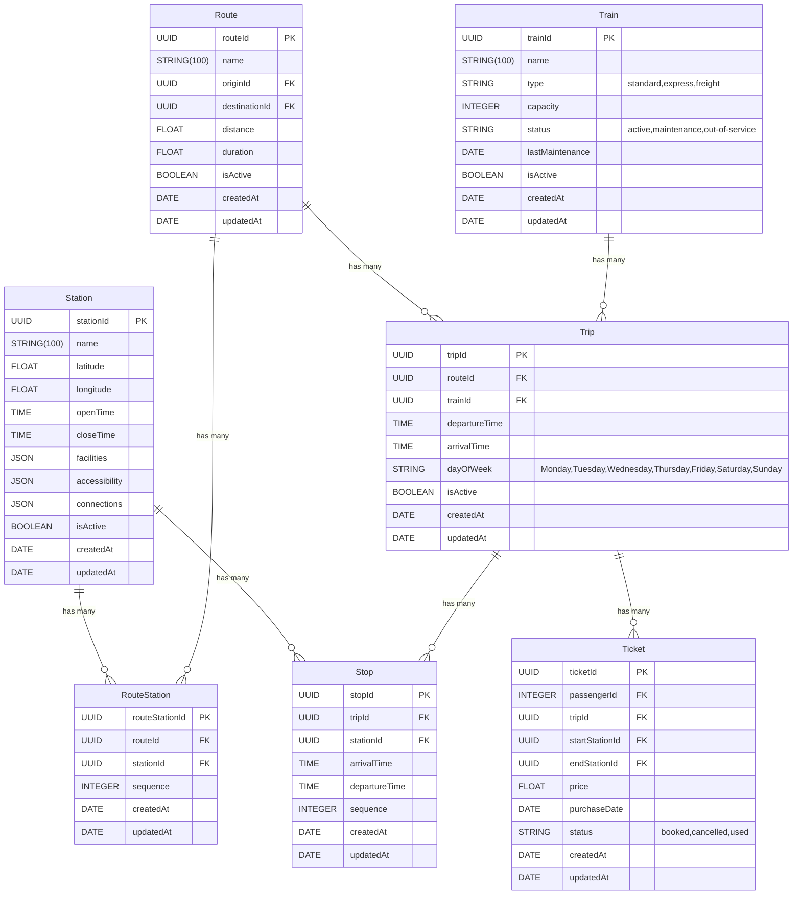

```mermaid
erDiagram
    Station ||--o{ RouteStation : "has many"
    Station ||--o{ Stop : "has many"
    Route ||--o{ RouteStation : "has many"
    Route ||--o{ Trip : "has many"
    Train ||--o{ Trip : "has many"
    Trip ||--o{ Stop : "has many"
    Trip ||--o{ Ticket : "has many"
    Station {
        UUID stationId PK
        STRING(100) name
        FLOAT latitude
        FLOAT longitude
        TIME openTime
        TIME closeTime
        JSON facilities
        JSON accessibility
        JSON connections
        BOOLEAN isActive
        DATE createdAt
        DATE updatedAt
    }
    Route {
        UUID routeId PK
        STRING(100) name
        UUID originId FK
        UUID destinationId FK
        FLOAT distance
        FLOAT duration
        BOOLEAN isActive
        DATE createdAt
        DATE updatedAt
    }
    RouteStation {
        UUID routeStationId PK
        UUID routeId FK
        UUID stationId FK
        INTEGER sequence
        DATE createdAt
        DATE updatedAt
    }
    Train {
        UUID trainId PK
        STRING(100) name
        STRING type "standard,express,freight"
        INTEGER capacity
        STRING status "active,maintenance,out-of-service"
        DATE lastMaintenance
        BOOLEAN isActive
        DATE createdAt
        DATE updatedAt
    }
    Trip {
        UUID tripId PK
        UUID routeId FK
        UUID trainId FK
        TIME departureTime
        TIME arrivalTime
        STRING dayOfWeek "Monday,Tuesday,Wednesday,Thursday,Friday,Saturday,Sunday"
        BOOLEAN isActive
        DATE createdAt
        DATE updatedAt
    }
    Stop {
        UUID stopId PK
        UUID tripId FK
        UUID stationId FK
        TIME arrivalTime
        TIME departureTime
        INTEGER sequence
        DATE createdAt
        DATE updatedAt
    }
    Ticket {
        UUID ticketId PK
        INTEGER passengerId FK
        UUID tripId FK
        UUID startStationId FK
        UUID endStationId FK
        FLOAT price
        DATE purchaseDate
        STRING status "booked,cancelled,used"
        DATE createdAt
        DATE updatedAt
    }
```
