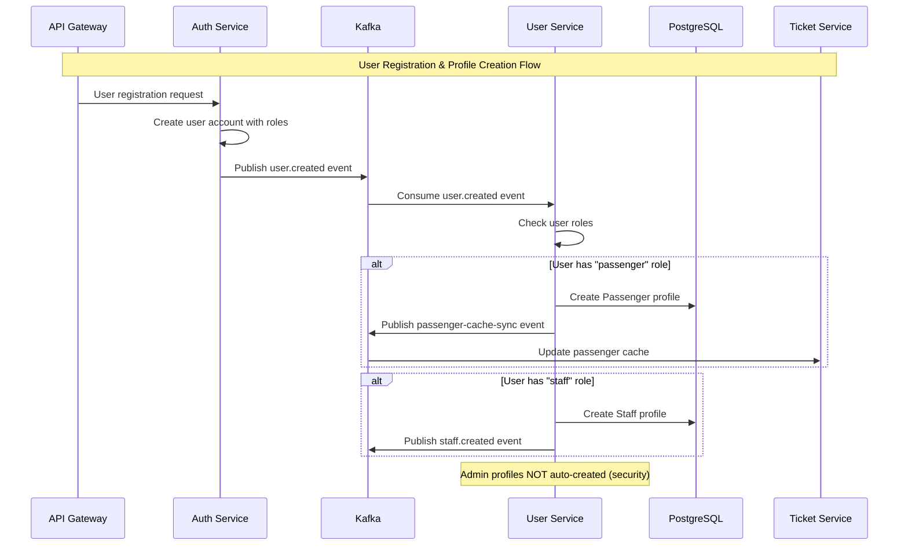
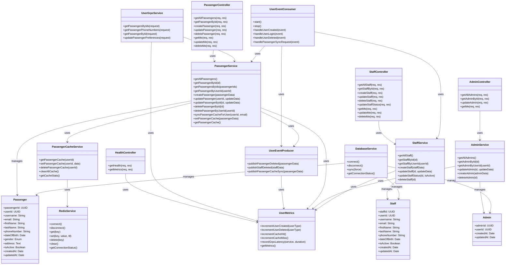
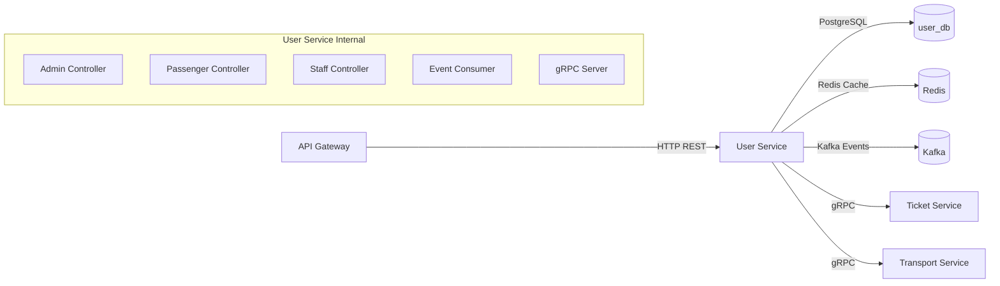
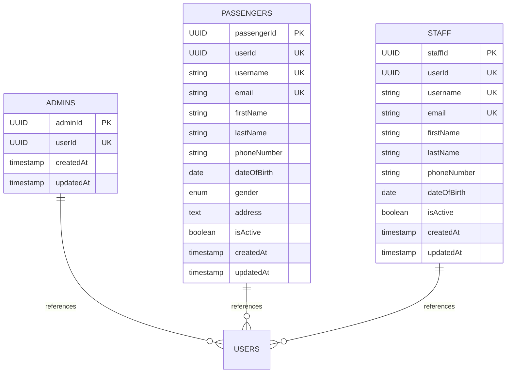

# User Service — Service README
> Mục đích: Mô tả kiến trúc, API, dữ liệu, vận hành, và tiêu chuẩn chất lượng cho service này.

## 1. Tổng quan
- **Chức năng chính**: Unified microservice quản lý profiles của admin, passenger và staff users trong hệ thống Metro HCM
- **Vai trò trong hệ MetroHCM**: Service trung tâm xử lý thông tin người dùng, nhận events từ Auth Service để tạo profiles, tích hợp với Ticket Service và các service khác
- **Giao tiếp**: 
  - REST API ⟷ API Gateway
  - gRPC ⟷ Ticket Service, Transport Service
  - Kafka Events ⟷ Auth Service, Ticket Service, Notification Service
- **Kiến trúc & pattern**: Layered Architecture với SOLID principles, Event-Driven Architecture, Repository pattern với Sequelize ORM
- **Lưu đồ chuỗi** cho luồng tạo user profile:



## 2. Sơ đồ Class (Class Diagram)



## 2.1 Sơ đồ hệ thống (Mermaid)



## 3. API & Hợp đồng

### 3.1 REST endpoints

| Method | Path | Mô tả | Auth | Request | Response | Status Codes |
| ------ | ---- | ----- | ---- | ------- | -------- | ------------ |
| GET | `/v1/user/admin/getAllAdmins` | Lấy danh sách tất cả admin | admin | - | `{admins: Admin[]}` | 200, 401, 403 |
| GET | `/v1/user/admin/getAdminById/:id` | Lấy admin theo ID | admin | - | `{admin: Admin}` | 200, 404, 401, 403 |
| PUT | `/v1/user/admin/updateAdmin/:id` | Cập nhật admin | admin | `AdminUpdateData` | `{admin: Admin}` | 200, 404, 401, 403 |
| GET | `/v1/user/admin/me` | Lấy thông tin admin hiện tại | admin | - | `{admin: Admin}` | 200, 401, 403 |
| GET | `/v1/user/passenger/getallPassengers` | Lấy danh sách passengers | staff,admin | - | `{passengers: Passenger[]}` | 200, 401, 403 |
| GET | `/v1/user/passenger/getPassengerById/:id` | Lấy passenger theo ID | staff,admin | - | `{passenger: Passenger}` | 200, 404, 401, 403 |
| POST | `/v1/user/passenger/createPassenger` | Tạo passenger mới | staff,admin | `PassengerCreateData` | `{passenger: Passenger}` | 201, 400, 401, 403 |
| PUT | `/v1/user/passenger/updatePassenger/:id` | Cập nhật passenger | staff,admin | `PassengerUpdateData` | `{passenger: Passenger}` | 200, 404, 401, 403 |
| DELETE | `/v1/user/passenger/deletePassenger/:id` | Xóa passenger | staff,admin | - | `{success: boolean}` | 200, 404, 401, 403 |
| GET | `/v1/user/passenger/me` | Lấy thông tin passenger hiện tại | passenger,staff,admin | - | `{passenger: Passenger}` | 200, 401, 403 |
| PUT | `/v1/user/passenger/me` | Cập nhật thông tin passenger hiện tại | passenger,staff,admin | `PassengerUpdateData` | `{passenger: Passenger}` | 200, 400, 401, 403 |
| DELETE | `/v1/user/passenger/me` | Xóa passenger hiện tại | passenger,staff,admin | - | `{success: boolean}` | 200, 401, 403 |
| GET | `/v1/user/staff/getAllStaff` | Lấy danh sách tất cả staff | admin | - | `{staff: Staff[]}` | 200, 401, 403 |
| GET | `/v1/user/staff/getStaffById/:id` | Lấy staff theo ID | admin | - | `{staff: Staff}` | 200, 404, 401, 403 |
| POST | `/v1/user/staff/createStaff` | Tạo staff mới | admin | `StaffCreateData` | `{staff: Staff}` | 201, 400, 401, 403 |
| PUT | `/v1/user/staff/updateStaff/:id` | Cập nhật staff | admin | `StaffUpdateData` | `{staff: Staff}` | 200, 404, 401, 403 |
| DELETE | `/v1/user/staff/deleteStaff/:id` | Xóa staff | admin | - | `{success: boolean}` | 200, 404, 401, 403 |
| PUT | `/v1/user/staff/updateStaffStatus/:id` | Cập nhật trạng thái staff | admin | `{isActive: boolean}` | `{staff: Staff}` | 200, 404, 401, 403 |
| GET | `/v1/user/staff/me` | Lấy thông tin staff hiện tại | staff | - | `{staff: Staff}` | 200, 401, 403 |
| PUT | `/v1/user/staff/me` | Cập nhật thông tin staff hiện tại | staff | `StaffUpdateData` | `{staff: Staff}` | 200, 400, 401, 403 |
| DELETE | `/v1/user/staff/me` | Xóa staff hiện tại | staff | - | `{success: boolean}` | 200, 401, 403 |
| GET | `/health` | Health check | - | - | `{status: "OK", service: "user-service"}` | 200 |
| GET | `/metrics` | Prometheus metrics | - | - | Prometheus format | 200 |

### 3.2 gRPC Services

**File proto**: `src/proto/user.proto`

**Services**:
- `GetPassengersByIds` - Lấy thông tin passengers theo danh sách IDs
- `GetPassengerPhoneNumbers` - Lấy số điện thoại passengers theo IDs  
- `GetPassengerById` - Lấy thông tin passenger theo ID
- `UpdatePassengerPreferences` - Cập nhật preferences của passenger

**Cách build/generate**: 
```bash
# Generate client/server code (nếu cần)
protoc --js_out=import_style=commonjs,binary:. --grpc_out=grpc_js:. src/proto/user.proto
```

**Versioning & Compatibility**: Sử dụng proto3 syntax, backward compatible

### 3.3 Event (Kafka)

| Topic | Direction | Key | Schema | Semantics | Retry/DLQ |
| ----- | --------- | --- | ------ | --------- | --------- |
| `user.created` | Consumer | userId | `{userId, username, email, firstName, lastName, phoneNumber, dateOfBirth, gender, address, roles}` | At-least-once | Manual retry |
| `user.login` | Consumer | userId | `{userId, username, email, roles}` | At-least-once | Manual retry |
| `passenger-sync-request` | Consumer | userId | `{userId, requestedBy, source}` | At-least-once | Manual retry |
| `passenger.deleted` | Producer | passengerId | `{passengerId, userId, email, deletedAt}` | At-least-once | (Không tìm thấy trong repo) |
| `passenger-cache-sync` | Producer | passengerId | `{passengerId, userId, firstName, lastName, phoneNumber, dateOfBirth, gender, updatedAt}` | At-least-once | (Không tìm thấy trong repo) |
| `staff.deleted` | Producer | staffId | `{staffId, userId, email, employeeId, department, position, deletedAt}` | At-least-once | (Không tìm thấy trong repo) |

## 4. Dữ liệu & Migrations

**Loại CSDL**: PostgreSQL

**Bảng chính**:

| Bảng | Cột chính | Kiểu | Index | Ràng buộc |
| ---- | --------- | ---- | ----- | --------- |
| `admins` | `adminId` (PK), `userId` (UNIQUE) | UUID, UUID | - | NOT NULL, UNIQUE |
| `passengers` | `passengerId` (PK), `userId` (UNIQUE), `username`, `email`, `firstName`, `lastName`, `phoneNumber`, `dateOfBirth`, `gender`, `address`, `isActive` | UUID, UUID, VARCHAR(50), VARCHAR(50), VARCHAR(50), VARCHAR(50), VARCHAR(15), DATE, ENUM, TEXT, BOOLEAN | `phoneNumber` | NOT NULL, UNIQUE, Validation |
| `staff` | `staffId` (PK), `userId` (UNIQUE), `username`, `email`, `firstName`, `lastName`, `phoneNumber`, `dateOfBirth`, `isActive` | UUID, UUID, VARCHAR(50), VARCHAR(50), VARCHAR(50), VARCHAR(50), VARCHAR(15), DATE, BOOLEAN | - | NOT NULL, UNIQUE, Validation |

**Quan hệ & cascade**: Không có foreign key constraints, sử dụng userId để liên kết với auth-service

**Seeds/fixtures**: `src/utils/seedAdmin.js` - Tạo admin mặc định

**Cách chạy migration**: 
```bash
# Tự động sync khi start service
npm start
# Hoặc force sync (development)
# Set DB_FORCE_SYNC=true trong .env
```

## 5. Cấu hình & Secrets

### 5.1 Biến môi trường (bảng bắt buộc)

| ENV | Bắt buộc | Giá trị mẫu | Mô tả | Phạm vi |
| --- | -------- | ----------- | ----- | ------- |
| `NODE_ENV` | Có | `production` | Môi trường chạy | dev/staging/prod |
| `PORT` | Có | `8002` | Port HTTP server | 1-65535 |
| `SERVICE_JWT_SECRET` | Có | `CHANGE_ME` | Secret cho service-to-service auth | String |
| `DEFAULT_ADMIN_USER_ID` | Có | `00000000-0000-0000-0000-000000000001` | ID admin mặc định | UUID |
| `ADMIN_PASSENGER_ID` | Có | `00000000-0000-4000-8000-000000000001` | ID passenger cho admin | UUID |
| `DB_HOST` | Có | `postgres` | Host PostgreSQL | String |
| `DB_PORT` | Có | `5432` | Port PostgreSQL | 1-65535 |
| `DB_NAME` | Có | `user_db` | Tên database | String |
| `DB_USER` | Có | `user_service` | Username database | String |
| `DB_PASSWORD` | Có | `${USER_DB_PASSWORD}` | Password database | String |
| `REDIS_HOST` | Có | `redis` | Host Redis | String |
| `REDIS_PORT` | Có | `6379` | Port Redis | 1-65535 |
| `REDIS_PASSWORD` | Không | - | Password Redis | String |
| `REDIS_KEY_PREFIX` | Không | `service:` | Prefix cho Redis keys | String |
| `REDIS_USER_CACHE_KEY_PREFIX` | Không | `metrohcm:` | Prefix cho user cache | String |
| `KAFKA_BROKERS` | Có | `kafka-1:19092,kafka-2:19093,kafka-3:19094` | Kafka brokers | String |
| `KAFKA_CLIENT_ID` | Có | `user-service` | Kafka client ID | String |
| `KAFKA_GROUP_ID` | Có | `user-service-group` | Kafka consumer group | String |
| `USER_CREATED_TOPIC` | Có | `user.created` | Topic user created events | String |
| `USER_DELETED_TOPIC` | Có | `user.deleted` | Topic user deleted events | String |
| `PASSENGER_DELETED_TOPIC` | Có | `passenger.deleted` | Topic passenger deleted events | String |
| `STAFF_DELETED_TOPIC` | Có | `staff.deleted` | Topic staff deleted events | String |
| `USER_LOGIN_TOPIC` | Có | `user.login` | Topic user login events | String |
| `API_GATEWAY_ORIGIN` | Có | `https://api.metrohcm.io.vn` | Origin API Gateway | URL |
| `ALLOWED_ORIGINS` | Không | `https://api.metrohcm.io.vn` | Origins được phép CORS | String |
| `USER_GRPC_PORT` | Có | `50054` | Port gRPC server | 1-65535 |

### 5.2 Profiles

- **dev**: CORS enabled, debug logging, force DB sync
- **staging**: Production-like với test data
- **prod**: CORS handled by Nginx, error logging only, secure config

**Nguồn secrets**: Environment variables, Docker secrets, Kubernetes secrets

## 6. Bảo mật & Tuân thủ

**AuthN/AuthZ**: 
- Service-to-service: JWT với `x-service-auth` header
- User authentication: Thông qua API Gateway với role-based authorization
- JWT validation: HS256, issuer: `api-gateway`, audience: `internal-services`, max age: 5 minutes

**Input validation & sanitize**: 
- Sequelize model validation (email format, string length, UUID format)
- Express-validator middleware (không tìm thấy trong code hiện tại)
- Helmet.js cho security headers

**CORS & CSRF**: 
- CORS: Chỉ cho phép API Gateway origin
- CSRF: Helmet.js protection
- Network source validation: Chỉ cho phép requests từ API Gateway hoặc private networks

**Rate limit / Anti-abuse**: (Không tìm thấy trong repo)

**Nhật ký/Audit**: 
- Winston structured logging với daily rotation
- Request/response logging với correlation ID
- Error tracking với stack traces

**Lỗ hổng tiềm ẩn & khuyến nghị**:
- Admin profiles không được auto-create từ events (security by design)
- Service-to-service auth với JWT expiration
- Network source validation để ngăn direct access
- Cần thêm rate limiting và input sanitization

## 7. Độ tin cậy & Khả dụng

**Timeouts/Retry/Backoff**: 
- Database connection: 60s timeout, 5 retries với exponential backoff
- Redis connection: Auto-retry với error handling
- Kafka: (Không tìm thấy retry config trong repo)

**Circuit breaker/Bulkhead**: (Không tìm thấy trong repo)

**Idempotency**: 
- UUID primary keys cho tất cả entities
- Event processing với duplicate check (check existing profiles)

**Outbox/Saga/Orchestrator**: (Không tìm thấy trong repo)

**Khả năng phục hồi sự cố**: 
- Graceful shutdown với SIGTERM/SIGINT handlers
- Database connection retry với exponential backoff
- Redis connection auto-recovery
- Event consumer restart capability

## 8. Observability

**Logging**: 
- Format: JSON structured logs
- CorrelationId: (Không tìm thấy trong code)
- Ví dụ log JSON:
```json
{
  "timestamp": "2025-01-15 10:30:45",
  "level": "info",
  "message": "Passenger profile created successfully",
  "service": "user-service",
  "userId": "123e4567-e89b-12d3-a456-426614174000",
  "username": "john.doe",
  "passengerId": "987fcdeb-51a2-43d1-b789-123456789abc"
}
```

**Metrics**: 
- Prometheus endpoints: `/metrics`
- Metrics: `http_request_duration_seconds`, `app_errors_total`
- Default metrics: CPU, memory, event loop

**Tracing**: (Không tìm thấy trong repo)

**Healthchecks**: 
- `/health`: Basic health check
- Database connection check trong startup
- Redis connection check

## 9. Build, Run, Test

### 9.1 Local

```bash
# Prerequisites
Node.js 18+, PostgreSQL, Redis, Kafka

# Install dependencies
npm install

# Setup environment
cp env.example .env
# Edit .env with your config

# Run
npm start
# Development
npm run dev
```

### 9.2 Docker/Compose

```bash
# Build
docker build -t user-service .

# Run
docker run --env-file .env -p 8002:8002 -p 50054:50054 user-service

# Docker Compose
docker-compose up user-service
```

### 9.3 Kubernetes/Helm (nếu có)

(Không tìm thấy Helm charts trong repo)

### 9.4 Testing

```bash
# Run all tests
npm test

# Run with coverage
npm run test:coverage

# Generate coverage CSV
npm run coverage:csv
```

**Coverage**: 
- Lines: 90% threshold
- Statements: 90% threshold  
- Branches: 80% threshold
- Functions: 90% threshold

## 10. CI/CD

(Không tìm thấy GitHub workflows trong repo)

**Workflow cần thiết**:
- Lint: ESLint
- Typecheck: (Không sử dụng TypeScript)
- Tests: Jest với coverage
- Build: Docker build
- Security: SAST/SBOM scan

## 11. Hiệu năng & Quy mô

**Bottlenecks đã thấy từ code**:
- Database queries không có pagination cho list endpoints
- Redis cache chưa được implement đầy đủ
- Không có connection pooling config cho external services

**Kỹ thuật**:
- Pagination: (Chưa implement)
- Batch operations: gRPC GetPassengersByIds hỗ trợ batch
- Cache: Redis cho passenger cache
- N+1: Sử dụng Sequelize ORM, cần kiểm tra queries

**Định hướng benchmark**: Cần load testing cho concurrent user creation events

## 12. Rủi ro & Nợ kỹ thuật

**Danh sách vấn đề hiện tại**:
1. Thiếu pagination cho list endpoints
2. Không có rate limiting
3. Thiếu circuit breaker cho external calls
4. Không có comprehensive input validation
5. Thiếu tracing/monitoring
6. Không có automated testing trong CI/CD

**Ảnh hưởng & ưu tiên**:
- High: Pagination (performance), Input validation (security)
- Medium: Rate limiting, Circuit breaker (reliability)
- Low: Tracing, CI/CD (operational)

**Kế hoạch cải thiện**:
1. Implement pagination cho tất cả list endpoints
2. Thêm express-rate-limit middleware
3. Implement circuit breaker cho database/Redis calls
4. Thêm comprehensive input validation với express-validator
5. Setup distributed tracing với OpenTelemetry
6. Setup GitHub Actions workflow

## 13. Phụ lục

### Sơ đồ ERD



### Bảng mã lỗi chuẩn & cấu trúc response lỗi

**Error Response Format**:
```json
{
  "success": false,
  "message": "Error description",
  "error": "ERROR_CODE",
  "debug": {
    "additionalInfo": "value"
  }
}
```

**Error Codes**:
- `MISSING_SERVICE_AUTH`: Thiếu service authentication header
- `INVALID_SERVICE_TOKEN`: JWT token không hợp lệ
- `EXPIRED_SERVICE_TOKEN`: JWT token đã hết hạn
- `TOKEN_TOO_OLD`: Token quá cũ (>5 phút)
- `DIRECT_ACCESS_FORBIDDEN`: Truy cập trực tiếp bị cấm
- `ROUTE_NOT_FOUND`: Route không tồn tại
- `INTERNAL_ERROR`: Lỗi server nội bộ

### License & 3rd-party

**License**: (Không tìm thấy LICENSE file)

**3rd-party dependencies**:
- Express.js: Web framework
- Sequelize: ORM
- PostgreSQL: Database
- Redis: Caching
- KafkaJS: Message broker
- Winston: Logging
- Prom-client: Metrics
- gRPC: Service communication
- Helmet: Security
- Jest: Testing 