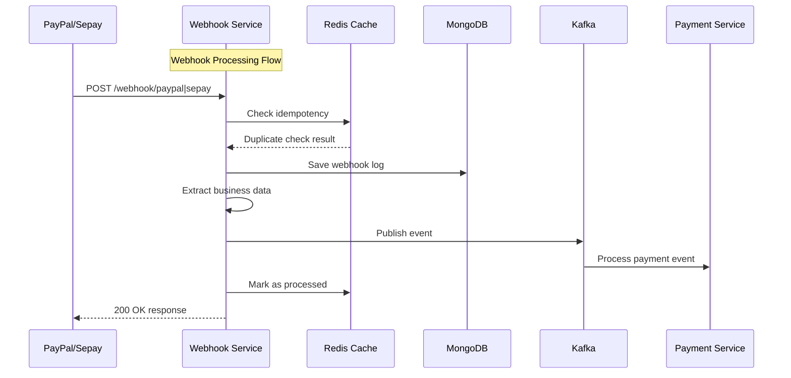
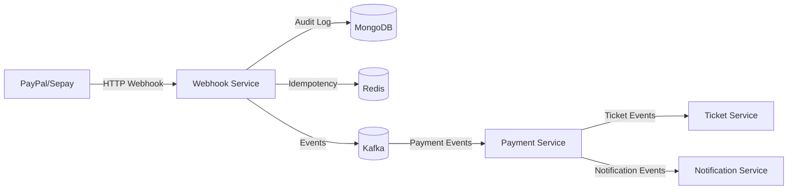
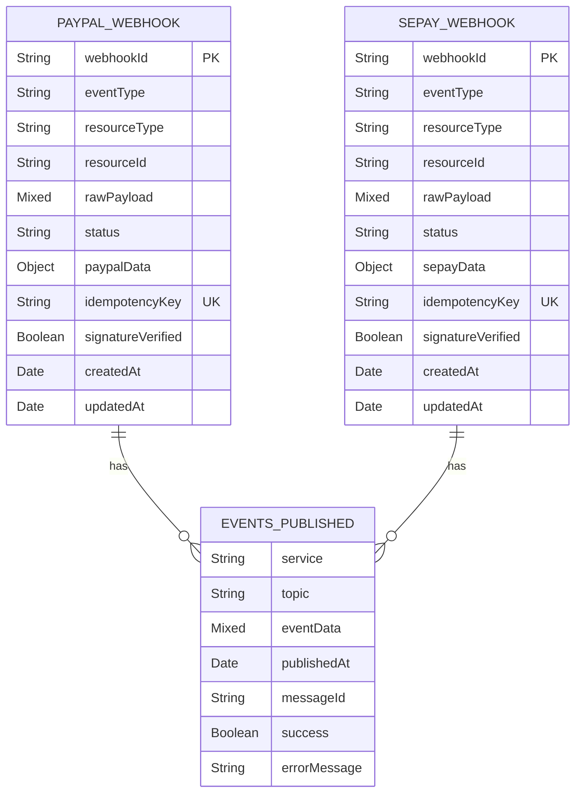

# Webhook Service — Service README
> Mục đích: Mô tả kiến trúc, API, dữ liệu, vận hành, và tiêu chuẩn chất lượng cho service này.

## 1. Tổng quan
- **Chức năng chính:** Xử lý webhook events từ các payment providers (PayPal, Sepay) với kiến trúc SOLID và modular design
- **Vai trò trong hệ MetroHCM:** Trung tâm xử lý webhook từ payment providers, chuyển đổi và phân phối events tới các services khác
- **Giao tiếp:** 
  - **REST** ⟷ PayPal, Sepay (webhook providers)
  - **Event (Kafka)** ⟷ payment-service, ticket-service, notification-service
- **Kiến trúc & pattern:** Clean Architecture + SOLID Principles, Layered Architecture, Dependency Injection, Event-Driven Architecture
- **Lưu đồ chuỗi (Mermaid sequence) cho luồng xử lý webhook:**



## 2. Sơ đồ hệ thống (Mermaid)



## 3. API & Hợp đồng

### 3.1 REST endpoints

| Method | Path | Mô tả | Auth | Request | Response | Status Codes |
| ------ | ---- | ----- | ---- | ------- | -------- | ------------ |
| POST | `/webhook/paypal` | PayPal webhook endpoint | None | PayPal webhook payload | Processing result | 200, 400, 422, 500 |
| POST | `/webhook/sepay` | Sepay webhook endpoint | None | Sepay webhook payload | Processing result | 200, 400, 422, 500 |
| GET | `/webhook/health` | Service health check | None | - | Health status | 200, 503 |
| GET | `/webhook/statistics` | Combined statistics | None | Query: startDate, endDate | Statistics data | 200, 500 |
| GET | `/webhook/paypal/statistics` | PayPal statistics | None | Query: startDate, endDate | PayPal stats | 200, 500 |
| GET | `/webhook/sepay/statistics` | Sepay statistics | None | Query: startDate, endDate | Sepay stats | 200, 500 |
| POST | `/webhook/paypal/retry` | Retry failed PayPal webhooks | None | Query: limit | Retry results | 200, 500 |
| POST | `/webhook/sepay/retry` | Retry failed Sepay webhooks | None | Query: limit | Retry results | 200, 500 |
| GET | `/metrics` | Prometheus metrics | None | - | Metrics data | 200 |

### 3.2 OpenAPI/Proto

* **Vị trí file:** (Không tìm thấy trong repo)
* **Cách build/generate client/server:** (Không tìm thấy trong repo)
* **Versioning & Compatibility:** REST API v1, backward compatible

### 3.3 Event (Kafka/Queue)

| Topic | Direction | Key | Schema | Semantics | Retry/DLQ |
| ----- | --------- | --- | ------ | --------- | --------- |
| `paypal.webhook.event` | Out | PayPal Order ID | PayPal webhook payload | At-least-once | Built-in retry |
| `sepay.webhook.event` | Out | Sepay Transaction ID | Sepay webhook payload | At-least-once | Built-in retry |
| `paypal.payment.completed` | Out | Ticket ID | Payment completion data | At-least-once | Built-in retry |
| `sepay.payment.completed` | Out | Ticket ID | Payment completion data | At-least-once | Built-in retry |

## 4. Dữ liệu & Migrations

* **Loại CSDL:** MongoDB
* **Bảng/collection chính:**

### PayPal Webhook Collection (`paypal_webhook_hooks`)
| Field | Type | Index | Ràng buộc | Mô tả |
| ----- | ---- | ----- | --------- | ----- |
| webhookId | String | Unique | Required | PayPal webhook ID |
| eventType | String | Index | Enum | PayPal event type |
| resourceType | String | - | Enum | Resource type (capture, order, payment, refund) |
| resourceId | String | Index | Required | PayPal resource ID |
| rawPayload | Mixed | - | Required | Raw webhook data |
| status | String | Index | Enum | Processing status |
| paypalData | Object | - | - | Extracted business data |
| eventsPublished | Array | - | - | Published events log |
| idempotencyKey | String | Unique | Required | Idempotency key |
| signatureVerified | Boolean | - | Default: false | Signature verification status |

### Sepay Webhook Collection (`sepay_webhook_hooks`)
| Field | Type | Index | Ràng buộc | Mô tả |
| ----- | ---- | ----- | --------- | ----- |
| webhookId | String | Unique | Required | Sepay webhook ID |
| eventType | String | Index | Enum | Sepay event type |
| resourceType | String | - | Enum | Resource type (capture, order, payment, refund, bank_transfer) |
| resourceId | String | Index | Required | Sepay resource ID |
| rawPayload | Mixed | - | Required | Raw webhook data |
| status | String | Index | Enum | Processing status |
| sepayData | Object | - | - | Extracted business data |
| eventsPublished | Array | - | - | Published events log |
| idempotencyKey | String | Unique | Required | Idempotency key |
| signatureVerified | Boolean | - | Default: false | Signature verification status |

* **Quan hệ & cascade:** No foreign key relationships (document-based)
* **Seeds/fixtures:** (Không tìm thấy trong repo)
* **Cách chạy migration:** MongoDB auto-creates collections on first write

## 5. Cấu hình & Secrets

### 5.1 Biến môi trường (bảng bắt buộc)

| ENV | Bắt buộc | Giá trị mẫu | Mô tả | Phạm vi |
| --- | -------- | ----------- | ----- | ------- |
| PORT | No | 3003 | Service port | All |
| NODE_ENV | No | development | Environment | All |
| PAYPAL_CLIENT_ID | Yes | - | PayPal client ID | Production |
| PAYPAL_CLIENT_SECRET | Yes | - | PayPal client secret | Production |
| PAYPAL_WEBHOOK_ID | Yes | - | PayPal webhook ID | Production |
| PAYPAL_MODE | No | sandbox | PayPal environment | All |
| MONGODB_HOST | No | localhost | MongoDB host | All |
| MONGODB_PORT | No | 27017 | MongoDB port | All |
| MONGODB_DB_NAME | No | metro_webhook | Database name | All |
| MONGODB_USER | No | - | MongoDB username | Production |
| MONGODB_PASSWORD | No | - | MongoDB password | Production |
| REDIS_HOST | No | localhost | Redis host | All |
| REDIS_PORT | No | 6379 | Redis port | All |
| REDIS_PASSWORD | No | - | Redis password | Production |
| REDIS_KEY_PREFIX | No | metrohcm:webhook: | Redis key prefix | All |
| KAFKA_BROKERS | No | localhost:9092 | Kafka brokers | All |
| KAFKA_CLIENT_ID | No | webhook | Kafka client ID | All |
| KAFKA_GROUP_ID | No | webhook-service-group | Kafka group ID | All |
| ALLOWED_ORIGINS | No | - | CORS allowed origins | Production |

### 5.2 Profiles

* **dev:** MongoDB localhost, Redis localhost, PayPal sandbox mode
* **staging:** MongoDB cluster, Redis cluster, PayPal sandbox mode
* **prod:** MongoDB cluster, Redis cluster, PayPal live mode
* **Nguồn secrets:** Environment variables, Docker secrets, Kubernetes secrets

## 6. Bảo mật & Tuân thủ

* **AuthN/AuthZ:** No authentication for webhook endpoints (PayPal/Sepay call directly)
* **Input validation & sanitize:** Joi validation, express-validator, custom validation
* **CORS & CSRF:** CORS enabled for PayPal/Sepay domains, CSRF protection via Helmet
* **Rate limit / Anti-abuse:** Redis-based rate limiting (100 req/15min default, 10 req/15min auth)
* **Nhật ký/Audit:** Winston structured logging, MongoDB audit trail
* **Lỗ hổng tiềm ẩn & khuyến nghị:**
  - Webhook signature verification currently simplified
  - Consider implementing proper PayPal webhook signature validation
  - Add request size limits and timeout handling

## 7. Độ tin cậy & Khả dụng

* **Timeouts/Retry/Backoff:** 
  - MongoDB: 5s connection timeout, exponential backoff retry
  - Kafka: 8 retries with exponential backoff
  - Redis: Graceful degradation if unavailable
* **Circuit breaker/Bulkhead:** (Không tìm thấy trong repo)
* **Idempotency (keys, store):** Redis-based idempotency with SHA256 keys, 24h TTL
* **Outbox/Saga/Orchestrator:** Event sourcing pattern with MongoDB audit log
* **Khả năng phục hồi sự cố:** Graceful shutdown, connection pooling, error handling

## 8. Observability

* **Logging:** Winston with daily rotation, structured JSON format, correlation IDs
* **Metrics:** Prometheus metrics at `/metrics` endpoint
  - `http_request_duration_seconds` - HTTP request duration
  - `app_errors_total` - Application error counter
* **Tracing:** Request ID tracking via `x-request-id` header
* **Healthchecks:** `/webhook/health` endpoint with service status

## 9. Build, Run, Test

### 9.1 Local

```bash
# prerequisites
Node.js 18+, MongoDB, Redis, Kafka

# run
npm install
npm run dev
```

### 9.2 Docker/Compose

```bash
docker build -t metro/webhook-service .
docker run --env-file .env -p 3003:3003 metro/webhook-service
```

### 9.3 Kubernetes/Helm (nếu có)

* **Chart path:** (Không tìm thấy trong repo)
* **Values quan trọng:** (Không tìm thấy trong repo)
* **Lệnh cài đặt:** (Không tìm thấy trong repo)

### 9.4 Testing

* **Cách chạy:** `npm test`, `npm run test:watch`
* **Coverage:** Jest with coverage reports in `coverage/` directory
* **Test types:** Unit tests, integration tests, controller tests

## 10. CI/CD

* **Workflow path:** (Không tìm thấy trong repo)
* **Job chính:** (Không tìm thấy trong repo)
* **Ma trận build:** (Không tìm thấy trong repo)
* **Tagging/Release:** (Không tìm thấy trong repo)
* **Gates:** ESLint, Jest tests, Docker build

## 11. Hiệu năng & Quy mô

* **Bottlenecks đã thấy từ code:**
  - MongoDB connection pooling (max 10 connections)
  - Redis single connection (no connection pooling)
  - Kafka producer single instance
* **Kỹ thuật:** 
  - Redis idempotency caching
  - MongoDB indexing on frequently queried fields
  - Kafka message partitioning by order/transaction ID
* **Định hướng benchmark/kịch bản tải:** Load testing with webhook simulation, MongoDB performance tuning

## 12. Rủi ro & Nợ kỹ thuật

* **Danh sách vấn đề hiện tại:**
  - PayPal webhook signature verification simplified
  - No circuit breaker implementation
  - Single Redis connection (no pooling)
  - No proper error recovery for failed webhook processing
* **Ảnh hưởng & ưu tiên:**
  - High: Signature verification (security risk)
  - Medium: Circuit breaker (resilience)
  - Low: Redis pooling (performance)
* **Kế hoạch cải thiện:**
  - Implement proper PayPal webhook signature validation
  - Add circuit breaker pattern for external dependencies
  - Implement Redis connection pooling
  - Add webhook retry mechanism with exponential backoff

## 13. Phụ lục

* **Sơ đồ ERD (nếu service có DB) – dùng Mermaid ER:**



* **Bảng mã lỗi chuẩn & cấu trúc response lỗi:**

| Error Code | HTTP Status | Mô tả | Response Format |
| ---------- | ----------- | ----- | --------------- |
| INVALID_WEBHOOK_PAYLOAD | 400 | Invalid webhook structure | `{success: false, error: "INVALID_WEBHOOK_PAYLOAD", message: "..."}` |
| INVALID_EVENT_STRUCTURE | 400 | Event validation failed | `{success: false, error: "INVALID_EVENT_STRUCTURE", message: "..."}` |
| WEBHOOK_PROCESSING_FAILED | 422 | Processing failed | `{success: false, error: "WEBHOOK_PROCESSING_FAILED", message: "..."}` |
| INTERNAL_SERVER_ERROR | 500 | Server error | `{success: false, error: "INTERNAL_SERVER_ERROR", message: "..."}` |
| STATISTICS_ERROR | 500 | Statistics retrieval failed | `{success: false, error: "STATISTICS_ERROR", message: "..."}` |
| RETRY_ERROR | 500 | Retry operation failed | `{success: false, error: "RETRY_ERROR", message: "..."}` |

* **License & 3rd-party:** MIT License, dependencies listed in package.json
